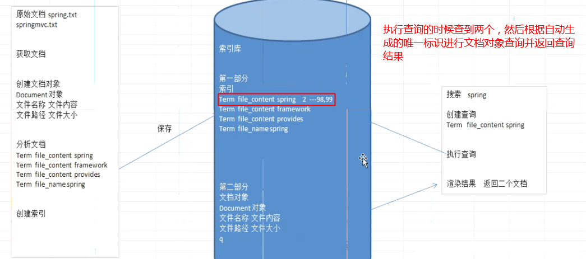
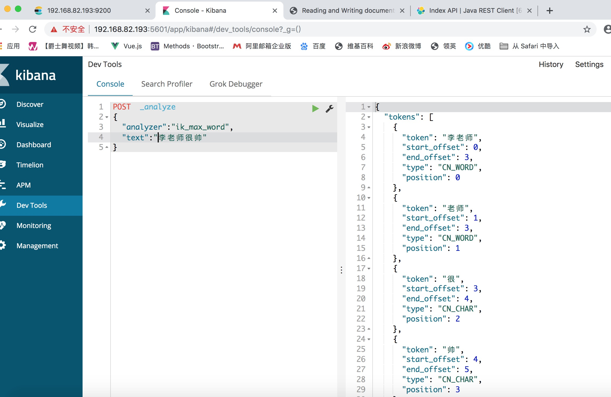

[TOC]

# 回顾

```
昨天作业讲解、知识回顾。
```

# 教学目的

```
1、了解Lucene的原理、索引、分词的概念
2、Elasticsearch的基本概念（索引、类型、文档、字段、节点与集群、分片）
3、了解Elasticsearch的安装、分词插件安装
4、熟练使用API创建索引
5、熟练使用API操作基本的查询
```

# 第一章 概述

Elasticsearch是一个实时的分布式搜索和分析引擎。它可以帮助你用前所未有的速度去处理大规模数据, 它不但稳定、可靠、快速，而且也具有良好的水平扩展能力，是专门为分布式环境设计的,它可以用于全文搜索，结构化搜索以及分析，当然你也可以将这三者进行组合。Elasticsearch是一个建立在全文搜索引擎 Apache Lucene 基础上的搜索引擎，可以说Lucene是当今最先进，最高效的全功能开源搜索引擎框架。Elasticsearch分布式搜索引擎的总体框架图：


ElasticSearch是基于Lucene开发的分布式搜索框架，包含如下特性：

1. 分布式索引、搜索。

2. 索引自动分片、负载均衡。

3. 自动发现机器、组建集群。

4. 支持Restful 风格接口。

5. 配置简单等。

#  第二章 Lucene简介

## 2.1 Lucene简介

Lucene是Apache Jakarta家族中的一个开源项目，是一个开放源代码的全文检索引擎工具包，但它不是一个完整的全文检索引擎，而是一个**全文检索引擎的架构**，提供了完整的查询引擎、索引引擎和部分文本分析引擎。

Lucene提供了一个简单却强大的应用程式接口，能够做**全文索引和搜寻**。在Java开发环境里Lucene是一个成熟的免费开源工具，是目前最为流行的基于 Java 开源全文检索工具包。

数据总体分为两种：

- `结构化数据`：指**具有固定格式或有限长度的数据**，如数据库、元数据等。
- `非结构化数据`：指**不定长或无固定格式的数据**，如邮件、word文档等磁盘上的文件。

对于结构化数据的全文搜索很简单，因为数据都是有固定格式的，例如搜索数据库中数据使用SQL语句即可。

对于非结构化数据，有以下两种方法：

1. `顺序扫描法`(Serial Scanning)
2. `全文检索`(Full-text Search)

**顺序扫描法**
如果要找包含某一特定内容的文件，对于每一个文档，**从头到尾扫描内容**，如果此文档包含此字符串，则此文档为我们要找的文件，接着看下一个文件，直到扫描完所有的文件，因此速度很慢。

**全文检索**
将非结构化数据中的**一部分信息提取出来，重新组织**，使其变得**具有一定结构**，然后对此有一定结构的数据进行搜索，从而达到搜索相对较快的目的。这部分从非结构化数据中提取出的然后重新组织的信息，我们称之索引。

例如字典的拼音表和部首检字表就相当于字典的索引，通过查找拼音表或者部首检字表就可以快速的查找到我们要查的字。

这种**先建立索引，再对索引进行搜索**的过程就叫**全文检索**(Full-text Search)。

## 2.1、全文检索流程


### 2.1.1 索引过程

1. 索引过程，对要搜索的原始内容进行索引构建一个索引库，索引过程包括：确定原始内容即要搜索的内容→采集文档→创建文档→分析文档→索引文档。 
2. 搜索过程，从索引库中搜索内容，搜索过程包括：用户通过搜索界面→创建查询→执行搜索，从索引库搜索→渲染搜索结果。

从上面了解到的知识点也可看出，索引和搜索流程图也可表示为


总结：全文检索过程分为索引、搜索两个过程：

**索引** 
       从关系数据库中、互联网上、文件系统采集源数据(要搜索的目标信息)，源数据的来源是很广泛的。
将源数据采集到一个统一的地方，要创建索引，将索引创建到一个索引库（文件系统）中，从源数据库中提取关键信息，从关键信息中抽取一个一个词，词和源数据是有关联的。也即创建索引时，词和源数据有关联，索引库中记录了这个关联，如果找到了词就说明找到了源数据（http的网页、pdf电子书等……）。
**搜索** 

       1. 用户执行搜索（全文检索）编写查询关键字。
       2. 从索引库中搜索索引，根据查询关键字搜索索引库中的一个一个词。
       3. 展示搜索的结果。


### 2.1.2 创建索引 

对文档索引的过程，将用户要搜索的文档内容进行索引，索引存储在索引库（index）中。 
这里我们要搜索的文档是磁盘上的文本文件，根据案例描述：凡是文件名或文件内容包括关键字的文件都要找出来，这里要对文件名和文件内容创建索引。 

### 2.1.3 获得原始文档 

原始文档是指要索引和搜索的内容。原始内容包括互联网上的网页、数据库中的数据、磁盘上的文件等。 

### 2.1.4 创建文档对象 

获取原始内容的目的是为了索引，在索引前需要将原始内容创建成文档（Document），文档中包括一个一个的域（Field），域中存储内容。 
这里我们可以将磁盘上的一个文件当成一个document，Document中包括一些Field（file_name文件名称、file_path文件路径、file_size文件大小、file_content文件内容），如下图： 


注意：每个Document可以有多个Field，不同的Document可以有不同的Field，不同的Document可以有相同的Field（域名和域值都相同）

每个文档都有一个唯一的编号，就是文档id。 

### 2.1.5 分析文档 

将原始内容创建为包含域（Field）的文档（document），需要再对域中的内容进行分析，分析的过程是经过对原始文档提取单词、将字母转为小写、去除标点符号、去除停用词等过程生成最终的语汇单元，可以将语汇单元理解为一个一个的单词。 
比如下边的文档经过分析如下： 
原文档内容： 
Lucene is a Java full-text search engine. Lucene is not a complete 
application, but rather a code library and API that can easily be used 
to add search capabilities to applications.

分析后得到的语汇单元： 
lucene、java、full、search、engine。。。。

每个单词叫做一个Term，不同的域中拆分出来的相同的单词是不同的term。term中包含两部分一部分是文档的域名，另一部分是单词的内容。 
例如：文件名中包含apache和文件内容中包含的apache是不同的term。

###  2.1.6 创建索引 

对所有文档分析得出的语汇单元进行索引，索引的目的是为了搜索，最终要实现只搜索被索引的语汇单元从而找到Document（文档）。 



注意：创建索引是对语汇单元索引，通过词语找文档，这种索引的结构叫倒排索引结构。 
传统方法是根据文件找到该文件的内容，在文件内容中匹配搜索关键字，这种方法是顺序扫描方法，数据量大、搜索慢。 
倒排索引结构是根据内容（词语）找文档，如下图： 


倒排索引结构也叫反向索引结构，包括索引和文档两部分，索引即词汇表，它的规模较小，而文档集合较大。 

### 2.1.7 查询索引 

查询索引也是搜索的过程。搜索就是用户输入关键字，从索引（index）中进行搜索的过程。根据关键字搜索索引，根据索引找到对应的文档，从而找到要搜索的内容（这里指磁盘上的文件）。 

#### 2.1.7.1 用户接口查询 

全文检索系统提供用户搜索的界面供用户提交搜索的关键字，搜索完成展示搜索结果。


比如：

Lucene不提供制作用户搜索界面的功能，需要根据自己的需求开发搜索界面。 

#### 2.1.7.2 创建查询 

用户输入查询关键字执行搜索之前需要先构建一个查询对象，查询对象中可以指定查询要搜索的Field文档域、查询关键字等，查询对象会生成具体的查询语法， 
例如： 
语法 “fileName:lucene”表示要搜索Field域的内容为“lucene”的文档 

#### 2.1.7.3 执行查询 

搜索索引过程： 
根据查询语法在倒排索引词典表中分别找出对应搜索词的索引，从而找到索引所链接的文档链表。 
比如搜索语法为“fileName:lucene”表示搜索出fileName域中包含Lucene的文档。 
搜索过程就是在索引上查找域为fileName，并且关键字为Lucene的term，并根据term找到文档id列表。

 

#### 2.1.7.4 渲染结果 

以一个友好的界面将查询结果展示给用户，用户根据搜索结果找自己想要的信息，为了帮助用户很快找到自己的结果，提供了很多展示的效果，比如搜索结果中将关键字高亮显示，百度提供的快照等。


## 2.3 分词

### 2.3.1 分词器的作用

　　a. 在创建索引的时候需要用到分词器，在使用字符串搜索的时候也会用到分词器，并且这两个地方要使用同一个分词器，否则可能会搜索不出来结果。

　　b. 分词器(Analyzer)的作用是把一段文本中的词按规则取出所包含的所有词，对应的是Analyzer类，这是一个抽象类(public abstract class org.apache.lucene.analysis.Analyzer)，切分词的具体规则是由子类实现的，所以对于不同的语言规则，要有不同的分词器。

### 2.3.2 英文分词器的原理

　　a.英文的处理流程为：输入文本，词汇切分，词汇过滤(去除停用词)，词干提取(形态还原)、大写转小写，结果输出。

　　b. 何为形态还原，意思是：去除单词词尾的形态变化，将其还原为词的原形，这样做可以搜索出更多有意义的结果，比如在搜索student的时候，同事也可以搜索出students的结果。

　　c. 任何一个分词方法对英文的支持都是还可以的。

### 2.3.3 中文分词器的原理

　　a.中文分词比较复杂，并没有英文分词那么简单，这主要是因为中文的词与词之间并不是像英文那样用空格来隔开，

因为不是一个字就是一个词，而且一个词在另外一个地方就可能不是一个词，如："我们是中国人"，"是中"就不是一个词，对于中文分词，通常有三种方式：单字分词、二分法分词、词典分词。

　　a.1 单字分词：就是按照中文一个字一个字的进行分词，比如:"我们是中国人"，分词的效果就是"我"，"们"，"是"，"中"，"国"，"人"，StandardAnalyzer分词法就是单字分词。

　　a.2 二分法分词：按照两个字进行切分，比如："我们是中国人"，分词的效果就是："我们"，"们是"，"是中"，"中国"，"国人"，CJKAnalyzer分词法就是二分法分词

　　a.3 词库分词：按照某种算法构造词，然后去匹配已建好的词库集合，如果匹配到就切分出来成为词语，通常词库分词被认为是最好的中文分词算法，如："我们是中国人"，分词的效果就是:"我们"，"中国人"，极易分词

MMAnalyzer、庖丁分词、IkAnalyzer等分词法就是属于词库分词。

　　b.分词器还有很多，请大家自行查询，它们的实现基本一致，都是Analyzer的子类，故而可以很完美的集成到Lucene中。

### 2.3.4 停用词的规则

 有些词在文本中出现的频率非常高，但是对文本所携带的信息基本不产生影响，例如英文的"a、an、the、of"或中文的"的、了、着、是"，以及各种标点符号等，这样的词称为停用词，文本经过分词处理后，停用词通常会被过滤掉，不会被进行索引，在检索的时候，用户的查询中如果含有停用词，检索系统也会将其过滤掉，这是因为用户输入的查询字符串也要进行分词处理，排除停用词可以提高建立索引的速度，减小索引库文件的大小。

### 2.3.5 常用的分词器

**WhitespaceAnalyzer**

 仅仅是去掉了空格，没有其他任何操作，不支持中文。

**SimpleAnalyzer**

 讲除了字母以外的符号全部去除，并且讲所有字符变为小写，需要注意的是这个分词器同样把数据也去除了，同样不支持中文。

**StopAnalyzer**

 这个和SimpleAnalyzer类似，不过比他增加了一个的是，在其基础上还去除了所谓的stop words，比如the, a, this这些。这个也是不支持中文的。

**StandardAnalyzer**

 英文方面的处理和StopAnalyzer一样的，对中文支持，使用的是单字切割。

**CJKAnalyzer**

 这个支持中日韩，前三个字母也就是这三个国家的缩写。这个对于中文基本上不怎么用吧，对中文的支持很烂，它是用每两个字作为分割，分割方式个人感觉比较奇葩，我会在下面比较举例。

**SmartChineseAnalyzer**

 中文的分词。比较标准的中文分词，对一些搜索处理的并不是很好。

**IKAnalyzer**

中国人自己开发，对于中文分词比较精准

### 2.3.6 IK 分词器

Elasticsearch中文分词我们采用Ik分词，ik有两种分词模式，ik_max_word,和ik_smart模式; 

 ik_max_word 和 ik_smart 什么区别?

> ik_max_word: 会将文本做最细粒度的拆分，比如会将“中华人民共和国国歌”拆分为“中华人民共和国,中华人民,中华,华人,人民共和国,人民,人,民,共和国,共和,和,国国,国歌”，会穷尽各种可能的组合；
> ik_smart: 会做最粗粒度的拆分，比如会将“中华人民共和国国歌”拆分为“中华人民共和国,国歌”。

索引时，为了提供索引的覆盖范围，通常会采用ik_max_word分析器，会以最细粒度分词索引，搜索时为了提高搜索准确度，会采用ik_smart分析器，会以粗粒度分词

我们可以使用网上的一些工具来查看分词的效果，比如<https://www.sojson.com/analyzer>：


## 2.4 lucene全文检索与数据库查询的比较

### 2.4.1 性能上

**数据库：**比如我要查找某个商品，根据商品名，比如select * from product where doctname like %keywords%,这样查询的话对于数据量少是可以的，可是一旦你的数据量巨大几万几十万的时候，你的性能将会极大的减弱。

**lucene:** 全文检索，建立一个索引库，一次建立多次使用。在索引库里面会把所有的商品名根据分词器建立索引，就好比新华字典，索引对应document，比如输入衬衫，那么就会根据索引迅速的翻到衬衫对应的商品名，时间迅速，性能很好。

### 2.4.2 相关度排序

**数据库：**数据库要实现该功能也是可以的，可是需要改变表的结构，添加一个字段，然后该字段用于排名，最后查询的时候order by 一下

**lucene:** 查询出来的document都有一个算法（得分），根据算法可以计算得分，得分越高的排名越靠前，比如百度搜索一个东西，一般排名靠前的得分越高，得分通过算法，可以人工控制，比如百度推广，企业给的钱多得分自然高，因此排名靠前

### 2.4.3 准确性

**数据库：**select * from product where doctname like %ant%,搜索出来的可以是plant,aplant,planting等等，准确性不高

**lucene：**它是通过索引查询的，就好像你查字典一样，准确性比数据库的模糊查询高许多

# 第三章 ElasticSearch简介

## 3.1 ElasticSearch vs Lucene的关系

ElasticSearch vs Lucene的关系，简单一句话就是，成品与半成品的关系。

　　（1）Lucene专注于搜索底层的建设，而ElasticSearch专注于企业应用。

 　  （2）Luncene是单节点的API，ElasticSearch是分布式的。　

　   （3）Luncene需要二次开发，才能使用。不能像百度或谷歌一样，它只是提供一个接口需要被实现才能使用。

　　ElasticSearch直接拿来用。

**Lucene**


 

**ElasticSearch**


## 3.2 Elasticsearch与Solr对比

Solr与elasticsearch是当前两大最流行的搜索应用服务器，他们的底层都是基于lucene。

- Elasticsearch是分布式的，不需要其他组件，Solr 利用 Zookeeper 进行分布式管理，而 Elasticsearch 自身带有分布式协调管理功能
- Elasticsearch设计用于云计算中，处理多租户不需要特殊配置，而Solr则需要更多的高级设置。
-  当单纯的对已有数据进行搜索时，Solr更快，实时建立索引时, Solr会产生io阻塞，查询性能较差, Elasticsearch具有明显的优势，随着数据量的增加，Solr的搜索效率会变得更低，而Elasticsearch却没有明显的变化 

Elasticsearch与Solr的性能测试比较:

当单纯的对已有数据进行搜索时，Solr更快。

 

当实时建立索引时, Solr会产生io阻塞，查询性能较差, Elasticsearch具有明显的优势。


随着数据量的增加，Solr的搜索效率会变得更低，而Elasticsearch却没有明显的变化。


## 3.3 Elasticsearch特性

### 3.3.1  安装管理方便

Elasticsearch没有其他依赖，下载后安装非常方便；只用修改几个参数就可以搭建起来一个集群。

### 3.3.2  大规模分布式

Elasticsearch允许你开始小规模使用，但是随着你使用数据的增长，它可以建立在横向扩展的开箱即用。当你需要更多的容量，只需添加更多的节点，并让集群重组，只需要增加额外的硬件，让集群自动利用额外的硬件。

可以在数以百计的服务器上处理PB级别的数据。

节点对外表现对等（每个节点都可以用来做入口）；加入节点自动均衡，可以扩展到上百台服务器，处理PB级别的结构化或非结构化数据。

Elasticsearch致力于隐藏分布式系统的复杂性。以下这些操作都是在底层自动完成的：

- 将你的文档分区到不同的容器或者分片(shards)中，它们可以存在于一个或多个节点中。

- 将分片均匀的分配到各个节点，对索引和搜索做负载均衡。

- 冗余每一个分片，防止硬件故障造成的数据丢失。

- 将集群中任意一个节点上的请求路由到相应数据所在的节点。

- 无论是增加节点，还是移除节点，分片都可以做到无缝的扩展和迁移


### 3.3.3   多租户的支持

ES处理多租户不需要特殊配置，可根据不同的用途分索引；可以同时操作多个索引。

ES 的多租户简单的说就是通过多索引机制同时提供给多种业务使用，每种业务使用一个索引。我们可以把索引理解为关系型数据库里的库，那多索引可以理解为一个数据库系统建立多个库给不同的业务使用。

在实际使用时，我们可以通过每个租户一个索引的方式将他们的数据进行隔离，并且每个索引是可以单独配置参数的（可对特定租户进行调优），这在典型的多租户场景下非常有用：例如我们的一个多租户应用需要提供搜索支持，这时可以通过 ES 根据租户建立索引，这样每个租户就可以在自己的索引下搜索相关内容了

### 3.3.4  高可用性

Elasticsearch集群是有弹性的 - 他们会自动检测到新的或失败的节点，以及重组和重新平衡数据，以确保数据安全。

### 3.3.5  操作持久化

Elasticsearch把数据安全第一。文档改变被记录在群集上的多个节点上的事务日志(transaction logs)中记录，以减少任何数据丢失的机会。

### 3.3.6  友好的RESTful API

Elasticsearch是API驱动。几乎任何动作都可以用一个简单的RESTful API使用JSON基于HTTP请求。ElasticSearch 提供多种语言的客户端 API。

Java

JavaScript

Groovy

.NET

PHP 

Perl 

Python 

Ruby

## 3.4  典型使用案例

- 维基百科使用Elasticsearch来进行全文搜做并高亮显示关键词，以及提供search-as-you-type、did-you-mean等搜索建议功能。
- 英国卫报使用Elasticsearch来处理访客日志，以便能将公众对不同文章的反应实时地反馈给各位编辑。
- StackOverflow将全文搜索与地理位置和相关信息进行结合，以提供more-like-this相关问题的展现。
- GitHub使用Elasticsearch来检索超过1300亿行代码。
- 每天，Goldman Sachs使用它来处理5TB数据的索引，还有很多投行使用它来分析股票市场的变动。

# 第四章 Elasticsearch的基本概念


## 4.1 索引（index）

索引是ElasticSearch存放数据的地方，可以理解为关系型数据库中的一个数据库。事实上，我们的数据被存储和索引在分片(shards)中，索引只是一个把一个或多个分片分组在一起的逻辑空间。然而，这只是一些内部细节——我们的程序完全不用关心分片。对于我们的程序而言，文档存储在索引(index)中。剩下的细节由Elasticsearch关心既可。<font color=red>（索引的名字必须是全部小写，不能以下划线开头，不能包含逗号）</font>

## 4.2 类型（type）

类型用于区分同一个索引下不同的数据类型,相当于关系型数据库中的表。在Elasticsearch中，我们使用相同类型(type)的文档表示相同的“事物”，因为他们的数据结构也是相同的。每个类型(type)都有自己的映射(mapping)或者结构定义，就像传统数据库表中的列一样。所有类型下的文档被存储在同一个索引下，但是类型的映射(mapping)会告诉Elasticsearch不同的文档如何被索引。

<font color=red>es 6.0 开始不推荐一个index下多个type的模式，并且会在 7.0 中完全移除。在 7.0 的index下是无法创建多个type</font>

## 4.3 文档（documents）

文档是ElasticSearch中存储的实体，类比关系型数据库，每个文档相当于数据库表中的一行数据。 在Elasticsearch中，文档(document)这个术语有着特殊含义。它特指最顶层结构或者根对象(root object)序列化成的JSON数据（以唯一ID标识并存储于Elasticsearch中）。

## 4.4 字段（fields）

文档由字段组成，相当于关系数据库中列的属性，不同的是ES的不同文档可以具有不同的字段集合。 

## 4.5 节点与集群

一个集群是由一个或多个节点组成的集合，集群上的节点将会存储数据，并提供跨节点的索引和搜索功能。
集群通过一个唯一的名称作为标识，节点通过设置集群名称就可以加入相应的集群，当然这需要节点所在的网络能够发现集群。所以要注意在同一个网络中，不同环境、服务的集群的名称不能重复。
一个节点就是一个 Elasticsearch 服务（实例），可以实现存储数据，索引并且搜索的功能。和集群一样，每个节点都有一个唯一的名称作为身份标识，如果没有设置名称，默认使用 UUID 作为名称。如果想更好的管理集群，最好给每个节点都定义上有意义的名称，在集群中区分出各个节点。
节点通过设置集群名称，在同一网络中发现具有相同集群名称的节点，组成集群。默认的集群名称为 elasticsearch 。如果在同一网络中只有一个节点，则这个节点成为一个单节点集群，换句话说就是每个节点都是功能齐全的服务。

## 4.6 分片与副本

如果一个索引具有很大的数据量，它的数据量可能会超出单个节点的容量限制（硬盘容量），而且单个节点数据量过大，执行性能也会随之下降，每个搜索请求的执行效率都会降低。
为了解决上述问题， Elasticsearch 提出了分片的概念，索引将划分成多份，称为分片。当创建索引时，可以很简单的指定想要的分片数量。每个分片都是功能齐全的，独立的“索引”，驻留在集群的各个节点中。


> Elasticsearch 中的分片其实就是 Lucene 索引。

分片的作用

> 分片有两个主要的用处：
>
> - 水平划分数据
> - 多个分片分发工作，并行执行，从而提高性能，吞吐量
>
> 分片分为主分片和副本分片。副本分片主要功能如下：
>
> - **高可用性**：副本分片作为数据备份，当某个主分片发生故障时，副本分片能够成为新的主分片，保证服务的可用性。
> - **提高性能：**副本分片本身也是一个功能齐全的独立的分片（所以才能够随时取代故障的主分片），当有查询请求时，既可以在主分片中完成查询，也可以在副本分片中完成查询，当然数据添加、更新的操作只能在主分片中完成。
>
> 副本分片与主分片需要分配在不同的节点上，一是为了更好的均衡负载到不同节点上
>
> 二是节点发生故障时，主分片和副本分片一起故障，没法保证高可用性。所以 Elasticsearch 集群最好要有 2 个节点或以上。
>
> 一个索引默认有 5 个主分片，每个主分片默认有 1 个副本分片，即创建一个索引默认会有 10 个分片。


## 4.7 实际应用

**场景1**：数据量大小约为10GB, 用于输入时自动提示场景，数据每天定时更新部分字段。ES集群有5台机器。

方案一：主分片数=1，副分片数=4，每个节点持有一个分片。

- 优点：每个节点持有一个分片，读请求可以在一个分片获取结果，不需要合并结果等操作。
- 缺点：索引写入的时候，全部请求到主分片的机器，再由主分片同步到副分片，由于副分片较多，写入过程变慢。

方案二：主分片数=2，副分片数=4，每个节点持有一个主分片和一个副分片。

- 优点：副分片变少，对写入操作友好。
- 缺点：多个分片分散在不同节点上，请求会发布到各个分片号上取topN汇总。由于评分是在各个分片内进行，在本场景中存在TF/IDF评分差异，导致返回结果排序问题。

考虑业务场景，最终选择方案一。

**场景2：**在ELK(ELK是Elasticsearch、Logstash、Kibana的简称)中，想一下, 大部分的 Logstash 用户并不会频繁的进行搜索, 甚至每分钟都不会有一次查询. 所以这种场景, 推荐更为经济使用的设置. 在这种场景下, 搜索性能并不是第一要素, 所以并不需要很多副本。

## 4.8 总结

1. 读远大于写的场景，可以减少主分片个数，增加副本数，提升读吞吐率，前提是写的优先级不高。极端情况下单分片多副本可以最大程度提升总的读吞吐。

2. 写远大于读的场景，最大程度分配主分片个数，一个机器一个，并最大程度减少副本数（极端情况下集群规模不大且可用性优先级较低时可以不要副本）。

   

## 4.9 分片的大小和数量怎么设定？

**注1**：小的分片会造成小的分段，从而会增加开销。我们的目的是将平均分片大小控制在几 GB 到几十 GB 之间。对于基于时间的数据的使用场景来说，通常将分片大小控制在 20GB 到 40GB 之间。

**注2**：由于每个分片的开销取决于分段的数量和大小，因此通过 forcemerge 操作强制将较小的分段合并为较大的分段，这样可以减少开销并提高查询性能。 理想情况下，一旦不再向索引写入数据，就应该这样做。 请注意，这是一项比较耗费性能和开销的操作，因此应该在非高峰时段执行。

**注3**：我们可以在节点上保留的分片数量与可用的堆内存成正比，但 Elasticsearch 没有强制的固定限制。 一个好的经验法则是确保每个节点的分片数量低于每GB堆内存配置20到25个分片。 因此，具有30GB堆内存的节点应该具有最多600-750个分片，但是低于该限制可以使其保持更好。 这通常有助于集群保持健康。

**注4**：如果担心数据的快速增长, 建议根据这条限制: ElasticSearch推荐的最大JVM堆空间是 30~32G, 把分片最大容量限制为 30GB, 然后再对分片数量做合理估算。例如, 如果的数据能达到 200GB, 则最多分配7到8个分片。


# 第五章 Elasticsearch介绍和安装

## 5.1 简介

### 5.1.1 Elastic

Elastic官网：https://www.elastic.co/cn/


Elastic有一条完整的产品线及解决方案：Elasticsearch、Kibana、Logstash等，前面说的三个就是大家常说的ELK技术栈。


### 5.1.2.Elasticsearch

Elasticsearch官网：https://www.elastic.co/cn/products/elasticsearch


### 5.1.3.版本

我们使用6.5.4

需要虚拟机JDK1.8及以上

## 5.2 安装和配置

为了模拟真实场景，我们将在linux下安装Elasticsearch。

### 5.2.1.新建一个用户es

出于安全考虑，elasticsearch默认不允许以root账号运行。

创建用户：

```sh
useradd es
```

设置密码：

```
passwd es
```

切换用户：

```
su - es
```

### 5.2.2.上传安装包,并解压

我们将安装包上传到：/home/es目录

解压缩：

```
tar -zxvf elasticsearch-6.5.4.tar.gz
```

我们把目录重命名：

```
mv elasticsearch-6.5.4/ elasticsearch
```

### 5.2.3.修改配置

cd  /home/es/elasticsearch/config

我们进入config目录：`cd config`

需要修改的配置文件有两个：elasticsearch.yml和jvm.options

1. **jvm.options**

Elasticsearch基于Lucene的，而Lucene底层是java实现，因此我们需要配置jvm参数。

编辑jvm.options：

```
vim jvm.options
```

默认配置如下：

```
-Xms1g
-Xmx1g
```

2. **elasticsearch.yml**

```
vim elasticsearch.yml
```

- 修改数据和日志目录：

```yml
path.data: /home/es/elasticsearch/data # 数据目录位置
path.logs: /home/es/elasticsearch/logs # 日志目录位置
```

我们把data和logs目录修改指向了elasticsearch的安装目录。但是这两个目录并不存在，因此我们需要创建出来。

进入elasticsearch的根目录，然后创建：


```
[es@localhost elasticsearch]$ pwd
/home/es/elasticsearch
[es@localhost elasticsearch]$ mkdir data logs
```

- 修改绑定的ip：

```
network.host: 0.0.0.0 # 绑定到0.0.0.0，允许任何ip来访问
```

默认只允许本机访问，修改为0.0.0.0后则可以远程访问


目前我们是做的单机安装，如果要做集群，只需要在这个配置文件中添加其它节点信息即可。

> elasticsearch.yml的其它可配置信息：

| 属性名                             | 说明                                                         |
| ---------------------------------- | ------------------------------------------------------------ |
| cluster.name                       | 配置elasticsearch的集群名称，默认是elasticsearch。建议修改成一个有意义的名称。 |
| node.name                          | 节点名，es会默认随机指定一个名字，建议指定一个有意义的名称，方便管理 |
| path.conf                          | 设置配置文件的存储路径，tar或zip包安装默认在es根目录下的config文件夹，rpm安装默认在/etc/ elasticsearch |
| path.data                          | 设置索引数据的存储路径，默认是es根目录下的data文件夹，可以设置多个存储路径，用逗号隔开 |
| path.logs                          | 设置日志文件的存储路径，默认是es根目录下的logs文件夹         |
| path.plugins                       | 设置插件的存放路径，默认是es根目录下的plugins文件夹          |
| bootstrap.memory_lock              | 设置为true可以锁住ES使用的内存，避免内存进行swap             |
| network.host                       | 设置bind_host和publish_host，设置为0.0.0.0允许外网访问       |
| http.port                          | 设置对外服务的http端口，默认为9200。                         |
| transport.tcp.port                 | 集群结点之间通信端口                                         |
| discovery.zen.ping.timeout         | 设置ES自动发现节点连接超时的时间，默认为3秒，如果网络延迟高可设置大些 |
| discovery.zen.minimum_master_nodes | 主结点数量的最少值 ,此值的公式为：(master_eligible_nodes / 2) + 1 ，比如：有3个符合要求的主结点，那么这里要设置为2 |
|                                    |                                                              |

## 5.3 运行

进入elasticsearch/bin目录，可以看到下面的执行文件：

然后输入命令：

```
./elasticsearch
```

发现报错了，启动失败。

### 5.3.1 错误1：内核过低


我们使用的是centos6，其linux内核版本为2.6。而Elasticsearch的插件要求至少3.5以上版本。不过没关系，我们禁用这个插件即可。

修改elasticsearch.yml文件，在最下面添加如下配置：

```
bootstrap.system_call_filter: false
```

然后重启


### 5.3.2 错误2：文件权限不足

再次启动，又出错了：


我们用的是es用户，而不是root，所以文件权限不足。

**首先用root用户登录。**

然后修改配置文件:

```
vim /etc/security/limits.conf
```

添加下面的内容：

```
* soft nofile 65536

* hard nofile 131072

* soft nproc 4096

* hard nproc 4096
```


### 5.3.3 错误3：线程数不够

刚才报错中，还有一行：

```
[1]: max number of threads [1024] for user [es] is too low, increase to at least [4096]
```

这是线程数不够。

继续修改配置：

```
vim /etc/security/limits.d/20-nproc.conf 
```

修改下面的内容：

```
* soft nproc 1024
```

改为：

```
* soft nproc 4096
```


### 5.3.4 错误4：进程虚拟内存

```
[3]: max virtual memory areas vm.max_map_count [65530] likely too low, increase to at least [262144]
```

vm.max_map_count：限制一个进程可以拥有的VMA(虚拟内存区域)的数量，继续修改配置文件， ：

```
vim /etc/sysctl.conf 
```

添加下面内容：

```
vm.max_map_count=655360
```

然后执行命令：

```
sysctl -p
```


### 5.3.5 重启终端窗口

所有错误修改完毕，一定要重启你的虚拟机终端，否则配置无效。


### 5.3.6 启动

再次启动，终于成功了！


可以看到绑定了两个端口:

- 9300：集群节点间通讯接口
- 9200：客户端访问接口

我们在浏览器中访问：http://192.168.82.193:9200


## 54.安装kibana

### 5.4.1 什么是Kibana？


Kibana是一个基于Node.js的Elasticsearch索引库数据统计工具，可以利用Elasticsearch的聚合功能，生成各种图表，如柱形图，线状图，饼图等。

而且还提供了操作Elasticsearch索引数据的控制台，并且提供了一定的API提示，非常有利于我们学习Elasticsearch的语法。


### 5.4.2 安装

kibana版本与elasticsearch保持一致，也是6.5.4解压到特定目录即可

### 5.4.3 配置运行

> 配置

进入安装目录下的config目录，修改kibana.yml文件：

修改elasticsearch服务器的地址：

```
elasticsearch.url: "http://192.168.82.193:9200"
server.host: "0.0.0.0"
```

> 运行

进入安装目录下的bin目录启动：

```
./kibana
```


发现kibana的监听端口是5601

我们访问：http://193.168.82.193:5601


### 5.4.4 控制台

选择左侧的DevTools菜单，即可进入控制台页面：


在页面右侧，我们就可以输入请求，访问Elasticsearch了。

	

## 5.5 安装ik分词器

Lucene的IK分词器早在2012年已经没有维护了，现在我们要使用的是在其基础上维护升级的版本，并且开发为ElasticSearch的集成插件了，与Elasticsearch一起维护升级，版本也保持一致，最新版本：6.3.0

### 5.5.1.安装

上传课前资料中的zip包，解压到Elasticsearch目录的plugins目录中：

使用unzip命令解压：

```
unzip elasticsearch-analysis-ik-6.3.0.zip -d ik-analyzer
```

然后重启elasticsearch：


### 5.5.2.测试

大家先不管语法，我们先测试一波。

在kibana控制台输入下面的请求：

http://192.168.82.188:9200/_analyze

```
POST _analyze
{
  "analyzer": "ik_max_word",  // 中文分词
  "text":     "李老师很帅"
}
```

运行得到结果：




## 5.6 Docker-compose安装Elasticsearch

### 1 安装Elasticsearch和kibana

> docker-compose.yml

```yaml
version: '3.1'
services:
  elasticsearch:
    image: baseservice.qfjava.cn:60001/elasticsearch:6.5.4
    restart: always
    container_name: elasticsearch
    ports:
      - 9000:9200
    environment:
      discovery.type: single-node
   #kibana图形化插件
  kibana:
    image:  baseservice.qfjava.cn:60001/kibana:6.5.4
    environment:
      SERVER_NAME: kibana
      ELASTICSEARCH_URL: http://192.168.3.18:9000
    ports:
      - "9002:5601"
    depends_on:
      -  elasticsearch
```


### 2 安装IK分词插件

#### 2.1进入正在运行的elasticsearch 容器

```shell
 docker exec -it elasticsearch bash
```

#### 2.2 安装插件

> 访问https://github.com/medcl/elasticsearch-analysis-ik/releases 查找和当前es匹配的版本

```shell
./bin/elasticsearch-plugin install https://github.com/medcl/elasticsearch-analysis-ik/releases/download/v6.5.4/elasticsearch-analysis-ik-6.5.4.zip
```


> 如果上面的下载地址不行,可以替换为这个地址 http://tomcat01.qfjava.cn:81/elasticsearch-analysis-ik-6.5.4.zip

####2.3 重启容器


# 第六章 索引的创建

## 6.1 语法

Elasticsearch采用Rest风格API，因此其API就是一次http请求，你可以用任何工具发起http请求

请求分为 PUT POST GET DELETE

GET: 查询数据

POST: 插入数据,也可以实现查询,因为如果查询条件很复杂的时候可以使用 json 参数通过 post 传递

PUT: 更新数据,实际上很多情况下 es 不是很清晰你到底要作什么,所有有时候添加也需要使用 PUT 请求,如果错了,会告诉我请求方式不对

DELETE: 删除数据

`创建索引的请求格式`：

- 请求方式：PUT

- 请求路径：/索引库名

- 请求参数：json格式：

  ```json
  PUT /qf
  {
      "settings": {
          "number_of_shards": 3,
          "number_of_replicas": 2
        }
  }
  ```
```
  
  - settings：索引库的设置
  - number_of_shards：分片数量
  - number_of_replicas：副本数量
  

  
  `FAQ 分片的大小和数量怎么设定？`
  
  <font color=red>提示1：避免有非常大的分片，因为大的分片可能会对集群从故障中恢复的能力产生负面影响。 对于多大的分片没有固定的限制，但是**分片大小为50GB通常被界定为适用于各种用例的限制**。</font>
  
  <font color=red>提示2：可以在集群节点上保存的分片数量与可用的堆内存大小成正比，但这在Elasticsearch中没有的固定限制。 一个很好的经验法则是：确保每个节点的分片数量保持在低于**每1GB堆内存对应集群的分片在20-25之间**。 因此，具有30GB堆内存的节点最多可以有600-750个分片，但是进一步低于此限制，您可以保持更好。 这通常会帮助群体保持处于健康状态。</font>
```
## 6.2 测试

http://192.168.82.188:9200/qf 

我们先用postman测试来试试


可以看到索引创建成功了。

## 6.3 使用kibana创建

kibana的控制台，可以对http请求进行简化，示例：

```json
PUT /qianfeng
{
    "settings": {
        "number_of_shards": 3,
        "number_of_replicas": 2
      }
}
```


相当于是省去了elasticsearch的服务器地址

而且还有语法提示，非常舒服。


## 6.4 查看索引设置

> 语法

Get请求可以帮我们查看索引信息，格式：

```
GET /索引库名
GET /qianfeng
```


或者，我们可以使用*来查询所有索引库配置：

## 6.5 删除索引

删除索引使用DELETE请求

> 语法

```
DELETE /索引库名
DELETE /qianfeng
```

当然，我们也可以用HEAD请求，查看索引是否存在：

```
HEAD /qianfeng
```


## 6.6 映射配置

索引有了，接下来肯定是添加数据。但是，在添加数据之前必须定义映射。

什么是映射？

> 映射是定义文档的过程，文档包含哪些字段，这些字段是否保存，是否索引，是否分词等,相当于我们数据库中的表

只有配置清楚，Elasticsearch才会帮我们进行索引库的创建（不一定）

## 6.7 创建映射字段

> 语法

请求方式依然是PUT

```json
PUT /索引库名/_mapping/类型名称
{
  "properties": {
    "字段名": {
      "type": "类型",
      "index": true，
      "store": true，
      "analyzer": "分词器"
    }
  }
}
```

- 类型名称：就是前面讲的type的概念，类似于数据库中的不同表
  字段名：任意填写	，可以指定许多属性，例如：
- type：类型，可以是text、long、short、date、integer、object等
- index：是否索引，默认为true
- store：是否存储，默认为false
- analyzer：分词器，这里的`ik_max_word`即使用ik分词器

> 示例

发起请求：

```json
POST  qf/_mapping/items
{
  "properties":
  {
    "title":{
    "type":"text",
    "analyzer":"ik_max_word"
  },
  "sellpoint":{
    "type": "text",
    "index":true,
    "store": true
  }
  ,
  "images":{
     "type":"keyword",
     "index":false
  },
  "price":{
    "type":"float" 
  }
  }
}
```

`响应结果：`

```json

{
  "acknowledged": true
}

```

## 6.8 查看映射关系

> 语法：

```
GET /索引库名/_mapping
```

> 示例：

```
GET /qf/_mapping
```

> 响应：

```json
{
  "qf": {
    "mappings": {
      "items": {
        "properties": {
          "images": {
            "type": "keyword",
            "index": false
          },
          "price": {
            "type": "float"
          },
          "sellpoint": {
            "type": "text",
            "store": true
          },
          "title": {
            "type": "text",
            "analyzer": "ik_max_word"
          }
        }
      }
    }
  }
}
```


## 6.9 字段属性详解

### 6.9.1 type

Elasticsearch中支持的数据类型非常丰富：


我们说几个关键的：

- String类型，又分两种：

  - text：可分词，不可参与聚合
  - keyword：不可分词，数据会作为完整字段进行匹配，可以参与聚合

- Numerical：数值类型，分两类

  - 基本数据类型：long、interger、short、byte、double、float、half_float
  - 浮点数的高精度类型：scaled_float
    - 需要指定一个精度因子，比如10或100。elasticsearch会把真实值乘以这个因子后存储，取出时再还原。

- Date：日期类型

  elasticsearch可以对日期格式化为字符串存储，但是建议我们存储为毫秒值，存储为long，节省空间。

- boolean

​      设置字段类型为boolean后，可以填入的值为：true、false、"true"、"false"。

- binary

​      binary类型接受base64编码的字符串。

- geo point

  地理点类型用于存储地理位置的经纬度对

其它的不再一一讲解，用的不多，大家参考官方文档：

https://www.elastic.co/guide/en/elasticsearch/reference/6.5/mapping-types.html


### 6.9.2 index

index影响字段的索引情况。

- true：字段会被索引，则可以用来进行搜索。默认值就是true
- false：字段不会被索引，不能用来搜索

index的默认值就是true，也就是说你不进行任何配置，所有字段都会被索引。

但是有些字段是我们不希望被索引的，比如商品的图片信息，就需要手动设置index为false。


### 6.9.3 store

是否将数据进行额外存储。

在学习lucene和solr时，我们知道如果一个字段的store设置为false，那么在文档列表中就不会有这个字段的值，用户的搜索结果中不会显示出来。

但是在Elasticsearch中，即便store设置为false，也可以搜索到结果。

原因是Elasticsearch在创建文档索引时，会将文档中的原始数据备份，保存到一个叫做`_source`的属性中。而且我们可以通过过滤`_source`来选择哪些要显示，哪些不显示。

而如果设置store为true，就会在`_source`以外额外存储一份数据，多余，因此一般我们都会将store设置为false，事实上，store的默认值就是false。


### 6.9.4 boost

激励因子，这个与lucene中一样,我们可以通过指定一个boost值来控制每个查询子句的相对权重，该值默认为1。一个大于1的boost会增加该查询子句的相对权重,如下所示：

```json
GET /_search
{
    "query": {
        "bool": {
            "must": {
                "match": {
                    "content": {
                        "query": "full text search",
                        "operator": "and"
                    }
                }
            },
            "should": [{
                "match": {
                    "content": {
                        "query": "Elasticsearch",
                        "boost": 3
                    }
                }
            },
            {
                "match": {
                    "content": {
                        "query": "Lucene",
                        "boost": 2
                    }
                }
            }]
        }
    }
}
```

### 6.9.5 analyzer

定义的是该字段的分析器，默认的分析器是 standard 标准分析器，这个地方可定义为自定义的分析器。比如IK分词器为：`ik_max_word`

## 6.10  学生实习题

某短信平台发送短信的下发表字段如下所示：

| 字段名称   | 备注                            |
| ---------- | :------------------------------ |
| createDate | 创建时间                        |
| sendDate   | 发送时间                        |
| longCode   | 发送的qian号码，如“1069886622”  |
| mobile     | 如：13800000000                 |
| corpName   | 发送公司名称，需要分词检索      |
| smsContent | 下发短信内容，需要分词检索      |
| state      | 短信下发状态  0 成功 1 失败     |
| operatorId | 运营商编号 1 移动 2 联通 3 电信 |
| province   | 省份                            |
| ipAddr     | 下发服务器IP地址                |
| replyTotal | 短信状态报告返回时长（秒）      |
| fee        | 扣费（分）                      |

请根据上面的表设计出索引结构。

```json
POST /sms-logs-index/_mapping/sms_logs_type
{
      "properties": {
        "corpName": {
          "type": "keyword"
        },
        "createDate": {
          "type": "date"
        },
        "fee": {
          "type": "integer"
        },
        "ipAddr": {
          "type": "ip"
        },
        "longCode": {
          "type": "keyword"
        },
        "mobile": {
          "type": "keyword"
        },
        "operatorId": {
          "type": "integer"
        },
        "province": {
          "type": "keyword"
        },
        "replyTotal": {
          "type": "integer"
        },
        "sendDate": {
          "type": "date"
        },
        "smsContent": {
          "type": "text",
          "analyzer": "ik_max_word"
        },
        "state": {
          "type": "integer"
        }
      }
}
```


# 第七章 Springboot2.x中使用High Level REST Client

**<font color=red>注意：以后章节的讲课都通过API操作与kibana查看操作结果的方式来演示。</font>**

Elasticsearch 会在7.0之后的版本废弃TransportClient，在8.0之后的版本移除TransportClient ([文档](https://www.elastic.co/guide/en/elasticsearch/client/java-api/current/client.html))。因此，使用RestClient来进行相关的操作。

> We plan on deprecating the `TransportClient` in Elasticsearch 7.0 and removing it completely in 8.0. Instead, you should be using the [Java High Level REST Client](https://www.elastic.co/guide/en/elasticsearch/client/java-rest/6.4/java-rest-high.html), which executes HTTP requests rather than serialized Java requests. The [migration guide](https://www.elastic.co/guide/en/elasticsearch/client/java-rest/6.4/java-rest-high-level-migration.html)describes  all the steps needed to migrate.

取而代之的是High Level REST Client。

后续的JAVA API使用我们都是使用的High Level REST Client。

## 7.1 maven配置

新建SpringBoot2.0.3的WEB工程，在MAVEN的pom.xml文件中加入如下依赖

pom文件：

```xml 
 <dependencies>
        <dependency>
            <groupId>org.springframework.boot</groupId>
            <artifactId>spring-boot-starter-web</artifactId>
        </dependency>
        <dependency>
            <groupId>org.elasticsearch</groupId>
            <artifactId>elasticsearch</artifactId>
            <version>6.5.0</version>
        </dependency>
        <dependency>
            <groupId>org.elasticsearch.client</groupId>
            <artifactId>elasticsearch-rest-high-level-client</artifactId>
            <version>6.5.0</version>
        </dependency>
        <dependency>
            <groupId>com.alibaba</groupId>
            <artifactId>fastjson</artifactId>
            <version>1.2.56</version>
        </dependency>
        <dependency>
            <groupId>org.springframework.boot</groupId>
            <artifactId>spring-boot-starter-test</artifactId>
            <scope>test</scope>
        </dependency>
    </dependencies>
```

## 7.2 配置文件配置

application.properties针对ES配置示例如下：

```properties
#日志
logging.path=D:/logs/cache
#es 配置信息
spring.data.elasticsearch.host=192.168.157.140
spring.data.elasticsearch.port=9200
spring.data.elasticsearch.connectTimeOut=1000
spring.data.elasticsearch.socketTimeOut=30000
spring.data.elasticsearch.connectionRequestTimeOut=500
spring.data.elasticsearch.maxConnectNum=100
spring.data.elasticsearch.maxConnectPerRoute=100
```

## 7.3 ES配置类

```java
package com.qianfeng.elasticsearch.config;

import org.apache.http.HttpHost;
import org.apache.http.client.config.RequestConfig;
import org.apache.http.impl.nio.client.HttpAsyncClientBuilder;
import org.elasticsearch.client.RestClient;
import org.elasticsearch.client.RestClientBuilder;
import org.elasticsearch.client.RestHighLevelClient;
import org.slf4j.Logger;
import org.slf4j.LoggerFactory;
import org.springframework.beans.factory.annotation.Value;
import org.springframework.boot.autoconfigure.condition.ConditionalOnMissingBean;
import org.springframework.context.annotation.Bean;
import org.springframework.context.annotation.Configuration;
import java.util.ArrayList;

@Configuration
public class ElasticsearchConfig {
    private final static Logger log = LoggerFactory.getLogger(ElasticsearchConfig.class);
    private static final String SCHEMA = "http"; // 使用的协议
    private  ArrayList<HttpHost> hostList;
    @Value("${spring.data.elasticsearch.host}")
    private String hosts; // 集群地址，多个用,隔开
    @Value("${spring.data.elasticsearch.port}")
    private int port; // 集群地址，多个用,隔开
    @Value("${spring.data.elasticsearch.connectTimeOut}")
    private int connectTimeOut = 1000; // 连接超时时间
    @Value("${spring.data.elasticsearch.socketTimeOut}")
    private int socketTimeOut = 30000; // 连接超时时间
    @Value("${spring.data.elasticsearch.connectionRequestTimeOut}")
    private int connectionRequestTimeOut = 500; // 获取连接的超时时间
    @Value("${spring.data.elasticsearch.maxConnectNum}")
    private int maxConnectNum = 100; // 最大连接数
    @Value("${spring.data.elasticsearch.maxConnectPerRoute}")
    private int maxConnectPerRoute = 100; // 最大路由连接数
    private RestClientBuilder builder;

    @Bean
    @ConditionalOnMissingBean(RestHighLevelClient.class)
    public RestHighLevelClient client() {
        hostList = new ArrayList<>();
        String[] hostStrs = hosts.split(",");
        for (String host : hostStrs) {
            String server = host;
            hostList.add(new HttpHost(host, port , SCHEMA));
        }
        builder = RestClient.builder(hostList.toArray(new HttpHost[0]));
        setConnectTimeOutConfig();
        setMutiConnectConfig();
        RestHighLevelClient client = new RestHighLevelClient(builder);
        return client;
    }

    // 异步httpclient的连接延时配置
    public void setConnectTimeOutConfig() {
        builder.setRequestConfigCallback(new RestClientBuilder.RequestConfigCallback() {
            @Override
            public RequestConfig.Builder customizeRequestConfig(RequestConfig.Builder requestConfigBuilder) {
                requestConfigBuilder.setConnectTimeout(connectTimeOut);
                requestConfigBuilder.setSocketTimeout(socketTimeOut);
                requestConfigBuilder.setConnectionRequestTimeout(connectionRequestTimeOut);
                return requestConfigBuilder;
            }
        });
    }

    // 异步httpclient的连接数配置
    public void setMutiConnectConfig() {
        builder.setHttpClientConfigCallback(new RestClientBuilder.HttpClientConfigCallback() {
            @Override
            public HttpAsyncClientBuilder customizeHttpClient(HttpAsyncClientBuilder httpClientBuilder) {
                httpClientBuilder.setMaxConnTotal(maxConnectNum);
                httpClientBuilder.setMaxConnPerRoute(maxConnectPerRoute);
                return httpClientBuilder;
            }
        });
    }

}
```


# 第八章 索引api

## 8.1 代码示例

设置分片API：

```java
private void buildSetting(CreateIndexRequest request) {
    request.settings(Settings.builder().put("index.number_of_shards", 3)
            .put("index.number_of_replicas", 2));
}
```

生成索引mapping(以短信下发表为例)：

```java
/**
 * 生成短信下发表索引结构
 *
 * createDate 创建时间
 * sendDate 发送时间
 * longCode 发送的长号码
 * mobile 下发手机号
 * corpName 发送公司名称
 * smsContent 下发短信内容
 * state 短信下发状态  0 成功 1 失败
 * operatorId  '运营商编号  1 移动 2 联通 3 电信
 * province 省份
 * ipAddr 下发服务器IP地址
 * replyTotal 短信状态报告返回时长（秒）
 * fee 费用
 * @param request 
 * @param type
 * @throws IOException
 */
private void  buildIndexMapping(CreateIndexRequest request, String type) throws IOException {
    XContentBuilder mappingBuilder = JsonXContent.contentBuilder()
            .startObject()
                .startObject("properties")
                    .startObject("mobile")
                    .field("type", "keyword")
                    .field("index", "true")
                    .endObject()

                    .startObject("createDate")
                    .field("type", "date")
                    .field("index", "true")
                    .endObject()

                    .startObject("sendDate")
                    .field("type", "date")
                    .field("index", "true")
                    .endObject()

                    .startObject("longCode")
                    .field("type", "keyword")
                    .field("index", "true")
                    .endObject()

                    .startObject("corpName")
                    .field("type", "keyword")
                    .field("index", "true")
                    .endObject()

                    .startObject("smsContent")
                    .field("type", "text")
                    .field("index", "true")
                    .field("analyzer", "ik_max_word") 
                    .endObject()

                    .startObject("state")
                    .field("type", "integer")
                    .field("index", "true")
                    .endObject()

                    .startObject("province")
                    .field("type", "keyword")
                    .field("index", "true")
                    .endObject()

                    .startObject("operatorId")
                    .field("type", "integer")
                    .field("index", "true")
                    .endObject()

                    .startObject("ipAddr")
                    .field("type", "ip")
                    .field("index", "true")
                    .endObject()

                    .startObject("replyTotal")
                    .field("type", "integer")
                    .field("index", "true")
                    .endObject()

                    .startObject("fee")
                    .field("type", "integer")
                    .field("index", "true")
                    .endObject()
                 .endObject()
            .endObject();
    request.mapping(type, mappingBuilder);
}
```

```java
package com.qianfeng.elasticsearch.document.impl;

import com.qianfeng.elasticsearch.document.IndexService;
import org.elasticsearch.action.admin.indices.create.CreateIndexRequest;
import org.elasticsearch.action.admin.indices.create.CreateIndexResponse;
import org.elasticsearch.action.admin.indices.delete.DeleteIndexRequest;
import org.elasticsearch.action.admin.indices.get.GetIndexRequest;
import org.elasticsearch.client.RequestOptions;
import org.elasticsearch.client.RestHighLevelClient;

import org.slf4j.Logger;
import org.slf4j.LoggerFactory;
import org.springframework.beans.factory.annotation.Autowired;
import org.springframework.stereotype.Service;

import java.io.IOException;


@Service("indexService")
public class IndexServiceImpl implements IndexService {
    private final static Logger log = LoggerFactory.getLogger(IndexServiceImpl.class);
    @Autowired
    private RestHighLevelClient restHighLevelClient;

    /**
     *  创建索引
     * @param index       索引名称
     * @param type        索引类型
     * @param request     创建索引的REQUEST
     * @throws IOException
     */
    @Override
    public void createIndex(String index,String type,CreateIndexRequest request) throws IOException {
        log.info("source:" + request.toString());
        if (!existsIndex(index)) {
            CreateIndexResponse response = restHighLevelClient.indices().create(request, RequestOptions.DEFAULT);
            System.out.println(response.toString());
            log.info("索引创建结查：" + response.isAcknowledged());
        } else {
            log.warn("索引：{}，已经存在，不能再创建。", index);
        }
    }

    /**
     * 删除索引
     * @param index 索引名称
     * @throws IOException
     */
    @Override
    public void deleteIndex(String index) throws IOException {
        GetIndexRequest getIndexRequest = new GetIndexRequest();
        getIndexRequest.indices(index);
        if (restHighLevelClient.indices().exists(getIndexRequest)) {
            DeleteIndexRequest deleteIndexRequest = new DeleteIndexRequest(index);
            log.info("source:" + deleteIndexRequest.toString());
            restHighLevelClient.indices().delete(deleteIndexRequest);
        }
    }

    /**
     * 判断索引是否存在
     * @param index
     * @return
     * @throws IOException
     */
    public boolean existsIndex(String index) throws IOException {
        GetIndexRequest request = new GetIndexRequest();
        request.indices(index);
        log.info("source:" + request.toString());
        boolean exists = restHighLevelClient.indices().exists(request, RequestOptions.DEFAULT);
        log.debug("existsIndex: " + exists);
        return exists;
    }

}
```

## 8.2 学生实习题

```
以上面的代码为参考
1.学生定义接口
2.写索引服务
3.写索引单元测试代码，实现增加索引，删除索引
```


# 第九章 Document APIs

## 9.1 新建文档

当我们索引一个文档， 怎么确认我们正在创建一个完全新的文档，而不是覆盖现有的呢？
请记住， `_index` 、 `_type` 和 `_id` 的组合可以唯一标识一个文档。所以，确保创建一个新文档的最简单办法是，使用索引请求的 `POST` 形式让 Elasticsearch 自动生成唯一 `_id` 

`语法格式`


>\#此方式会自动创建 id
>
>POST /index 索引/type 类型/
>
>{
>
>数据的键值对
>
>}

```json
POST /sms-logs-index/sms_logs_type/
{
  "corpName":"盒马鲜生",
  "mobile":"13100000000",
  "createDate":"2020-02-18 19:19:20",
  "sendDate":"2020-02-18 19:19:21",
  "longCode":"10660000988",
  "smsContent":"【盒马】您尾号12345678的订单已开始配送，请在您指定的时间收货不要走开哦~配送员：刘三，电话：13800000000",
  "state":0,
  "province":"北京",
  "operatorId":2,
  "ipAddr":"10.126.2.9",
  "replyTotal":15,
  "fee":5
 
}
```


> JAVA代码示例1（_id自动生成）：com.qianfeng.elasticsearch.document.impl.DocServiceImpl
>

```java
@Override
public void add(String index,String type,String json) throws IOException {
    IndexRequest indexRequest = new IndexRequest(index, type);
    indexRequest.source(json, XContentType.JSON);
    IndexResponse indexResponse = restHighLevelClient.index(indexRequest, RequestOptions.DEFAULT);
    log.debug("add: " + JSON.toJSONString(indexResponse));
}

```


`指定 id 创建语法`

> PUT /index/type/id
>
> {
>
> 数据键值对
>
> }


```json
#指定id创建,需要 PUT 请求
PUT /sms-logs-index/sms_logs_type/1
{
  "corpName":"途虎养车",
  "mobile":"13800000000",
  "createDate":"2020-02-18 19:19:19",
  "sendDate":"2020-02-18 19:19:19",
  "longCode":"10690000988",
  "smsContent":"【途虎养车】亲爱的张三先生/女士，您在途虎购买的货品(单号TH123456)已到指定安装店多日，现需与您确认订单的安装情况，请点击链接按实际情况选择（此链接有效期为72H）。您也可以登录途虎APP进入“我的-待安装订单”进行预约安装。若您在服务过程中有任何疑问，请致电400-111-8868向途虎咨询。",
  "state":0,
  "province":"北京",
  "operatorId":1,
  "ipAddr":"10.126.2.9",
  "replyTotal":10,
  "fee":3
  
}
```


> JAVA代码示例1（指定_id值）：com.qianfeng.elasticsearch.document.impl.DocServiceImpl
>

```java
@Override
public void add(String index,String type,String json,String id) throws IOException {
    IndexRequest indexRequest = new IndexRequest(index, type, id);
    indexRequest.source(json, XContentType.JSON);
    IndexResponse indexResponse = restHighLevelClient.index(indexRequest, RequestOptions.DEFAULT);
    log.debug("add: " + JSON.toJSONString(indexResponse));
}
```


## 9.2 更新文档


`完全更新`

> 其实完全更新就是重新添加了一份 ID 一模一样的数据,此方式格式同 PUT 指定 id 插入格式, 需要注意,需要完整传递所有数据,否则只会保留最新传递的字段,老字段将会被删除


`局部更新`

> \#注意后的 _update 必须填写,忘记填写就是用传递的字段代替所有原始字段
>
> 使用 post 请求  POST /index/type/id/_update
>
> {
>
> "doc"{
>
> 需要更新的属性键值对
>
> }
>
> }

```json
#POST方式更新单个内容
POST /sms-logs-index/sms_logs_type/1/_update
{
  "doc":{
  "ipAddr":"10.126.2.9"
  }
}

```


> JAVA代码示例：com.qianfeng.elasticsearch.document.impl.DocServiceImpl
>

```java
public UpdateResponse update(String index,String type,Map<String, Object> map,String id) throws IOException {
    UpdateRequest request = new UpdateRequest(index,type,id).doc(map);
    UpdateResponse updateResponse = restHighLevelClient.update(request, RequestOptions.DEFAULT);
    log.debug("update: " + JSON.toJSONString(updateResponse));
    return updateResponse;
}
```


## 9.3 删除文档

`语法格式`

>DELETE /index/type/id
>
>例如 DELETE /sms-logs-index/sms_logs_type/1


> JAVA代码示例：com.qianfeng.elasticsearch.document.impl.DocServiceImpl

```java
  /**
     * 删除
     * @param indexName 索引名称
     * @param typeName TYPE名称
     * @param docId    文档ID
     * @throws IOException
     */
    @Override
    public void deleteDocWithId(String indexName, String typeName, String docId) throws IOException {
        DeleteRequest request = new DeleteRequest(
                indexName,
                typeName,
                docId);
        DeleteResponse response = restHighLevelClient.delete(request, RequestOptions.DEFAULT);
        System.out.println(response+""+response.getResult());
    }
```

## 9.4 批量操作

### 9.4.1 批量增加与修改

**使用Bulk API 实现批量操作,bulk的格式：**

```
{action:{metadata}}\n
{requstbody}\n
```

>action:(行为)
>
>create：文档不存在时创建
>
>update:更新文档
>
>index:创建新文档或替换已有文档
>
>delete:删除一个文档
>
>metadata：_index,_type,_id
>
>create 和index的区别
>
>如果数据存在，使用create操作失败，会提示文档已经存在，使用index则可以成功执行。
>

**示例：**

```json
{"delete":{"_index":"lib","_type":"user","_id":"1"}}
```

**批量添加:**

```json
#bulk 批量添加,批量的时候第一行为id 列,第二行为数据列,中间不能出现换行
POST /sms-logs-index/sms_logs_type/_bulk
{"index":{"_id":1}}
{"corpName":"途虎养车","mobile":"13800000000","createDate":"2020-02-18 19:19:19","sendDate":"2020-02-18 19:19:19","longCode":"10690000988","smsContent":"【途虎养车】亲爱的张三先生/女士，您在途虎购买的货品(单号TH123456)已到指定安装店多日，现需与您确认订单的安装情况，请点击链接按实际情况选择（此链接有效期为72H）。您也可以登录途虎APP进入“我的-待安装订单”进行预约安装。若您在服务过程中有任何疑问，请致电400-111-8868向途虎咨询。","state":0,"province":"北京","operatorId":1,"ipAddr":"10.126.2.10","replyTotal":10,"fee":3}
{"index":{"_id":2}}
{"corpName":"盒马鲜生","mobile":"13100000000","createDate":"2020-02-18 19:19:20","sendDate":"2020-02-18 19:19:21","longCode":"10660000988","smsContent":"【盒马】您尾号12345678的订单已开始配送，请在您指定的时间收货不要走开哦~配送员：刘三，电话：13800000000","state":0,"province":"北京","operatorId":2,"ipAddr":"10.126.2.9","replyTotal":15,"fee":5}
```


> JAVA代码示例：com.qianfeng.elasticsearch.document.impl.DocServiceImpl

```java
   /**
     *  批量增加与修改
     * @param indexName 索引名称
     * @param typeName  TYPE名称
     * @param BulkRequest 批量请求
     * @throws IOException
     */
    @Override
    public BulkResponse bulkUpdateOrInsertDoc(String indexName, String typeName, BulkRequest builder) throws IOException {
        BulkResponse bulkResponse = restHighLevelClient.bulk(builder, RequestOptions.DEFAULT);
        return bulkResponse;
    }

```

请求串拼接：

```java
BulkRequest bulkRequestBuilder = new BulkRequest();
bulkRequestBuilder.add(new IndexRequest(indexName, type, String.valueOf(100)).source(JSON.toJSONString(smsSendLog1), XContentType.JSON));
bulkRequestBuilder.add(new IndexRequest(indexName, type, String.valueOf(101)).source(JSON.toJSONString(smsSendLog2), XContentType.JSON));
BulkResponse bulkResponse = docService.bulkUpdateOrInsertDoc(indexName, type, bulkRequestBuilder);
        BulkItemResponse[] bulkItemResponseArr = bulkResponse.getItems();
        for (BulkItemResponse bulkItemResponse :bulkItemResponseArr) {
            System.out.println("操作是否失败:"+ bulkItemResponse.isFailed() + " 文档版本：" + bulkItemResponse.getVersion());
        }
```

### 9.4.2 批量删除


`语法格式`

```shell
#可以删除不同 index 下的数据,下面案例不演示了,注意会在倒数第二行报错,因为第一条就是删除的它,即便在地址中指定了库,可以去删除其他index 的数据,在参数中不指定 index 的情况下就是按照地址中的来,指定了 index 的情况下就是按照具体指定的来
POST /lib2/books/_bulk
{"delete":{"_index":"lib2","_type":"books","_id":4}}
{"create":{"_index":"tt","_type":"ttt","_id":"100"}}
{"name":"lisi"}
{"index":{"_index":"tt","_type":"ttt"}}
{"name":"zhaosi"}
{"update":{"_index":"lib2","_type":"books","_id":"4"}}
{"doc":{"price":58}}
```


```java
/**
 *  批量删除
 * @param indexName 索引名称
 * @param typeName  TYPE名称
 * @param docIdArr _ID数组
 * @throws IOException
 */
@Override
public void bulkDeleteDoc(String indexName, String typeName, String[] docIdArr) throws IOException {
    BulkRequest  bulkRequestBuilder = new BulkRequest();
    for (String docId : docIdArr) {
        bulkRequestBuilder.add(new DeleteRequest(indexName, typeName,docId));
    }
    BulkResponse bulkResponse = restHighLevelClient.bulk(bulkRequestBuilder, RequestOptions.DEFAULT);
    log.info(bulkResponse.toString());
}
```


### 9.4.3 批量获取


```json
#可以指定不同的 index 和 type
GET /_mget
{
"docs":[
   {
       "_index": "sms-logs-index", #索引
       "_type": "sms_logs_type", #数据类型
       "_id": 1 #要查询的主键
   },
     {
       "_index": "sms-logs-index", 
       "_type": "sms_logs_type",
       "_id": 2
   }
 ]
}
```


## 9.6 refresh

一个理想的搜索解决方案中，新索引的数据应该能立即搜索到。ElasticSearch给人的第一印象仿佛就是如此工作的，即使是在多服务器环境下，然而事实并非如此（至少不是任何场景都能保证新索引的数据能被实时检索到）。

elasticsearch是基于lucene的，lucene是可以做到实时的，就是创建索引之后，立即能查询到。但是这样，要么是牺牲索引的效率，每次都索引之后都刷新，要么就是牺牲查询的效率每次查询之前都进行刷新。

无论哪一种，都会让你的性能下降10倍以上，所以只能采取一种折中的方案，每隔n秒自动刷新，这样你创建索引之后，最多在ns之内肯定能查到。这就是所谓的准实时(near real-time)查询。

elasticsearch默认刷新时间是1s。

刷新索引方法：

```java
@Override
public void refresh(String indexName) throws IOException {
    RefreshRequest refreshRequest = new RefreshRequest(indexName);
    RefreshResponse refresh = restHighLevelClient.indices().refresh(refreshRequest, RequestOptions.DEFAULT);
    log.info(refresh.toString());
}
```

## 9.7 测试用例

> 演示用例：com.qianfeng.elasticsearch.test.document.DocServiceTest

```java
package com.qianfeng.elasticsearch.test.document;

import com.alibaba.fastjson.JSON;
import com.qianfeng.elasticsearch.SearchServiceApplication;
import com.qianfeng.elasticsearch.document.DocService;
import org.elasticsearch.action.bulk.BulkItemResponse;
import org.elasticsearch.action.bulk.BulkRequest;
import org.elasticsearch.action.bulk.BulkResponse;
import org.elasticsearch.action.index.IndexRequest;
import org.elasticsearch.action.update.UpdateRequest;
import org.elasticsearch.action.update.UpdateResponse;
import org.elasticsearch.common.xcontent.XContentType;
import org.junit.Test;
import org.junit.runner.RunWith;
import org.slf4j.Logger;
import org.slf4j.LoggerFactory;
import org.springframework.beans.factory.annotation.Autowired;
import org.springframework.boot.test.context.SpringBootTest;
import org.springframework.test.context.junit4.SpringJUnit4ClassRunner;
import org.springframework.test.context.web.WebAppConfiguration;

import javax.tools.Tool;
import java.io.IOException;
import java.util.Date;
import java.util.HashMap;
import java.util.Map;

@RunWith(SpringJUnit4ClassRunner.class)
@SpringBootTest(classes = SearchServiceApplication.class)
@WebAppConfiguration
public class DocServiceTest {
    private final static Logger log = LoggerFactory.getLogger(DocServiceTest.class);
    private String indexName = "sms-logs-index";
    private String type = "sms_logs_type";
    @Autowired
    private DocService docService;

    /**
     * SMS_LOG_SUBMIT表
     * numSeqID 唯一ID
     * createDate 创建时间
     * longCode 发送的长号码
     * mobile 下发手机号
     * corpName 发送公司名称
     * smsContent 下发短信内容
     * state 短信下发状态  0 成功 1 失败
     * operatorId  '运营商编号  1 移动 2 联通 3 电信
     * province 省份
     * ipAddr 下发服务器IP地址
     * replyTotal 短信状态报告返回时长（秒）
     */
    @Test
    public void testAddData() throws IOException {
        int total = 10;
        SmsSendLog smsSendLog = new SmsSendLog();
        smsSendLog.setMobile("13800000000");
        smsSendLog.setCorpName("途虎养车");
        smsSendLog.setCreateDate(new Date());
        smsSendLog.setSendDate(new Date());
        smsSendLog.setIpAddr("10.126.2.9");
        smsSendLog.setLongCode("10690000988");
        smsSendLog.setReplyTotal(10);
        smsSendLog.setSmsContent("【途虎养车】亲爱的张三先生/女士，您在途虎购买的货品(单号TH123456)已到指定安装店多日，" +
                "现需与您确认订单的安装情况，请点击链接按实际情况选择（此链接有效期为72H）。您也可以登录途虎APP进入" +
                "“我的-待安装订单”进行预约安装。若您在服务过程中有任何疑问，请致电400-111-8868向途虎咨询。");
        smsSendLog.setProvince("北京");
        smsSendLog.setOperatorId(1);
        smsSendLog.setFee(3);
        docService.add(indexName,type, JSON.toJSONString(smsSendLog),"1");

        smsSendLog.setMobile("13700000001");
        smsSendLog.setProvince("上海");
        smsSendLog.setSmsContent("【途虎养车】亲爱的刘红先生/女士，您在途虎购买的货品(单号TH1234526)已到指定安装店多日，" +
                "现需与您确认订单的安装情况，请点击链接按实际情况选择（此链接有效期为72H）。您也可以登录途虎APP进入" +
                "“我的-待安装订单”进行预约安装。若您在服务过程中有任何疑问，请致电400-111-8868向途虎咨询。");
        docService.add(indexName,type, JSON.toJSONString(smsSendLog),"2");

        SmsSendLog smsSendLog1 = new SmsSendLog();
        smsSendLog1.setMobile("13100000000");
        smsSendLog1.setCorpName("盒马鲜生");
        smsSendLog1.setCreateDate(new Date());
        smsSendLog1.setSendDate(new Date());
        smsSendLog1.setIpAddr("10.126.2.9");
        smsSendLog1.setLongCode("10660000988");
        smsSendLog1.setReplyTotal(15);
        smsSendLog1.setSmsContent("【盒马】您尾号12345678的订单已开始配送，请在您指定的时间收货不要走开哦~配送员：" +
                "刘三，电话：13800000000");
        smsSendLog1.setProvince("北京");
        smsSendLog1.setOperatorId(2);
        smsSendLog1.setFee(5);
        docService.add(indexName,type, JSON.toJSONString(smsSendLog1),"3");

        smsSendLog1.setMobile("18600000001");
        smsSendLog1.setProvince("上海");
        smsSendLog1.setSmsContent("【盒马】您尾号7775678的订单已开始配送，请在您指定的时间收货不要走开哦~配送员：" +
                "王五，电话：13800000001");
        docService.add(indexName,type, JSON.toJSONString(smsSendLog1),"4");

        SmsSendLog smsSendLog2 = new SmsSendLog();
        smsSendLog2.setMobile("15300000000");
        smsSendLog2.setCorpName("滴滴打车");
        smsSendLog2.setCreateDate(new Date());
        smsSendLog2.setSendDate(new Date());
        smsSendLog2.setIpAddr("10.126.2.8");
        smsSendLog2.setLongCode("10660000988");
        smsSendLog2.setReplyTotal(50);
        smsSendLog2.setSmsContent("【滴滴单车平台】专属限时福利！青桔/小蓝月卡立享5折，特惠畅骑30天。" +
                "戳 https://xxxxxx退订TD");
        smsSendLog2.setProvince("上海");
        smsSendLog2.setOperatorId(3);
        smsSendLog2.setFee(7);
        docService.add(indexName,type, JSON.toJSONString(smsSendLog2),"5");

        smsSendLog2.setMobile("18000000001");
        smsSendLog2.setProvince("武汉");
        smsSendLog2.setSmsContent("【滴滴单车平台】专属限时福利！青桔/小蓝月卡立享5折，特惠畅骑30天。" +
                "戳 https://xxxxxx退订TD");
        docService.add(indexName,type, JSON.toJSONString(smsSendLog2),"6");

        SmsSendLog smsSendLog3 = new SmsSendLog();
        smsSendLog3.setMobile("13900000000");
        smsSendLog3.setCorpName("招商银行");
        smsSendLog3.setCreateDate(new Date());
        smsSendLog3.setSendDate(new Date());
        smsSendLog3.setIpAddr("10.126.2.8");
        smsSendLog3.setLongCode("10690000988");
        smsSendLog3.setReplyTotal(50);
        smsSendLog3.setSmsContent("【招商银行】尊贵的李四先生,恭喜您获得华为P30 Pro抽奖资格,还可领100元打" +
                "车红包,仅限1天");
        smsSendLog3.setProvince("上海");
        smsSendLog3.setOperatorId(1);
        smsSendLog3.setFee(8);
        docService.add(indexName,type, JSON.toJSONString(smsSendLog3),"7");

        smsSendLog3.setMobile("13990000001");
        smsSendLog3.setProvince("武汉");
        smsSendLog3.setSmsContent("【招商银行】尊贵的李四先生,恭喜您获得华为P30 Pro抽奖资格,还可领100元打" +
                "车红包,仅限1天");
        docService.add(indexName,type, JSON.toJSONString(smsSendLog3),"8");

        SmsSendLog smsSendLog4 = new SmsSendLog();
        smsSendLog4.setMobile("13700000000");
        smsSendLog4.setCorpName("中国平安保险有限公司");
        smsSendLog4.setCreateDate(new Date());
        smsSendLog4.setSendDate(new Date());
        smsSendLog4.setIpAddr("10.126.2.8");
        smsSendLog4.setLongCode("10690000998");
        smsSendLog4.setReplyTotal(18);
        smsSendLog4.setSmsContent("【中国平安】奋斗的时代，更需要健康的身体。中国平安为您提供多重健康保障，在奋斗之路上为您保驾护航。退订请回复TD");
        smsSendLog4.setProvince("武汉");
        smsSendLog4.setOperatorId(1);
        smsSendLog4.setFee(5);
        docService.add(indexName,type, JSON.toJSONString(smsSendLog4),"9");

        SmsSendLog smsSendLog5 = new SmsSendLog();
        smsSendLog5.setMobile("13600000000");
        smsSendLog5.setCorpName("中国移动");
        smsSendLog5.setCreateDate(new Date());
        smsSendLog5.setSendDate(new Date());
        smsSendLog5.setIpAddr("10.126.2.8");
        smsSendLog5.setLongCode("10650000998");
        smsSendLog5.setReplyTotal(60);
        smsSendLog5.setSmsContent("【北京移动】尊敬的客户137****0000，5月话费账单已送达您的139邮箱，" +
                "点击查看账单详情 http://y.10086.cn/\n" +
                " 回Q关闭通知，关注“中国移动139邮箱”微信随时查账单【中国移动 139邮箱】");
        smsSendLog5.setProvince("武汉");
        smsSendLog5.setOperatorId(1);
        smsSendLog5.setFee(4);

        docService.add(indexName,type, JSON.toJSONString(smsSendLog5),"10");
    }

    /**
     * 单个删除
     * @throws IOException
     */
    @Test
    public void testDelDoc() throws IOException {
        //DOCID从增加日志中取或从图形界面中找
        docService.deleteDocWithId(indexName,type,"10");
    }

    /**
     * 删除多个
     * @throws IOException
     */
    @Test
    public void testBulkDeleteDoc() throws IOException {
        //DOCID从增加日志中取或从Kibana图形界面中找
        String[] docidArr =new String[]{"9","10"};
        docService.bulkDeleteDoc(indexName,type, docidArr);
    }

    /** 注意：
     * 虽然刷新比提交更轻量，但是它依然有消耗。人工刷新在测试写的时有用，但是不要在生产环境中每写一次就执行刷新，
     * 这会影响性能。
     * 相反，你的应用需要意识到ES近实时搜索的本质，并且容忍它。
     */
    /**
     * 不是所有的用户都需要每秒刷新一次。也许你使用ES索引百万日志文件，你更想要优化索引的速度，而不是进实时搜索。
     * 你可以通过修改配置项refresh_interval减少刷新的频率：1
     PUT /my_logs
     {
     "settings": {
     "refresh_interval": "30s" <1>
     }
     }
     */
    @Test
    public void testRefresh() throws IOException {
        long docSize1 = docService.countDoc(indexName, type);
        SmsSendLog smsSendLog5 = new SmsSendLog();
        smsSendLog5.setMobile("13600000000");
        smsSendLog5.setCorpName("中国移动");
        smsSendLog5.setCreateDate(new Date());
        smsSendLog5.setSendDate(new Date());
        smsSendLog5.setIpAddr("10.126.2.8");
        smsSendLog5.setLongCode("10690000998");
        smsSendLog5.setReplyTotal(30);
        smsSendLog5.setSmsContent("【中国移动】尊敬的客户137****0000，您的话费不足10元，为了不影响您的使用请尽快充值。");
        smsSendLog5.setProvince("武汉");
        smsSendLog5.setOperatorId(1);
        smsSendLog5.setFee(5);
        docService.add(indexName,type, JSON.toJSONString(smsSendLog5),"8");
        long docSize2 = docService.countDoc(indexName, type);
        System.out.println("docSize1:" + docSize1 + " docSize2:" + docSize2 + " 因为没有刷新，docSize1 == docSize2");

        long docSize3 = docService.countDoc(indexName, type);
        SmsSendLog smsSendLog6 = new SmsSendLog();
        smsSendLog6.setMobile("13600000000");
        smsSendLog6.setCorpName("中国移动");
        smsSendLog6.setCreateDate(new Date());
        smsSendLog6.setSendDate(new Date());
        smsSendLog6.setIpAddr("10.126.2.8");
        smsSendLog6.setLongCode("10690000998");
        smsSendLog6.setReplyTotal(60);
        smsSendLog6.setSmsContent("【中国移动】为了答谢老用户，近期展开充话费，送流量的活动，充的越多，送的越多，详情请见http://xxxxxxxxxxxxxxxxxx");
        smsSendLog6.setProvince("武汉");
        smsSendLog6.setOperatorId(1);
        smsSendLog6.setFee(9);
        docService.add(indexName,type, JSON.toJSONString(smsSendLog6),"9");
        //刷新
        docService.refresh(indexName);
        long docSize4 = docService.countDoc(indexName, type);
        System.out.println("docSize3:" + docSize3 + " docSize4:" + docSize4 + " 因为有刷新，docSize3 =! docSize4");
    }

    //修改
    @Test
    public void testUpdateDoc() throws IOException {
        //2.插入一个id为10的文档
        SmsSendLog smsSendLog6 = new SmsSendLog();
        smsSendLog6.setMobile("13200000000");
        smsSendLog6.setCorpName("泰康人寿");
        smsSendLog6.setCreateDate(new Date());
        smsSendLog6.setSendDate(new Date());
        smsSendLog6.setIpAddr("10.126.2.8");
        smsSendLog6.setLongCode("10690000998");
        smsSendLog6.setReplyTotal(10);
        smsSendLog6.setSmsContent("【泰康人寿】邀请函：公司举办客服节活动，免费赠送口腔检查券，以及价值2680元的指纹密码锁，高端候鸟医养结合社区体验券。了解回复Y，退订回T");
        smsSendLog6.setProvince("武汉");
        smsSendLog6.setOperatorId(1);
        smsSendLog6.setFee(6);
        docService.add(indexName,type, JSON.toJSONString(smsSendLog6),"10");

        //3.更新这个文档 age改为18
        Map<String,Object> map =new HashMap<>();
        map.put("province","天津");
        map.put("replyTotal",100);
        UpdateResponse update = docService.update(indexName, type, map, "10");
    }


    //批量增加文档
    @Test
    public void testBuldInsertDoc() throws IOException {
        BulkRequest bulkRequestBuilder = new BulkRequest();
        SmsSendLog smsSendLog5 = new SmsSendLog();
        smsSendLog5.setMobile("13500000000");
        smsSendLog5.setCorpName("京东");
        smsSendLog5.setCreateDate(new Date());
        smsSendLog5.setSendDate(new Date());
        smsSendLog5.setIpAddr("10.126.2.8");
        smsSendLog5.setLongCode("10690000998");
        smsSendLog5.setReplyTotal(30);
        smsSendLog5.setSmsContent("【京东金融】尊敬的用户，您的20元信用卡还款券还未领取，为避免奖励过期造成" +
                "无法领取的情况，请及时领取  （已领请忽略）！回N退订");
        smsSendLog5.setProvince("北京");
        smsSendLog5.setOperatorId(1);
        smsSendLog5.setFee(6);

        SmsSendLog smsSendLog6 = new SmsSendLog();
        smsSendLog6.setMobile("13600000000");
        smsSendLog6.setCorpName("京东");
        smsSendLog6.setCreateDate(new Date());
        smsSendLog6.setSendDate(new Date());
        smsSendLog6.setIpAddr("10.126.2.8");
        smsSendLog6.setLongCode("10690000998");
        smsSendLog6.setReplyTotal(60);
        smsSendLog6.setSmsContent("【京东】PLUS会员上线京典卡、联名卡双卡种！开通京典卡，享10倍返利、" +
                "360元运费券/年等特权；开通联名卡，还可额外享爱奇艺VIP年卡、知乎读书会员。7月8号PLUS DAY，PLUS下单" +
                "还可赢免单，回复BK退订");
        smsSendLog6.setProvince("武汉");
        smsSendLog6.setOperatorId(1);
        smsSendLog6.setFee(6);

        bulkRequestBuilder.add(new IndexRequest(indexName, type, String.valueOf(100)).source(JSON.toJSONString(smsSendLog5), XContentType.JSON));
        bulkRequestBuilder.add(new IndexRequest(indexName, type, String.valueOf(101)).source(JSON.toJSONString(smsSendLog6), XContentType.JSON));

        BulkResponse bulkResponse = docService.bulkUpdateOrInsertDoc(indexName, type, bulkRequestBuilder);
        BulkItemResponse[] bulkItemResponseArr = bulkResponse.getItems();
        for (BulkItemResponse bulkItemResponse :bulkItemResponseArr) {
            System.out.println("操作是否失败:"+ bulkItemResponse.isFailed() + " 文档版本：" + bulkItemResponse.getVersion());
        }
    }

    //批量更新这个文档
    @Test
    public void testBuldUpdateDoc() throws IOException {
        //5.批量更新这个文档
        BulkRequest bulkRequestBuilder = new BulkRequest();
        for (int i = 100;i <= 101;i++) {
            Map<String,Object> maps =new HashMap<>();
            maps.put("province","天津");
            maps.put("replyTotal",120);
            bulkRequestBuilder.add(new UpdateRequest(indexName, type, String.valueOf(i)).doc(maps));
        }
        BulkResponse bulkResponse = docService.bulkUpdateOrInsertDoc(indexName, type, bulkRequestBuilder);
        BulkItemResponse[] bulkItemResponseArr = bulkResponse.getItems();
        for (BulkItemResponse bulkItemResponse :bulkItemResponseArr) {
            System.out.println("操作是否失败:"+ bulkItemResponse.isFailed() + " 文档版本：" + bulkItemResponse.getVersion());
        }
    }
}
```

## 9.8 学生实习题 

参考上面的代码，写出DOC相关的操作服务，通上上面的测试用例逐个操作，体会各个功能。初始化数据为下面的查询提供数据。

# 第十章 基本查询

## 10.1 term & terms查询

### 10.1.1 term

term是代表完全匹配，也就是精确查询，搜索前不会再对搜索词进行分词，所以我们的搜索词必须是文档分词集合中的一个。

比如说我们要查找省份（province）中为“北京”的所有文档，JSON如下：

```java
GET /sms-logs-index/sms_logs_type/_search/
{
	"from": 0, #偏移量 0
	"size": 5, #总共 5 条,组合为分页
	"query": {
		"term": {
			"province": {
				"value": "北京",
				"boost": 1.0
			}
		}
	}
}

#不需要指定分数的情况下
GET /sms-logs-index/sms_logs_type/_search/
{
	"from": 0,
	"size": 5,
	"query": {
		"term": {
			"province": "北京"
		}
	}
}

#返回指定列
GET /sms-logs-index/sms_logs_type/_search/
{
	"from": 0,
	"size": 5,
  "_source": ["longCode","corpName"], 
	"query": {
		"term": {
			"province": "北京"
		}
	}
}

```

> JAVA代码示例：com.qianfeng.elasticsearch.query.impl.BaseQueryImpl
>

```java
/**
 * 查询某个字段里含有某个关键词的文档
 * @param indexName   索引名
 * @param typeName    TYPE
 * @param fieldName   字段名称
 * @param fieldValue  字段值
 * @return 返回结果列表
 * @throws IOException
 */
public List<Map<String,Object>> termQuery(String indexName, String typeName, String fieldName, String fieldValue) throws IOException {
    List<Map<String,Object>> response =new ArrayList<>();
    SearchRequest searchRequest = new SearchRequest(indexName);
    searchRequest.types(typeName);
    SearchSourceBuilder sourceBuilder = new SearchSourceBuilder();
    sourceBuilder.query(QueryBuilders.termQuery(fieldName, fieldValue));
    sourceBuilder.from(0);
    sourceBuilder.size(10);
    searchRequest.source(sourceBuilder);
    SearchResponse searchResponse =  restHighLevelClient.search(searchRequest, RequestOptions.DEFAULT);
    SearchHits hits = searchResponse.getHits();
    System.out.println("count:"+hits.totalHits);
    SearchHit[] h =  hits.getHits();
    for (SearchHit hit : h) {
        System.out.println("结果"+hit.getSourceAsMap());
        response.add(hit.getSourceAsMap());
    }
    return response;
}
```

### 10.1.2 terms

在查询的字段只有一个值的时候，应该使用term而不是terms，在查询字段包含多个的时候才使用terms(类似于sql中的in、or)，使用terms语法.

比如说我们要查找省份（province）为“湖北省”或“北京”的所有文档，JSON如下：

```java
GET /sms-logs-index/sms_logs_type/_search/
{
	"from": 0,
	"size": 5,
	"query": {
		"terms": {
			"province": ["湖北省", "北京"],
			"boost": 1.0
		}
	}
}
```

> JAVA代码示例：com.qianfeng.elasticsearch.query.impl.BaseQueryImpl
>

```java
/**
 * 查询某个字段里含有多个关键词的文档
 * @param indexName   索引名
 * @param typeName    TYPE
 * @param fieldName   字段名称
 * @param fieldValues  字段值
 * @return 返回结果列表
 * @throws IOException
 */
public List<Map<String,Object>> termsQuery(String indexName, String typeName, String fieldName, String... fieldValues) throws IOException {
    List<Map<String,Object>> response =new ArrayList<>();
    SearchRequest searchRequest = new SearchRequest(indexName);
    searchRequest.types(typeName);
    SearchSourceBuilder sourceBuilder = new SearchSourceBuilder();
    sourceBuilder.query(QueryBuilders.termsQuery(fieldName,fieldValues));
    sourceBuilder.from(0);
    sourceBuilder.size(10);
    searchRequest.source(sourceBuilder);
    log.info("source:" + searchRequest.source());
    SearchResponse searchResponse =  restHighLevelClient.search(searchRequest, RequestOptions.DEFAULT);
    SearchHits hits = searchResponse.getHits();
    System.out.println("count:"+hits.totalHits);
    SearchHit[] h =  hits.getHits();
    for (SearchHit hit : h) {
        System.out.println("结果"+hit.getSourceAsMap());
        response.add(hit.getSourceAsMap());
    }
    return response;
}
```

### 10.1.3 测试演示用例

```java
//查询省份为湖北省的数据
@Test
public void testTerm() throws IOException {
    List<Map<String, Object>> list = baseQuery.termQuery(indexName, type, "province", "湖北省");
    System.out.println("term查询数量：" + list.size());
    System.out.println(list);
}

////查询省份为湖北省或北京的数据
@Test
public void testTerms() throws IOException {
    List<Map<String, Object>> list1 = baseQuery.termsQuery(indexName, type, "province", "湖北省","北京");
    System.out.println("terms查询数量：" + list1.size());
    System.out.println(list1);
}
```

### 10.1.4  学生实习题

参考上面的代码，实现如下功能：

```
1、查出手机号为“13800000000”的文档
2、查出公司名称为“途虎养车”或“盒马鲜生”的文档
```

## 10.2 match查询

像 match 或 query_string 这样的查询是高层查询，它们了解字段映射的信息：
      1.如果查询 日期（date） 或 整数（integer） 字段，它们会将查询字符串分别作为日期或整数对待。
      2.如果查询一个（ not_analyzed ）未分析的精确值字符串字段， 它们会将整个查询字符串作为单个词项对待。
      3.但如果要查询一个（ analyzed ）已分析的全文字段， 它们会先将查询字符串传递到一个合适的分析器，然后生成一个供查询的词项列表。
一旦组成了词项列表，这个查询会对每个词项逐一执行底层的查询，再将结果合并，然后为每个文档生成一个最终的相关度评分。
match查询其实底层是多个term查询，最后将term的结果合并。

### 10.2.1 match_all查询

查询所有的文档。

JSON如下：

```java
GET /sms-logs-index/sms_logs_type/_search/
{
	"query": {
		"match_all": {
			"boost": 1.0
		}
	}
}
```

> JAVA代码示例：com.qianfeng.elasticsearch.query.impl.BaseQueryImpl
>

```java
/**
 * 查询所有文档
 * @param indexName   索引名称
 * @param typeName    TYPE
 * @throws IOException
 */
@Override
public void queryAll(String indexName, String typeName) throws IOException {
    SearchRequest searchRequest = new SearchRequest(indexName);
    searchRequest.types(typeName);
    SearchSourceBuilder searchSourceBuilder = new SearchSourceBuilder();
    searchSourceBuilder.query(QueryBuilders.matchAllQuery());
    searchSourceBuilder.from(0);
    searchSourceBuilder.size(20);
    searchRequest.source(searchSourceBuilder);
    log.info("source:" + searchRequest.source());
    SearchResponse searchResponse =  restHighLevelClient.search(searchRequest,RequestOptions.DEFAULT);
    SearchHits hits = searchResponse.getHits();
    System.out.println(hits.totalHits);
    SearchHit[] h =  hits.getHits();
    for (SearchHit hit : h) {
        System.out.println(hit.getSourceAsMap());
    }
}
```

> 演示用例：com.qianfeng.elasticsearch.test.document.BaseQueryTest
>

``` java
   //查询全部
    @Test
    public void testMatchsAll() throws IOException {
        baseQuery.queryAll(indexName, type);
    }
```

### 10.2.2  match查询

```java
GET /sms-logs-index/sms_logs_type/_search/
{
	"query": {
		"match": {
			"smsContent": {
				"query": "收货安装",
				"operator": "OR", #OR代表分词后的词语在查询条件出现一个即可,AND 代表所有的分词都必须符合
				"prefix_length": 0,
				"max_expansions": 50,
				"fuzzy_transpositions": true,
				"lenient": false,
				"zero_terms_query": "NONE",
				"auto_generate_synonyms_phrase_query": true,
				"boost": 1.0
			}
		}
	}
}
```

对“收货安装”进行分词：

```java
收货,货,安装
```

> JAVA代码示例：com.qianfeng.elasticsearch.query.impl.BaseQueryImpl
>

```java
/**
 * match 搜索
 * @param indexName 索引名称
 * @param typeName  TYPE名称
 * @param field     字段
 * @param keyWord   搜索关键词
 * @throws IOException
 */
@Override
public void queryMatch(String indexName, String typeName, String field,String keyWord) throws IOException {
    SearchRequest searchRequest = new SearchRequest(indexName);
    searchRequest.types(typeName);
    SearchSourceBuilder searchSourceBuilder = new SearchSourceBuilder();
    searchSourceBuilder.query(QueryBuilders.matchQuery(field,keyWord));
    searchRequest.source(searchSourceBuilder);
    log.info("source:" + searchRequest.source());
    SearchResponse searchResponse =  restHighLevelClient.search(searchRequest,RequestOptions.DEFAULT);
    SearchHits hits = searchResponse.getHits();
    System.out.println("count:"+hits.totalHits);
    SearchHit[] h =  hits.getHits();
    for (SearchHit hit : h) {
        System.out.println("结果"+hit.getSourceAsMap());
    }
}
```

> 演示用例：com.qianfeng.elasticsearch.test.document.BaseQueryTest
>

```java
@Test
public void testQueryMatch() throws IOException {
    baseQuery.queryMatch(indexName,type,"smsContent","收货安装");
}
```

> 查询结果
>


### 10.2.3 布尔match查询

查询短信内容中 即有“中国”同时也有“健康”的文档：

```java
GET /sms-logs-index/sms_logs_type/_search/
{
	"query": {
		"match": {
			"smsContent": {
				"query": "中国 健康",
				"operator": "AND",
				"prefix_length": 0,
				"max_expansions": 50,
				"fuzzy_transpositions": true,
				"lenient": false,
				"zero_terms_query": "NONE",
				"auto_generate_synonyms_phrase_query": true,
				"boost": 1.0
			}
		}
	}
}
```

查询短信内容中有“中国”或“健康”的文档：

```java
GET /sms-logs-index/sms_logs_type/_search/
{
	"query": {
		"match": {
			"smsContent": {
				"query": "中国 健康",
				"operator": "OR",
				"prefix_length": 0,
				"max_expansions": 50,
				"fuzzy_transpositions": true,
				"lenient": false,
				"zero_terms_query": "NONE",
				"auto_generate_synonyms_phrase_query": true,
				"boost": 1.0
			}
		}
	}
}
```

> JAVA代码示例：com.qianfeng.elasticsearch.query.impl.BaseQueryImpl
>

```java
/**
 * 布尔match查询
 * @param indexName    索引名称
 * @param typeName     TYPE名称
 * @param field        字段名称
 * @param keyWord      关键词
 * @param op           该参数取值为or 或 and
 * @throws IOException
 */
@Override
public void queryMatchWithOperate(String indexName, String typeName, String field,String keyWord,Operator op) throws IOException {
    SearchRequest searchRequest = new SearchRequest(indexName);
    searchRequest.types(typeName);
    SearchSourceBuilder searchSourceBuilder = new SearchSourceBuilder();
    searchSourceBuilder.query(QueryBuilders.matchQuery(field,keyWord).operator(op));
    searchRequest.source(searchSourceBuilder);
    log.info("source:" + searchRequest.source());
    SearchResponse searchResponse =  restHighLevelClient.search(searchRequest,RequestOptions.DEFAULT);
    SearchHits hits = searchResponse.getHits();
    System.out.println("count:"+hits.totalHits);
    SearchHit[] h =  hits.getHits();
    for (SearchHit hit : h) {
        System.out.println("结果"+hit.getSourceAsMap());
    }
}
```

> 演示用例：com.qianfeng.elasticsearch.test.document.BaseQueryTest
>

```java
@Test
public void testMatchWithOperate() throws IOException {
    baseQuery.queryMatchWithOperate(indexName, type, "smsContent", "中国 健康", Operator.AND);
    baseQuery.queryMatchWithOperate(indexName, type, "smsContent", "中国 健康", Operator.OR);
}
```

> 查询结果
>


查询结果2：


### 10.2.4 multi_match查询

multi_match查询与match查询类似，不同的是他不在作用于一个字段上，该查询通过字段fields参数作用在多个字段上。

例如:查询省份（province）与短信内容（smsContent）中含有“北京”关键字的文档：

```java
GET /sms-logs-index/sms_logs_type/_search/
{
	"query": {
		"multi_match": {
			"query": "北京",
			"fields": ["province^1.0", "smsContent^1.0"],
			"type": "best_fields",
			"operator": "OR",
			"slop": 0,
			"prefix_length": 0,
			"max_expansions": 50,
			"zero_terms_query": "NONE",
			"auto_generate_synonyms_phrase_query": true,
			"fuzzy_transpositions": true,
			"boost": 1.0
		}
	}
}
```

> JAVA代码示例：com.qianfeng.elasticsearch.query.impl.BaseQueryImpl
>

```java
/**
 *该查询通过字段fields参数作用在多个字段上。
 * @param indexName  索引名称
 * @param typeName   TYPE名称
 * @param keyWord    关键字
 * @param fieldNames  字段
 * @throws IOException
 */
@Override
public void queryMulitMatch(String indexName, String typeName,String keyWord,String ...fieldNames) throws IOException {
    SearchRequest searchRequest = new SearchRequest(indexName);
    searchRequest.types(typeName);
    SearchSourceBuilder searchSourceBuilder = new SearchSourceBuilder();
    searchSourceBuilder.query(QueryBuilders.multiMatchQuery(keyWord,fieldNames));
    searchRequest.source(searchSourceBuilder);
    SearchResponse searchResponse =  restHighLevelClient.search(searchRequest,RequestOptions.DEFAULT);
    SearchHits hits = searchResponse.getHits();
    System.out.println("count:"+hits.totalHits);
    SearchHit[] h =  hits.getHits();
    for (SearchHit hit : h) {
        System.out.println("结果"+hit.getSourceAsMap());
    }
}
```

> 演示用例：com.qianfeng.elasticsearch.test.document.BaseQueryTest
>

```java
    @Test
    public void testQueryMulitMatch() throws IOException {
        baseQuery.queryMulitMatch(indexName,type,"北京","smsContent","province");
    }
```
查询结果:


### 10.2.5 match_phrase 查询

对查询词语分析后构建一个短语查询，而不是一个布尔表达式。

**一、什么是近似匹配**

　match_phrase的使用场景

现假设有两个句子

１、java is my favourite programming language, and I also think spark is a very good big data system.

２、java spark are very related, because scala is spark's programming language and scala is also based on jvm like java.

进行match query，query语法如下：

```java
{
    "query":｛
            "match":{
            "content":"java spark"
            }
    ｝
}
```

match query进行搜索，只能搜索到包含java或spark的document，包含java和spark的doc都会被返回回来。现在假如说我们要实现以下三个需求：

1、java spark，就靠在一起，中间不能插入任何其他字符，就要搜索出来这种doc

2、java spark，但是要求，java和spark两个单词靠的越近，doc的分数越高，排名越靠前

３、我们搜索时，文档中必须包含java spark这两个文档，且他们之间的距离不能超过５，

要实现上述三个需求，用match做全文检索，是搞不定的，必须得用proximity match（近似匹配），proximity match分两种，短语匹配（phrase match）和近似匹配（proximity match）。这一讲，要学习的是phrase match，就是仅仅搜索出java和spark靠在一起的那些doc，比如有个doc，是java use'd spark，这就不是结果。

  

**二、match_phrase的用法**

　　phrase match，就是要去将多个term作为一个短语，一起去搜索，只有包含这个短语的doc才会作为结果返回。match是只在包含其中任何一个分词就返回。

１、match语法：

```java
GET /forum/article/_search

{
    "query": {
        "match": {
        "content": "java spark"
        }
	}
}
```

单单包含java的doc也返回了，不是我们想要的结果

   

２、改一个数据，将一个doc的content设置为恰巧包含java spark这个短语，以方便搜索

```java
POST /forum/article/5/_update
{
    "doc": {

    "content": "spark is best big data solution based on scala ,an programming language similar to java spark"

    }
}
```

   

３、match_phrase语法

```java
GET /forum/article/_search
{
    "query": {
            "match_phrase": {
            "content": "java spark"
            }
    }
}
```

结果只返回了最后我们修改的那个dock，只包含java或spark的doc不会返回


`演示`

```json
GET /sms-logs-index/sms_logs_type/_search/
{
	"query": {
		"match_phrase": {
            "smsContent": "服务 时间"
            }
	}
}
```


> JAVA代码示例：com.qianfeng.elasticsearch.query.impl.BaseQueryImpl
>

```java
/**
 * 对查询词语分析后构建一个短语查询
 * @param indexName    索引名称
 * @param typeName     TYPE名称
 * @param fieldName    字段名称
 * @param keyWord      关键字
 * @throws IOException
 */
@Override
public void queryMatchPhrase(String indexName, String typeName,String fieldName,String keyWord) throws IOException {
    SearchRequest searchRequest = new SearchRequest(indexName);
    searchRequest.types(typeName);
    SearchSourceBuilder searchSourceBuilder = new SearchSourceBuilder();
    searchSourceBuilder.query(QueryBuilders.matchPhraseQuery(fieldName,keyWord));
    searchRequest.source(searchSourceBuilder);
    SearchResponse searchResponse =  restHighLevelClient.search(searchRequest,RequestOptions.DEFAULT);
    SearchHits hits = searchResponse.getHits();
    System.out.println("count:"+hits.totalHits);
    SearchHit[] h =  hits.getHits();
    for (SearchHit hit : h) {
        System.out.println("结果"+hit.getSourceAsMap());
    }
}
```

> 演示用例：com.qianfeng.elasticsearch.test.document.BaseQueryTest
>

```java
	@Test
    public void testMathPhrase() throws IOException, InterruptedException {
        SmsSendLog smsSendLog5 = new SmsSendLog();
        smsSendLog5.setMobile("13600000088");
        smsSendLog5.setCorpName("中国移动");
        smsSendLog5.setCreateDate(new Date());
        smsSendLog5.setSendDate(new Date());
        smsSendLog5.setIpAddr("10.126.2.8");
        smsSendLog5.setLongCode("10690000998");
        smsSendLog5.setReplyTotal(60);
        smsSendLog5.setProvince("湖北省");
        smsSendLog5.setOperatorId(1);
        smsSendLog5.setSmsContent("java is my favourite programming language, and I also think spark is a very good big data system..");
        docService.add(indexName,type, JSON.toJSONString(smsSendLog5),"200");
        smsSendLog5.setSmsContent("java spark very related, because scala is spark's programming language and scala is also based on jvm like java.");
        docService.add(indexName,type, JSON.toJSONString(smsSendLog5),"300");
        //不是实时刷新，不休眠一下可能查不出来
        Thread.sleep(3000l);
        baseQuery.queryMatchPhrase(indexName,type,"smsContent","java spark");
    }

```

### 10.2.6 学生实习题

工信部将强化信息通信市场监管，推进垃圾短信整治

```
1、不允许发送房地产营销售与网贷相关的短信，请以“地产”或“网贷“为关键词，搜索短信发送内容，查看有没有发送相关信息的文档。

2、查出发送内容中同时含有“教育”和“培训”关键字的文档。

3、为了更加精准地查询出信息，以“教育培训”为短语来查询短信内容中包含此信息的文档。
```

# 课后作业

通过JAVA API练习如下功能：

```
1、建立索引、删除索引
2、对文档的增、删、改相关操作
3、terms查询
4、match查询
```


# 需求问题

> MySQL 我们都用过,可以通过各种查询来查询数据,我们实际生产中可能经常会通过关键列来查询数据,比如主键,外键,获取其他唯一性的索引,但是我们还有一种需求,模糊匹配,比如淘宝等电商中搜索商品的时候就是一种典型的模糊匹配,如果这个时候我们使用数据库,会出现需要 like 搜索, 但是我们搜索的关键字只是其中一段内容并不是开始内容,比如我们搜索恐龙🦕,不是说我们要搜索的商品必须以恐龙开头,只要其中包含恐龙就可以了,那么代表的 like 后跟的是%%这个时候数据库中你做的优化就没意义了,因为这种情况 mysql 会进行全表扫描,所有的索引失效,如果数据量很多的情况下,比如 50 亿条数据, 那你就等着吧,🙄
>
> 怎么解决,我们肯定🙅‍♂️不能使用like 搜索,那么如何解决,我们需要用到专门的搜索引擎来进行查询,也就是说,我们不再直接从数据库中查询数据,而是将数据导入到搜索引擎中进行搜索