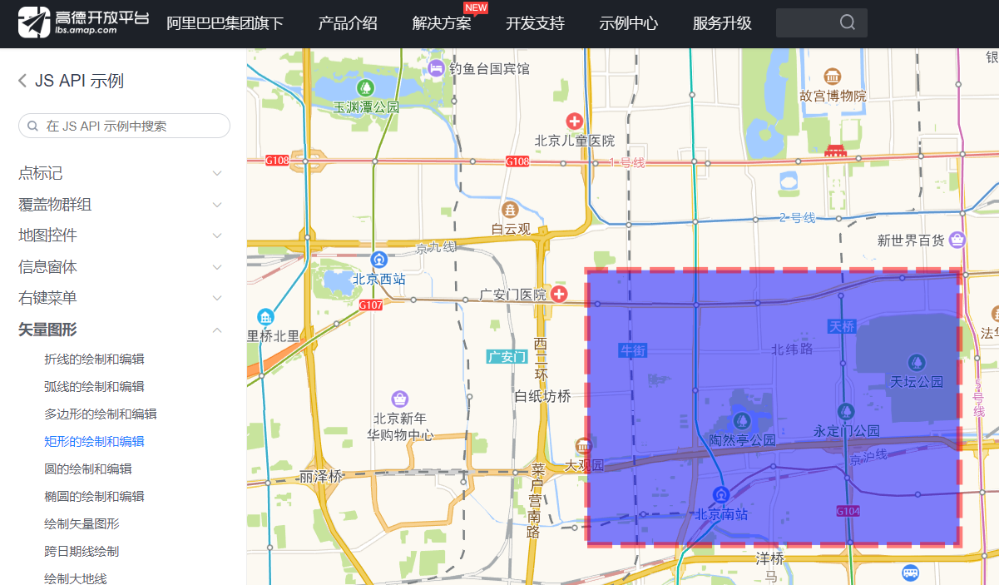

[TOC]

# 第一章 基本查询

## 1.1 ids查询

ids查询是一类简单的查询，它过滤返回的文档只包含其中指定标识符的文档，该查询默认指定作用在“_id”上面。

例如查询_id为1，2，3的文档：

```java
GET /sms-logs-index/sms_logs_type/_search/
{
	"query": {
		"ids": {
			"type": [],
			"values": ["1", "2", "3"],
			"boost": 1.0
		}
	}
}
```

> JAVA代码示例：com.qianfeng.elasticsearch.query.impl.BaseQueryImpl
>

```java
/**
 * 查出指定_id的文档
 * @param indexName   索引名称
 * @param typeName    TYPE名称
 * @param ids         _id值
 * @throws IOException
 */
@Override
public void idsQuery(String indexName, String typeName,String ... ids) throws IOException {
    SearchRequest searchRequest = new SearchRequest(indexName);
    searchRequest.types(typeName);
    SearchSourceBuilder searchSourceBuilder = new SearchSourceBuilder();
    searchSourceBuilder.query(QueryBuilders.idsQuery().addIds(ids));
    searchRequest.source(searchSourceBuilder);
    log.info("string:" + searchRequest.source());
    SearchResponse searchResponse =  restHighLevelClient.search(searchRequest,RequestOptions.DEFAULT);
    SearchHits hits = searchResponse.getHits();
    System.out.println("count:"+hits.totalHits);
    SearchHit[] h =  hits.getHits();
    for (SearchHit hit : h) {
        System.out.println("结果"+hit.getSourceAsMap());
    }
}
```

> 演示用例：com.qianfeng.elasticsearch.test.document.testIdsQuery
>

```java
@Test
public void testIdsQuery() throws IOException, InterruptedException {
    baseQuery.idsQuery(indexName,type,"1","2","3");
}
```


## 1.2 prefix查询

前缀查询，可以使我们找到某个字段以给定前缀开头的文档。

最典型的使用场景，一般是在文本框录入的时候的联想功能，如下所示：


例如想查到公司名以“中国”开头的文档：

```java
GET /sms-logs-index/sms_logs_type/_search/
{
	"query": {
		"prefix": {
			"corpName": {
				"value": "中国",
				"boost": 1.0
			}
		}
	}
}
```

> JAVA代码示例：com.qianfeng.elasticsearch.query.impl.BaseQueryImpl
>

```java
/**
 * 查找某字段以某个前缀开头的文档
 * @param indexName 索引名称
 * @param typeName  TYPE名称
 * @param field     字段
 * @param prefix    前缀
 * @throws IOException
 */
@Override
public void prefixQuery(String indexName, String typeName, String field, String prefix) throws IOException {
    SearchRequest searchRequest = new SearchRequest(indexName);
    searchRequest.types(typeName);
    SearchSourceBuilder searchSourceBuilder = new SearchSourceBuilder();
    searchSourceBuilder.query(QueryBuilders.prefixQuery(field,prefix));
    searchRequest.source(searchSourceBuilder);
    log.info("string:" + searchRequest.source());
    SearchResponse searchResponse =  restHighLevelClient.search(searchRequest,RequestOptions.DEFAULT);
    SearchHits hits = searchResponse.getHits();
    System.out.println("count:"+hits.totalHits);
    SearchHit[] h =  hits.getHits();
    for (SearchHit hit : h) {
        System.out.println("结果"+hit.getSourceAsMap());
    }
}
```

> 演示用例：com.qianfeng.elasticsearch.test.document.testIdsQuery
>

```java
@Test
public void testPrefixQuery() throws IOException, InterruptedException {
    baseQuery.prefixQuery(indexName,type,"corpName","中国");
}
```

## 1.3 fuzzy查询

fuzzy才是实现真正的模糊查询，我们输入的字符可以是个大概，他可以根据我们输入的文字大概进行匹配查询。

参数说明：

> **`prefix_length`**
>
> 不能被 “模糊化” 的初始字符数。 大部分的拼写错误发生在词的结尾，而不是词的开始。 例如通过将 `prefix_length` 设置为 `3` ，你可能够显著降低匹配的词项数量。
>


例如用户在查询过程中把“中国移动”输为了“中国联动”：

```java
GET /sms-logs-index/sms_logs_type/_search/
{
	"query": {
		"fuzzy": {
			"corpName": {
				"value": "中国联动",
				"fuzziness": "AUTO",
				"prefix_length": 0,
				"max_expansions": 50, #控制查询的数量,注意不是返回结果的最大值,而是在查询过程中最多去匹配到多少条,比如此处 50 条,即便有 1 万条能匹配到的,当查询过程中匹配到 50 条的时候就不再继续查询直接返回结果
				"transpositions": false,
				"boost": 1.0
			}
		}
	}
}
```

> JAVA代码示例：com.qianfeng.elasticsearch.query.impl.BaseQueryImpl

```java
/**
 * 查找某字段以某个前缀开头的文档
 * @param indexName 索引名称
 * @param typeName  TYPE名称
 * @param field     字段
 * @param value     查询关键字
 * @throws IOException
 */
@Override
public void fuzzyQuery(String indexName, String typeName,String field,String value) throws IOException {
    SearchRequest searchRequest = new SearchRequest(indexName);
    searchRequest.types(typeName);
    SearchSourceBuilder searchSourceBuilder = new SearchSourceBuilder();
    searchSourceBuilder.query(QueryBuilders.fuzzyQuery(field,value).prefixLength(2));
    searchRequest.source(searchSourceBuilder);
    log.info("string:" + searchRequest.source());
    SearchResponse searchResponse =  restHighLevelClient.search(searchRequest,RequestOptions.DEFAULT);
    SearchHits hits = searchResponse.getHits();
    System.out.println("count:"+hits.totalHits);
    SearchHit[] h =  hits.getHits();
    for (SearchHit hit : h) {
        System.out.println("结果"+hit.getSourceAsMap());
    }
}
```

把prefixLength(2)参数改为prefixLength(3)就查不到结果了，不能被 “模糊化” 的初始字符变成了`中国联`。

> 演示用例：com.qianfeng.elasticsearch.test.document.testIdsQuery

```java
@Test
public void testfuzzyQuery() throws IOException, InterruptedException {
    baseQuery.fuzzyQuery(indexName,type,"corpName","中国联动");
}
```

> 学生实习题 
>

```
用户输入错误地把“中国平安”输为了“中国保安”，通过fuzzy查询也可以查出公司名为中国平安的文档。
```

## 1.4 wildcard查询

wildcard查询允许我们在要查询的内容中使用通配符*和？，和SQL语句。

<font color=red>注意：wildcard查询不注意查询性能，应尽可能避免使用。</font>

例如用户在查询公司名以“中国”开头的文档：

```json
GET /sms-logs-index/sms_logs_type/_search/
{
	"query": {
		"wildcard": {
			"corpName": {
				"wildcard": "中国*",
				"boost": 1.0
			}
		}
	}
}
```

> JAVA代码示例：com.qianfeng.elasticsearch.query.impl.BaseQueryImpl
>

```java
/**
 * 以通配符来查询
 * @param indexName     索引名称
 * @param typeName      TYPE名称
 * @param fieldName     字段名称
 * @param wildcard      通配符
 * @throws IOException
 */
@Override
public void wildCardQuery(String indexName, String typeName, String fieldName, String wildcard) throws IOException {
    SearchRequest searchRequest = new SearchRequest(indexName);
    searchRequest.types(typeName);
    SearchSourceBuilder searchSourceBuilder = new SearchSourceBuilder();
    searchSourceBuilder.query(QueryBuilders.wildcardQuery(fieldName, wildcard));
    searchRequest.source(searchSourceBuilder);
    log.info("string:" + searchRequest.source());
    SearchResponse searchResponse =  restHighLevelClient.search(searchRequest,RequestOptions.DEFAULT);
    SearchHits hits = searchResponse.getHits();
    System.out.println("count:"+hits.totalHits);
    SearchHit[] h =  hits.getHits();
    for (SearchHit hit : h) {
        System.out.println("结果"+hit.getSourceAsMap());
    }
}
```

> 演示用例：com.qianfeng.elasticsearch.test.document.testIdsQuery
>

```java
@Test
public void testWildCardQuery() throws IOException, InterruptedException {
    baseQuery.wildCardQuery(indexName,type,"corpName","中国*");
    baseQuery.wildCardQuery(indexName,type,"corpName","中国?安保险有限公司");
}
```

## 1.5 range查询

本章到目前为止，对于数字，只介绍如何处理精确值查询。 实际上，对数字范围进行过滤有时会更有用。例如，我们可能想要查找所有价格大于 $20 且小于 $40 美元的产品。

在 SQL 中，范围查询可以表示为：

```sql
SELECT document
FROM   products
WHERE  price BETWEEN 20 AND 40
```

Elasticsearch 有 `range` 查询， 不出所料地，可以用它来查找处于某个范围内的文档：

```js
"range" : {
    "price" : {
        "gte" : 20,
        "lte" : 40
    }
}
```

`range` 查询可同时提供包含（inclusive）和不包含（exclusive）这两种范围表达式，可供组合的选项如下：

- `gt`: `>` 大于（greater than）

- `lt`: `<` 小于（less than）

- `gte`: `>=` 大于或等于（greater than or equal to）

- `lte`: `<=` 小于或等于（less than or equal to）

  

例如要查询出短信状态报告响应时间在1-10秒之内的文档：

```java
GET /sms-logs-index/sms_logs_type/_search/
{
	"query": {
		"range": {
			"replyTotal": {
				"from": 1,
				"to": 10,
				"include_lower": true,
				"include_upper": true,
				"boost": 1.0
			}
		}
	}
}

#或者下面写法
GET /sms-logs-index/sms_logs_type/_search/
{
	"query": {
		"range": {
			"replyTotal": {
				"gte": 1,
				"lte": 10
			}
		}
	}
}  
```

> JAVA代码示例：com.qianfeng.elasticsearch.query.impl.BaseQueryImpl
>

```java
/**
 * 范围查询
 * @param indexName     索引名称
 * @param typeName      TYPE名称
 * @param fieldName     字段名称
 * @param from
 * @param to
 * @throws IOException
 */
@Override
public void rangeQuery(String indexName, String typeName, String fieldName, int from,int to) throws IOException {
    SearchRequest searchRequest = new SearchRequest(indexName);
    searchRequest.types(typeName);
    SearchSourceBuilder searchSourceBuilder = new SearchSourceBuilder();
    searchSourceBuilder.query(QueryBuilders.rangeQuery(fieldName).from(from).to(to));
    searchRequest.source(searchSourceBuilder);
    log.info("string:" + searchRequest.source());
    SearchResponse searchResponse =  restHighLevelClient.search(searchRequest,RequestOptions.DEFAULT);
    SearchHits hits = searchResponse.getHits();
    System.out.println("count:"+hits.totalHits);
    SearchHit[] h =  hits.getHits();
    for (SearchHit hit : h) {
        System.out.println("结果"+hit.getSourceAsMap());
    }
}
```

> 演示用例：com.qianfeng.elasticsearch.test.document.testIdsQuery
>

```
@Test
public void testRangeCardQuery() throws IOException {
    baseQuery.rangeQuery(indexName,type,"replyTotal",1,20);
}
```

> 学生实习题 
>

```
查询价格（fee）在5-8分之间的短信文档。
```

## 1.6 regexp查询

正则表达式查询，wildcard和regexp查询的工作方式和prefix查询完全一样。它们也需要遍历倒排索引中的词条列表来找到所有的匹配词条，然后逐个词条地收集对应的文档ID。它们和prefix查询的唯一区别在于它们能够支持更加复杂的模式。

这也意味着使用它们存在相同的风险。对一个含有很多不同词条的字段运行这类查询是非常消耗资源的。避免使用一个以通配符开头的模式(比如，*foo)。

尽管对于前缀匹配，可以在索引期间准备你的数据让它更加高效，通配符和正则表达式匹配只能在查询期间被完成。虽然使用场景有限，但是这些查询也有它们的用武之地。

<font color=red>注意：prefix，wildcard以及regexp查询基于词条进行操作。如果你在一个analyzed字段上使用了它们，它们会检查字段中的每个词条，而不是整个字段。</font>

例如查找长号码(longCode)以1069开头后面是数字的文档：

```java
GET /sms-logs-index/sms_logs_type/_search/
{
	"query": {
		"regexp": {
			"longCode": {
				"value": "1069[0-9].+",
				"flags_value": 65535,
				"max_determinized_states": 10000,
				"boost": 1.0
			}
		}
	}
}
```

> JAVA代码示例：com.qianfeng.elasticsearch.query.impl.BaseQueryImpl
>

```java
/**
 *正则表达示查询
 * @param indexName     索引名称
 * @param typeName      TYPE名称
 * @param fieldName     字段名称
 * @param regexp        正则表达示
 * @throws IOException
 */
@Override
public void regexpQuery(String indexName, String typeName, String fieldName, String regexp) throws IOException {
    SearchRequest searchRequest = new SearchRequest(indexName);
    searchRequest.types(typeName);
    SearchSourceBuilder searchSourceBuilder = new SearchSourceBuilder();
    searchSourceBuilder.query(QueryBuilders.regexpQuery(fieldName,regexp));
    searchRequest.source(searchSourceBuilder);
    log.info("string:" + searchRequest.source());
    SearchResponse searchResponse =  restHighLevelClient.search(searchRequest,RequestOptions.DEFAULT);
    SearchHits hits = searchResponse.getHits();
    System.out.println("count:"+hits.totalHits);
    SearchHit[] h =  hits.getHits();
    for (SearchHit hit : h) {
        System.out.println("结果"+hit.getSourceAsMap());
    }
}
```

> 演示用例：com.qianfeng.elasticsearch.test.document.testIdsQuery
>

```java
@Test
public void testRegexpQuery() throws IOException {
    String regex = "1069[0-9].+";
    baseQuery.regexpQuery(indexName,type,"longCode",regex);
}
```

## 1.7 scroll查询

ES对于from+size的个数是有限制的，二者之和不能超过1w。当所请求的数据总量大于1w时，可用scroll来代替from+size。

### 1.7.1 原理

ES的搜索是分2个阶段进行的，即Query阶段和Fetch阶段。  Query阶段比较轻量级，通过查询倒排索引，获取满足查询结果的文档ID列表。  而Fetch阶段比较重，需要将每个shard的结果取回，在协调结点进行全局排序。  通过From+size这种方式分批获取数据的时候，随着from加大，需要全局排序并丢弃的结果数量随之上升，性能越来越差。

而Scroll查询，先做轻量级的Query阶段以后，免去了繁重的全局排序过程。 它只是将查询结果集，也就是doc id列表保留在一个上下文里， 之后每次分批取回的时候，只需根据设置的size，在每个shard内部按照一定顺序（默认doc_id续)， 取回这个size数量的文档即可。 

### 1.7.2 使用场景

由此也可以看出scroll不适合支持那种实时的和用户交互的前端分页工作，其主要用途用于从ES集群分批拉取大量结果集的情况，一般都是offline的应用场景。  比如需要将非常大的结果集拉取出来，存放到其他系统处理，或者需要做大索引的reindex等等。
 不要把 `scroll` 用于实时请求，它主要用于大数据量的场景。例如：将一个索引的内容索引到另一个不同配置的新索引中。

### 1.7.3 JAVA代码示例

例如滚动查询所有文档：

```java
POST  /sms-logs-index/sms_logs_type/_search?scroll=1m
{
    "from": 0,
    "size": 2,  #每次返回的数据的条数
    "query": {
        "match_all" : {}
    },
    "sort": [
        "_doc"
        ]
}


POST /_search/scroll #继续使用滚动查询
{
   "scroll": "1m", #设置时间
   "scroll_id": "DnF1ZXJ5VGhlbkZldGNoAwAAAAAAAAAdFkEwRENOVTdnUUJPWVZUd1p2WE5hV2cAAAAAAAAAHhZBMERDTlU3Z1FCT1lWVHdadlhOYVdnAAAAAAAAAB8WQTBEQ05VN2dRQk9ZVlR3WnZYTmFXZw==" #指定在哪个scroll的基础上继续查询
}
```

`清除scroll,按照官方文档是这样删除,但是运行会报错,删不掉`

虽然我们在设置开启scroll时，设置了一个scroll的存活时间，但是如果能够在使用完顺手关闭，可以提早释放资源，降低ES的负担.

```json
DELETE /_search/scroll
{
    "scroll_id": "DnF1ZXJ5VGhlbkZldGNoBQAAAAAAdsMqFmVkZTBJalJWUmp5UmI3V0FYc2lQbVEAAAAAAHbDKRZlZGUwSWpSVlJqeVJiN1dBWHNpUG1RAAAAAABpX2sWclBEekhiRVpSRktHWXFudnVaQ3dIQQAAAAAAaV9qFnJQRHpIYkVaUkZLR1lxbnZ1WkN3SEEAAAAAAGlfaRZyUER6SGJFWlJGS0dZcW52dVpDd0hB"
}
```

> JAVA代码示例：com.qianfeng.elasticsearch.query.impl.BaseQueryImpl
>

```java
@Override
public void scrollQuery(String indexName, String typeName) throws IOException {
    SearchRequest searchRequest = new SearchRequest(indexName);
    searchRequest.types(typeName);
    //初始化scroll
    //值不需要足够长来处理所有数据—它只需要足够长来处理前一批结果。每个滚动请求(带有滚动参数)设置一个新的过期时间。
    final Scroll scroll = new Scroll(TimeValue.timeValueMinutes(1L)); //设定滚动时间间隔
    searchRequest.scroll(scroll);
    SearchSourceBuilder searchSourceBuilder = new SearchSourceBuilder();
    searchSourceBuilder.query(matchAllQuery());
    searchSourceBuilder.size(5); //设定每次返回多少条数据
    searchRequest.source(searchSourceBuilder);
    log.info("string:" + searchRequest.source());
    SearchResponse searchResponse = null;
    try {
        searchResponse = restHighLevelClient.search(searchRequest, RequestOptions.DEFAULT);
    } catch (IOException e) {
        e.printStackTrace();
    }
    String scrollId = searchResponse.getScrollId();
    SearchHit[] searchHits = searchResponse.getHits().getHits();
    System.out.println("-----首页-----");
    for (SearchHit searchHit : searchHits) {
        System.out.println(searchHit.getSourceAsString());
    }
    //遍历搜索命中的数据，直到没有数据
    while (searchHits != null && searchHits.length > 0) {
        SearchScrollRequest scrollRequest = new SearchScrollRequest(scrollId);
        scrollRequest.scroll(scroll);
        log.info("string:" + scrollRequest.toString());
        try {
            searchResponse = restHighLevelClient.scroll(scrollRequest, RequestOptions.DEFAULT);
        } catch (IOException e) {
            e.printStackTrace();
        }
        scrollId = searchResponse.getScrollId();
        searchHits = searchResponse.getHits().getHits();
        if (searchHits != null && searchHits.length > 0) {
            System.out.println("-----下一页-----");
            for (SearchHit searchHit : searchHits) {
                System.out.println(searchHit.getSourceAsString());
            }
        }

    }
    
    //清除滚屏
    ClearScrollRequest clearScrollRequest = new ClearScrollRequest();
    clearScrollRequest.addScrollId(scrollId);//也可以选择setScrollIds()将多个scrollId一起使用
    ClearScrollResponse clearScrollResponse = null;
    try {
        clearScrollResponse = restHighLevelClient.clearScroll(clearScrollRequest,RequestOptions.DEFAULT);
    } catch (IOException e) {
        e.printStackTrace();
    }
    boolean succeeded = clearScrollResponse.isSucceeded();
    System.out.println("succeeded:" + succeeded);
}
```

> 演示用例：com.qianfeng.elasticsearch.test.document.testIdsQuery
>

```java
@Test
public void testScrollQuery() throws IOException {
    baseQuery.scrollQuery(indexName,type);
}
```

演示效果：


# 第二章 delete-by-query

删除查询的文档，由于每个文档都需要单独被删除，查询大量文档可能需要很长的时间。

**注意：**

```
不要使用delete-by-query来删除一个索引下的全部或者大部分文档，确实需要的话，可以创建一个新的索引，然后将需要保留的文档重新索引到新的索引中去，这样你就可以直接删掉旧索引。
```


```json
POST /sms-logs-index/sms_logs_type/_delete_by_query
{
   "query": { #此处使用之前的查询条件
    "match_all": {}
  }
}
```


> JAVA代码示例：com.qianfeng.elasticsearch.query.impl.DocServiceImpl
>

```java
/**
 * 删除查询的数据
 * @param indexName 索引名称
 * @param typeName  TYPE名称
 * @param fieldName   查询字段名称
 * @param fieldValue  查询字段值
 * @throws IOException
 */
@Override
public void deleteByQuery(String indexName, String typeName,String fieldName,String  fieldValue) throws IOException {
    DeleteByQueryRequest deleteByQueryRequest = new DeleteByQueryRequest(indexName).types(typeName).setQuery(QueryBuilders.termQuery(fieldName, fieldValue));
    BulkByScrollResponse bulkByScrollResponse = restHighLevelClient.deleteByQuery(deleteByQueryRequest, RequestOptions.DEFAULT);
    log.info(bulkByScrollResponse.toString());
}
```

> 演示用例：com.qianfeng.elasticsearch.test.document.DeleteByQueryTest
>

```java
//先增加1000条数据
@Test
public void testAddDatas() throws IOException {
    for (int i=0;i<1000;i++) {
        SmsSendLog smsSendLog = new SmsSendLog();
        smsSendLog.setMobile("13800000000");
        smsSendLog.setCorpName("贝壳网");
        smsSendLog.setCreateDate(new Date());
        smsSendLog.setSendDate(new Date());
        smsSendLog.setIpAddr("10.126.2.9");
        smsSendLog.setLongCode("10690000988");
        smsSendLog.setReplyTotal(10);
        smsSendLog.setSmsContent("【贝壳找房】择水而居，北京669万高品质两居 http://xxxxxxx，退订回T");
        smsSendLog.setProvince("北京");
        smsSendLog.setOperatorId(1);
        smsSendLog.setFee(3);
        int k = 1000 + i;
        docService.add(indexName, type, JSON.toJSONString(smsSendLog), String.valueOf(k));
    }
}

//演示完成后，删除公司名为“贝壳网”的数据
@Test
public void testDeleteByQuery() throws IOException {
    docService.deleteByQuery(indexName, type, "corpName", "贝壳网");
}
```

> 学生实习题 
>

```
1.插入出1000条数据，设置fee的值大于100

2.删除fee大于100的数据
```


# 第三章 复合查询

## 3.1 bool查询

bool （布尔）过滤器。 这是个 复合过滤器（compound filter） ，它可以接受多个其他过滤器作为参数，并将这些过滤器结合成各式各样的布尔（逻辑）组合。 
格式 
一个 bool 过滤器由三部分组成：

```json
{
   "bool" : {
      "must" :     [],
      "should" :   [],
      "must_not" : [],
   }
}
```

参数定义：

> `must` 
> 所有的语句都 必须（must） 匹配，与 AND 等价。 
> `must_not` 
> 所有的语句都 不能（must not） 匹配，与 NOT 等价。 
> `should` 
> 至少有一个语句要匹配，与 OR 等价。

例如查询条件：

```
1.省份为湖北或北京

2.运营商不是联通

3.短信内容中包含有“中国”关键词
```


```java
POST  /sms-logs-index/sms_logs_type/_search
{
	"query": {
		"bool": {
			"must": [{
				"match": {
					"smsContent": {
						"query": "中国",
						"operator": "OR",
						"prefix_length": 0,
						"max_expansions": 50,
						"fuzzy_transpositions": true,
						"lenient": false,
						"zero_terms_query": "NONE",
						"auto_generate_synonyms_phrase_query": true,
						"boost": 1.0
					}
				}
			}],
			"must_not": [{
				"term": {
					"operatorId": {
						"value": 2,
						"boost": 1.0
					}
				}
			}],
			"should": [{
				"term": {
					"province": {
						"value": "湖北省",
						"boost": 1.0
					}
				}
			}, {
				"term": {
					"province": {
						"value": "北京",
						"boost": 1.0
					}
				}
			}],
			"adjust_pure_negative": true,
			"boost": 1.0
		}
	}
}
```

> JAVA代码示例：com.qianfeng.elasticsearch.query.impl.BoolQueryImpl
>

```java
**
 * bool组俣查询
 * @param indexName   索引名称
 * @param typeName    TYPE名称
 * @throws IOException
 */
public void boolQuery(String indexName, String typeName) throws IOException {
    SearchRequest searchRequest = new SearchRequest(indexName);
    searchRequest.types(typeName);
    SearchSourceBuilder searchSourceBuilder = new SearchSourceBuilder();
    BoolQueryBuilder queryBuilder = QueryBuilders.boolQuery();
    queryBuilder.should(QueryBuilders.termQuery("province","湖北省"));
    queryBuilder.should(QueryBuilders.termQuery("province","北京"));
    queryBuilder.must(QueryBuilders.matchQuery("smsContent","中国"));
    //运营商不是联通的手机号
    queryBuilder.mustNot(QueryBuilders.termQuery("operatorId",2));
    searchSourceBuilder.query(queryBuilder);
    searchRequest.source(searchSourceBuilder);
    log.info("source:" + searchRequest.source());
    SearchResponse searchResponse =  restHighLevelClient.search(searchRequest, RequestOptions.DEFAULT);
    SearchHits hits = searchResponse.getHits();
    System.out.println("count:"+hits.totalHits);
    SearchHit[] h =  hits.getHits();
    for (SearchHit hit : h) {
        System.out.println("结果"+hit.getSourceAsMap());
    }
}
```

> 演示用例：com.qianfeng.elasticsearch.test.document.BoolQueryTest
>

```java
@Test
public void testBoolQuery() throws IOException {
    boolQuery.boolQuery(indexName,type);
}
```

> 学生实习题 
>

```java
查询条件如下：
1.运营商为联通或移动
2.公司名为“途虎养车”或“招商银行”
3.短信内容中包含有“红包”或“安装”关键词
```

## 3.2 boosting查询

这个查询会根据条件查询结果,并不是从结果排除掉另外一个条件的数据,而是在返回内容进行排序显示的时候会排在后面

```
The boosting query can be used to effectively demote results that match a given query. Unlike the "NOT" clause in bool query, this still selects documents that contain undesirable terms, but reduces their overall score.(仍然会选中显示查询的内容,但是会降低它的评分)
```


它接受一个positive查询和一个negative查询。只有匹配了positive查询的文档才会被包含到结果集中，但是同时匹配了negative查询的文档会被降低其相关度，通过将文档原本的_score和negative_boost参数进行相乘来得到新的_score。因此，negative_boost参数必须小于1.0。在上面的例子中，任何包含了指定负面词条的文档的_score都会是其原本_score的一半。

打分核心标准:

搜索的关键词在目标文档中出现的频率越高,评分就越高

目标文档的内容长度越短,评分越高

因为我们搜索的关键词可能会被分词,目标文档中和分词匹配的个数越多,评分越高

权重越高,评分越高

例如：

在互联网上搜索"苹果"也许会返回，水果或者各种食谱的结果。我们可以通过排除“水果 乔木 维生素”和这类单词，结合bool查询中的must_not子句，将结果范围缩小到只剩苹果手机。

```java
POST  /sms-logs-index/sms_logs_type/_search
{
	"query": {
		"boosting": {
			"positive": {
				"match": {
					"smsContent": {
						"query": "盒马",
						"operator": "OR",
						"prefix_length": 0,
						"max_expansions": 50,
						"fuzzy_transpositions": true,
						"lenient": false,
						"zero_terms_query": "NONE",
						"auto_generate_synonyms_phrase_query": true,
						"boost": 1.0
					}
				}
			},
			"negative": {
				"match": {
					"smsContent": {
						"query": "水果 乔木 维生素 中国",
						"operator": "OR",
						"prefix_length": 0,
						"max_expansions": 50,
						"fuzzy_transpositions": true,
						"lenient": false,
						"zero_terms_query": "NONE",
						"auto_generate_synonyms_phrase_query": true,
						"boost": 0.1
					}
				}
			},
			"negative_boost": 0.1,
			"boost": 1.0
		}
	}
}
```

> JAVA代码示例：com.qianfeng.elasticsearch.query.impl.BoolQueryImpl
>

```java
public void boostingQuery(String indexName, String typeName) throws IOException {
    SearchRequest searchRequest = new SearchRequest(indexName);
    searchRequest.types(typeName);
    SearchSourceBuilder searchSourceBuilder = new SearchSourceBuilder();
    MatchQueryBuilder matchQueryPositiveBuilder = QueryBuilders.matchQuery("smsContent", "苹果");
    MatchQueryBuilder matchQueryNegativeBuilder = QueryBuilders.matchQuery("smsContent", "水果 乔木 维生素");//
    BoostingQueryBuilder boostingQueryBuilder = QueryBuilders.boostingQuery(matchQueryPositiveBuilder,
            matchQueryNegativeBuilder).negativeBoost(0.1f);
    searchSourceBuilder.query(boostingQueryBuilder);
    searchRequest.source(searchSourceBuilder);
    log.info("source:" + searchRequest.source());
    SearchResponse searchResponse =  restHighLevelClient.search(searchRequest, RequestOptions.DEFAULT);
    SearchHits hits = searchResponse.getHits();
    System.out.println(searchRequest.source().toString());
    System.out.println("count:"+hits.totalHits);
    SearchHit[] h =  hits.getHits();
    for (SearchHit hit : h) {
        System.out.println("score:"+hit.getScore());
        System.out.println("结果"+hit.getSourceAsMap());
    }
}
```

> 演示用例：com.qianfeng.elasticsearch.test.document.BoolQueryTest
>

```java
/**
 * 它接受一个positive查询和一个negative查询。只有匹配了positive查询的文档才会被包含到结果集中，
 * 但是同时匹配了negative查询的文档会被降低其相关度，通过将文档原本的_score和negative_boost参数进行相乘来得到新的_score。
 * 因此，negative_boost参数必须小于1.0。在上面的例子中，任何包含了指定负面词条的文档的_score都会是其原本_score的一半。
 * @throws IOException
 */
@Test
public void testBoostingQuery() throws InterruptedException, IOException {
    SmsSendLog smsSendLog = new SmsSendLog();
    smsSendLog.setMobile("13800000000");
    smsSendLog.setCorpName("天猫商城");
    smsSendLog.setCreateDate(new Date());
    smsSendLog.setSendDate(new Date());
    smsSendLog.setIpAddr("10.126.2.9");
    smsSendLog.setLongCode("10690000988");
    smsSendLog.setReplyTotal(10);
    smsSendLog.setSmsContent("【天猫商城】苹果手机双11大优惠，原价8000块钱的苹果土豪金IPNONE手机，惊爆降价2000元，速来抢购。你也可以拥有苹果");
    smsSendLog.setProvince("北京");
    smsSendLog.setOperatorId(1);
    docService.add(indexName,type, JSON.toJSONString(smsSendLog),"17");

    smsSendLog.setMobile("13700000001");
    smsSendLog.setProvince("上海");
    smsSendLog.setSmsContent("苹果，是水果中的一种，是蔷薇科亚科属植物，其树木为落叶乔木。营养价值很高，富含矿物质和维生素，" +
            "含钙量丰富，有助于代谢掉体内多余盐分，酸可代谢热量，防止下半身肥胖。是人们经常食用的水果之一。");
    docService.add(indexName,type, JSON.toJSONString(smsSendLog),"18");
    Thread.sleep(3000l);
    //都可以查出来，只是SCORE值减少，可以通过SCORE值来去掉排名在后面的
    boolQuery.boostingQuery(indexName,type);
}
```

搜索结果如下，观察两个score值：


# 第四章 排序

默认情况下，结果集会按照相关性进行排序 -- 相关性越高，排名越靠前。 这一章我们会讲述相关性是什么以及它是如何计算的。 在此之前，我们先看一下`sort`参数的使用方法。

为了使结果可以按照相关性进行排序，我们需要一个相关性的值。在ElasticSearch的查询结果中， 相关性分值会用`_score`字段来给出一个浮点型的数值，所以默认情况下，结果集以`_score`进行倒序排列。


```json
GET /sms-logs-index/sms_logs_type/_search
{
    "query": {
        "match_all": {}
    },
    "sort": [
        {
           "operatorId": {
               "order":"asc"
           }
        }
    ]
        
}
```


> JAVA代码示例：com.qianfeng.elasticsearch.query.impl.SortQueryImpl

```java
@Override
public void queryMatch(String indexName, String typeName, String field,String keyWord) throws IOException {
    SearchRequest searchRequest = new SearchRequest(indexName);
    searchRequest.types(typeName);
    SearchSourceBuilder searchSourceBuilder = new SearchSourceBuilder();
    searchSourceBuilder.query(QueryBuilders.matchQuery(field,keyWord));
    searchSourceBuilder.sort("replyTotal");
    searchRequest.source(searchSourceBuilder);
    log.info("source:" + searchRequest.source());
    SearchResponse searchResponse =  restHighLevelClient.search(searchRequest, RequestOptions.DEFAULT);
    SearchHits hits = searchResponse.getHits();
    System.out.println("count:"+hits.totalHits);
    SearchHit[] h =  hits.getHits();
    for (SearchHit hit : h) {
        System.out.println("结果"+hit.getSourceAsMap() +",score:"+ hit.getScore());
    }
}

@Override
public void sortQuery(String indexName, String typeName, String field,String keyWord,String sort,SortOrder sortOrder) throws IOException {
    SearchRequest searchRequest = new SearchRequest(indexName);
    searchRequest.types(typeName);
    SearchSourceBuilder searchSourceBuilder = new SearchSourceBuilder();
    searchSourceBuilder.query(QueryBuilders.matchQuery(field,keyWord));
    searchSourceBuilder.sort(sort, sortOrder);
    searchRequest.source(searchSourceBuilder);
    log.info("source:" + searchRequest.source());
    SearchResponse searchResponse =  restHighLevelClient.search(searchRequest, RequestOptions.DEFAULT);
    SearchHits hits = searchResponse.getHits();
    System.out.println("count:"+hits.totalHits);
    SearchHit[] h =  hits.getHits();
    for (SearchHit hit : h) {
        System.out.println("结果"+hit.getSourceAsMap() +",score:"+ hit.getScore());
    }
}

@Override
public void multSortQuery(String indexName, String typeName, String field,String keyWord,String sort1,String sort2,SortOrder sortOrder) throws IOException {
    SearchRequest searchRequest = new SearchRequest(indexName);
    searchRequest.types(typeName);
    SearchSourceBuilder searchSourceBuilder = new SearchSourceBuilder();
    searchSourceBuilder.query(QueryBuilders.matchQuery(field,keyWord));
    searchSourceBuilder.sort(sort1, sortOrder);
    searchSourceBuilder.sort(sort2, sortOrder);
    searchRequest.source(searchSourceBuilder);
    log.info("source:" + searchRequest.source());
    SearchResponse searchResponse =  restHighLevelClient.search(searchRequest, RequestOptions.DEFAULT);
    SearchHits hits = searchResponse.getHits();
    System.out.println("count:"+hits.totalHits);
    SearchHit[] h =  hits.getHits();
    for (SearchHit hit : h) {
        System.out.println("结果"+hit.getSourceAsMap() +",score:"+ hit.getScore());
    }
}
```

> 演示用例：com.qianfeng.elasticsearch.test.document.SortQueryTest

```java
//默认排序
@Test
public void testSortQueryByDefault() throws IOException {
   sortQuery.queryMatch(indexName,type,"smsContent","中国银行");
}

//条件排序
@Test
public void testSortQueryBySort() throws IOException {
   sortQuery.sortQuery(indexName,type,"smsContent","中国银行","replyTotal", SortOrder.DESC);
}

//多条件排序
@Test
public void testSortQueryByMultSort() throws IOException {
   sortQuery.multSortQuery(indexName,type,"smsContent","中国银行","replyTotal","province", SortOrder.DESC);
 }
```

# 第五章 过滤查询结果

## 4.1 filter与query对比

`filter`，仅仅只是按照搜索条件过滤出需要的数据而已，不计算任何相关度分数，对相关度没有任何影响；
`query`，会去计算每个document相对于搜索条件的相关度，并按照相关度进行排序；

一般来说，如果你是在进行搜索，需要将最匹配搜索条件的数据先返回，那么用query；如果你只是要根据一些条件筛选出一部分数据，不关注其排序，那么用filter；
除非是你的这些搜索条件，你希望越符合这些搜索条件的document越排在前面返回，那么这些搜索条件要放在query中；如果你不希望一些搜索条件来影响你的document排序，那么就放在filter中即可；

分数的计算规则: 关键词在文档中出现的频率越高,分数越高, 如果关键词出现在文档个数中越高,分数越低, 关键词出现的文档的内容的长度越长,分数越低


## 4.2 filter与query性能对比

`filter`，不需要计算相关度分数，不需要按照相关度分数进行排序，同时还有内置的自动cache最常使用filter的数据

`query`，相反，要计算相关度分数，按照分数进行排序，而且无法cache结果.

## 4.3 filter

全如搜索省份为“湖北省”，并且运营商为移动（标识为1）的短信文档：

```java
GET /sms-logs-index/sms_logs_type/_search
{
	"query": {
		"bool": {
			"filter": [{
				"term": {
					"province": {
						"value": "湖北省",
						"boost": 1.0
					}
				}
			}, {
				"term": {
					"operatorId": {
						"value": 1,
						"boost": 1.0
					}
				}
			}],
			"adjust_pure_negative": true,
			"boost": 1.0
		}
	}
}
```

> JAVA代码示例：com.qianfeng.elasticsearch.query.impl.FilterQueryImpl
>

```java

@Override
    public void filterInBoolQuery(String indexName, String typeName) throws IOException {
        SearchRequest searchRequest = new SearchRequest(indexName);
        searchRequest.types(typeName);
        SearchSourceBuilder searchSourceBuilder = new SearchSourceBuilder();
        BoolQueryBuilder queryBuilder = QueryBuilders.boolQuery();
        queryBuilder.filter(QueryBuilders.termQuery("province","湖北省"));
        queryBuilder.filter(QueryBuilders.termQuery("operatorId",1));
        searchSourceBuilder.query(queryBuilder);
        searchRequest.source(searchSourceBuilder);
        SearchResponse searchResponse =  restHighLevelClient.search(searchRequest, RequestOptions.DEFAULT);
        SearchHits hits = searchResponse.getHits();
        System.out.println("count:"+hits.totalHits);
        SearchHit[] h =  hits.getHits();
        for (SearchHit hit : h) {
            System.out.println("结果"+hit.getSourceAsMap());
        }
    }
```


## 4.4 range过滤器

range过滤器允许我们将搜索范围限制在字段值给定的界限范围内。

例如搜索省份为“湖北省”费用在1-5分之间的短信文档：

```java
GET /sms-logs-index/sms_logs_type/_search
{
	"query": {
		"bool": {
			"filter": [{
				"term": {
					"province": {
						"value": "湖北省",
						"boost": 1.0
					}
				}
			}, {
				"range": {
					"fee": {
						"from": 1,
						"to": 5,
						"include_lower": true,
						"include_upper": true,
						"boost": 1.0
					}
				}
			}],
			"adjust_pure_negative": true,
			"boost": 1.0
		}
	}
}
```

> JAVA代码示例：com.qianfeng.elasticsearch.query.impl.FilterQueryImpl
>

```java
@Override
public void rangeQuery(String indexName, String typeName, String fieldName, int from,int to) throws IOException {
    SearchRequest searchRequest = new SearchRequest(indexName);
    searchRequest.types(typeName);
    SearchSourceBuilder searchSourceBuilder = new SearchSourceBuilder();
    searchSourceBuilder.query(QueryBuilders.rangeQuery(fieldName).from(from).to(to));
    searchRequest.source(searchSourceBuilder);
    log.info("string:" + searchRequest.source());
    SearchResponse searchResponse =  restHighLevelClient.search(searchRequest,RequestOptions.DEFAULT);
    SearchHits hits = searchResponse.getHits();
    System.out.println("count:"+hits.totalHits);
    SearchHit[] h =  hits.getHits();
    for (SearchHit hit : h) {
        System.out.println("结果"+hit.getSourceAsMap());
    }
}
```

> 演示用例：com.qianfeng.elasticsearch.test.document.FilterQueryTest
>

```
@Test
public void testRangeCardQuery() throws IOException {
    filterQuery.rangeQuery(indexName,type,"fee",1,5);
}
```

## 4.5 exists 过滤器

exists 过滤器只选择给定字段的文档。如果某字段没有值，就不选择。

比如我们查询响应时间不为空的文档：

```java
GET /sms-logs-index/sms_logs_type/_search
{
	"query": {
		"exists": {
			"field": "replyTotal",
			"boost": 1.0
		}
	}
}
```

> JAVA代码示例：com.qianfeng.elasticsearch.query.impl.FilterQueryImpl
>

```java
@Override
public void existQuery(String indexName, String typeName, String fieldName) throws IOException {
    SearchRequest searchRequest = new SearchRequest(indexName);
    searchRequest.types(typeName);
    SearchSourceBuilder searchSourceBuilder = new SearchSourceBuilder();
    searchSourceBuilder.query(QueryBuilders.existsQuery(fieldName));
    searchRequest.source(searchSourceBuilder);
    log.info("string:" + searchRequest.source());
    SearchResponse searchResponse =  restHighLevelClient.search(searchRequest,RequestOptions.DEFAULT);
    SearchHits hits = searchResponse.getHits();
    System.out.println("count:"+hits.totalHits);
    SearchHit[] h =  hits.getHits();
    for (SearchHit hit : h) {
        System.out.println("结果"+hit.getSourceAsMap());
    }
}
```

> 演示用例：com.qianfeng.elasticsearch.test.document.FilterQueryTest
>

增加一条新的数据，去掉ReplyTotal字段的值，通过查询查出replyTotal不为空的文档。

```java
 @Test
    public void testExistQuery() throws IOException, InterruptedException {
        SmsSendLog smsSendLog = new SmsSendLog();
        smsSendLog.setMobile("13998000000");
        smsSendLog.setCorpName("北京海联力捷汽车销售服务有限公司");
        smsSendLog.setCreateDate(new Date());
        smsSendLog.setSendDate(new Date());
        smsSendLog.setIpAddr("10.126.2.9");
        smsSendLog.setLongCode("10690000988");
        //去掉某个值
//        smsSendLog.setReplyTotal(10);
        smsSendLog.setSmsContent("感谢您致电北京海联力捷汽车销售服务有限公司 我们以客户至上的理念，" +
                "为您提供专业的技术服务，全体员工期待您的光临！");
        smsSendLog.setProvince("北京");
        smsSendLog.setOperatorId(1);
        docService.add(indexName,type, JSON.toJSONString(smsSendLog),"300");
        Thread.sleep(2000l);
        filterQuery.existQuery(indexName,type,"replyTotal");
    }
```

# 第六章 高亮

## 6.1 高亮介绍

许多应用都倾向于在每个搜索结果中 高亮 显示搜索的关键词，比如字体的加粗,改变字体的颜色等.以便让用户知道为何该文档符合查询条件。在 Elasticsearch 中检索出高亮片段也很容易。

高亮显示需要一个字段的实际内容。 如果该字段没有被存储（映射mapping没有将存储设置为 true），则加载实际的_source，并从_source中提取相关的字段。

以百度搜索“千锋”为例，如下图标红的文字。


在 Elasticsearch 中检索出高亮片段也很容易。

再次执行前面的查询，并增加一个新的 `highlight` 参数：

```js
GET /sms-logs-index/sms_logs_type/_search
{
    "query" : {
        "match_phrase" : {
            "smsContent": "服务"
        }
    },
    "highlight": {
       "pre_tags": ["<tag1>"],
  		"post_tags": ["</tag2>"],
        "fields" : {
            "smsContent" : {}
        }
    }
}
```

当执行该查询时，返回结果与之前一样，与此同时结果中还多了一个叫做 `highlight` 的部分。这个部分包含了 `about` 属性匹配的文本片段，并以 HTML 标签 `<em></em>` 封装：

```js
{
   ...
   "hits": {
      "total":      1,
      "max_score":  0.23013961,
      "hits": [
         {
            ...
            "_score":         0.23013961,
            "_source": {
               "first_name":  "John",
               "last_name":   "Smith",
               "age":         25,
               "about":       "I love to go rock climbing",
               "interests": [ "sports", "music" ]
            },
            "highlight": {
               "about": [
                  "I love to go <em>rock</em> <em>climbing</em>" 
               ]
            }
         }
      ]
   }
}
```

可以看到，除了从ES中得到标准信息以外，还有一个新命名的highlight的部分。这里ES使用<em>的这HTML标签作为highlight部分的开始，使用<//em>标识其结束。

## 6.2 高亮使用

**highlight参数：**

下面的参数可以改变返回的结果。即可以为单独的字段设置不同的参数，也可以作为 highlight 的属性统一定义。

`number_of_fragments`
        fragment 是指一段连续的文字。返回结果最多可以包含几段不连续的文字。默认是5。,如果要返回所有内容,设置 

`fragment_size`
       某字段的值，长度是1万，但是我们一般不会在页面展示这么长，可能只是展示一部分。设置要显示出来的fragment文本判断的长度，默认是100

`no_match_size`

如果我们设置的高向区域并没有我们想要的高亮数据,仍然会返回当前属性指定的长度的内容,比如我们通过 province 来查询数据,但是期望把 smsContent中符合条件的内容高亮出来,但是可能smsContent中并没有这个高亮内容,这个时候仍旧会把smsContent中的内容显示出来

`pre_tags`
       标记 highlight 的开始标签。例如上面的<em>。

`post_tags`
       标记 highlight 的结束标签。例如上面的</em>。


例如：以“中国苹果”为关键词搜索短信下发内容，并高亮显示，HTML样式为"<b><font color=red>".


> JAVA代码示例：com.qianfeng.elasticsearch.query.impl.HightLightQueryImpl
>

```java
@Override
public void hightLightQuery(String indexName, String type,String field,String keyword) throws IOException {
    SearchRequest searchRequest = new SearchRequest(indexName);
    searchRequest.types(type);
    SearchSourceBuilder searchSourceBuilder = new SearchSourceBuilder();
    searchSourceBuilder.from(0);
    searchSourceBuilder.size(5);
    //条件
    MatchQueryBuilder queryBuilder = new MatchQueryBuilder(field,keyword);
    // 高亮设置
    HighlightBuilder highlightBuilder = new HighlightBuilder();
    highlightBuilder.requireFieldMatch(false).field(field).
            preTags("<b><font color=red>").postTags("</font></b>");
    searchSourceBuilder.highlighter(highlightBuilder);
    searchSourceBuilder.query( queryBuilder);
    searchRequest.source(searchSourceBuilder);
    log.info("source string:" + searchRequest.source());
    SearchResponse searchResponse =  restHighLevelClient.search(searchRequest, RequestOptions.DEFAULT);
    SearchHits hits = searchResponse.getHits();
    System.out.println("count:"+hits.totalHits);
    SearchHit[] h =  hits.getHits();
    for (SearchHit hit : h) {
        //得到高亮显示的集合
        Map<String, HighlightField> map = hit.getHighlightFields();
        HighlightField highlightField =  map.get(field);
        // System.out.println("高"+map);
        if (highlightField!=null){
            System.out.println(highlightField.getName());
            Text[] texts =  highlightField.getFragments();
            System.out.println("高亮显示结果"+texts[0]);
        }
        System.out.println("普通字段结果"+hit.getSourceAsMap());
    }
}
```

> 演示用例：com.qianfeng.elasticsearch.test.document.HightLightQueryTest
>

```java
@Test
public void testhightLightQuery() throws IOException {
    hightLightQuery.hightLightQuery(indexName,type,"smsContent","中国苹果");
}
```

把查询结果另存为HTML文件，用浏览器打开结果显示如下：


第二种情况：将fragmentSize设置为10

```java
@Override
public void hightLightQueryByFragment(String indexName, String type, int fragmentSize) throws IOException {
    SearchRequest searchRequest = new SearchRequest(indexName);
    searchRequest.types(type);
    SearchSourceBuilder searchSourceBuilder = new SearchSourceBuilder();
    searchSourceBuilder.from(0);
    searchSourceBuilder.size(5);
    //条件
    MatchQueryBuilder queryBuilder = new MatchQueryBuilder("smsContent","企业");
    // 高亮设置
    HighlightBuilder highlightBuilder = new HighlightBuilder();
    highlightBuilder.requireFieldMatch(false).field("smsContent").
            preTags("<b><em style='color:red;'>").postTags("</em></b>");
    highlightBuilder.fragmentSize(fragmentSize);
    searchSourceBuilder.highlighter(highlightBuilder);
    searchSourceBuilder.query( queryBuilder);
    searchRequest.source(searchSourceBuilder);
    log.info("source string:" + searchRequest.source());
    SearchResponse searchResponse =  restHighLevelClient.search(searchRequest, RequestOptions.DEFAULT);
    SearchHits hits = searchResponse.getHits();
    System.out.println("count:"+hits.totalHits);
    SearchHit[] h =  hits.getHits();
    for (SearchHit hit : h) {
        //得到高亮显示的集合
        Map<String, HighlightField> map = hit.getHighlightFields();
        HighlightField highlightField =  map.get("smsContent");
        if (highlightField!=null){
            Text[] fragments3 = highlightField.getFragments();
            for (Text text : fragments3) {
                System.out.println("result:"+text);
            }
        }
    }
}
```

> 演示用例：com.qianfeng.elasticsearch.test.document.HightLightQueryTest
>

```java
@Test
public void testHightLightQueryByFragment() throws IOException, InterruptedException {
    //fragment-size 指定高亮字段最大字符长度
    SmsSendLog smsSendLog5 = new SmsSendLog();
    smsSendLog5.setMobile("13600000088");
    smsSendLog5.setCorpName("中国移动");
    smsSendLog5.setCreateDate(new Date());
    smsSendLog5.setSendDate(new Date());
    smsSendLog5.setIpAddr("10.126.2.8");
    smsSendLog5.setLongCode("10690000998");
    smsSendLog5.setReplyTotal(60);
    smsSendLog5.setProvince("湖北省");
    smsSendLog5.setOperatorId(1);
    smsSendLog5.setSmsContent("新京报快讯 7月16日，国家发改委网站发布《关于印发的通知》（下称《通知》），该《通知》表示，要完善国有企业退出机制。推动国有“僵尸企业”破产退出。对符合破产等退出条件的国有企业，各相关方不得以任何方式阻碍其退出，防止形成“僵尸企业”。不得通过违规提供政府补贴、贷款等方式维系“僵尸企业”生存，有效解决国有“僵尸企业”不愿退出的问题。国有企业退出时，金融机构等债权人不得要求政府承担超出出资额之外的债务清偿责任。《通知》还称，完善特殊类型国有企业退出制度。针对全民所有制企业、厂办集体企业存在的出资人已注销、工商登记出资人与实际控制人不符、账务账册资料严重缺失等问题，明确市场退出相关规定，加快推动符合条件企业退出市场，必要时通过强制清算等方式实行强制退出。\n" +
            "\n" +
            "《通知》表示，要建立市场主体退出预警机制。强化企业信息披露义务。提高企业财务和经营信息透明度，强化信息披露义务主体对信息披露真实性、准确性、完整性的责任要求。公众公司应依法向公众披露财务和经营信息。非公众公司应及时向股东和债权人披露财务和经营信息。鼓励非公众公司特别是大型企业集团、国有企业参照公众公司要求公开相关信息。强化企业在陷入财务困境时及时向股东、债权人等利益相关方的信息披露义务。");
    docService.add(indexName,type, JSON.toJSONString(smsSendLog5),"220");
    Thread.sleep(2000);
    hightLightQuery.hightLightQueryByFragment(indexName,type,20);
}
```

搜索结果：


第三种情况：把numOfFragments设置为1

```java
@Override
public void hightLightQueryByNumOfFragments(String indexName, String type, int fragmentSize,int numOfFragments) throws IOException {
    SearchRequest searchRequest = new SearchRequest(indexName);
    searchRequest.types(type);
    SearchSourceBuilder searchSourceBuilder = new SearchSourceBuilder();
    searchSourceBuilder.from(0);
    searchSourceBuilder.size(5);
    //条件
    MatchQueryBuilder queryBuilder = new MatchQueryBuilder("smsContent","企业");
    // 高亮设置
    HighlightBuilder highlightBuilder = new HighlightBuilder();
    highlightBuilder.requireFieldMatch(false).field("smsContent").
            preTags("<b><em style='color:red;'>").postTags("</em></b>");
    highlightBuilder.fragmentSize(fragmentSize);
    highlightBuilder.numOfFragments(numOfFragments);
    searchSourceBuilder.highlighter(highlightBuilder);
    searchSourceBuilder.query( queryBuilder);
    searchRequest.source(searchSourceBuilder);
    log.info("source string:" + searchRequest.source());
    SearchResponse searchResponse =  restHighLevelClient.search(searchRequest, RequestOptions.DEFAULT);
    SearchHits hits = searchResponse.getHits();
    System.out.println("count:"+hits.totalHits);
    SearchHit[] h =  hits.getHits();
    for (SearchHit hit : h) {
        //得到高亮显示的集合
        Map<String, HighlightField> map = hit.getHighlightFields();
        HighlightField highlightField =  map.get("smsContent");
        if (highlightField!=null){
            Text[] fragments3 = highlightField.getFragments();
            for (Text text : fragments3) {
                System.out.println("高亮显示结果:"+text);
            }
        }
    }
}
```

> 演示用例：com.qianfeng.elasticsearch.test.document.HightLightQueryTest
>

```java
@Test
public void testHightLightQueryByNumOfFragments() throws IOException {
    hightLightQuery.hightLightQueryByNumOfFragments(indexName,type,20,2);
}
```

搜索结果：


第四种情况：将noMatchSize设置进来

```java
@Override
public void hightLightNoMatchSize(String indexName, String type, int fragmentSize,int numOfFragments,int noMatchSize) throws IOException {
    SearchRequest searchRequest = new SearchRequest(indexName);
    searchRequest.types(type);
    SearchSourceBuilder searchSourceBuilder = new SearchSourceBuilder();
    searchSourceBuilder.from(0);
    searchSourceBuilder.size(5);
    //条件
    BoolQueryBuilder builder = QueryBuilders.boolQuery();
    MatchQueryBuilder querySmsContentBuilder = new MatchQueryBuilder("smsContent","企业");
    MatchQueryBuilder queryCorpNameBuilder = new MatchQueryBuilder("corpName","企业");
    builder.should(querySmsContentBuilder);
    builder.should(queryCorpNameBuilder);
    // 高亮设置
    HighlightBuilder highlightBuilder = new HighlightBuilder();
    highlightBuilder.requireFieldMatch(false).field("smsContent").field("corpName").
            preTags("<b><em style='color:red;'>").postTags("</em></b>");
    highlightBuilder.fragmentSize(fragmentSize);
    highlightBuilder.numOfFragments(numOfFragments);
    highlightBuilder.noMatchSize(noMatchSize);
    searchSourceBuilder.highlighter(highlightBuilder);
    searchSourceBuilder.query(builder);
    searchRequest.source(searchSourceBuilder);
    log.info("source string:" + searchRequest.source());
    SearchResponse searchResponse =  restHighLevelClient.search(searchRequest, RequestOptions.DEFAULT);
    SearchHits hits = searchResponse.getHits();
    System.out.println("count:"+hits.totalHits);
    SearchHit[] h =  hits.getHits();
    for (SearchHit hit : h) {
        //得到高亮显示的集合
        Map<String, HighlightField> map = hit.getHighlightFields();
        HighlightField highlightField1 = map.get("corpName");
        if(highlightField1!=null) {
            Text[] fragments1 = highlightField1.getFragments();
            for (Text text : fragments1) {
                System.out.println("1:" + text);
            }
        }

        HighlightField highlightField2 =  map.get("smsContent");
        if (highlightField2!=null){
            Text[] fragments3 = highlightField2.getFragments();
            for (Text text : fragments3) {
                System.out.println("2:"+text);
            }
        }
    }
}
```

> 演示用例：com.qianfeng.elasticsearch.test.document.HightLightQueryTest
>

```java
@Test
public void testHightLightNoMatchSize() throws IOException {
    hightLightQuery.hightLightNoMatchSize(indexName,type,30,2,150);
}
```

> 搜索结果
>


## 6.3 学生实习题 

搜索条件

```
1、省份为“湖北省”
2、IP地址为“10.126.2.8”
3、费用大于5分
4、短信内容中包含有“红包”关键词的短信
5、分页显示，一面10条记录
```


# 第七章 地理信息搜索

随着生活服务类应用最近一年的崛起和普及，基于地理位置的内容正在日益重要。LBS已是老生常谈，不过在PC、在移动互联网时代，LBS在导航之外都未出现第二个杀手级应用。在没有O2O之前，LBS所依重的POI（Point of Interest）并未真正成为用户的“Interest”，人们的兴趣还是只存在于网络的虚拟内容，游戏、新闻、文学、网页、多媒体，等等。

O2O大热之后，越来越多的杀手级应用开始出现：打车拼车租车等用车服务进去主界面是地图，陌陌这个声名鹊起的后来者基于位置做出了社交的差异化，团购上门分享所有热门O2O应用均离不开地图。线下实体、生活服务、身边内容的呈现形式都基于地图的“点”而不是基于时间的“线”，人们不需刷而是搜索、缩放、点选，乃至不做任何操作根据位置移动来与之交互。我将这类内容称之为LocationPoint，这将成为Timeline之后的又一种至关重要的内容形式。

## 7.1 地理坐标点

*地理坐标点* 是指地球表面可以用经纬度描述的一个点。 地理坐标点可以用来计算两个坐标间的距离，还可以判断一个坐标是否在一个区域中，或在聚合中。

地理坐标点不能被动态映射 （[dynamic mapping](https://www.elastic.co/guide/cn/elasticsearch/guide/current/dynamic-mapping.html)）自动检测，而是需要显式声明对应字段类型为 `geo-point` ：

```json
PUT /map
{
  "settings": {
    "number_of_shards": 3,
    "number_of_replicas": 1
  },
  "mappings": {
    "cp": {
      "properties": {
        "name": {
          "type": "keyword"
        },
        "location": {
          "type": "geo_point" #经度lon,纬度lat
        }
      }
    }
  }
}
```

## 7.2 经纬度坐标格式

如上例，`location` 字段被声明为 `geo_point` 后，我们就可以索引包含了经纬度信息的文档了。 经纬度信息的形式可以是字符串、数组或者对象：

```json
####  北科
POST /map/cp/1
{
  "name": "北科",
  "location": {
    "lon": 116.2577,
    "lat": 40.1225
  }
}

#### 巩华城地铁站
POST /map/cp/2
{
  "name": "巩华城地铁站",
  "location": {
    "lon": 116.3004,
    "lat": 40.137399
  }
}

#### 生命科学园地铁站
POST /map/cp/3
{
  "name": "生命科学园地铁站",
  "location": {
    "lon": 116.300582,
    "lat": 40.101053
  }
}
```

| [](https://www.elastic.co/guide/cn/elasticsearch/guide/current/lat-lon-formats.html#CO226-1) | 字符串形式以半角逗号分割，如 `"lat,lon"` 。 |
| ------------------------------------------------------------ | ------------------------------------------- |
| [](https://www.elastic.co/guide/cn/elasticsearch/guide/current/lat-lon-formats.html#CO226-2) | 对象形式显式命名为 `lat` 和 `lon` 。        |
| [](https://www.elastic.co/guide/cn/elasticsearch/guide/current/lat-lon-formats.html#CO226-3) | 数组形式表示为 `[lon,lat]`                  |

大家可以上百度或者高德的地图开放平台了解相关的操作，以百度地图开放为例（http://lbsyun.baidu.com/jsdemo.htm），比如想获取地图上某个点的经纬度，如下图所示：


## 7.3 通过地理坐标点过滤

我们有时候，希望可以根据当前所在的位置，找到自己身边的符合条件的一些商店，酒店之类的。它主要支持两种类型的地理查询：

一种是地理点(geo_point)，即经纬度查询,另一种是地理形状查询(geo_shape)，即支持点、线、圈、多边形查询.

ES中有3中位置相关的过滤器，用于过滤位置信息：

- geo_distance: 查找距离某个中心点距离在一定范围内的位置
- geo_bounding_box: 查找某个长方形区域内的位置
- geo_polygon: 查找位于多边形内的地点。

## 7.4 geo_distance

地理距离过滤器（ `geo_distance` ）以给定位置为圆心画一个圆，来找出那些地理坐标落在其中的文档.

广泛地应用在O2O,LBS领域，比如查找附近的酒店、包店、共享单车等。如下图所示，按距用户的距离查询周边酒店：


例如：查询以某个经纬度为中心周围5000M以内的城市

```java
#### 定位一个点,使用长度定义一个圆
POST /map/cp/_search
{
  "query": {
    "geo_distance": {
      "location": {				### 确定坐标位置
        "lon": 116.2577,
        "lat": 40.1225
      },
      "distance": 5000,			### 半径
      "distance_type": "arc"	### 指定圆
    }
  }
}
```

> JAVA代码示例：com.qianfeng.elasticsearch.query.impl.GeoQueryImpl
>

```java
/**
 * 以某个经纬度为中心查询周围限定距离的文档
 * @param indexName    索引
 * @param typeName     类型
 * @param lot          经度
 * @param lon          纬度
 * @param distance     距离
 * @throws IOException
 */
public void geoDistanceQuery(String indexName, String typeName, double lot, double lon, int distance) throws IOException {
    SearchRequest searchRequest = new SearchRequest(indexName);
    searchRequest.types(typeName);
    SearchSourceBuilder searchSourceBuilder = new SearchSourceBuilder();
    GeoDistanceQueryBuilder geoDistanceQueryBuilder = QueryBuilders.geoDistanceQuery("location")
            .point(lot,lon).
            distance(distance, DistanceUnit.KILOMETERS).
            geoDistance(GeoDistance.ARC);
    searchSourceBuilder.query(geoDistanceQueryBuilder);
    searchRequest.source(searchSourceBuilder);
    log.info("source:" + searchRequest.source());
    SearchResponse searchResponse =  restHighLevelClient.search(searchRequest, RequestOptions.DEFAULT);
    SearchHits hits = searchResponse.getHits();
    System.out.println(hits.totalHits);
    SearchHit[] h =  hits.getHits();
    for (SearchHit hit : h) {
        System.out.println(hit.getSourceAsMap());
    }
}
```

> 演示用例：com.qianfeng.elasticsearch.test.document.GeoQueryTest
>

```
代码依次执行：
1、建立索引
2、初始化数据
3、执行testGeoDistanceQuery，搜索“距厦门500公里以内的城市”
```

```java
package com.qianfeng.elasticsearch.test.document;

import com.qianfeng.elasticsearch.SearchServiceApplication;
import com.qianfeng.elasticsearch.document.DocService;
import com.qianfeng.elasticsearch.document.IndexService;
import com.qianfeng.elasticsearch.query.GeoQuery;
import org.elasticsearch.action.admin.indices.create.CreateIndexRequest;
import org.elasticsearch.common.settings.Settings;
import org.elasticsearch.common.xcontent.XContentBuilder;
import org.elasticsearch.common.xcontent.json.JsonXContent;
import org.junit.Test;
import org.junit.runner.RunWith;
import org.slf4j.Logger;
import org.slf4j.LoggerFactory;
import org.springframework.beans.factory.annotation.Autowired;
import org.springframework.boot.test.context.SpringBootTest;
import org.springframework.test.context.junit4.SpringJUnit4ClassRunner;
import org.springframework.test.context.web.WebAppConfiguration;

import java.io.IOException;

@RunWith(SpringJUnit4ClassRunner.class)
@SpringBootTest(classes = SearchServiceApplication.class)
@WebAppConfiguration
public class GeoQueryTest {
    private final static Logger log = LoggerFactory.getLogger(GeoQueryTest.class);
    private String indexName = "cn_large_cities";
    private String type = "city_type";

    @Autowired
    private IndexService indexService;
    @Autowired
    private DocService docService;
    @Autowired
    private GeoQuery geoQuery;

    @Test
    public void testCreateIndex() throws IOException {
        CreateIndexRequest request = new CreateIndexRequest(indexName);
        buildSetting(request);
        buildIndexMapping(request, type);
        indexService.createIndex(indexName,type,request);
    }

    @Test
    public void testDelIndex() throws IOException {
        indexService.deleteIndex(indexName);
    }

    //设置分片
    private void buildSetting(CreateIndexRequest request) {
        request.settings(Settings.builder().put("index.number_of_shards", 3)
                .put("index.number_of_replicas", 2));
    }

    /**
     * 生成地理信息表索引结构
     *
     * city 城市
     * state 省
     * location 位置
     * @param request
     * @param type
     * @throws IOException
     */
    private void  buildIndexMapping(CreateIndexRequest request, String type) throws IOException {
        XContentBuilder mappingBuilder = JsonXContent.contentBuilder()
                .startObject()
                    .startObject("properties")
                        .startObject("city")
                        .field("type", "keyword")
                        .field("index", "true")
                        .endObject()

                        .startObject("state")
                        .field("type", "keyword")
                        .field("index", "true")
                        .endObject()

                        .startObject("location")
                        .field("type", "geo_point")
//                        .field("index", "true")
                        .endObject()
                     .endObject()
                .endObject();
        request.mapping(type, mappingBuilder);
    }

    @Test
    public void testInitData() throws IOException {
        String json1 ="{" +
                "\"city\": \"北京\", " +
                "\"state\": \"北京\"," +
                "\"location\": {\"lat\": \"39.91667\", \"lon\": \"116.41667\"}"
                +"}";
        String json2 ="{" +
                "\"city\": \"上海\", " +
                "\"state\": \"上海\"," +
                "\"location\": {\"lat\": \"34.50000\", \"lon\": \"121.43333\"}"
                +"}";
        String json3 ="{" +
                "\"city\": \"厦门\", " +
                "\"state\": \"福建\"," +
                "\"location\": {\"lat\": \"24.46667\", \"lon\": \"118.10000\"}"
                +"}";
        String json4 ="{" +
                "\"city\": \"福州\", " +
                "\"state\": \"福建\"," +
                "\"location\": {\"lat\": \"26.08333\", \"lon\": \"119.30000\"}"
                +"}";
        String json5 ="{" +
                "\"city\": \"广州\", " +
                "\"state\": \"广东\"," +
                "\"location\": {\"lat\": \"23.16667\", \"lon\": \"113.23333\"}"
                +"}";

        docService.add(indexName, type, json1);
        docService.add(indexName, type, json2);
        docService.add(indexName, type, json3);
        docService.add(indexName, type, json4);
        docService.add(indexName, type, json5);
    }

    @Test
    public void testGeoDistanceQuery() throws IOException {
        //距厦门500公里以内的城市
        geoQuery.geoDistanceQuery(indexName,type,24.46667,118.0000,500);
    }
}
```

## 7.5  geo_bounding_box

 查找某个长方形区域内的位置，以高德地图开放平台为例（<https://lbs.amap.com/api/javascript-api/example/overlayers/rectangle-draw-and-edit>），通过在地图上用矩形框选取一定范围来搜索。如下图所示：



这是目前为止最有效的地理坐标过滤器了，因为它计算起来非常简单。 你指定一个矩形的 顶部 , 底部 , 左边界 ，和 右边界 ，然后过滤器只需判断坐标的经度是否在左右边界之间，纬度是否在上下边界之间：

他可以指定一下几个属性：

`top_left`: 指定最左边的经度和最上边的纬度

`bottom_right`: 指定右边的经度和最下边的纬度


例如：查询某个矩形范围内的文档

```java
POST /map/cp/_search
{
  "query": {
    "geo_bounding_box": {
      "location": {
        "top_left": {
          "lon": 116.242461,
          "lat": 40.139123
        },
        "bottom_right": {
          "lon": 116.305702,
          "lat": 40.11987
        }
      }
    }
  }
}
```

> JAVA代码示例：com.qianfeng.elasticsearch.query.impl.GeoQueryImpl
>

```java
/**
 * 搜索矩形范围内的文档
 * @param indexName    索引
 * @param typeName     TYPE
 * @param top          最上边的纬度
 * @param left         最左边的经度
 * @param bottom       最下边的纬度 
 * @param right        右边的经度 
 * @throws IOException
 */
public void geoBoundingBoxQuery(String indexName, String typeName, double top,double left,double bottom,double right) throws IOException {
    SearchRequest searchRequest = new SearchRequest(indexName);
    searchRequest.types(typeName);
    SearchSourceBuilder searchSourceBuilder = new SearchSourceBuilder();
    GeoBoundingBoxQueryBuilder address = QueryBuilders.geoBoundingBoxQuery("location").setCorners(top, left, bottom, right);
    searchSourceBuilder.query(address);
    searchRequest.source(searchSourceBuilder);
    log.info("source:" + searchRequest.source());
    SearchResponse searchResponse =  restHighLevelClient.search(searchRequest, RequestOptions.DEFAULT);
    SearchHits hits = searchResponse.getHits();
    System.out.println(hits.totalHits);
    SearchHit[] h =  hits.getHits();
    for (SearchHit hit : h) {
        System.out.println(hit.getSourceAsMap());
    }
}
```

> 演示用例：com.qianfeng.elasticsearch.test.document.GeoQueryTest
>

``` java
@Test
public void testGeoBoundingBoxh() throws IOException {
    geoQuery.geoBoundingBoxQuery(indexName,type,40.8,-74.0,40.715,-73.0);
}
```

## 7.6 geo_polygon

 根据给定的多个点组成的多边形，查询范围内的点。以高德地图开放平台为例（https://lbs.amap.com/api/javascript-api/example/overlayers/polygon-draw-and-edit），通过多个点来确定一个面积，在些面积区域内搜索。


例如：搜索某个多边型区域的文档。

```java
POST /map/cp/_search
{
  "query": {
    "geo_polygon": {
      "location": {
        "points": [
          {
            "lon": 116.292695,
            "lat": 40.110104
          },
          {
            "lon": 116.296288,
            "lat": 40.096114
          },
          {
            "lon": 116.303798,
            "lat": 40.099977
          },
          {
            "lon": 116.304876,
            "lat": 40.102902
          }
        ]
      }
    }
  }
}
```

> JAVA代码示例：com.qianfeng.elasticsearch.query.impl.GeoQueryImpl
>

```java
public void geoPolygonQuery(String indexName, String typeName) throws IOException {
    SearchRequest searchRequest = new SearchRequest(indexName);
    searchRequest.types(typeName);
    SearchSourceBuilder searchSourceBuilder = new SearchSourceBuilder();
    List<GeoPoint> points=new ArrayList<GeoPoint>();
    points.add(new GeoPoint( 40.110104,116.292695));
    points.add(new GeoPoint( 40.096114,116.296288));
    points.add(new GeoPoint(40.099977, 116.303798));
   points.add(new GeoPoint(40.102902, 116.304876));
    GeoPolygonQueryBuilder geoPolygonQueryBuilder = QueryBuilders.geoPolygonQuery("location", points);
    searchSourceBuilder.query(geoPolygonQueryBuilder);
    searchRequest.source(searchSourceBuilder);
    log.info("source:" + searchRequest.source());
    SearchResponse searchResponse =  restHighLevelClient.search(searchRequest, RequestOptions.DEFAULT);
    SearchHits hits = searchResponse.getHits();
    System.out.println(hits.totalHits);
    SearchHit[] h =  hits.getHits();
    for (SearchHit hit : h) {
        System.out.println(hit.getSourceAsMap());
    }
}
```

> 演示用例：com.qianfeng.elasticsearch.test.document.GeoQueryTest
>

```java
@Test
public void testPolygonQuery() throws IOException {
    geoQuery.geoPolygonQuery(indexName,type);
}
```

## 7.7 学生实习题

```
学生可以上百度（http://lbsyun.baidu.com/jsdemo.htm#a1_2）或高德地图上找经度与纬度的坐标做出数据，练习上面三种地图搜索。
```


# 第八章 聚合

聚合分析是数据库中重要的功能特性，完成对一个查询的数据集中数据的聚合计算，如：找出某字段（或计算表达式的结果）的最大值、最小值，计算和、平均值等。ES作为搜索引擎兼数据库，同样提供了强大的聚合分析能力。

## 8.1 cardinality去重计数

其作用是对选择字段先执行类似sql中的distinct操作，去掉集合中的重复项，然后统计排重后的集合长度。
总共有多少不同的值  相当于SQL中的 select count(distinct clusterId) from table

例如查询去重后的公司数量：

```java
POST /sms-logs-index/sms_logs_type/_search
{
	"aggregations": {
		"agg": {
			"cardinality": {
				"field": "province"
			}
		}
	}
}
```

> JAVA代码示例：com.qianfeng.elasticsearch.query.impl.AggregationQueryImpl
>

```java
public  void cardinalityAggregations(String indexName, String typeName, String field) throws IOException {
    SearchRequest searchRequest = new SearchRequest(indexName);
    searchRequest.types(typeName);
    SearchSourceBuilder sourceBuilder = new SearchSourceBuilder();
    CardinalityAggregationBuilder agg1 = AggregationBuilders.cardinality("agg").field(field);
    sourceBuilder.aggregation(agg1);
    searchRequest.source(sourceBuilder);
    SearchResponse searchResponse =  restHighLevelClient.search(searchRequest, RequestOptions.DEFAULT);
    Cardinality agg = searchResponse.getAggregations().get("agg");
    double value = agg.getValue();
    log.info(field + " cardinalityAggregation value ：" + value);
}
```

> 演示用例：com.qianfeng.elasticsearch.test.document.AggregationQueryTest
>

```java
    public void testCardinalityAggregations() throws IOException {
        //统计去重后的公司数量
        aggregationQuery.cardinalityAggregations(indexName,type,"corpName");
        //统计去重后的手机数量
        aggregationQuery.cardinalityAggregations(indexName,type,"mobile");
    }
```

## 8.2 range统计

range统计能够获取得到一个属于指定范围集的文档的个数。除些之外，还能够获取指定字段的聚合数据。例如，我们可以某个数值字段中小于100，100~200，200~300三外范围内的文档个数，还可以用在日期，IP地址范围统计 。

统计2011以前，2018~2021，2022及以后的文档数：

```java
POST /sms-logs-index/sms_logs_type/_search
{
"aggregations": {
	"agg": {
		"date_range": {
			"field": "createDate",
			"format": "yyyy",
			"ranges": [{
				"to": "2011"
			}, {
				"from": "2018",
				"to": "2021"
			}, {
				"from": "2022"
			}],
			"keyed": false
		}
	}
}
}
```

> JAVA代码示例：com.qianfeng.elasticsearch.query.impl.AggregationQueryImpl
>

```java
public  void dateRangeAggregation(String indexName, String typeName, String field) throws IOException {
    SearchRequest searchRequest = new SearchRequest(indexName);
    searchRequest.types(typeName);
    SearchSourceBuilder sourceBuilder = new SearchSourceBuilder();
    AggregationBuilder agg1 = AggregationBuilders.dateRange("agg").field(field).format("yyyy").
            addUnboundedTo("2011").
            addRange("2011","2019")
            .addUnboundedFrom("2019");
    sourceBuilder.aggregation(agg1);
    searchRequest.source(sourceBuilder);
    log.info("source:" + searchRequest.source());
    SearchResponse searchResponse =  restHighLevelClient.search(searchRequest, RequestOptions.DEFAULT);
    Range agg = searchResponse.getAggregations().get("agg");
    for (Range.Bucket entry : agg.getBuckets()) {
        String key = entry.getKeyAsString();                // Date range as key
        DateTime fromAsDate = (DateTime) entry.getFrom();   // Date bucket from as a Date
        DateTime toAsDate = (DateTime) entry.getTo();       // Date bucket to as a Date
        long docCount = entry.getDocCount();                // Doc count

        log.info("key:"+key+" from:"+fromAsDate+" to:"+toAsDate+" doc_count:" +docCount);
    }
}
```

> 演示用例：com.qianfeng.elasticsearch.test.document.AggregationQueryTest
>

```java
@Test
public void testDateRangeAggregation() throws IOException, ParseException, InterruptedException {
    System.out.println("======================= 统计开始 dateRangeAggregation ==================================");
    aggregationQuery.dateRangeAggregation(indexName, type, "createDate");
    System.out.println("======================= 统计结束 dateRangeAggregation==================================");
}
```

> 学生实习题 
>

```
按费用价格（fee）统计各个价格阶段的文档数量：
1. 5分以下
2. 5-8分
3. 8分以上
```

## 8.3 histogram 统计

histogram 统计能够对字段取值按间隔统计建立直方图（针对数值型和日期型字段）。

比如我们以5为间隔，统计不同区间的，现在想每隔5就创建一个桶，统计每隔区间都有多少个文档：

```java
POST /sms-logs-index/sms_logs_type/_search
{
	"aggregations": {
		"agg": {
			"histogram": {
				"field": "fee",
				"interval": 5.0,
				"offset": 0.0,
				"order": {
					"_key": "asc"
				},
				"keyed": false,
				"min_doc_count": 0
			}
		}
	}
}
```

> JAVA代码示例：com.qianfeng.elasticsearch.query.impl.AggregationQueryImpl
>

```java
   /**
     * histogram 统计能够对字段取值按间隔统计建立直方图
     * @param indexName   索引名称
     * @param typeName    TYPE名称
     * @param field       字段名称
     * @param interval     间段值
     * @throws IOException
     */
    public  void histogramAggregation(String indexName, String typeName, String field,int interval) throws IOException {
        SearchRequest searchRequest = new SearchRequest(indexName);
        searchRequest.types(typeName);
        SearchSourceBuilder sourceBuilder = new SearchSourceBuilder();
        AbstractAggregationBuilder agg1 = AggregationBuilders.histogram("agg").field(field).interval(interval);
        sourceBuilder.aggregation(agg1);
        searchRequest.source(sourceBuilder);
        SearchResponse searchResponse =  restHighLevelClient.search(searchRequest, RequestOptions.DEFAULT);
        Histogram agg = searchResponse.getAggregations().get("agg");
        for (Histogram.Bucket entry : agg.getBuckets()) {
            double key = (double) entry.getKey();       // Key
            double docCount = entry.getDocCount();    // Doc count
            log.info("key:" + key + ", doc_count " + docCount);
        }
    }
```

> 演示用例：com.qianfeng.elasticsearch.test.document.AggregationQueryTest

```java
//以响应时间replyTotal间隔5为区间来统计每个区间的文档数量
@Test
public void testHistogramAggregation() throws IOException, ParseException, InterruptedException {
    System.out.println("======================= 统计开始 HistogramAggregation==================================");
    aggregationQuery.histogramAggregation(indexName,type,"fee",5);
    System.out.println("======================= 统计结束 HistogramAggregation==================================");
}
```

> 运行结果
>

```
key:0.0, doc_count 4.0
key:5.0, doc_count 7.0
```

表示：

```
大于等于1，小于5之间有4个文档

大于等于5，小于10之间有7个文档
```

## 8.5 date_histogram统计

histogram 除了对数值统计外，还提供了date_histogram统计类型，可以应用于日期字段类型。date_histogram允许我们使用year,month,week,day,hour或minute等常量作为interval属性的取值。

支持的日期格式：

```java
public static final DateHistogramInterval SECOND = new DateHistogramInterval("1s");
public static final DateHistogramInterval MINUTE = new DateHistogramInterval("1m");
public static final DateHistogramInterval HOUR = new DateHistogramInterval("1h");
public static final DateHistogramInterval DAY = new DateHistogramInterval("1d");
public static final DateHistogramInterval WEEK = new DateHistogramInterval("1w");
public static final DateHistogramInterval MONTH = new DateHistogramInterval("1M");
public static final DateHistogramInterval QUARTER = new DateHistogramInterval("1q");
public static final DateHistogramInterval YEAR = new DateHistogramInterval("1y");
```

例如创建时间以天为单位来统计文档数量：

```java
POST /sms-logs-index/sms_logs_type/_search
{
	"aggregations": {
		"agg": {
			"date_histogram": {
				"field": "createDate",
				"interval": "1d",
				"offset": 0,
				"order": {
					"_key": "asc"
				},
				"keyed": false,
				"min_doc_count": 0
			}
		}
	}
}
```

> JAVA代码示例：com.qianfeng.elasticsearch.query.impl.AggregationQueryImpl
>

```java
/**
 * histogram 统计能够对字段取值按间隔统计建立直方图
 * @param indexName   索引名称
 * @param typeName    TYPE名称
 * @param field       字段名称
 * @param interval     间段值
 * @throws IOException
 */
public  void histogramDateAggregation(String indexName, String typeName, String field,int interval) throws IOException {
    SearchRequest searchRequest = new SearchRequest(indexName);
    searchRequest.types(typeName);
    SearchSourceBuilder sourceBuilder = new SearchSourceBuilder();
    AggregationBuilder agg1 = AggregationBuilders.dateHistogram("agg").field(field).dateHistogramInterval(DateHistogramInterval.DAY).interval(interval);
    sourceBuilder.aggregation(agg1);
    searchRequest.source(sourceBuilder);
    log.info("source:" + searchRequest.source());
    SearchResponse searchResponse =  restHighLevelClient.search(searchRequest, RequestOptions.DEFAULT);
    Histogram agg = searchResponse.getAggregations().get("agg");
    for (Histogram.Bucket entry : agg.getBuckets()) {
        org.joda.time.DateTime key = (DateTime) entry.getKey();       // Key
        double docCount = entry.getDocCount();    // Doc count
        log.info("key:" + key + ", doc_count " + docCount);
    }
}
```

> JAVA代码示例：com.qianfeng.elasticsearch.query.impl.AggregationQueryImpl
>

```java
@Test
public void testHistogramDateAggregation() throws IOException, ParseException, InterruptedException {
    System.out.println("======================= 统计开始 HistogramAggregation==================================");
    aggregationQuery.histogramDateAggregation(indexName,type,"createDate",1);
    System.out.println("======================= 统计结束 HistogramAggregation==================================");
}
```

> 演示用例：com.qianfeng.elasticsearch.test.document.AggregationQueryTest
>

```
以周为单位统计每个区间短信文档的数量。
```

## 8.4 extended_stats统计聚合

extended_stats统计使得我们可以对一个数值型字段计算统计 信息。我们能够得到个数、总和、平方和、均值、最小值、最大值、方差及标准差。

```json
POST /sms-logs-index/sms_logs_type/_search
{
	"aggregations": {
		"agg": {
			"extended_stats": {
				"field": "replyTotal"
			}
		}
	}
}
```


> JAVA代码示例：com.qianfeng.elasticsearch.query.impl.AggregationQueryImpl
>

```java
public  void extendedStatsAggregation(String indexName, String typeName, String field) throws IOException {
    SearchRequest searchRequest = new SearchRequest(indexName);
    searchRequest.types(typeName);
    SearchSourceBuilder sourceBuilder = new SearchSourceBuilder();
    ExtendedStatsAggregationBuilder agg1 = AggregationBuilders.extendedStats("agg").field(field);
    sourceBuilder.aggregation(agg1);
    searchRequest.source(sourceBuilder);
    log.info("source :" + searchRequest.source());
    SearchResponse searchResponse =  restHighLevelClient.search(searchRequest, RequestOptions.DEFAULT);
    ExtendedStats agg = searchResponse.getAggregations().get("agg");
    double min = agg.getMin();
    double max = agg.getMax();
    double avg = agg.getAvg();
    double sum = agg.getSum();
    long count = agg.getCount();
    double stdDeviation = agg.getStdDeviation();
    double sumOfSquares = agg.getSumOfSquares();
    double variance = agg.getVariance();
    System.out.println("min ：" + min);
    System.out.println("max ：" + max);
    System.out.println("avg ：" + avg);
    System.out.println("sum ：" + sum);
    System.out.println("count ：" + count);
    System.out.println("stdDeviation ：" + stdDeviation);
    System.out.println("sumOfSquares ：" + sumOfSquares);
    System.out.println("variance ：" + variance);
}
```

> 演示用例：com.qianfeng.elasticsearch.test.document.AggregationQueryTest
>

```java
@Test
public void testExtendedStatsAggregation() throws IOException {
    System.out.println("======================= 统计开始 ExtendedStatsAggregation==================================");
    aggregationQuery.extendedStatsAggregation(indexName,type,"replyTotal");
    System.out.println("======================= 统计结束 ExtendedStatsAggregation==================================");
}
```

> 运行结果示例
>

```java
min ：10.0
max ：60.0
avg ：41.05882352941177
sum ：698.0
count ：17
stdDeviation ：21.16453912238525
sumOfSquares ：36274.0
variance ：447.93771626297575
```


## 8.5 terms_stats统计

terms_stats统计提供了在一个字段上基于另一个字段获得的取值进行统计的能力。

例如对fee字段进行平均值统计，同时希望根据省份字段对统计值进行划分。

```java
POST /sms-logs-index/sms_logs_type/_search
{
	"query": {
		"range": {
			"createDate": {
				"from": "2020-02-17 19:19:19",
				"to": "2020-02-19 19:19:30",
				"include_lower": true,
				"include_upper": true,
				"boost": 1.0
			}
		}
	},
	"aggregations": {
		"province": {
			"terms": {
				"field": "province",
				"size": 10,
				"min_doc_count": 1,
				"shard_min_doc_count": 0,
				"show_term_doc_count_error": false,
				"order": [{
					"_count": "desc"
				}, {
					"_key": "asc"
				}]
			},
			"aggregations": {
				"avg_request_fee": {
					"avg": {
						"field": "fee"
					}
				}
			}
		}
	}
}
```

> JAVA代码示例：com.qianfeng.elasticsearch.query.impl.AggregationQueryImpl
>

```java
@Override
public void termsAggregation(String indexName, String typeName,long startTime, long endTime) throws IOException {
    HashMap<String, Integer> apiAvg = new HashMap<String, Integer>();
    SearchRequest searchRequest = new SearchRequest();
    SearchSourceBuilder searchSourceBuilder = new SearchSourceBuilder();
    searchSourceBuilder.query(QueryBuilders.rangeQuery("createDate").from(startTime).to(endTime));
    TermsAggregationBuilder aggregation = AggregationBuilders.terms("province")
            .field("province");   //text类型不能用于索引或排序，必须转成keyword类型
    aggregation.subAggregation(AggregationBuilders.avg("avg_request_fee")
            .field("fee"));  //avg_age 为子聚合名称，名称可随意
    searchSourceBuilder.aggregation(aggregation);
    searchRequest.source(searchSourceBuilder);
    SearchResponse searchResponse = null;
    log.info("cource:" + searchRequest.source());
    searchResponse = restHighLevelClient.search(searchRequest, RequestOptions.DEFAULT);
    SearchHits hits = searchResponse.getHits();
    Aggregations aggregations = searchResponse.getAggregations();
    Terms byCompanyAggregation = aggregations.get("province");
    List<? extends Terms.Bucket> buckets = byCompanyAggregation.getBuckets();
    for (int i = 0; i < buckets.size(); i++) {
        Terms.Bucket elasticBucket = buckets.get(i);
        Object key = elasticBucket.getKey();
        Avg averageAge = elasticBucket.getAggregations().get("avg_request_fee");
        Double avg = averageAge.getValue();
        int intAvg = avg.intValue();
        apiAvg.put(key.toString(), intAvg);
    }
    log.info(apiAvg.toString());
}
```

> 演示用例：com.qianfeng.elasticsearch.test.document.AggregationQueryTest
>

```java
@Test
public void testTermsAggregation() throws IOException {
    System.out.println("======================= 统计开始 TermsAggregation==================================");
    aggregationQuery.termsAggregation(indexName,type,1458332215006l,1659035753905l);
    System.out.println("======================= 统计结束 TermsAggregation==================================");
}
```

> 运行结果示例
>

```
上海=5

湖北省=5

北京=4
```

> 学生实习题 
>

```
例如对replyTotal字段进行总数值的统计，同时根据公司（corpName）字段对统计值进行划分,统计条件为某个IP地址。
```

## 8.6 geo_distance统计

全用该类型可以获得给定位置某个距离范围内的文档个数。

比如：利用第七节中的数据，统计离厦门（0~100公里,100~500公里，500~5000公里）索引中的文档数量。

```java
POST /map/cp/_search
{
	"aggregations": {
		"agg": {
			"geo_distance": {
				"field": "location",
				"origin": {
					"lat": 40.1225,
					"lon": 116.2577
				},
				"ranges": [{
					"key": "*-100.0",
					"from": 0.0,
					"to": 100.0
				}, {
					"key": "100.0-500.0",
					"from": 100.0,
					"to": 500.0
				}, {
					"key": "500.0-5000.0",
					"from": 500.0,
					"to": 5000.0
				}],
				"keyed": false,
				"unit": "km",
				"distance_type": "ARC"
			}
		}
	}
}
```

> ##### JAVA代码示例：com.qianfeng.elasticsearch.query.impl.AggregationQueryImpl

```java
public  void geoDistanceAggregation(String indexName, String typeName) throws IOException {
    SearchRequest searchRequest = new SearchRequest(indexName);
    searchRequest.types(typeName);
    SearchSourceBuilder sourceBuilder = new SearchSourceBuilder();
    GeoDistanceAggregationBuilder geoDistanceAggregationBuilder = AggregationBuilders.geoDistance("agg", new GeoPoint(40.1225, 116.2577))
            .field("location")
            .unit(DistanceUnit.KILOMETERS)
            .addUnboundedTo(100)
            .addRange(100, 500)
            .addRange(500, 5000);
    sourceBuilder.aggregation(geoDistanceAggregationBuilder);
    searchRequest.source(sourceBuilder);
    log.info("source:" + searchRequest.source());
    SearchResponse searchResponse =  restHighLevelClient.search(searchRequest, RequestOptions.DEFAULT);
    Range agg = searchResponse.getAggregations().get("agg");
    for (Range.Bucket entry : agg.getBuckets()) {
        String key = entry.getKeyAsString();                // Date range as key
        Double from = (Double) entry.getFrom();   // Date bucket from as a Date
        Double to = (Double) entry.getTo();       // Date bucket to as a Date
        long docCount = entry.getDocCount();                // Doc count
        log.info("key:" + key + " from:"+ from +" to:" + to + " doc_count:" +docCount);
    }
}
```

> 演示用例：com.qianfeng.elasticsearch.test.document.AggregationQueryTest
>

```java
@Test
public void testGeoDistanceAggregation() throws IOException {
    System.out.println("======================= 统计开始 GeoDistanceAggregation==================================");
    aggregationQuery.geoDistanceAggregation("cn_large_cities","city_type");
    System.out.println("======================= 统计结束 GeoDistanceAggregation==================================");
}
```


## 8.7 其他

```json
#平均值
POST /sms-logs-index/sms_logs_type/_search
{
    "aggs" : {
        "avg_grade" : {
          "avg" : { 
            "field" : "replyTotal"
          }
        }
    }
}
```


```json
#最大值
POST /sms-logs-index/sms_logs_type/_search
{
    "aggs" : {
        "max_replyTotal" : { "max" : { "field" : "replyTotal" } }
    }
}
```


```json
#最小值
POST /sms-logs-index/sms_logs_type/_search
{
    "aggs" : {
        "min_replyTotal" : { "min" : { "field" : "replyTotal" } }
    }
}
```


```json
#最大、最小、和、平均值。一起求出来
POST /sms-logs-index/sms_logs_type/_search
{
    "aggs" : {
        "grades_stats" : { "stats" : { "field" : "replyTotal" } }
    }
}
```


# 八  课后作业

```
老师把教学代码发给学生、学生按用例逐个操作体会各个搜索功能项。
```

