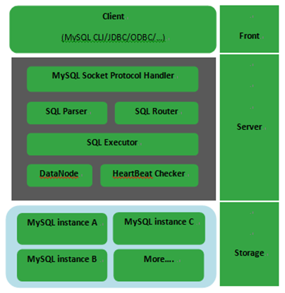
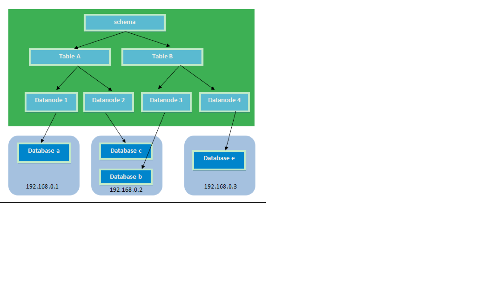
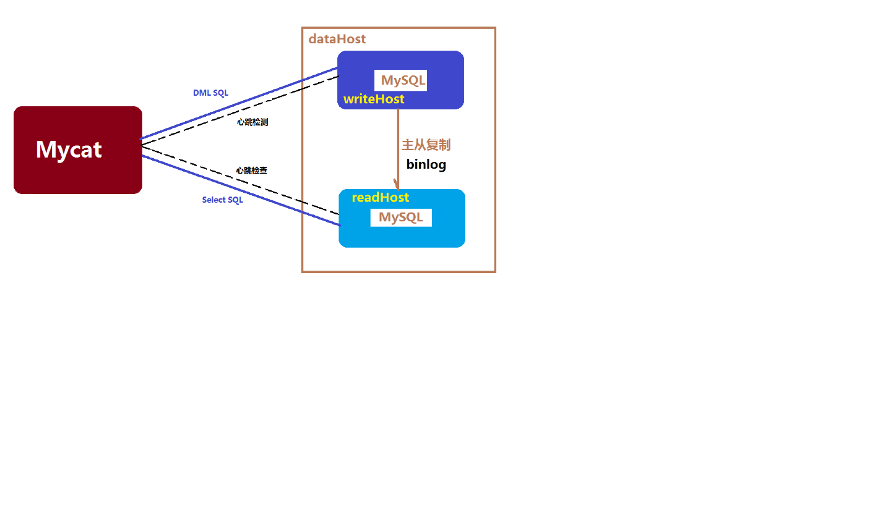
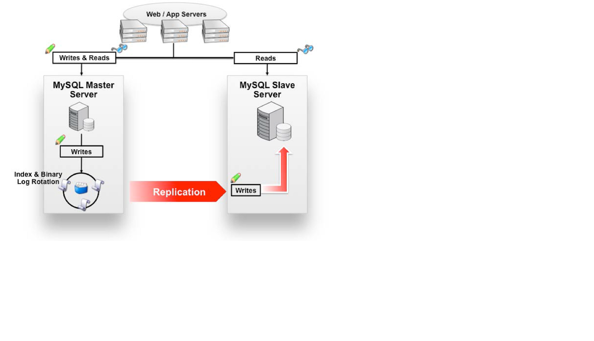
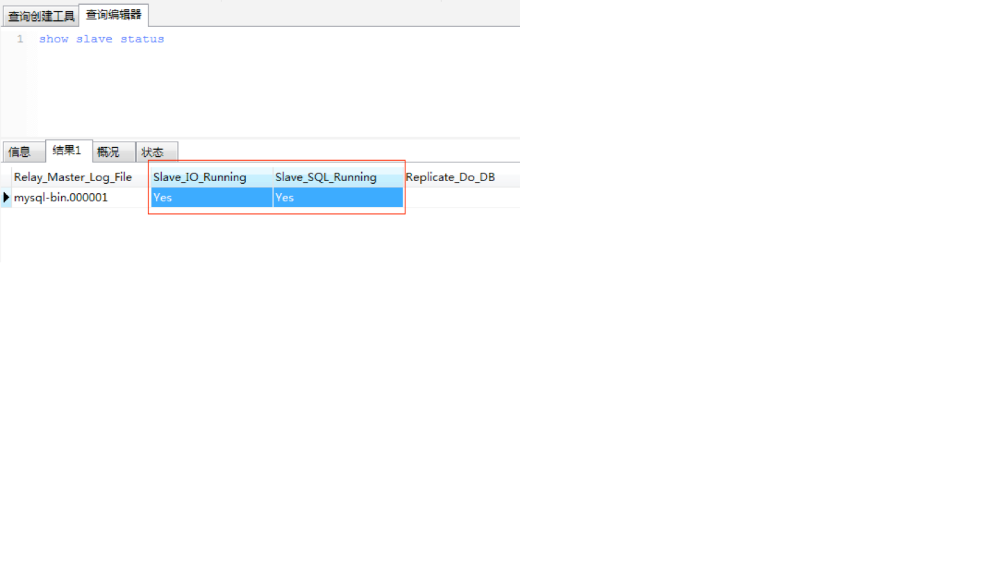
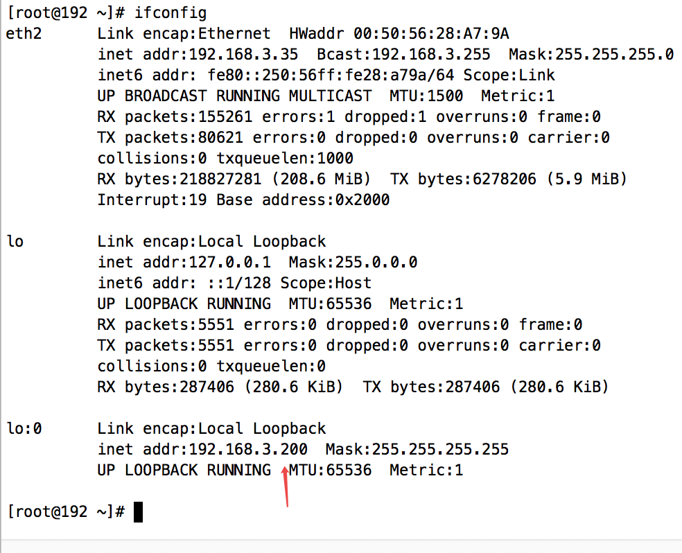

#MyCAT介绍

## 1.1.	什么是MyCAT？ ##
    简单的说，MyCAT就是：
    一个彻底开源的，面向企业应用开发的“大数据库集群”
    支持事务、ACID、可以替代Mysql的加强版数据库
    一个可以视为“Mysql”集群的企业级数据库，用来替代昂贵的Oracle集群
    一个融合内存缓存技术、Nosql技术、HDFS大数据的新型SQL Server
    结合传统数据库和新型分布式数据仓库的新一代企业级数据库产品
    一个新颖的数据库中间件产品 
    
    MyCAT的目标是：低成本的将现有的单机数据库和应用平滑迁移到“云”端，解决数据存储和业务规模迅速增长情况下的数据瓶颈问题。

## 1.2.	MyCAT的关键特性 ##
    支持 SQL 92标准
    支持Mysql集群，可以作为Proxy使用
    支持JDBC连接ORACLE、DB2、SQL Server，将其模拟为MySQL  Server使用
    支持galera for mysql集群，percona-cluster或者mariadb cluster，提供高可用性数据分片集群
    自动故障切换，高可用性
    支持读写分离，支持Mysql双主多从，以及一主多从的模式
    支持全局表，数据自动分片到多个节点，用于高效表关联查询
    支持独有的基于E-R 关系的分片策略，实现了高效的表关联查询
    多平台支持，部署和实施简单

## 1.3.	MyCAT架构 ##

​    如图所示：MyCAT使用Mysql的通讯协议模拟成了一个Mysql服务器，并建立了完整的Schema（数据库）、Table （数据表）、User(用户)的逻辑模型，并将这套逻辑模型映射到后端的存储节点DataNode（MySQL Instance）上的真实物理库中，这样一来，所有能使用Mysql的客户端以及编程语言都能将MyCAT当成是Mysql Server来使用，不必开发新的客户端协议。

## 2 Mycat解决的问题 ##
    性能问题
    数据库连接过多
    E-R分片难处理
    可用性问题
    成本和伸缩性问题


###2.1.	Mycat对多数据库的支持


## 3.分片策略 ##
    MyCAT支持水平分片与垂直分片：
    水平分片：一个表格的数据分割到多个节点上，按照行分隔。
    垂直分片：一个数据库中多个表格A，B，C，A存储到节点1上，B存储到节点2上，C存储到节点3上。


    MyCAT通过定义表的分片规则来实现分片，每个表格可以捆绑一个分片规则，每个分片规则指定一个分片字段并绑定一个函数，来实现动态分片算法。
    
    Schema：逻辑库，与MySQL中的Database（数据库）对应，一个逻辑库中定义了所包括的Table。
    Table：表，即物理数据库中存储的某一张表，与传统数据库不同，这里的表格需要声明其所存储的逻辑数据节点DataNode。在此可以指定表的分片规则。
    DataNode：MyCAT的逻辑数据节点，是存放table的具体物理节点，也称之为分片节点，通过DataSource来关联到后端某个具体数据库上
    DataSource：定义某个物理库的访问地址，用于捆绑到Datanode上

## 4.	Mycat的下载及安装 ##
###4.1.	下载mycat

    官方网站：
    http://www.mycat.org.cn/
    
    github地址
    https://github.com/MyCATApache

###4.2.	Mycat安装

- 第一步：把MyCat的压缩包上传到linux服务器

- 第二步：解压缩，得到mycat目录

- 第三步：进入mycat/bin，启动MyCat

- 启动命令：./mycat start

- 停止命令：./mycat stop

- 重启命令：./mycat restart

- 注意：可以使用mysql的客户端直接连接mycat服务。默认服务端口为8066


##5.Mycat分片

###5.1.需求

- 把商品表分片存储到三个数据节点上。

### 5.2.安装环境

- mysql节点1环境
- 数据库名 : db1、db3
- ip:192.168.3.37
- mysql节点2环境
- 数据库名 : db2
- ip:192.168.3.38
- mycat 节点
- Ip:192.168.3.34

> MyCat安装到节点3上（需要安装jdk）
>

###5.3.	配置schema.xml

####5.3.1.	Schema.xml介绍 

    Schema.xml作为MyCat中重要的配置文件之一，管理着MyCat的逻辑库、表、分片规则、DataNode以及DataSource。弄懂这些配置，是正确使用MyCat的前提。这里就一层层对该文件进行解析。
    
    schema 标签用于定义MyCat实例中的逻辑库
    Table 标签定义了MyCat中的逻辑表
    dataNode 标签定义了MyCat中的数据节点，也就是我们通常说所的数据分片。
    dataHost标签在mycat逻辑库中也是作为最底层的标签存在，直接定义了具体的数据库实例、读写分离配置和心跳语句。

**注意：若是LINUX版本的MYSQL，则需要设置为Mysql大小写不敏感，否则可能会发生表找不到的问题。
在MySQL的配置文件中my.cnf  位置在etc目录下[mysqld] 中增加一行
　　lower_case_table_names = 1**


####5.3.2.	Schema.xml配置 

```xml
<?xml version="1.0"?>
<!DOCTYPE mycat:schema SYSTEM "schema.dtd">
<mycat:schema xmlns:mycat="http://io.mycat/">
		
    	<!--逻辑库,此处的名字必须和 server.xml 中配置在用户下面的库名一致-->
		<schema name="TESTDB" checkSQLschema="false" sqlMaxLimit="100">
		<!--
 		配置逻辑表名,并制定其所在的节点名称,以及表主键规则
auto sharding by id (long) 

-->
            
		<table name="p2p_item" dataNode="dn1,dn2,dn3" rule="auto-sharding-long" />
		<table name="p2p_user" primaryKey="ID" type="global" dataNode="dn1,dn2" />
	</schema>
    
<!--配置节点名字,此处名字和上面使用的一致,并指定其主机名字和对应的真实数据库位名称-->
<dataNode name="dn1" dataHost="localhost1" database="db1" />
<dataNode name="dn2" dataHost="localhost2" database="db2" />
<dataNode name="dn3" dataHost="localhost1" database="db3" />
    
    
    <!--配置主机信息,并指定其所在的地址 数据库类型 用户名密码等-->
<dataHost name="localhost1" maxCon="1000" minCon="10" balance="0"
writeType="0" dbType="mysql" dbDriver="native" switchType="1"  slaveThreshold="100">
    <!--心跳规则,用于检查状态-->
<heartbeat>select user()</heartbeat>
<!-- can have multi write hosts
	指定写主机地址,可以有多个写主机 
-->
<writeHost host="hostM1" url="192.168.3.37:3306" user="root"
	password="qishimeiyoumima">
	<!-- can have multi read hosts -->

</writeHost>
</dataHost>
    
<dataHost name="localhost2" maxCon="1000" minCon="10" balance="0"
writeType="0" dbType="mysql" dbDriver="native" switchType="1"  slaveThreshold="100">
<heartbeat>select user()</heartbeat>
<!-- can have multi write hosts -->
<writeHost host="hostM1" url="192.168.3.39:3306" user="root"
	password="qishimeiyoumima">
	<!-- can have multi read hosts -->
</writeHost>
</dataHost>
    
</mycat:schema>

```

###5.4.	配置server.xml

####5.4.1.	Server.xml介绍 

    server.xml几乎保存了所有mycat需要的系统配置信息。最常用的是在此配置用户名、密码及权限。

####5.4.2.	Server.xml配置 

> 用户名密码配置,可以自行修改

```Xml
<user name="root">
    <property name="password">123456</property>
    <property name="schemas">TESTDB</property>
    <property name="readOnly">true</property>
</user>
```

###5.5.	配置rule.xml

    rule.xml里面就定义了我们对表进行拆分所涉及到的规则定义。我们可以灵活的对表使用不同的分片算法，或者对表使用相同的算法但具体的参数不同。
    这个文件里面主要有tableRule和function这两个标签。在具体使用过程中可以按照需求添加tableRule和function。
    此配置文件可以不用修改，使用默认即可。
###5.6.	测试分片

>mycat 连接端口8066  mysql -uroot -p123456 -P8066 -h192.168.3.34

####5.6.1.	创建表 

```Sql
配置完毕后，重新启动mycat。使用mysql客户端连接mycat，创建表。
mycat 连接端口8066
-- ----------------------------
-- Table structure for p2p_item
-- ----------------------------
DROP TABLE IF EXISTS `p2p_item`;
CREATE TABLE `p2p_item` (
  `id` bigint(20) NOT NULL ,
  `title` varchar(100) NOT NULL ,
  PRIMARY KEY (`id`)
) ENGINE=InnoDB DEFAULT CHARSET=utf8;

-- ----------------------------
-- Table structure for p2p_user
-- ----------------------------
DROP TABLE IF EXISTS `p2p_user`;
CREATE TABLE `p2p_user` (
  `id` bigint(20) NOT NULL AUTO_INCREMENT,
  PRIMARY KEY (`id`)
) ENGINE=InnoDB AUTO_INCREMENT=37 DEFAULT CHARSET=utf8;
```

####5.6.2.	插入数据

```sql
insert into p2p_item (id,title) values(1,'title1');
insert into p2p_item (id,title) values(2,'title1');
insert into p2p_item (id,title) values(3,'title1');
insert into p2p_item (id,title) values(4,'title1');
insert into p2p_item (id,title) values(5,'title1');
insert into p2p_user values(1);
insert into p2p_user values(2);
insert into p2p_user values(3);
insert into p2p_user values(4);
insert into p2p_user values(5);
insert into p2p_item (id,title) values(5000001,'title1');
insert into p2p_item (id,title) values(10000001,'title1');

```

####5.6.3.	分片测试

    由于配置的分片规则为“auto-sharding-long”，所以mycat会根据此规则自动分片。
    每个datanode中保存一定数量的数据。根据id进行分片
    经测试id范围为：
    Datanode1：1~5000000
    Datanode2：5000000~10000000
    Datanode3：10000001~15000000
    
    当15000000以上的id插入时报错：
    [Err] 1064 - can't find any valid datanode :p2p_item -> ID -> 15000001
    此时需要添加节点了。


##6.Mycat读写分离

    数据库读写分离对于大型系统或者访问量很高的互联网应用来说，是必不可少的一个重要功能。对于MySQL来说，标准的读写分离是主从模式，一个写节点Master后面跟着多个读节点，读节点的数量取决于系统的压力，通常是1-3个读节点的配置

- Mycat读写分离和自动切换机制，需要mysql的主从复制机制配合。


###6.1.Mysql的主从复制

  
####6.1.1主从配置需要注意的地方

    1、主DB server和从DB server数据库的版本一致
    2、主DB server和从DB server数据库数据一致[ 这里就会可以把主的备份在从上还原，也可以直接将主的数据目录拷贝到从的相应数据目录]
    3、主DB server开启二进制日志,主DB server和从DB server的server_id都必须唯一

###6.2.	Mysql主服务器配置

- 第一步：修改my.cnf文件：位置/etc/my.cnf

  在[mysqld]段下添加：

  ```properties
  #开启主从复制的库
  binlog-do-db=db1
  #忽略主从复制的库,系统库忽略掉
  binlog-ignore-db=mysql
  #启用二进制日志
  log-bin=mysql-bin
  #服务器唯一ID，一般取IP最后一段
  server-id=134
  ```

- 第二步：重启mysql服务

  service mysqld restart

- 第三步：建立帐户并授权slave

  ```mysql
  - mysql>GRANT FILE ON *.* TO 'backup'@'%' IDENTIFIED BY '123456';
    mysql>GRANT REPLICATION SLAVE, REPLICATION CLIENT ON *.* to 'backup'@'%' identified by '123456'; 
  -- 一般不用root帐号，“%”表示所有客户端都可能连，只要帐号，密码正确，此处可用具体客户端IP代替，如10.10.159.131，加强安全。
  
  ```

- 刷新权限

  ```mysql
  mysql> FLUSH PRIVILEGES;
  ```

- 查看mysql现在有哪些用户

  ```mysql
  mysql>select user,host from mysql.user;
  ```

- 第四步：查询master的状态

  ```mysql
  mysql> show master status;
  ```

- +------------------+----------+--------------+------------------+-------------------+

- | File             | Position | Binlog_Do_DB | Binlog_Ignore_DB | Executed_Gtid_Set |

- +------------------+----------+--------------+------------------+-------------------+

- | mysql-bin.000001 |      120 | db1          | mysql            |                   |

- +------------------+----------+--------------+------------------+-------------------+

> 记录上面的 file 和 position 的值,后面会用到

###6.3.	Mysql从服务器配置

```mysql
第一步：修改my.conf文件
[mysqld]
server-id=131

第二步：配置从服务器
mysql>change master to master_host='192.168.3.34',master_port=3306,master_user='backup',master_password='123456',master_log_file='mysql-bin.000002',master_log_pos=2066; 

注意语句中间不要断开，master_port为mysql服务器端口号(无引号)，master_user为执行同步操作的数据库账户，“120”无单引号(此处的120就是show master status 中看到的position的值，这里的mysql-bin.000001就是file对应的值)。

第二步：启动从服务器复制功能
Mysql>start slave; 

第三步：检查从服务器复制功能状态：
mysql> show slave status;

……………………(省略部分)
Slave_IO_Running: Yes //此状态必须YES
Slave_SQL_Running: Yes //此状态必须YES
……………………(省略部分)

注：Slave_IO及Slave_SQL进程必须正常运行，即YES状态，否则都是错误的状态(如：其中一个NO均属错误)。

错误处理：
如果出现此错误：
Fatal error: The slave I/O thread stops because master and slave have equal MySQL server UUIDs; these UUIDs must be different for replication to work.
因为是mysql是克隆的系统所以mysql的uuid是一样的，所以需要修改。
解决方法：
删除/var/lib/mysql/auto.cnf文件，重新启动服务。


以上操作过程，从服务器配置完成。
```

###6.4.	Mycat配置

>Mycat 1.4开始 支持MySQL主从复制状态绑定的读写分离机制，让读更加安全可靠，配置如下： 

```Xml
<dataNode name="dn1" dataHost="localhost1" database="db1" />
<dataNode name="dn2" dataHost="localhost2" database="db2" />
<dataNode name="dn3" dataHost="localhost1" database="db3" />
<dataHost name="localhost1" maxCon="1000" minCon="10" balance="1"
	writeType="0" dbType="mysql" dbDriver="native" switchType="2"  slaveThreshold="100">
	<heartbeat>show slave status</heartbeat>
	<writeHost host="hostM" url="192.168.3.37:3306" user="root"
		password="qishimeiyoumima">
		<readHost host="hostS" url="192.168.3.38:3306" user="root"
		password="qishimeiyoumima" />
        <!-- 可以有多个
        <readHost host="hostS" url="192.168.3.39:3306" user="root"
		password="qishimeiyoumima" />
-->
	</writeHost>
    </dataHost>
    <dataHost name="localhost2" maxCon="1000" minCon="10" balance="1"
	writeType="0" dbType="mysql" dbDriver="native" switchType="2"  slaveThreshold="100">
	<heartbeat>show slave status</heartbeat>
	<writeHost host="hostM" url="192.168.3.39:3306" user="root"
		password="qishimeiyoumima">
		<readHost host="hostS" url="192.168.3.40:3306" user="root"
		password="qishimeiyoumima" />
	</writeHost>
</dataHost>
```


    (1)	设置 balance="1"与writeType="0"
    Balance参数设置：
    1. balance=“0”, 所有读操作都发送到当前可用的writeHost上。
    2. balance=“1”，所有读操作都随机的发送到readHost。
    3. balance=“2”，所有读操作都随机的在writeHost、readhost上分发
    WriteType参数设置：
    1. writeType=“0”, 所有写操作都发送到可用的writeHost上。
    2. writeType=“1”，所有写操作都随机的发送到readHost。
    3. writeType=“2”，所有写操作都随机的在writeHost、readhost分上发。
     “readHost是从属于writeHost的，即意味着它从那个writeHost获取同步数据，因此，当它所属的writeHost宕机了，则它也不会再参与到读写分离中来，即“不工作了”，这是因为此时，它的数据已经“不可靠”了。
    基于这个考虑，目前mycat 1.3和1.4版本中，若想支持MySQL一主一从的标准配置，并且在主节点宕机的情况下，从节点还能读取数据，则需要在Mycat里配置为两个writeHost并设置banlance=1。”
    (2)	设置 switchType="2" 与slaveThreshold="100"
    switchType 目前有三种选择：
    -1：表示不自动切换
    1 ：默认值，自动切换
    2 ：基于MySQL主从同步的状态决定是否切换
    “Mycat心跳检查语句配置为 show slave status ，dataHost 上定义两个新属性： switchType="2" 与slaveThreshold="100"，此时意味着开启MySQL主从复制状态绑定的读写分离与切换机制。
    Mycat心跳机制通过检测 show slave status 中的 "Seconds_Behind_Master", "Slave_IO_Running", "Slave_SQL_Running" 三个字段来确定当前主从同步的状态以及Seconds_Behind_Master主从复制时延。“

## 7 mycat 集群

> mycat 可以通过 zookeeper 集群进行配置文件管理

### 7.1 搭建 zookeeper 集群

> 参考 zookeeper 文档

### 7.2配置mycat支持zookeeper

> 修改 mycat conf 目录下myid.properties

```properties
loadZk=true
# zk集群地址，多个用","隔开
zkURL=192.168.3.31:2181,192.168.3.32:2181,192.168.3.33:2181
# zk集群内Mycat集群ID
clusterId=mycat-cluster-1
# Mycat集群内本实例ID，禁止重复
myid=mycat_fz_01
# Mycat集群内节点个数
clusterSize=3
#集群内所有节点的 id
clusterNodes=mycat_fz_01,mycat_fz_02,mycat_fz_03
#server  booster  ;   booster install on db same server,will reset all minCon to 1
type=server
boosterDataHosts=dataHost1
```

### 7.3 自定义配置

> 将需要修改的配置文件替换到 conf 目录中的 zkconf 目录下,只需要在一台机器修改即可,需要注意 conf目录中的 server.xml 中用户名和密码与 zkconf 中的不一致

### 7.4 上传配置

> 执行修改了配置文件的 mycat 下的bin 目录下的init_zk_data.sh,上传配置文件,(在修改了配置文件的机器上执行)
>
> ./init_zk_data.sh

### 7.5 启动所有 mycat

> 启动后发现其他 mycat conf 下的配置文件已经自动变化为修改的内容,是zookeeper 中下载的


## 8 mycat 高可用

> 此处使用的是 lvs+keepalived 的方式

```
LVS+Keepalived 介绍

LVS
LVS是Linux Virtual Server的简写，意即Linux虚拟服务器，是一个虚拟的服务器集群系统。本项目在1998年5月由章文嵩博士成立，是中国国内最早出现的自由软件项目之一。目前有三种IP负载均衡技术（VS/NAT、VS/TUN和VS/DR），十种调度算法（rrr|wrr|lc|wlc|lblc|lblcr|dh|sh|sed|nq）。

Keepalvied
Keepalived在这里主要用作RealServer的健康状态检查以及Master主机和BackUP主机之间failover的实现

下面，搭建基于LVS+Keepalived的MyCAT高可用负载均衡集群，其中，LVS实现MyCAT的负载均衡，但是，简单的LVS不能监控后端节点是否健康，它只是基于具体的调度算法对后端服务节点进行访问。同时，单一的LVS又存在单点故障的风险。在这里，引进了Keepalived，可以实现以下几个功能：

1. 检测后端节点是否健康。
2. 实现LVS本身的高可用。
```

### 8.1 配置环境

角色                                    主机IP                          主机名                 操作系统版本     软件版本

VIP                                       192.168.3.200

LVS-DR-Master                  192.168.3.41              keepalived01       CentOS6.9        Keepalived v1.2.13，LVS 1.2.1

LVS-DR-Backup                  192.168.3.42             keepalived02      CentOS6.9         Keepalived v1.2.13，LVS 1.2.1

mycat-Realserver              192.168.3.34             mycat01               CentOS6.9       mycat v1.6.5

mycat-Realserver              192.168.3.35             mycat02               CentOS6.9         mycat v1.6.5

mycat-Realserver              192.168.3.36             mycat03               CentOS6.9         mycat v1.6.5

###8.2安装keepalived和ipvsadm

      注意：ipvsadm并不是lvs，它只是lvs的配置工具，因lvs在3.10（CentOS7.1的内核版本）的内核中是默认支持的。所以在这里就不需要重新安装。
    
      为了方便起见，在这里我们使用yum的安装方式
    
      分别在keepalived01和keepalived02两台主机上安装keepalived和ipvsadm
    
      yum install -y keepalived ipvsadm
    
      除了这种简易方式外，也可直接编译官方的源码包。
    
      LVS：<http://www.linuxvirtualserver.org/software/index.html>
    
      Keepalived：<http://www.keepalived.org/download.html>
    
      安装步骤可参考：<http://www.cnblogs.com/mchina/archive/2012/05/23/2514728.html>

### 8.3 配置Keepalived

#### 8.3.1 master

```shell
vi /etc/keepalived/keepalived.conf
```

```properties
! Configuration File for keepalived

global_defs {
   notification_email {
     acassen@firewall.loc     #设置报警邮件地址，可以设置多个，每行一个。
     failover@firewall.loc    #需开启本机的sendmail服务
     sysadmin@firewall.loc
   }
   notification_email_from Alexandre.Cassen@firewall.loc  #设置邮件的发送地址
   smtp_server 127.0.0.1      #设置smtp server地址
   smtp_connect_timeout 30    #设置连接smtp server的超时时间
   router_id LVS_DEVEL        #表示运行keepalived服务器的一个标识。发邮件时显示在邮件主题的信息
}

vrrp_instance VI_1 {
    state MASTER              #指定keepalived的角色，MASTER表示此主机是主服务器，BACKUP表示此主机是备用服务器
    interface eth4     #指定HA监测网络的接口,通过 ifconfig 或者 ip add 查看到的网络接口名字
    virtual_router_id 51      #虚拟路由标识，这个标识是一个数字，同一个vrrp实例使用唯一的标识。即同一vrrp_instance下，MASTER和BACKUP必须是一致的
    priority 100              #定义优先级，数字越大，优先级越高，在同一个vrrp_instance下，MASTER的优先级必须大于BACKUP的优先级
    advert_int 1              #设定MASTER与BACKUP负载均衡器之间同步检查的时间间隔，单位是秒
    authentication {          #设置验证类型和密码
        auth_type PASS        #设置验证类型，主要有PASS和AH两种
        auth_pass 1111        #设置验证密码，在同一个vrrp_instance下，MASTER与BACKUP必须使用相同的密码才能正常通信
    }
    virtual_ipaddress {       #设置虚拟IP地址，可以设置多个虚拟IP地址，每行一个
         192.168.3.200
    }
}

virtual_server  192.168.3.200 8066 {  #设置虚拟服务器，需要指定虚拟IP地址和服务端口，IP与端口之间用空格隔开
    delay_loop 6              #设置运行情况检查时间，单位是秒
    lb_algo rr                #设置负载调度算法，这里设置为rr，即轮询算法
    lb_kind DR                #设置LVS实现负载均衡的机制，有NAT、TUN、DR三个模式可选
    nat_mask 255.255.255.0 
    persistence_timeout 50    #会话保持时间，单位是秒。这个选项对动态网页是非常有用的，为集群系统中的session共享提供了一个很好的解决方案。如果设置为0会执行轮询方式实现负载均衡,设置数字则代表在指定实现内使用 iphash 方式
                              #有了这个会话保持功能，用户的请求会被一直分发到某个服务节点，直到超过这个会话的保持时间。
                              #需要注意的是，这个会话保持时间是最大无响应超时时间，也就是说，用户在操作动态页面时，如果50秒内没有执行任何操作
                              #那么接下来的操作会被分发到另外的节点，但是如果用户一直在操作动态页面，则不受50秒的时间限制
    protocol TCP              #指定转发协议类型，有TCP和UDP两种

    real_server 192.168.3.34 8066 { #配置服务节点1，需要指定real server的真实IP地址和端口，IP与端口之间用空格隔开
        weight 1              #配置服务节点的权值，权值大小用数字表示，数字越大，权值越高，设置权值大小可以为不同性能的服务器
                              #分配不同的负载，可以为性能高的服务器设置较高的权值，而为性能较低的服务器设置相对较低的权值，这样才能合理地利用和分配系统资源
        TCP_CHECK {           #realserver的状态检测设置部分，单位是秒
            connect_timeout 3    #表示3秒无响应超时
            nb_get_retry 3       #表示重试次数
            delay_before_retry 3 #表示重试间隔
            connect_port 8066
        } 
    }
    real_server 192.168.3.35 8066 {
        weight 1
        TCP_CHECK {
            connect_timeout 3
            nb_get_retry 3
            delay_before_retry 3
            connect_port 8066
        }
    }

 real_server 192.168.3.36 8066 {
        weight 1
        TCP_CHECK {
            connect_timeout 3
            nb_get_retry 3
            delay_before_retry 3
            connect_port 8066
        }
    }
}
```

#### 8.3.2 backup

> 修改备份机上面同样的文件,除了优先级和状态修改外,其他与主机一致

```properties
! Configuration File for keepalived

global_defs {
   notification_email {
     acassen@firewall.loc
     failover@firewall.loc
     sysadmin@firewall.loc
   }
   notification_email_from Alexandre.Cassen@firewall.loc
   smtp_server 127.0.0.1
   smtp_connect_timeout 30
   router_id LVS_DEVEL
}

vrrp_instance VI_1 {
    state BACKUP   #将state从MASTER改为BACKUP
    interface eth4
    virtual_router_id 51
    priority 99  #修改优先级
    advert_int 1
    authentication {
        auth_type PASS
        auth_pass 1111
    }
    virtual_ipaddress {
         192.168.3.200
    }
}

virtual_server  192.168.3.200 8066 {
    delay_loop 6
    lb_algo rr
    lb_kind DR
    nat_mask 255.255.255.0
    persistence_timeout 50
    protocol TCP

    real_server 192.168.3.34 8066 {
        weight 1
        TCP_CHECK {
            connect_timeout 3
            nb_get_retry 3
            delay_before_retry 3
            connect_port 8066
        }
    }
    real_server 192.168.3.35 8066 {
        weight 1
        TCP_CHECK {
            connect_timeout 3
            nb_get_retry 3
            delay_before_retry 3
            connect_port 8066
        }
    }
    real_server 192.168.3.36 8066 {
        weight 1
        TCP_CHECK {
            connect_timeout 3
            nb_get_retry 3
            delay_before_retry 3
            connect_port 8066
        }
    }
}
```

**在上面这两个配置文件中，有一个地方尤其需要注意，即interface，网上的相关部署文档都是eth0，在CentOS7之前，网络接口的确都是eth0，但在CentOS7中，该接口为eno16777736。所以需要根据生产实际情况进行相应的修改**

### 8.4 安装配置 mycat

> 安装请参考上面

#### 8.4.1 绑定虚拟 vip

> **在MyCAT服务器上为lo:0绑定VIP地址、抑制ARP广播**
>
> 分别在mycat01和mycat02,mycat03三台主机上执行以下脚本,此处起名realserver.sh  ,自行创建复制以下内容
>
> 如果出现找不到文件或者目录的错误,先执行 yum -y install net-tools

```shell
#!/bin/bash
#description: Config realserver
#此处 ip 与前面配置的虚拟 ip 一致
VIP=192.168.3.200
 
/etc/rc.d/init.d/functions
 
case "$1" in
start)
       /sbin/ifconfig lo:0 $VIP netmask 255.255.255.255 broadcast $VIP
       /sbin/route add -host $VIP dev lo:0
       echo "1" >/proc/sys/net/ipv4/conf/lo/arp_ignore
       echo "2" >/proc/sys/net/ipv4/conf/lo/arp_announce
       echo "1" >/proc/sys/net/ipv4/conf/all/arp_ignore
       echo "2" >/proc/sys/net/ipv4/conf/all/arp_announce
       sysctl -p >/dev/null 2>&1
       echo "RealServer Start OK"
       ;;
stop)
       /sbin/ifconfig lo:0 down
       /sbin/route del $VIP >/dev/null 2>&1
       echo "0" >/proc/sys/net/ipv4/conf/lo/arp_ignore
       echo "0" >/proc/sys/net/ipv4/conf/lo/arp_announce
       echo "0" >/proc/sys/net/ipv4/conf/all/arp_ignore
       echo "0" >/proc/sys/net/ipv4/conf/all/arp_announce
       echo "RealServer Stoped"
       ;;
*)
       echo "Usage: $0 {start|stop}"
       exit 1
esac
 
exit 0
```

**分别在机器上执行./realserver.sh start**

#### 8.4.2 查看

> 运行 ifconfig 查看



### 8.5 启动 keeplive

**分别在keepalived01和keepalived02上启动Keepalived服务**

```shell
service keepalived start
```

#### 8.5.1 查看

> 通过ipvsadm -L 查看映射,出现类似一下结果,理论上成功

```shell
[root@192 ~]# ipvsadm -L                        
IP Virtual Server version 1.2.1 (size=4096)
Prot LocalAddress:Port Scheduler Flags
  -> RemoteAddress:Port           Forward Weight ActiveConn InActConn
TCP  192.168.3.200:8066 rr persistent 50
  -> 192.168.3.34:8066            Route   1      0          0         
  -> 192.168.3.35:8066            Route   1      0          0         
  -> 192.168.3.36:8066            Route   1      0          0  
```

#### 8.5.2 测试

> 通过一台装有 mysql的机器连接我们的虚拟 ip 发现可以登录数据库

```shell
[root@192 network-scripts]# mysql -uroot -pdigdeep -P8066 -h192.168.3.200
mysql: [Warning] Using a password on the command line interface can be insecure.
Welcome to the MySQL monitor.  Commands end with ; or \g.
Your MySQL connection id is 307
Server version: 5.6.29-mycat-1.6.5-release-20180122220033 MyCat Server (OpenCloundDB)

Copyright (c) 2000, 2016, Oracle and/or its affiliates. All rights reserved.

Oracle is a registered trademark of Oracle Corporation and/or its
affiliates. Other names may be trademarks of their respective
owners.

Type 'help;' or '\h' for help. Type '\c' to clear the current input statement.

mysql> 
```

#### 8.5.3 查看转发

> 再次在 keepalived 的机器执行ipvsadm -L,发现被转到35上面一次

```shell
[root@192 ~]# ipvsadm -L
IP Virtual Server version 1.2.1 (size=4096)
Prot LocalAddress:Port Scheduler Flags
  -> RemoteAddress:Port           Forward Weight ActiveConn InActConn
TCP  192.168.3.200:8066 rr persistent 50
  -> 192.168.3.34:8066            Route   1      0          0         
  -> 192.168.3.35:8066            Route   1      0          1         
  -> 192.168.3.36:8066            Route   1      0          0         
[root@192 ~]# 
```

#### 8.5.4 负载均衡方式

> 与配置相关,此处发现多次都指向一个机器,因为我们在 keepalived 的配置文件中persistence_timeout属性指定为50 则代表50秒内同一个机器来的请求会被 hash 一致性分配,如果想实现严格意义上面的轮询,修改为0即可

```shell
[root@192 ~]# ipvsadm -L
IP Virtual Server version 1.2.1 (size=4096)
Prot LocalAddress:Port Scheduler Flags
  -> RemoteAddress:Port           Forward Weight ActiveConn InActConn
TCP  192.168.3.200:8066 rr persistent 50
  -> 192.168.3.34:8066            Route   1      0          0         
  -> 192.168.3.35:8066            Route   1      1          3         
  -> 192.168.3.36:8066            Route   1      0          0         
[root@192 ~]# 
```

