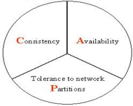
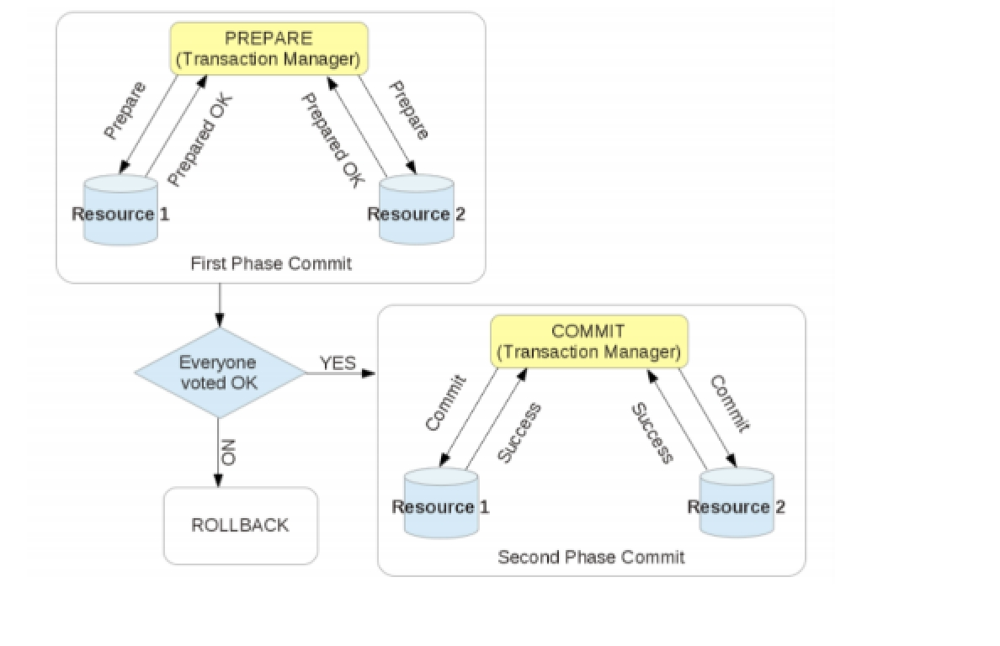
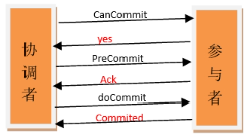

#分布式事物解决方案

## 事物特性(acid)

原子性（A）

所谓的原子性就是说，在整个事务中的所有操作，要么全部完成，要么全部不做，没有中间状态。对于事务在执行中发生错误，所有的操作都会被回滚，整个事务就像从没被执行过一样。

一致性（C）

事务的执行必须保证系统的一致性，就拿转账为例，A有500元，B有300元，如果在一个事务里A成功转给B50元，那么不管并发多少，不管发生什么，只要事务执行成功了，那么最后A账户一定是450元，B账户一定是350元。

隔离性（I）

所谓的隔离性就是说，事务与事务之间不会互相影响，一个事务的中间状态不会被其他事务感知。

持久性（D）

所谓的持久性，就是说一单事务完成了，那么事务对数据所做的变更就完全保存在了数据库中，即使发生停电，系统宕机也是如此。

这种特性 简称 刚性事物

 

## 事物隔离级别

更新丢失：两事务同时更新，一个失败回滚覆盖另一个事务的更新。

脏读：事务T1读取到事务T2修改了但是还未提交的数据，之后事务T2又回滚其更新操作，导致事务T1读到的是脏数据。

不可重复读：事务T1读取某个数据后，事务T2对其做了修改，当事务T1再次读该数据时得到与前一次不同的值。

虚读（幻读）：事务T1读取在读取某范围数据时，事务T2又插入一条数据，当事务T1再次数据这个范围数据时发现不一样了，出现了一些“幻影行”。

不可重复读和脏读的区别：脏读是某一事务读取了另一个事务未提交的脏数据，而不可重复读则是读取了前一事务提交的数据。

幻读和不可重复读的异同：都是读取了另一条已经提交的事务（这点就脏读不同），所不同的是不可重复读查询的都是同一个数据项，而幻读针对的是一批数据整体（比如数据的个数）。

 

## 分布式事物

分布式事务就是指事务的参与者、支持事务的服务器、资源服务器以及事务管理器分别位于不同的分布式系统的不同节点之上。以上是百度百科的解释，简单的说，就是一次大的操作由不同的小操作组成，这些小的操作分布在不同的服务器上，且属于不同的应用，分布式事务需要保证这些小操作要么全部成功，要么全部失败。本质上来说，分布式事务就是为了保证不同数据库的数据一致性。

## 分布式理论

## CPA理论

CAP由[Eric Brewer](https://en.wikipedia.org/wiki/Eric_Brewer_(scientist))在2000年PODC会议上提出[1][2]，是Eric Brewer在Inktomi[3]期间研发搜索引擎、分布式web缓存时得出的关于数据一致性(consistency)、服务可用性(availability)、分区容错性(partition-tolerance)的猜想：

· 数据一致性(consistency)：如果系统对一个写操作返回成功，那么之后的读请求都必须读到这个新数据；如果返回失败，那么所有读操作都不能读到这个数据，对调用者而言数据具有强一致性(strong consistency) (又叫原子性 atomic、线性一致性 linearizable consistency)[5]

· 服务可用性(availability)：所有读写请求在一定时间内得到响应，可终止、不会一直等待

· 分区容错性(partition-tolerance)：在网络分区的情况下，被分隔的节点仍能正常对外服务

### 一致性

一致性指“all nodes see the same data at the same time”，即更新操作成功并返回客户端完成后，所有节点在同一时间的数据完全一致。分布式的一致性
对于一致性，可以分为从客户端和服务端两个不同的视角。从客户端来看，一致性主要指的是多并发访问时更新过的数据如何获取的问题。从服务端来看，则是更新如何复制分布到整个系统，
以保证数据最终一致。一致性是因为有并发读写才有的问题，因此在理解一致性的问题时，一定要注意结合考虑并发读写的场景。
从客户端角度，多进程并发访问时，更新过的数据在不同进程如何获取的不同策略，决定了不同的一致性。对于关系型数据库，要求更新过的数据能被后续的访问都能看到，这是强一致性。
如果能容忍后续的部分或者全部访问不到，则是弱一致性。如果经过一段时间后要求能访问到更新后的数据，则是最终一致性。

### 可用性

可用性指“Reads and writes always succeed”，即服务一直可用，而且是正常响应时间。
对于一个可用性的分布式系统，每一个非故障的节点必须对每一个请求作出响应。也就是，该系统使用的任何算法必须最终终止。当同时要求分区容忍性时，这是一个很强的定义：即使是严重的网络错误，
每个请求必须终止。
好的可用性主要是指系统能够很好的为用户服务，不出现用户操作失败或者访问超时等用户体验不好的情况。可用性通常情况下可用性和分布式数据冗余，负载均衡等有着很大的关联。

### 分区容错

分区容错性指“the system continues to operate despite arbitrary message loss or failure of part of the system”，即分布式系统在遇到某节点或网络分区故障的时候，仍然能够对外提供满足一致性
和可用性的服务。
分区容错性和扩展性紧密相关。在分布式应用中，可能因为一些分布式的原因导致系统无法正常运转。好的分区容错性要求能够使应用虽然是一个分布式系统，而看上去却好像是在一个可以运转正常的整体。比如
现在的分布式系统中有某一个或者几个机器宕掉了，其他剩下的机器还能够正常运转满足系统需求，或者是机器之间有网络异常，将分布式系统分隔未独立的几个部分，各个部分还能维持分布式系统的运作，这样
就具有好的分区容错性。

## Base理论

BASE理论是指，Basically Available（基本可用）、Soft-state（ 软状态/柔性事务）、Eventual Consistency（最终一致性）。是基于CAP定理演化而来，是对CAP中一致性和可用性权衡的结果。核心思想：即使无法做到强一致性，但每个业务根据自身的特点，采用适当的方式来使系统达到最终一致性。

1、基本可用：指分布式系统在出现故障的时候，允许损失部分可用性，保证核心可用。但不等价于不可用。比如：搜索引擎0.5秒返回查询结果，但由于故障，2秒响应查询结果；网页访问过大时，部分用户提供降级服务，等。

2、软状态：软状态是指允许系统存在中间状态，并且该中间状态不会影响系统整体可用性。即允许系统在不同节点间副本同步的时候存在延时。

3、最终一致性：

系统中的所有数据副本经过一定时间后，最终能够达到一致的状态，不需要实时保证系统数据的强一致性。最终一致性是弱一致性的一种特殊情况。BASE理论面向的是大型高可用可扩展的分布式系统，通过牺牲强一致性来获得可用性。ACID是传统数据库常用的概念设计，追求强一致性模型。

ACID，指数据库事务正确执行的四个基本要素的缩写。包含：原子性（Atomicity）、一致性（Consistency）、隔离性（Isolation）、持久性（Durability）。

Base理论为柔性事务

## 柔性事务和刚性事务

柔性事务满足BASE理论（基本可用，最终一致）
刚性事务满足ACID理论

本文主要围绕分布式事务当中的柔性事务的处理方式进行讨论。

柔性事务分为

\1. 两阶段型

\2. 补偿型

\3. 异步确保型

\4. 最大努力通知型几种。 由于支付宝整个架构是SOA架构，因此传统单机环境下数据库的ACID事务满足不了分布式环境下的业务需要，以上几种事务类似就是针对分布式环境下业务需要设定的。

 

## 分布式事物解决方案

### 常见解决方案

\1. 分布式事物解决方案 可以使用全局事物2pc（两段提交协议）、3pc(三段提交协议)，tcc补偿机制、提供回滚接口、分布式数据库

\2. LCN 核心采用3PC+TCC补偿机制

 

### 什么是XA接口 

XA–eXtended Architecture 在事务中意为分布式事务 
XA由协调者(coordinator，一般为transaction manager)和参与者(participants,一般在各个资源上有各自的resource manager)共同完成。在MySQL中，XA事务有两种。

### 什么是JTA

作为java平台上事务规范JTA（Java Transaction API）也定义了对XA事务的支持，实际上，JTA是基于XA架构上建模的，在JTA 中，事务管理器抽象为javax.transaction.TransactionManager接口，并通过底层事务服务（即JTS）实现。像很多其他的java规范一样，JTA仅仅定义了接口，具体的实现则是由供应商(如J2EE厂商)负责提供，目前JTA的实现主要由以下几种：

1.J2EE容器所提供的JTA实现(JBoss)
2.独立的JTA实现:如JOTM，Atomikos.这些实现可以应用在那些不使用J2EE应用服务器的环境里用以提供分布事事务保证。如Tomcat,Jetty以及普通的java应用。

 

### 2PC两段提交

所谓的两个阶段是指：第一阶段：准备阶段(投票阶段)和第二阶段：提交阶段（执行阶段）。

XA一般由两阶段完成，称为two-phase commit(2PC)。 
阶段一为准备阶段，即所有的参与者准备执行事务并锁住需要的资源。参与者ready时，向transaction manager汇报自己已经准备好。 (通知每一方开启事务,然后执行相关操作,操作完成后返回 ok 给协调者)
阶段二为提交阶段。当transaction manager确认所有参与者都ready后，向所有参与者发送commit命令。 
如下图所示： 

XA的性能问题 
XA的性能很低。一个数据库的事务和多个数据库间的XA事务性能对比可发现，性能差10倍左右。因此要尽量避免XA事务，例如可以将数据写入本地，用高性能的消息系统分发数据。或使用数据库复制等技术。 
只有在这些都无法实现，且性能不是瓶颈时才应该使用XA。

 

### 3PC三段提交

三阶段提交（Three-phase commit），也叫三阶段提交协议（Three-phase commit protocol），是二阶段提交（2PC）的改进版本。

 

与两阶段提交不同的是，三阶段提交有两个改动点。

1、引入超时机制。同时在协调者和参与者中都引入超时机制。
2、在第一阶段和第二阶段中插入一个准备阶段。保证了在最后提交阶段之前各参与节点的状态是一致的。

也就是说，除了引入超时机制之外，3PC把2PC的准备阶段再次一分为二，这样三阶段提交就有CanCommit、PreCommit、DoCommit三个阶段。

#### CanCommit阶段

3PC的CanCommit阶段其实和2PC的准备阶段很像。协调者向参与者发送commit请求，参与者如果可以提交就返回Yes响应，否则返回No响应。

1.事务询问 协调者向参与者发送CanCommit请求。询问是否可以执行事务提交操作。然后开始等待参与者的响应。

2.响应反馈 参与者接到CanCommit请求之后，正常情况下，如果其自身认为可以顺利执行事务，则返回Yes响应，并进入预备状态。否则反馈No

#### PreCommit阶段

协调者根据参与者的反应情况来决定是否可以记性事务的PreCommit操作。根据响应情况，有以下两种可能。

假如协调者从所有的参与者获得的反馈都是Yes响应，那么就会执行事务的预执行。

1.发送预提交请求 协调者向参与者发送PreCommit请求，并进入Prepared阶段。

2.事务预提交 参与者接收到PreCommit请求后，会执行事务操作，并将undo和redo信息记录到事务日志中。

3.响应反馈 如果参与者成功的执行了事务操作，则返回ACK响应，同时开始等待最终指令。

假如有任何一个参与者向协调者发送了No响应，或者等待超时之后，协调者都没有接到参与者的响应，那么就执行事务的中断。

1.发送中断请求 协调者向所有参与者发送abort请求。

2.中断事务 参与者收到来自协调者的abort请求之后（或超时之后，仍未收到协调者的请求），执行事务的中断。

#### doCommit阶段

该阶段进行真正的事务提交，也可以分为以下两种情况。

执行提交

1.发送提交请求 协调接收到参与者发送的ACK响应，那么他将从预提交状态进入到提交状态。并向所有参与者发送doCommit请求。

2.事务提交 参与者接收到doCommit请求之后，执行正式的事务提交。并在完成事务提交之后释放所有事务资源。

3.响应反馈 事务提交完之后，向协调者发送Ack响应。

4.完成事务 协调者接收到所有参与者的ack响应之后，完成事务。

中断事务 协调者没有接收到参与者发送的ACK响应（可能是接受者发送的不是ACK响应，也可能响应超时），那么就会执行中断事务。

1.发送中断请求 协调者向所有参与者发送abort请求

2.事务回滚 参与者接收到abort请求之后，利用其在阶段二记录的undo信息来执行事务的回滚操作，并在完成回滚之后释放所有的事务资源。

3.反馈结果 参与者完成事务回滚之后，向协调者发送ACK消息

4.中断事务 协调者接收到参与者反馈的ACK消息之后，执行事务的中断。

在doCommit阶段，如果参与者无法及时接收到来自协调者的doCommit或者rebort请求时，会在等待超时之后，会继续进行事务的提交。（其实这个应该是基于概率来决定的，当进入第三阶段时，说明参与者在第二阶段已经收到了PreCommit请求，那么协调者产生PreCommit请求的前提条件是他在第二阶段开始之前，收到所有参与者的CanCommit响应都是Yes。（一旦参与者收到了PreCommit，意味他知道大家其实都同意修改了）所以，一句话概括就是，当进入第三阶段时，由于网络超时等原因，虽然参与者没有收到commit或者abort响应，但是他有理由相信：成功提交的几率很大。 ）

### 2PC与3PC的区别

相对于2PC，3PC主要解决的单点故障问题，并减少阻塞，因为一旦参与者无法及时收到来自协调者的信息之后，他会默认执行commit。而不会一直持有事务资源并处于阻塞状态。但是这种机制也会导致数据一致性问题，因为，由于网络原因，协调者发送的abort响应没有及时被参与者接收到，那么参与者在等待超时之后执行了commit操作。这样就和其他接到abort命令并执行回滚的参与者之间存在数据不一致的情况。

### TCC

TCC（Try-Confirm-Cancel），则是将业务逻辑分成try、confirm/cancel两个阶段执行，具体介绍见[TCC事务机制简介](http://www.bytesoft.org/tcc-intro/)。其事务处理方式为：
1、 在全局事务决定提交时，调用与try业务逻辑相对应的confirm业务逻辑；
2、 在全局事务决定回滚时，调用与try业务逻辑相对应的cancel业务逻辑。
可见，TCC在事务处理方式上，是很简单的：要么调用confirm业务逻辑，要么调用cancel逻辑

### MQ分布式事物

 采用时效性高的 MQ，由对方订阅消息并监听，有消息时自动触发事件
采用定时轮询扫描的方式，去检查消息表的数据。

### 其他补偿

做过支付宝交易接口的同学都知道，我们一般会在支付宝的回调页面和接口里，解密参数，然后调用系统中更新交易状态相关的服务，将订单更新为付款成功。同时，只有当我们回调页面中输出了 success 字样或者标识业务处理成功相应状态码时，支付宝才会停止回调请求。否则，支付宝会每间隔一段时间后，再向客户方发起回调请求，直到输出成功标识为止。
其实这就是一个很典型的补偿例子，跟一些 MQ 重试补偿机制很类似。

一般成熟的系统中，对于级别较高的服务和接口，整体的可用性通常都会很高。如果有些业务由于瞬时的网络故障或调用超时等问题，那么这种重试机制其实是非常有效的。

当然，考虑个比较极端的场景，假如系统自身有 bug 或者程序逻辑有问题，那么重试 1W 次那也是无济于事的。那岂不是就发生了“明明已经付款，却显示未付款不发货”类似的悲剧？

其实为了交易系统更可靠，我们一般会在类似交易这种高级别的服务代码中，加入详细日志记录的，一旦系统内部引发类似致命异常，会有邮件通知。同时，后台会有定时任务扫描和分析此类日志，检查出这种特殊的情况，会尝试通过程序来补偿并邮件通知相关人员。

在某些特殊的情况下，还会有“人工补偿”的，这也是最后一道屏障。

 

 