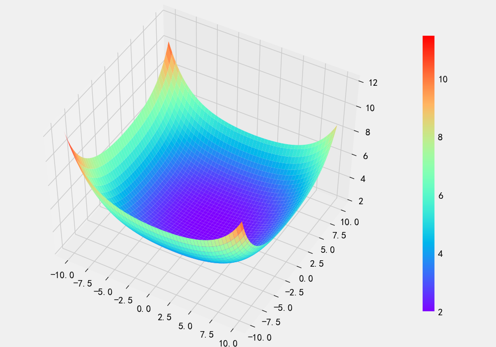

# 一、Matplotlib


​		Matplotlib和Seaborn是python中的图形可视化工具，什么是图形可视化工具了？


​		假如这是一个NBA的游戏，你要选择一个球星，那么你通过数据对比，基本上你可以知道自己的需求是什么了，从而帮助你做出最正确的选择。

## Matplotlib

### 一、Matplotlib的介绍


1、Matplotlib 是一个支持 Python 的 2D 绘图库，可以绘制各种形式的图 表 

2、Matplotlib 可以绘制的图表有：线图、散点图、条形图、柱状图、图 片以及图形动画等 (但是对于3D图片的和动态图片还不是非常擅长的)

3、良好的操作系统兼容性 

4、绘制印刷级高质量图表

 5、Matplotlib 可以在 Python 脚本、Python shell、iPython shell、 Jupyter notebook、Web 服务器应用中使用。

6、核心对象，尺寸对象，matplotlib在绘制图片的时候会自动创建一个Figure对象，如果我们事先创建好可以做的更加精细。

### 二、图表的构成

- 1.图表的标题(最顶部**Demo**的部分)
- 2.图例部分(右上角的颜色注释部分)
- 3.XY轴标签部分(红色字样)
- 4.XY轴刻度部分
- 5.图形部分(中间的蓝色区域)
- 6.图形标签(图形上normed-pdf字样部分)

**如果同学们想要尝试，代码如下：**

```python
#导入库部分
import numpy as np
import scipy.stats as stats
import matplotlib.pyplot as plt
import matplotlib.style as style
from IPython.core.display import HTML

#设置图标清晰度和字体
#这是jupyter中的魔法方法，作用是嵌入到jupyter中
%matplotlib inline
style.use('fivethirtyeight')
plt.rcParams["figure.figsize"] = (14, 7)
plt.figure(dpi=100)

#图形部分
#PDF
plt.plot(np.linspace(-4, 4, 100), 
         stats.norm.pdf(np.linspace(-4, 4, 100)) / np.max(stats.norm.pdf(np.linspace(-3, 3, 100))),
        )
plt.fill_between(np.linspace(-4, 4, 100),
                 stats.norm.pdf(np.linspace(-4, 4, 100)) / np.max(stats.norm.pdf(np.linspace(-3, 3, 100))),
                 alpha=.15,
                )
#高斯分布CDF
plt.plot(np.linspace(-4, 4, 100), 
         stats.norm.cdf(np.linspace(-4, 4, 100)),
        )

# Line - Legend  线段图例注释
plt.text(x=-1.5, y=.7, s="normed", rotation=65, alpha=.75, weight="bold", color="#008fd5")
plt.text(x=-.4, y=.5, s="cdf", rotation=55, alpha=.75, weight="bold", color="#fc4f30")

#Title 标题设置
plt.title('Demo')

#X,Y轴的表示
plt.xlabel('X',color='red')
plt.ylabel('Y',rotation=0,color='red')

#Legend
plt.legend(['normod-pdf','cdf'])

# Ticks 刻度控制
plt.tick_params(axis = 'both', which = 'major', labelsize = 18)
plt.axhline(y = 0, color = 'black', linewidth = 1.3, alpha = .7)

#保存图片
plt.savefig('normed.png',dpi=100)
```


### 三、线型图形的绘制

#### 1.绘制的基本过程

- 首先线型图是一个函数关系
- 这个函数关系是两组向量之间的关系

**例如：**

```python
import numpy as np
import matplotlib.pyplot as plt
import matplotlib.style as style

#设置图片嵌入在jupyter中，在其它的编译工具中不起作用
%matplotlib inline
#设置背景风格
style.use('fivethirtyeight')
#设置图片尺寸
plt.rcParams["figure.figsize"] = (14, 7)
#设置当前图片支持中文的黑体，目前在windows操作系统下有作用
plt.rcParams['font.family'] = ['SimHei']
#设置清晰度
plt.figure(dpi=100)

#设置X轴的向量
X = np.arange(-np.pi,np.pi,0.1)
#y轴和X轴的关系(例如当X=1的时候y=2,当X=2的时候y=4，y=2X)
y = np.exp(-X**2.2)
#设置中文标题
plt.title('绘制线型图')
#绘制图形
plt.plot(X,y)
#保存图形
plt.savefig('line.png',dpi=100)
```


#### 2.使用交互式的显示方式

- 将`%matplotlib inline`修改为`%matplotlib notebook`即可变化为交互式
- 交互式可以动态的查看图片中的变化，点击关闭按钮即变成静态图片

```python
import numpy as np
import matplotlib.pyplot as plt
import matplotlib.style as style
import warnings

#忽略警告提示信息
warnings.filterwarnings('ignore')

#将inline修改成notebook修改为交互式
%matplotlib notebook
#设置背景风格
style.use('fivethirtyeight')
#设置图片尺寸
plt.rcParams["figure.figsize"] = (8,4)
#设置当前图片支持中文的黑体，目前在windows操作系统下有作用
plt.rcParams['font.family'] = ['SimHei']
#设置清晰度
plt.figure(dpi=100)

#设置X轴的向量
X = np.arange(-np.pi,np.pi,0.1)
#y轴和X轴的关系(例如当X=1的时候y=2,当X=2的时候y=4，y=2X)
y = np.exp(-X**2.2)
#设置中文标题
plt.title('绘制线型图')
#绘制图形
plt.plot(X,y)
#保存图形
plt.savefig('line2.png',dpi=100)
```


#### 3.设置使用LateX符号

- LateX是算法之父高德纳编写的一款学术型文档编辑工具
- 它支持各种希腊字母和其它复制函数的编写

```python
import numpy as np
import matplotlib.pyplot as plt
import matplotlib.style as style
import warnings

#忽略警告提示信息
warnings.filterwarnings('ignore')

#设置图片嵌入在jupyter中，在其它的编译工具中不起作用
%matplotlib inline
#设置背景风格
style.use('fivethirtyeight')
#设置图片尺寸
plt.rcParams["figure.figsize"] = (8,4)
#设置当前图片支持中文的黑体，目前在windows操作系统下有作用
plt.rcParams['font.family'] = ['SimHei']
#当设置号中文以后，负号的显示也会出现问题，我们还要设置负号的属性
plt.rcParams['axes.unicode_minus'] = False
#设置清晰度
plt.figure(dpi=100)

#设置X轴的向量
X = np.arange(-pi,pi,0.1)
#y轴和X轴的关系(例如当X=1的时候y=2,当X=2的时候y=4，y=2X)
y = np.sin(X)
y2 = np.cos(X)
#设置中文标题
plt.title('绘制线型图')
#绘制图形
plt.plot(X,y)
plt.plot(X,y2)


#将X轴的刻度设置为  Π
pi = np.pi
plt.xticks([-pi,-pi/2,0,pi/2,pi],['$-\pi$','$-\pi/2$','$zero$','$\pi/2$','$\pi$'])

#替换y轴刻度
plt.yticks([-1,0,1],['Max','Zero','Down'])


#保存图形
plt.savefig('line3.png',dpi=100)
```


#### 4.点线样式设置

- 控制线的形状
- 控制点的形状
- 控制颜色和透明度

```python
import numpy as np
import matplotlib.pyplot as plt
import matplotlib.style as style
import warnings

#忽略警告提示信息
warnings.filterwarnings('ignore')

#设置图片嵌入在jupyter中，在其它的编译工具中不起作用
%matplotlib inline
#设置背景风格
style.use('fivethirtyeight')
#设置图片尺寸
plt.rcParams["figure.figsize"] = (8,4)
#设置当前图片支持中文的黑体，目前在windows操作系统下有作用
plt.rcParams['font.family'] = ['SimHei']
#当设置号中文以后，负号的显示也会出现问题，我们还要设置负号的属性
plt.rcParams['axes.unicode_minus'] = False
#设置清晰度
plt.figure(dpi=100)


X = np.arange(-np.pi,np.pi,0.1)
y = np.exp(-X**2)

#线的样式可以通过linestyle属性来控制('-'是实线,'--'是虚线,':'是点状线,'step'是阶梯线)
#点的样式可以通过marker来控制(默认的是'o'小圆点,'s'小方块,'d'小菱形)
#颜色可以通过color属性来控制,透明度可以用alpha来控制
plt.plot(X,y,ls='--',marker='d',color='red',alpha=0.5)

#保存图片
plt.savefig('line4.png',dpi=100)
```


### 四、绘制其它的图形

#### 1.柱状图的绘制

​		**柱形图**，又称长条图、柱状图、条状图、棒形图，是一种以[长方形]()的长度为变量的[统计图表]()。长条图用来比较两个或以上的价值（不同时间或者不同条件）。

```python
import numpy as np
import matplotlib.pyplot as plt
import matplotlib.style as style
import warnings

#忽略警告提示信息
warnings.filterwarnings('ignore')

#设置图片嵌入在jupyter中，在其它的编译工具中不起作用
%matplotlib inline
#设置背景风格
style.use('fivethirtyeight')
#设置图片尺寸
plt.rcParams["figure.figsize"] = (8,4)
#设置当前图片支持中文的黑体，目前在windows操作系统下有作用
plt.rcParams['font.family'] = ['SimHei']
#当设置号中文以后，负号的显示也会出现问题，我们还要设置负号的属性
plt.rcParams['axes.unicode_minus'] = False
#设置清晰度
plt.figure(dpi=100)


#绘制柱状图
X1 = [1,3,5,7,9]
y1 = [3,7,1,2,4]

X2 = [2,4,6,8,10]
y2 = [2,1,4,6,7]

plt.bar(X1,y1,label='柱一')
plt.bar(X2,y2,label='柱二')
plt.legend()

#保存图片
plt.savefig('bar.png',dpi=100)
```


#### 2.直方图的绘制

​		直方图(Histogram)，又称[质量分布图]()，是一种统计报告图，由一系列高度不等的纵向条纹或[线段]()表示数据分布的情况。 一般用[横轴]()表示数据类型，纵轴表示分布情况。

**上图中：**

- 数字2的数量为4
- 数字5的数量为0

```python
import numpy as np
import matplotlib.pyplot as plt
import matplotlib.style as style
import warnings

#忽略警告提示信息
warnings.filterwarnings('ignore')

#设置图片嵌入在jupyter中，在其它的编译工具中不起作用
%matplotlib inline
#设置背景风格
style.use('fivethirtyeight')
#设置图片尺寸
plt.rcParams["figure.figsize"] = (8,4)
#设置当前图片支持中文的黑体，目前在windows操作系统下有作用
plt.rcParams['font.family'] = ['SimHei']
#当设置号中文以后，负号的显示也会出现问题，我们还要设置负号的属性
plt.rcParams['axes.unicode_minus'] = False
#设置清晰度
plt.figure(dpi=100)

#创建数据
X = np.random.randint(0,10,20)
#创建图形
#bins越大，图形的分离度就越大(bins是直方图之间的间隔)
plt.hist(X,bins=20)

#保存图形
plt.savefig('hist.png',dpi=100)
```


#### 3.饼图绘制

​		饼图英文学名为Sector Graph，常用于统计学模块。2D饼图为圆形，手画时，常用圆规作图。

​		饼图所表示的是统计值的比例数量。

plt.pie()参数如下：

- X参数是各个扇面的数据集
- labels参数是各个扇面的标签
- shadow是否设置阴影
- colors是每个扇面的颜色
- explode设置各个扇面脱离效果
- autopct 设置各个扇面显示的百分比效果

```python
import numpy as np
import matplotlib.pyplot as plt
import matplotlib.style as style
import warnings

#忽略警告提示信息
warnings.filterwarnings('ignore')

#设置图片嵌入在jupyter中，在其它的编译工具中不起作用
%matplotlib inline
#设置背景风格
style.use('fivethirtyeight')
#设置图片尺寸
plt.rcParams["figure.figsize"] = (8,4)
#设置当前图片支持中文的黑体，目前在windows操作系统下有作用
plt.rcParams['font.family'] = ['SimHei']
#当设置号中文以后，负号的显示也会出现问题，我们还要设置负号的属性
plt.rcParams['axes.unicode_minus'] = False
#设置清晰度
plt.figure(dpi=100)

#2019年GDP  top10
X = [77191.22,72199.6,62308.4,43199,39055.64,33892.94,30509.42,27981.2,26814.7,25595.01]
labels = ['广东','江苏','山东','浙江','河南','四川','湖北','湖南','河北','福建']

#计算GDP最高的省份
expload = np.zeros(shape=len(X))
max_index = np.argmax(X)
#将GDP最高的省份分离出去
expload[max_index] = 0.1

#显示图片
plt.pie(X,labels=labels,autopct='%.2f%%',explode=expload)
plt.axis('equal')

#保存图片
plt.savefig('pie.png',dpi=100)
```


#### 4.散布图的绘制

​		散布图又称为相关图，它是指用来研究两个变量之间是否存在相关关系的一种图形。在质量问题的原因分析中，常会接触到各个质量因素之间的关系。这些变量之间的关系往往不能进行解析描述，不能由一个(或几个)变量的数值精确地求出另一个变量的值，称为非确定性关系(或相关关系)。散布图就是将两个非确定性关系变量的数据对应列出，标记在坐标图上，来观察它们之间的关系的图表。 

​		散布图，是用来表示一组成对的数据之间是否有相关性的一种图表。这种成对的数据或许是“特性—要因”、“特性—特性”、“要因—要因”的关系。制作散布图的目的是为辨认一个品质特征和一个可能原因因素之间的联系。

​		散布图是用非数学的方式来辨认某现象的测量值与可能原因因素之间的关系。散布图又叫[相关图]()，它是将两个可能相关的变数资料用点画在坐标图上，用成对的资料之间是否有相关性。

**下图呈现的是幂次相关：**

```python
import numpy as np
import matplotlib.pyplot as plt
import matplotlib.style as style
import warnings

#忽略警告提示信息
warnings.filterwarnings('ignore')

#设置图片嵌入在jupyter中，在其它的编译工具中不起作用
%matplotlib inline
#设置背景风格
style.use('fivethirtyeight')
#设置图片尺寸
plt.rcParams["figure.figsize"] = (8,4)
#设置当前图片支持中文的黑体，目前在windows操作系统下有作用
plt.rcParams['font.family'] = ['SimHei']
#当设置号中文以后，负号的显示也会出现问题，我们还要设置负号的属性
plt.rcParams['axes.unicode_minus'] = False
#设置清晰度
plt.figure(dpi=100)

#制造数据
X = np.arange(20)
y = X**3

#绘制散布图
plt.scatter(X,y)

#保存图片
plt.savefig('scatter.png',dpi=100)
```


### 五、绘制子图表

​		有些时候我们需要将多张图标绘制在一张画布中，但是一个plt对象只能开启一张画布，那么plt提供了实例对象的方式来绘制更多的图表。

```python
import numpy as np
#scikit-python
import scipy.stats as stats
import matplotlib.pyplot as plt
import matplotlib.style as style
import seaborn as sns
import warnings

warnings.filterwarnings('ignore')
#静态图形
%matplotlib inline
#设置图片风格
style.use('fivethirtyeight')
#设置图片的尺寸 x14英寸  y7英寸
plt.rcParams['figure.figsize'] = (8*2,4*2)
#图片的清晰度
plt.rcParams['figure.dpi'] = 100
#图片的清晰度
plt.rcParams['font.family'] = ['SimHei']
#设置中文负号问题
plt.rcParams['axes.unicode_minus'] = False

#plt 类对象   axis实例对象
#subplots分别返回尺寸对象,返回很多个画布对象
fig,((ax1,ax2),(ax3,ax4))=plt.subplots(nrows=2,ncols=2)

pie_data = [3022,155537,75528,63460,49940,34170,24827,20872]
labels = ['中国','美国','意大利','西班牙','德国','法国','伊朗','英国']
min_index = np.argmin(pie_data)
explode = np.zeros(shape=len(pie_data))
explode[min_index+2] = .1
colors = sns.color_palette(palette='rainbow',n_colors=len(pie_data))
ax1.pie(pie_data,labels=labels,autopct="%.2f%%",explode=explode,colors=colors,shadow=True)
ax1.axis('equal')


bar_data = ['2020-01','2020-02','2020-03','2020-04','2020-05']
y1= [3,7,1,7,9]
y2 = [2,2,2,4,1]
y3 = [1,5,3,2,1]
ax2.bar(bar_data,y1,label='服装')
ax2.bar(bar_data,y2,label='裤子')
ax2.bar(bar_data,y3,label=' 鞋')
ax2.legend(loc=[0,1],ncol=3)
#plt.title  ax.set_title()
# ax2.set_title('柱状图')
ax2.set_yticks(range(0,9))


X = np.arange(-np.e,np.pi,.1)
y = np.exp(-X**2.2)
ax3.plot(X,y,color='c')


hist_data= ['张三','赵四','赵四','王五','燕小六','张三','赵四','赵四','燕小六','鬼脚七']
ax4.hist(hist_data,bins=10,color='red',alpha=0.5)

plt.savefig('./imgs/merge.png',dpi=100)
```


### 六、雷达图


```python
import numpy as np
#scikit-python
import scipy.stats as stats
import matplotlib.pyplot as plt
import matplotlib.style as style
import seaborn as sns
import warnings

warnings.filterwarnings('ignore')
#静态图形
%matplotlib inline
#设置图片风格
style.use('fivethirtyeight')
#设置图片的尺寸 x14英寸  y7英寸
plt.rcParams['figure.figsize'] = (8*2,4*2)
#图片的清晰度
plt.rcParams['figure.dpi'] = 100
#图片的清晰度
plt.rcParams['font.family'] = ['SimHei']
#设置中文负号问题
plt.rcParams['axes.unicode_minus'] = False


#要求画布的设置方式是指定的
ax = plt.subplot(projection='polar')

#标签
labels = np.array(['生存','经济','承受伤害','助攻','输出'])
#数据
data = np.array([10,3,6,7,4])
#闭合数据
data = np.concatenate([data,[data[0]]]) #[9,3,6,7,4,9]
#角度
angles = np.linspace(0,2*np.pi,len(data)-1,endpoint=False)
#闭合角度
angles = np.concatenate([angles,[angles[0]]])

#雷达图的轮廓
ax.plot(angles,data,'co-',lw=2)
#填充
ax.fill(angles,data,facecolor='c',alpha=.3)
#添加标签
ax.set_thetagrids(angles*180/np.pi,labels,size=6)
ax.set_title('程咬金')

ax.grid(True)

#半径
ax.set_rlim(0,12)

plt.savefig('./imgs/polar.png',dpi=100)
```


```python
import numpy as np
#scikit-python
import scipy.stats as stats
import matplotlib.pyplot as plt
import matplotlib.style as style
import seaborn as sns

from mpl_toolkits.mplot3d.axes3d import Axes3D

import warnings

warnings.filterwarnings('ignore')
#静态图形
%matplotlib inline
#设置图片风格
style.use('fivethirtyeight')
#设置图片的尺寸 x14英寸  y7英寸  全局尺寸失效
# plt.rcParams['figure.figsize'] = (8*2,4*2)
#图片的清晰度
plt.rcParams['figure.dpi'] = 100
#图片的清晰度
plt.rcParams['font.family'] = ['SimHei']
#设置中文负号问题
plt.rcParams['axes.unicode_minus'] = False

#局部尺寸
fig = plt.figure(figsize=(10,7))
#3D画布实例
axes3d = Axes3D(fig)


X = np.linspace(-10,10,100)
y = np.linspace(-10,10,100)

#合成   100*100
xx,yy = np.meshgrid(X,y)

#合成样本数据
#np.c_[x.ravel(),y.ravel()]

#三维的曲面图要求的是二维数据计算
zz = np.exp((xx**2-xx)/(2*np.std(xx**2))) + np.exp((yy**2-yy)/(2*np.std(yy**2)))
# exp((theta - mu)^2  /  sigma)

#super face  超平面  
pic = axes3d.plot_surface(xx,yy,zz,cmap='rainbow')

axes3d.view_init(elev=50)
#色棒
plt.colorbar(pic,shrink=.8)

plt.savefig('./imgs/surface.png',dpi=100)
```



## 绘制股票数据

贵州茅台的股票地址http://q.stock.sohu.com/cn/600519/lshq.shtml

更多的股票地址可以选择[搜狐证券]()和[雅虎财经]()。

股票的内容已经下载好了，是以每一周作为时间单位统计的。

```python
import pandas as pd

pd.read_excel('茅台股份.xlsx',comment='#')

'''
日期	开盘	收盘	涨跌额	涨跌幅	最低	最高	成交量(手)	成交金额(万)	换手率
0	2020-02-05	985.00	1049.99	-2.81	-0.0027	980.00	1057.00	233485	2376181.50	0.0099
1	2020-01-23	1111.86	1052.80	-54.70	-0.0494	1037.00	1111.86	157934	1691490.88	0.0029
2	2020-01-17	1112.50	1107.50	-5.00	-0.0045	1101.01	1129.20	146354	1630883.00	0.0032
3	2020-01-10	1070.86	1112.50	33.94	0.0315	1067.30	1115.99	209658	2289939.25	0.0051
4	2020-01-03	1170.20	1078.56	-84.44	-0.0726	1076.90	1195.50	341767	3845760.50	0.0034
'''
```

### 1.绘制股票的OHLC线图

​		OHLC指的是股票开盘价、最高价、最低价和收盘价图表信息，它可以在映射出该股的波动趋势。

```python
import pandas as pd
import seaborn as sns
import matplotlib.pyplot as plt

#设置尺寸
plt.rcParams['figure.figsize']=(18,6)
#设置中文显示
sns.set_style('darkgrid',{'font.sans-serif':['SimHei','Arial']})

df_stock = pd.read_excel('茅台股份.xlsx')

#将日期修改为行索引
df_stock.set_index('日期',inplace=True)

#将我们想要的OHLC列全部提取出来做成新的数据包
new_df = df_stock.loc[:,['开盘','最高','最低','收盘']]

#绘制OHLC图,
sns.lineplot(data=new_df.iloc[:150])
plt.title('茅台股份OHLC图')

#保存图形
plt.savefig('sns_ohlc.png',dpi=300)
```


### 2.绘制股票K线图

K线图又叫做阴阳烛图，股市一红就要涨，一绿就要跌。

不过我们不能直接使用`matplotlib`和`seaborn`绘制，我们需要安装`mpl_finance`：

```shell
pip install mpl_finance -i https://pypi.douban.com/simple
```


绘制K线需要使用`candlestick_ohlc()`函数：

```python
candlestick_ohlc(ax,quotes,width=0.2,colorup='k',
                 colordown='r',alpha=1.0)
```

- ax参数代表图表的轴对象
- quotes参数代表股票数据，是一个生成器zip对象
- width参数代表线宽
- colorup参数代表阳线的颜色
- colordown参数代表阴线的颜色
- alpha参数代表颜色的透明度

**代码如下**

```python
import pandas as pd
import matplotlib.pyplot as plt
import  matplotlib.dates as dates
import mpl_finance as mf

#设置尺寸
plt.rcParams['figure.figsize']=(18,6)
#设置中文显示
plt.rcParams['font.family'] = ['SimHei']

df_stock = pd.read_excel('茅台股份.xlsx')

#将日期修改为行索引
df_stock.set_index('日期',inplace=True)

#将我们想要的OHLC列全部提取出来做成新的数据包
#我们获取前150条数据
new_df = df_stock.loc[:,['开盘','最高','最低','收盘']]
new_df = new_df.iloc[:100]
#在绘制K线的时候我们需要时间，开盘，最高，最低，收盘这5哥变量合成一个zip生成器
#mf这个库中寻妖将时间类型转换成整数类型，我们需要借助dates来进行转换
#先将时间抓便为元组：new_df.index.to_pydatetime()在转变为整数
quotes_data = zip(dates.date2num(new_df.index.to_pydatetime()),new_df.开盘,new_df.最高,new_df.最低,new_df.收盘)

#获取轴参数
ax = plt.gca()

#绘制K线图
mf.candlestick_ohlc(ax,quotes_data,width=1,colorup='red',colordown='green')

#更正时间
ax.xaxis_date()

#倾斜X轴文字
plt.xticks(rotation=45)

plt.title('茅台股份OHLC-K线图')

#保存图形
plt.savefig('k_ohlc.png',dpi=300)
```


## 绘制3D图形

matplotlib中并不能直接使用3D图，需要借助子库:

### a)、三维散点图

```python
import numpy as np
#scikit-python
import matplotlib.pyplot as plt
import matplotlib.style as style
import seaborn as sns
#生成圆形数据
from sklearn.datasets import make_circles

from mpl_toolkits.mplot3d.axes3d import Axes3D

import warnings

warnings.filterwarnings('ignore')
#静态图形
%matplotlib inline
#设置图片风格
style.use('fivethirtyeight')
#设置图片的尺寸 x14英寸  y7英寸  全局尺寸失效
# plt.rcParams['figure.figsize'] = (8*2,4*2)
#图片的清晰度
plt.rcParams['figure.dpi'] = 100
#图片的清晰度
plt.rcParams['font.family'] = ['SimHei']
#设置中文负号问题
plt.rcParams['axes.unicode_minus'] = False

#局部尺寸
fig = plt.figure(figsize=(10,7))
#3D画布实例
axes3d = Axes3D(fig)

#圆形数据 X[:,0]   X[:,1]  
X,cls = make_circles(noise=0.1,factor=0.1)
z = np.exp(-np.sum((X)**2,axis=1))


#三维散布图
axes3d.scatter3D(X[:,0],X[:,1],z,s=30,c=cls,cmap='autumn')

axes3d.view_init(elev=10,azim=30)

plt.savefig('./imgs/scatter3D.png',dpi=100)
```


### b)、三维曲面图

```python
import numpy as np
#scikit-python
import scipy.stats as stats
import matplotlib.pyplot as plt
import matplotlib.style as style
import seaborn as sns

from mpl_toolkits.mplot3d.axes3d import Axes3D

import warnings

warnings.filterwarnings('ignore')
#静态图形
%matplotlib inline
#设置图片风格
style.use('fivethirtyeight')
#设置图片的尺寸 x14英寸  y7英寸  全局尺寸失效
# plt.rcParams['figure.figsize'] = (8*2,4*2)
#图片的清晰度
plt.rcParams['figure.dpi'] = 100
#图片的清晰度
plt.rcParams['font.family'] = ['SimHei']
#设置中文负号问题
plt.rcParams['axes.unicode_minus'] = False

#局部尺寸
fig = plt.figure(figsize=(10,7))
#3D画布实例
axes3d = Axes3D(fig)


X = np.linspace(-10,10,100)
y = np.linspace(-10,10,100)

#合成   100*100
xx,yy = np.meshgrid(X,y)

#合成样本数据
#np.c_[x.ravel(),y.ravel()]

#三维的曲面图要求的是二维数据计算
zz = np.exp((xx**2-xx)/(2*np.std(xx**2))) + np.exp((yy**2-yy)/(2*np.std(yy**2)))
# exp((theta - mu)^2  /  sigma)

#super face  超平面  
pic = axes3d.plot_surface(xx,yy,zz,cmap='rainbow')

axes3d.view_init(elev=50)
#色棒
plt.colorbar(pic,shrink=.8)
```


