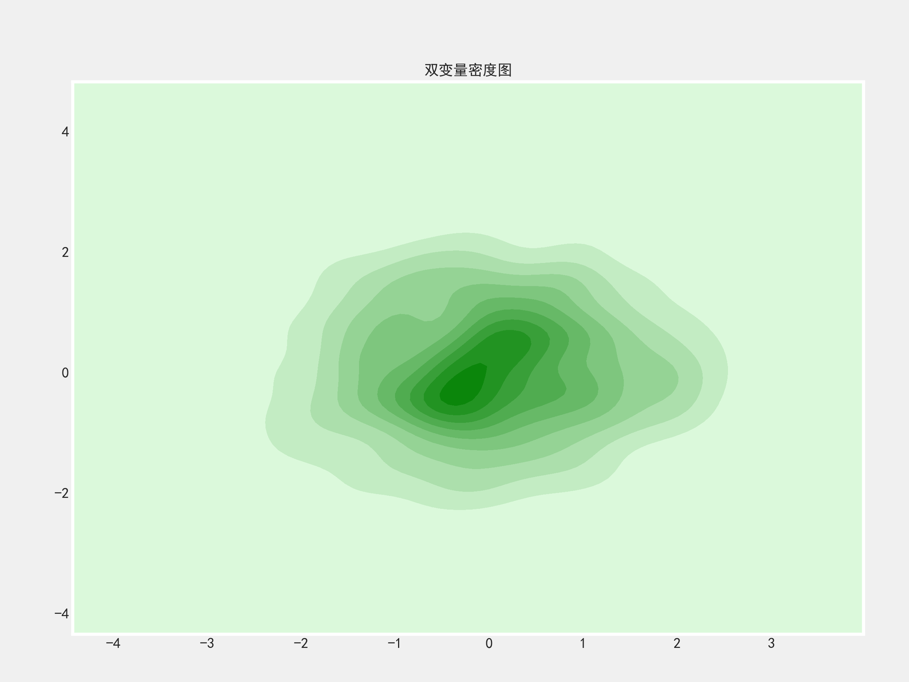

## Seaborn

### 一、Seaborn的介绍

​		Seaborn是一个基于Matplotlib的数据可视化库。它用于绘制有吸引力且信息丰富的统计图形。

1、Matplotlib的不足

- 图表的配置不够漂亮
- 数据分析的需要多
- 和pandas的结合一般

2、Seaborn优势

- Seaborn可以绘制漂亮的图片
- Seaborn是为数据分析设计的一款图形可视化库
- Seaborn对于Pandas的兼容性不错


在绘图中，Seaborn更加专业也更加的美观。

**Seaborn的图表分类如下：**

> 分类图：柱状图barplot、箱图boxplot、小提琴图violinplot、散布图(stripplot、swarmplot)，以及分面网格(FacetGrid)分类图catplot。

>关联图:散点图scatterplot、线图lineplot，以及分面网格(FacetGrid)关联图relplot。

>分布图:单变量分布图distplot、密度图kdeplot。

>矩阵图:热力图heatmap、聚类图clustermap。

>回归图:线性回归图regplot和分面网格(FacetGrid)线性回归图lmplot。

### 二、Seaborn的内置数据集

​		`sns.load_dataset()`函数可以加载内部的数据集，返回的[Dataframe]()对象：

```python
import seaborn as sns

sns.load_dataset(name,cache=True,data_home=None,**kwargs)

#name是数据集的名称,比如iris(鸢尾花数据集)titanic(泰坦尼克号数据集)
#cache是否缓存
#data_home指的是缓存的路径，默认在当前用户的home目录下的seaborn-data中
```

**https://github.com/mwaskom/seaborn-data这个网址有数据集名称的定义：**


​		我们也可以通过`sns.get_dataset_names()`函数来获取数据集的名称,再通过`sns.load_dataset()`函数加载。

**我们读取tips(小费)数据集：**

这是一个非常有经典的数据挖掘数据集，这组数据中体现了一些的相关性问题。

```python
import seaborn as sns

sns.load_dataset('tips')
```

|      | total_bill | tip  | sex    | smoker | day  | time   | size |
| ---- | ---------- | ---- | ------ | ------ | ---- | ------ | ---- |
| 0    | 16.99      | 1.01 | Female | No     | Sun  | Dinner | 2    |
| 1    | 10.34      | 1.66 | Male   | No     | Sun  | Dinner | 3    |
| 2    | 21.01      | 3.50 | Male   | No     | Sun  | Dinner | 3    |
| 3    | 23.68      | 3.31 | Male   | No     | Sun  | Dinner | 2    |

**tips数据集特征说明：**

- total_bill: 餐费金额
- tip:该餐给的小费
- sex:服务生性别

- smoker:服务生是否吸烟
- day:星期几吃的饭
- time:吃饭的时间
- size:聚餐人数

### 三、Seaborn的风格设置

​		再matplotlib中我们需要引入plt中style子库，通过控制子库来管理全局样式风格，那么再sns中也可以实现样式的控制。

使用`sns.set_style()`也可以代替`style.use('fivethirtyeight')`方法

#### 1、set_styl()第一个参数

`sns.set_style()`有以下集中风格：

- `darkgrid`:暗色网格背景
- `whitegrid`:白色网格背景
- `dark`：暗色的背景
- `white`：白色的背景
- `ticks`：带有刻度的背景


**代码如下：**

```python
import matplotlib.pyplot as plt
import seaborn as sns

import numpy as np
import warnings

#忽略警告提示信息
warnings.filterwarnings('ignore')

#使用sns设置画布背景风格
sns.set_style('whitegrid')

#plt控制尺寸
plt.rcParams["figure.figsize"] = (8,4)

#设置清晰度
plt.figure(dpi=100)

#制造数据
X = np.arange(20)
y = np.log(X**2)

#绘制散布图
plt.scatter(X,y)

#代斯皮纳偏移
#可以控制画布边框的显示问题
sns.despine(top=True, right=True, left=False, bottom=False)

#保存图片
plt.savefig('sns_scatter.png',dpi=100)
```

#### 2、set_style()第二个参数

再`matplotlib`中处理中文问题我们使用`plt.rcParams['font.family'] = ['SimHei']`

,但是再`seaborn`中就失去了作用。那么我们使用`set_style()`函数中的第二个参数来解决中文问题，第二个参数是一个字典:


```python
import matplotlib.pyplot as plt
import seaborn as sns
import pandas as pd
import numpy as np

plt.rcParams["figure.figsize"] = (18,9)


#设置画布的风格和设置中文
sns.set_style('darkgrid',{'font.sans-serif':['SimHei','Arial']})

#设置数据集
X =np.arange(-5,5,0.1)
data = dict(A=np.exp(-X**2),
           B=np.sin(X),
           C=X)

#将数据转化成dataframe的
df = pd.DataFrame(data)

#使用sns绘制线性图
sns.lineplot(data=df)
plt.title('这里有三条线')

#保存图片
plt.savefig('sans-serif.png',dpi=200)
```

#### 3.调色板

调色板可以调节你想要的图片颜色，这一点上比`plt`更加的灵活。

```python
import seaborn as sns
import matplotlib.pyplot as plt

#sns.palplot()是显示颜色板
#sns.color_palette()是颜色种类
sns.palplot(sns.color_palette(palette='hls',n_colors=30))
sns.palplot(sns.color_palette(palette='GnBu_r',n_colors=30))
sns.palplot(sns.color_palette(palette='rainbow',n_colors=30))
sns.palplot(sns.color_palette(palette='BuGn_r',n_colors=30))
```


### 四、分类图

分类图的主要作用就是将数据分开比较。

#### 1、柱状图

`sns.barplot(x=None,y=None,hue=None,data=None,palette=None)`

- hue参数，不同数据分类
- data参数，指定绘图的数据集，可以是DataFrame、Numpy数组
- palette参数,使用什么颜色集合
- x,y，hue取值必须是data总的列名


再`seaborn`中柱状图的柱状表示的是一组向量的平均值，黑色的线条(误差条)代表的是信息的置信区间。


**上图以tips为例：**

```python
import seaborn as sns
import matplotlib.pyplot as plt
#设置画布的风格和设置中文
sns.set_style('darkgrid',{'font.sans-serif':['SimHei','Arial']})
tips = sns.load_dataset('tips')

#绘制图表
sns.barplot(x='day',y='tip',hue='sex',data=tips,palette='hls')

#保存图片
plt.savefig('sns_tips_bar.png',dpi=200)
```

#### 2、箱图

箱图又叫做盒须图，是显示数据单变量[分布情况]()的统计图。常用于品质管理(产品的质量问题，所有的产品状况集中，说明产品是合格的)


我们再来看看**鸢尾花数据:**


上图中**sepeal_width**这一列中存在异常值，而且数据比较集中

```python
import seaborn as sns
import matplotlib.pyplot as plt

#设置画布的风格和设置中文
sns.set_style('darkgrid',{'font.sans-serif':['SimHei','Arial']})

#读取鸢尾花数据
iris = sns.load_dataset('iris')

#绘制图表
sns.boxplot(data=iris,palette='rainbow')

#保存图片
plt.savefig('sns_boxplot.png',dpi=200)
```

#### 3、小提琴图

小提琴图是箱图和密度图的一种结合图形。左右越快代表当前数据量越密集。


**鸢尾花数据：**


**代码如下:**

```python
import seaborn as sns
import matplotlib.pyplot as plt

#设置画布的风格和设置中文
sns.set_style('darkgrid',{'font.sans-serif':['SimHei','Arial']})

#读取鸢尾花数据
iris = sns.load_dataset('iris')

#绘制图表
sns.violinplot(data=iris,palette='rainbow')

#保存图片
plt.savefig('sns_violinplot.png',dpi=200)
```

#### 4、分类散点图

分类散点图有两种:Strip(带状图)和Swarm(蜂群图)

1、Strip图


```python
import seaborn as sns
import matplotlib.pyplot as plt

#设置画布的风格和设置中文
sns.set_style('darkgrid',{'font.sans-serif':['SimHei','Arial']})

#读取小费数据
tips = sns.load_dataset('tips')

#绘制图表
sns.stripplot(x='day',y='tip',data=tips,palette='rainbow')

#保存图片
plt.savefig('sns_strip.png',dpi=200)
```

2、Swarm图


```python
import seaborn as sns
import matplotlib.pyplot as plt

#设置画布的风格和设置中文
sns.set_style('darkgrid',{'font.sans-serif':['SimHei','Arial']})

#读取小费花数据
tips = sns.load_dataset('tips')

#绘制图表
sns.swarmplot(x='day',y='tip',data=tips,palette='rainbow')

#保存图片
plt.savefig('sns_swarm.png',dpi=200)
```

3、箱图和带状图


带状图和散布图合并以后更加能体现数据的分布态势和统计情况。

```python
import seaborn as sns
import matplotlib.pyplot as plt

#设置画布的风格和设置中文
sns.set_style('darkgrid',{'font.sans-serif':['SimHei','Arial']})

#读取鸢尾花数据
tips = sns.load_dataset('tips')

#绘制图表
sns.boxplot(x='day',y='tip',data=tips,palette='hls')
sns.stripplot(x='day',y='tip',data=tips,palette='rainbow')

#保存图片
plt.savefig('sns_boxstrip.png',dpi=200)
```

4、小提琴图和蜂群图

将小提琴图和蜂群图结合，可以更好的观察数据的分布密度问题。


**代码如下：**

```python
import seaborn as sns
import matplotlib.pyplot as plt

#设置画布的风格和设置中文
sns.set_style('darkgrid',{'font.sans-serif':['SimHei','Arial']})

#读取鸢尾花数据
iris = sns.load_dataset('iris')

#绘制图表
sns.violinplot(data=iris,palette='Blues')
sns.swarmplot(data=iris,palette='hls')

#保存图片
plt.savefig('sns_violinp_swarp.png',dpi=200)
```

#### 5、分面网格分类图

​		分面网格(FacetGrid)可以绘制多个子图，这个网格是一个大图，有x和y两个坐标轴，实际上就是一个大图里面嵌套多个子图。

​		在分面网格中绘制分类图使用catplot函数，catplot函数是**图级函数**，下面的barplot、boxplot、violinplot是**轴级函数**。

​		catplot函数出了**轴级函数**参数以外，还有其它参数：

- row : 在x轴上绘制的数据。
- col : 在y轴上绘制的数据。
- col_wrap : 在x轴上绘制子图的最大个数。
- kind : 绘制子图类型，主要有bar、strip、swarm、box、violin或boxen，其中strip是默认。

##### **案例一：**

```python
import seaborn as sns
import matplotlib.pyplot as plt

#设置画布的风格和设置中文
sns.set_style('darkgrid',{'font.sans-serif':['SimHei','Arial']})

#读取鸢尾花数据
tips = sns.load_dataset('tips')

#绘制分面图表
sns.catplot(x='day',y='tip',hue='sex',col='time',data=tips,palette='hls')

#保存图片
plt.savefig('cat1.png',dpi=200)
```


##### **案例二：**

虽然使用了catplot，但是如果不加上col参数，那么也就是普通的图表。

```python
import seaborn as sns
import matplotlib.pyplot as plt

#设置画布的风格和设置中文
sns.set_style('darkgrid',{'font.sans-serif':['SimHei','Arial']})

#读取鸢尾花数据
tips = sns.load_dataset('tips')

#绘制分面图表
sns.catplot(x='day',y='tip',data=tips,palette='hls')

#保存图片
plt.savefig('cat1.png',dpi=200)
```


##### **案例三：**

如果分类的图表过多，一行显示不易观察。

```python
import seaborn as sns
import matplotlib.pyplot as plt

#设置画布的风格和设置中文
sns.set_style('darkgrid',{'font.sans-serif':['SimHei','Arial']})

#读取鸢尾花数据
tips = sns.load_dataset('tips')

#绘制分面图表
sns.catplot(x='day',y='tip',hue='sex',col='size',data=tips,palette='hls')

#保存图片
plt.savefig('cat3.png',dpi=200)
```


使用**col_wrap**参数分行显示,这样图片会清晰一些：

```python
import seaborn as sns
import matplotlib.pyplot as plt

#设置画布的风格和设置中文
sns.set_style('darkgrid',{'font.sans-serif':['SimHei','Arial']})

#读取鸢尾花数据
tips = sns.load_dataset('tips')

#绘制分面图表
sns.catplot(x='day',y='tip',hue='sex',col='size',col_wrap=3,data=tips,palette='hls')

#保存图片
plt.savefig('cat3.png',dpi=200)
```


##### **案例四：**

我们可以同时使用row参数和col参数：

```python
import seaborn as sns
import matplotlib.pyplot as plt

#设置画布的风格和设置中文
sns.set_style('darkgrid',{'font.sans-serif':['SimHei','Arial']})

#读取鸢尾花数据
tips = sns.load_dataset('tips')

#绘制分面图表
sns.catplot(x='day',y='tip',hue='sex',col='time',row='smoker',data=tips,palette='hls')

#保存图片
plt.savefig('cat5.png',dpi=200)
```


##### **案例五：**

使用kind参数控制图表类型

```python
import seaborn as sns
import matplotlib.pyplot as plt

#设置画布的风格和设置中文
sns.set_style('darkgrid',{'font.sans-serif':['SimHei','Arial']})

#读取鸢尾花数据
tips = sns.load_dataset('tips')

#绘制分面图表
sns.catplot(x='day',y='tip',hue='sex',col='time',row='smoker',data=tips,palette='hls',kind='violin')

#保存图片
plt.savefig('cat6.png',dpi=200)
```


### 五、关联图

关联的图形包括关联的散布图和关联的线型图类型

#### 1、关联散布图

绘制关联散步图的函数是：

```python
sns.scatter(x=None,y=None,hue=None,style=None,size=None,data=None)
```

- x、y是有关联的两个变量数据集。
- hue、size、style能够显示不同的数据集。
- 如果data设定，则x、y、hue、size、style取值是data中的列名。

**绘制散布图**

```python
import seaborn as sns
import matplotlib.pyplot as plt

#设置画布的风格和设置中文
sns.set_style('darkgrid',{'font.sans-serif':['SimHei','Arial']})

#读取鸢尾花数据
iris = sns.load_dataset('iris')

#绘制图表
sns.scatterplot(x='petal_length',y='petal_width',hue='species',data=iris)

#保存图片
plt.savefig('sns_scatter1.png',dpi=200)
```

下图中能看出每种鸢尾花之间存在着某种线性相关性。


**带有条件类型的散布图**

```python
import seaborn as sns
import matplotlib.pyplot as plt

#设置画布的风格和设置中文
sns.set_style('darkgrid',{'font.sans-serif':['SimHei','Arial']})

#读取鸢尾花数据
tips = sns.load_dataset('tips')

#绘制图表
sns.scatterplot(x='total_bill',y='tip',hue='sex',data=tips,size='smoker')

#保存图片
plt.savefig('sns_scatter2.png',dpi=200)
```

- 下图中大的圆点代表是吸烟，小圆点是不吸烟


#### 2、关联线图

绘制关联线图的函数是:

```python
sns.lineplot(x=None,y=None,hue=None,data=None)
```

- x、y是有关联的两个变量数据集。
- hue、size、style能够显示不同的数据集。
- 如果data设定，则x、y、hue、size、style取值是data中的列名。

**绘制线型图**

```python
import seaborn as sns
import matplotlib.pyplot as plt

#设置画布的风格和设置中文
sns.set_style('darkgrid',{'font.sans-serif':['SimHei','Arial']})

#读取鸢尾花数据
iris = sns.load_dataset('iris')

#绘制图表
sns.lineplot(x='petal_length',y='petal_width',hue='species',data=iris)

#保存图片
plt.savefig('sns_line1.png',dpi=200)
```


**绘制带有条件的线性图**

```python
import seaborn as sns
import matplotlib.pyplot as plt

#设置画布的风格和设置中文
sns.set_style('darkgrid',{'font.sans-serif':['SimHei','Arial']})

#读取鸢尾花数据
tips = sns.load_dataset('tips')

#绘制图表
sns.lineplot(x='total_bill',y='tip',hue='sex',data=tips,size='smoker',style='time')

#保存图片
plt.savefig('sns_line1.png',dpi=200)
```

下图中粗线条的是抽烟的，虚线是晚餐的，条件样式设定的太多反而不利于观察。


#### 3.散布图矩阵

散布图图矩阵的作用是将每一个特征之间进行对比，从而查看变量之间的关系。

```python
import seaborn as sns
import pandas as pd

iris = sns.load_dataset('iris')

sns.pairplot(data=iris)

plt.savefig('sns_pair.png',dpi=300)
```


#### 4、分面网格关联图

在封面网格中绘制关联图使用`sns.relplot()`函数来观察下面数据中的相关性

使用`sns`中自带的`mpg`汽车耗油量数据集。

##### **案例一**

```python
import seaborn as sns
import matplotlib.pyplot as plt

mpg = sns.load_dataset('mpg')

'''
mpg            每加仑汽油行驶的英里数量
cylinders      气缸数量
displacement   排量
horsepower     马力
weight         重量
acceleration   加速度
model_year     生产年份
origin         原产地
name           车名
'''
sns.relplot(x='displacement',y='mpg',data=mpg)

plt.savefig('sns_relplot.png',dpi=200)
```

从下面这个图中我们能看出来排量越大的行驶的里程就越短。


##### **案例二**

```python
import seaborn as sns
import matplotlib.pyplot as plt

mpg = sns.load_dataset('mpg')

sns.relplot(x='displacement',y='mpg',hue='cylinders',data=mpg)

plt.savefig('sns_relplot2.png',dpi=200)
```

使用气缸数量作为分类可以看出，气缸的数量越多，排量就越大。


##### **案例三**

我们把图形做成分面图

```python
import seaborn as sns
import matplotlib.pyplot as plt

mpg = sns.load_dataset('mpg')

sns.relplot(x='displacement',y='mpg',col='cylinders',row='origin',data=mpg)

plt.savefig('sns_relplot3.png',dpi=200)
```

每一行代表每个不同产地，每一列代表气缸数量


### 六、其它图形

#### 1、分布图

分布图包含直方图和密度图。

##### **直方图**

​		在Seaborn中我们可以使用`distplot`函数绘制，绘制出来的是直方图和密度图的结合图形dist图，在统计学中并没有定义过dist图。

```python
sns.distplot(a,bins=None,hist=True,kde=True)
```

- a参数是单变量数据，可以是一维的array、list、tuple或者是Series。
- bins参数是直方图中柱体的个数。
- hist参数是否绘制直方图。
- kde参数是否绘制密度图。

**正太分布的Dist图**


代码如下：

```python
import seaborn as sns
import matplotlib.pyplot as plt
import numpy as np

#生产一组正态分布的数据集
X = np.random.normal(loc=0,scale=1,size=1000)

#绘制图形
sns.distplot(X,color='orange')
plt.title(s='直方密度图',fontproperties='SimHei')

#保存图片
plt.savefig('sns_distplot.png',dpi=200)
```

##### **密度图**

密度图(kernel density)核密度简称kde，用来展示数据的分布状况。

图形分为单变量KDE图形和双轴KDE图形(等高线图)。

```python
sns.kdeplot(data,data2=None,shade=False)
```

- data和data2都可以是一维的array、list、tuple或者是Series。
- shade参数是是否显示阴影。

**单变量密度图**

```python
import seaborn as sns
import matplotlib.pyplot as plt
import numpy as np

#生产一组正态分布的数据集
X = np.random.normal(loc=0,scale=1,size=1000)

#绘制图形,显示阴影
sns.kdeplot(X,color='red',shade=True)
plt.title(s='单变量密度图',fontproperties='SimHei')
plt.savefig('sns_kdeplot1.png',dpi=200)
```


**双轴密度图**

```python
import seaborn as sns
import matplotlib.pyplot as plt
import numpy as np

#生产一组正态分布的数据集,并且修改成二维数据
X = np.random.normal(loc=0,scale=1,size=1000).reshape(500,2)
#绘制图形
sns.kdeplot(X[:,0],X[:,1],shade=True,color='green')
plt.title(s='双变量密度图',fontproperties='SimHei')
plt.savefig('sns_kdeplot2.png',dpi=200)
```

下图中颜色越深的地方代表密度越大



#### 2、联合图

​	联合图将单变量的分布密度图和散布图或者是双变量密度图结合使用。

```python
sns.joinplot(x,y,data=None,kind='scatter')
```

- kind参数是绘制双变量图形类型，取值主要有scatter(散布图)、reg(回归)、kde(密度)、hex(六角形)。默认的是scatter。

- x、y参数是对应轴的单变量数据。
- data参数是指定的数据集。

##### **案例一**

```python
import seaborn as sns
import matplotlib.pyplot as plt
import numpy as np

#生产一组正态分布的数据集
X = np.random.normal(loc=0,scale=1,size=1000).reshape(500,2)
#绘制图形
sns.jointplot(X[:,0],X[:,1],color='purple')
plt.title(s='联合图形',fontproperties='SimHei')
plt.savefig('sns_joinplot1.png',dpi=200)
```


##### **案例二**

```python
import seaborn as sns
import matplotlib.pyplot as plt
import numpy as np

#生产一组正态分布的数据集
X = np.random.normal(loc=0,scale=1,size=1000).reshape(500,2)
#绘制图形
sns.jointplot(X[:,0],X[:,1],color='orange',kind='reg')
plt.title(s='联合回归线型图',fontproperties='SimHei')
plt.savefig('sns_joinplot2.png',dpi=200)
```


##### **案例三**

```python
import seaborn as sns
import matplotlib.pyplot as plt
import numpy as np

#生产一组正态分布的数据集
X = np.random.normal(loc=0,scale=1,size=1000).reshape(500,2)
#绘制图形
sns.jointplot(X[:,0],X[:,1],color='pink',kind='kde')
plt.title(s='联合密度图',fontproperties='SimHei')
plt.savefig('sns_joinplot3.png',dpi=200)
```


##### **案例四**

```python
import seaborn as sns
import matplotlib.pyplot as plt
import numpy as np

#生产一组正态分布的数据集
X = np.random.normal(loc=0,scale=1,size=1000).reshape(500,2)
#绘制图形
sns.jointplot(X[:,0],X[:,1],color='blue',kind='hex')
plt.title(s='联合六角密度图',fontproperties='SimHei')
plt.savefig('sns_joinplot4.png',dpi=200)
```


#### 3.热力图

​		热力图(heatmap)是以矩阵的行驶表示的一种方式，数据值在图形中以颜色的深浅来表示数量的多少。在机器学习的分类中经常用作混淆矩阵的比较。

```python
sns.heatmap(data,vmin=None,vmax=None,cmap=None,annot=None)
```

- data参数,二维数据集。
- vmin和vmax参数，图例中最大值和最小值的显示值。
- cmap参数，设置颜色面板。
- annot参数，设置热力图注解,如果True则在单元格中显示数据值。

##### **初始的图形**

```python
import seaborn as sns
import matplotlib.pyplot as plt
import numpy as np

#生产一组正态分布的数据集
X = np.random.normal(loc=0,scale=1,size=36).reshape(6,6)
#绘制图形
sns.heatmap(X)
plt.title(s='原始热力图',fontproperties='SimHei')
plt.savefig('sns_heapmap1.png',dpi=200)
```


##### **修饰热力图**

```python
import seaborn as sns
import matplotlib.pyplot as plt
import numpy as np

#生产一组正态分布的数据集
X = np.random.normal(loc=0,scale=1,size=36).reshape(6,6)
#绘制图形
sns.heatmap(X,vmin=-2,vmax=2,cmap='Greens',annot=True)
plt.title(s='修饰热力图',fontproperties='SimHei')
plt.savefig('sns_heapmap2.png',dpi=200)
```


#### 4.线性回归图

线性回归图通过大量数据找到模型拟合线性回归线，使用Seaborn的`regplot`函数。

回归图：线性回归图`regplot`和分面网格(FaceGrid)线性回归图lmplot。

```python
import seaborn as sns
import matplotlib.pyplot as plt
import numpy as np

iris = sns.load_dataset('iris')

sns.regplot(x='petal_length',y='petal_width',data=iris)

plt.savefig('sns_regplot.png',dpi=200)
```

下列的图中的线条时一个线性关系，阴影部分是置信区间


#### 5.分面网格绘图

通过FaceGrid绘制网格，添加子图的一种方式

第一步使用`sns.FaceGrid`构造函数：

```python
sns.FacetGrid(data,row=None,col=None,hue=None,col_warap=None)
```

第二步使用`FaceGrid.map`方法：

```python
FacetGrid.map(func,*args,**kwargs)
```

**示例**

```python
import seaborn as sns
import pandas as pd

#加载汽车耗油量数据
mpg = sns.load_dataset('mpg')
#创建网格
parent = sns.FacetGrid(mpg,col='origin')
#定义绘图方法
parent.map(sns.scatterplot,'mpg','displacement')

plt.savefig('sns_facegrid.png',dpi=300)
```


