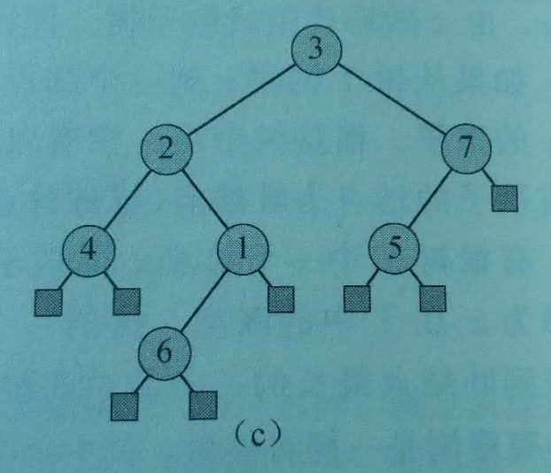

# 提升方法 (boosting)

* **Abstract**
  * 对于一个复杂任务,将多个模型进行综合所得出的模型,要比使用其中任何单一模型要好
* Kearns与Valiant提出
  * 强可学习 (strongly Learnable)
    * 一个概念(一个类),如果存在一个多项式的学习算法能够学习它,并且正确率很高
  * 弱可学习 (weakly Learnable)
    * 一个概念(一个类),,如果存在一个多项式的学习算法能够学习它,学习正确率仅比随机猜测略好
* Schapire证明
  * 强可学习与弱可学习是等价的,在**PAC**学习框架下,一个概念是强可学习的充分必要条件是这个概念是弱可学习的

#### 在学习中,如何把已经发现的弱学习算法,提升为强学习算法???

* **提高分类性能**

  * 通过改变训练样本的权重,学习多个分类器,并将这些分类器进行线性组合
    * 改变训练数据的概率分布(训练数据的权值分布),针对不同的训练数据分布调用弱学习算法,学习一系列弱分类器
  * 给定一个训练样本集,求比较粗糙的分类规则(弱分类器)要比求精确的分类规则(强分类器)容易的多
    * 从弱学习算法出发,反复学习,得到一系类弱分类器(基本分类器)
    * 组合这些弱分类器,构成一个强分类器

* 对于Boosting algorithm,有两个问题

  * 每一轮如何改变训练数据的权值或概率分布
    * 提高前一轮被弱分类器错误分类样本的权值,降低那些被正确分类样本的权值
      * 那些没有正确分类的数据,由于其权值的加大而受到后一轮的弱分类器的更大关注
      * 分类问题被一系列的弱分类器分而治之
  * 如何将弱分类器组合成一个强分类器
    * 采取加权多数表决的方法
      * 加大分类误差率小的弱分类器的权值,提高其在表决中的作用
      * 减小分类误差率大的弱分类器的权值,降低其在表决中的作用


#### **概率**近似正确 (probably approximately correct,PAC)

* 泛化误差 (generalization error)

  * 学到的模型$\hat{f}$对未知数据预测的误差
    * generalization error就是学习到的模型的期望风险
  * $R_{exp}(\hat{f})=E_P[L(Y,\hat{f}(X))]$
  * $R_{exp}(\hat{f})=\int_{\cal{X} \times \cal{Y}}L(y,\hat{f}(x))P(x,y)dxdy$

* **泛化误差上界 (generalization error bound)**

  * 学习方法的泛化能力分析往往是通过研究泛化误差的概率上界进行的
  * 性质
    * 泛化误差上界是样本容量的函数,当样本容量增加时,泛化上界趋于0
    * 泛化误差上界是假设空间容量的函数,假设空间容量越大,模型就越难学,泛化误差上界就越大
  * 定理
    * 对于二类分类问题,当假设空间是有限个函数的集合$\cal{F}=\{f_1,f_2,\cdots ,f_d\}$时,对任意一个函数$f\in \cal{F}$,至少以概率$1-\delta$,($0<\delta<1$),以下不等式成立
      * $R(f)\leq \hat{R}(f)+\varepsilon(d,N,\delta)$
        * $\varepsilon(d,N,\delta)=\sqrt{\frac{1}{2N}(\log d+\log \frac{1}{\delta})}$
        * $R(f)$为泛化误差
        * $\hat{R}(f)+\varepsilon(d,N,\delta)$为泛化误差上界
          * $\hat{R}(f)$为训练误差,训练误差越小,泛化误差也越小
          * $\varepsilon(d,N,\delta)$
            * 是$N$的单调递减函数,当$N$趋于无穷时趋于$0$
            * 也是$\sqrt{\log d}$阶的函数,假设空间包含的函数越多,其值越大
  * **霍夫丁界 (Hoeffding bound)**
    * 对于一簇分布在集合$\{0,1\}$上的独立同分布的随机变量$X_1,X_2,\cdots,X_N$
    * $i=1,2,\cdots,N$ 
    * $\overline{X}$是$X_1,X_2,\cdots,X_N$的经验均值
      * $\overline{X}=\frac{1}{N}\sum\limits_{i-1}^NX_i$
    * 假设$p=P[X_i=1]$ 对所有$1\leq i \leq N$都成立,那么对任意$t>0$有
    * **$P[\overline{X}>p+t]<e^{-2Nt^2}$** 
      * $N,t$越小$e^{-2Nt^2}$越大, $[0-1]$
    * 证明
      * 由切诺夫界,对任意$k>0$
        * $P[\overline{X}>p+t]=P[\sum\limits_{i=1}^NX_i>N(p+t)]$
          * ​		  $<e^{-Nk(p+t)}\cdot Ex[e^{k\sum\limits_{i=1}^NX_i}]$  (Chernoff bound)
          * ​                  $=e^{-Nk(p+t)}\cdot \prod\limits_{i=1}^NEx[e^{kX_i}]$  (独立变量的乘积)
          * ​                  $=e^{-Nk(p+t)}\cdot \prod\limits_{i=1}^N[(1-p)+pe^k]$
            * $Ex[e^{kX_i}]=P[X_i=0]e^{k\cdot 0}+P[X_i=1]e^{k\cdot 1}=(1-p)+pe^k$ 
          * ​                  $\leq e^{-Nk(p+t)}\cdot e^{N(kp+\frac{k^2}{8})}$ 
            * 设$f(k)=\ln ((1-p)+p\cdot e^k)$
            * $f'(k)=\frac{p\cdot e^k}{(1-p)+p\cdot e^k}$
            * $f''(k)=\frac{p(1-p)e^k}{((1-p)+p\cdot e^k)^2}$
            * $f(k) \leq f(0)+f'(0)k+\frac{f''(0)}{2}k^2$
            * ​         $=pk+\frac{p(1-p)}{2}k^2$
            * ​         $\leq pk+\frac{k^2}{8}$ 
          * ​                  $=e^{N[-kt+\frac{k^2}{8}]}$ 
          * ​                  $=e^{-2Nt^2}$  ($k=4t$)
  * **切诺夫界 (Chernoff bound)**
    * 某些随机变量不大可能显著的超出它们的期望
      * 很多小的 独立的随机变量的和,不大可能显著地超出它们和的均值
    * 只适用于实数区间$[0,1]$上的独立随机变量的和.切诺夫界允许这些随机变量有不同的 任意的或未知的分布,只要求它们的取值范围在$[0,1]$,此外,这些变量的个数以及它们的期望也没有直接的关系
    * **定理**
      * 设$T_1,T_2,\cdots,T_N$为相互独立的随机变量,满足$0\leq T_i\leq 1$对任意$i$成立
      * 令$T=T_1+T_2+\cdots+T_N$,那么对所有$c\geq 1$
        * $P[T\geq cEx[T]]\leq e^{-\beta(c)Ex[T]}$
          * $\beta(c)=c\ln c-c+1$
    * 证明
      * 指数化在某种程度上增强了马尔可夫边界
      * $P[T\geq cEx[T]]=P[c^T\geq c^{cEx[T]}]$  (两边变成指数形式)
      * ​                             $\leq \frac{Ex[c^T]}{c^{cEx[T]}}$  (马尔科夫边界)
      * ​                             $\leq \frac{e^{(c-1)Ex[T]}}{c^{cEx[t]}}$  (见下,引理1)
        * ​	             $= \frac{e^{(c-1Ex[T])}}{c^{c\ln(c)Ex[t]}}=c^{-(c\ln (c)-c+1)Ex[T]}$
        * 引理1
          * $Ex[c^T]\leq e^{(c-1)Ex[T]}$
          * 证明
            * $Ex[c^T]=Ex[c^{T_1+\cdots+T_N}]$
            * ​              $=Ex[c^{T_1}\cdots c^{T_N}]$
            * ​              $=Ex[c^{T_1}]\cdots Ex[c^{T_N}]$  (独立变量的乘积,独立变量的函数仍然是独立的)
            * ​              $\leq e^{(c-1)Ex[T_1]}+\cdots +e^{(c-1)Ex[T_N]}$  (见下,引理2)
            * ​              $=e^{(c-1)(Ex[T_1]+\cdots +Ex[T_N])}$
            * ​             $=e^{(c-1)Ex[T_1+\cdots +T_N]}$  ($Ex[\cdot]$线性性质)
            * ​             $=e^{(c-1)Ex[T]}$
        * 引理2
          * $Ex[c^{T_i}]\leq e^{(c-1)Ex[T_i]}$
          * 证明
            * $Ex[c^{T_i}]=\sum c^vP[T_i=v]$  ($Ex[\cdot]$定义)
            * ​              $\leq \sum (1+(c-1)v)P[T_i=v]$  (凸性)
            * ​              $=\sum P[T_i=v]+(c-1)vP[T_i=v]$
            * ​              $=\sum P[T_i=v]+(c-1)\sum vP[T_i=v]$
            * ​              $=1+(c-1)Ex[T_i]$
            * ​             $\leq e^{(c-1)Ex[T_i]}$  ($1+z \leq e^z$)
              * 凸性
                * $c^v \leq 1+(c-1)v$    对$[0,1]$上的所有$v$和$c\geq 1$成立
                * 凸函数$c^v$,在与线性函数$1+(c-1)v$的两个交点之间,$v=0,v=1$ ,凸函数小于线性函数
                * 这个不等式就是为了说明,变量$T_i$必须限制在实数区间$[0,1]$的原因


  * **Examples** 二类分类问题泛化误差上界
    * 训练数据集$T=\{(x_1,y_1),(x_2,y_2),\cdots,(x_N,y_N)\}$
      * $T$ 是从联合概率分布$P(X,Y)$独立同分布产生的
      * $N$是样本容量
      * $X\in R^n$ $Y\in \{-1,+1\}$
    * 假设空间是函数有限集合$\cal{F}=\{f_1,f_2,\cdots ,f_d\}$
      * $d$是函数个数
    * 设$f$是从$F$中选取的函数
      * 损失函数 (loss function)
        * $0-1$loss function
          * $L(Y,f(X))=\begin{cases} 1,Y\neq f(X)\\ 0,Y=f(X) \end{cases}$
      * 关于$f$的期望风险 (expected risk)
        * $R(f)=Ex[L(Y,f(X))]$
      * 关于$f$的经验风险 (empirical risk)
        * $\hat{R}(f)=\frac{1}{N}\sum\limits_{i=1}^N L(y_i,f(x_i))$
        * empirical risk最小化函数是
          * $f_N=arg \min\limits_{f\in F}\hat{R}(f)$
      * 证明
          * 由Hoeffding bound
              * 设$X_1,X_2,\cdots,X_N$是独立随机变量,且$X_i\in [a_i,b_i]$ ,$i=1,2,\cdots,N$
              * $\overline{X}$是$X_1,X_2,\cdots,X_N$的经验均值, $\overline{X}=\frac{1}{N}\sum\limits_{i-1}^NX_i$,对任意$t>0$有
                  * $P[\overline{X}-E(\overline{X})\geq t]\leq Ex[-\frac{2N^2t^2}{\sum\limits_{i=1}^N(b_i-a_i)^2}]$ 
                  * $P[E(\overline{X})-\overline{X}\geq t]\leq Ex[-\frac{2N^2t^2}{\sum\limits_{i=1}^N(b_i-a_i)^2}]$ 
        * 有
          * $P[R(f)-\hat{R}(f)\geq \varepsilon]\leq \exp(-2N\varepsilon^2)$ 
            * $R(f)$是随机变量$L(Y,f(X))$的期望值
            * $\hat{R}(f)​$是$N​$个独立随机变量$L(Y,f(X))​$的样本均值
            * 损失函数取值区间$[0,1]$
            * $\varepsilon>0$
          * $\cal{F}=\{f_1,f_2,\cdots,f_d\}$是一个有限集合,则有
            * $P[\exists f\in \cal{F} : \rm{R}(f)-\hat{R}f\geq \varepsilon]=P[\bigcup\limits_{f\in \cal{F}}\{R(f)-\hat{R}(f)\geq \varepsilon\}]$ 
            * ​                                                   $\leq \sum\limits_{f\in \cal{F}}P[R(f)-\hat{R}(f)\geq \varepsilon]$ 
            * ​                                                   $=d \exp(-2N\varepsilon^2)$ 
            * 等价于
              * $P[R(f)-\hat{R}(f)<\varepsilon]\geq 1-d \exp(-2N\varepsilon^2)$
            * $\delta =d \exp(-2N\varepsilon^2)$
              * $P[R(f)<\hat{R}(f)+\varepsilon]\geq 1-\delta$ 
            * 至少以概率$1-\delta$有$R(f)<\hat{R}(f)+\varepsilon$ 
            * 从泛化误差上界可知
              * $R(f_N)\leq \hat{R}(f_N)+\varepsilon(d,N,\delta)$ 
* **结论**
  * 通过比较两种学习方法的泛化误差上界的大小来比较它们的优劣性

#### AdaBoost算法 (Adaptive Boost algorithm)

* 策略
  * 从训练数据中学习一系列弱分类器,并将这些弱分类器线性组合成一个强分类器

* 给定二类分类的训练数据集$T=\{(x_1,y_1),(x_2,y_2),\cdots,(x_N,y_N)\}$
  * 每个样本点由实例与标记组成
    * 实例$x_i\in \cal{X}\subseteq \rm{R}^n$ ,$\cal{X}$是实例空间
    * 标记$y_i\in \cal Y=\rm\{1,-1\}$ ,$\cal Y$是标记集合

* (1) 初始化训练数据的权值分布
  * $D_1=(w_{1,1},\cdots,w_{1,i},\cdots,w_{1,N})$,$w_{1i}=\frac{1}{N}$,$i=1,2,\cdots,N$ 
  * **说明**
    * 假设训练数据集具有均匀的权值分布,既每个训练样本在弱分类器的学习中作用相同,这一假设保证第1步能够在原始数据上学习弱分类器$G_1(x)$

* (2) 对$m=1,2,\cdots,M$
  * (a)使用具有权值分布$D_m$的训练数据集学习,得到弱分类器
    * $G_m(x):\cal X \rm\rightarrow \{-1,+1\}$ 
  * (b)计算$G_m(x)$在训练数据集上的分类误差率
    * $e_m=\sum\limits_{i=1}^NP(G_m(x_i)\not=y_i)=w_{mi}I(G_m(x_i)\not=y_i)$ 
  * (c)计算$G_m(x)$的系数
    * $\alpha_m=\frac{1}{2}\log_e\frac{1-e_m}{e_m}$ 
  * (d)更新训练数据集的权值分布
    * $D_{m+1}=(w_{m+1,1},\cdots,w_{m+1,i},\cdots,w_{m+1,N})$ 
    * $w_{m+1,i}=\frac{w_{mi}}{Z_m}\exp(-\alpha_my_iG_m(x_i))$ ,$i=1,2,\cdots,N$ 
    * $Z_m=\sum\limits_{i=1}^Nw_{mi}\exp(-\alpha_my_iG_m(x_i))$ ,$Z_m$是规范化因子,它使$D_{m+1}$成为一个概率分布
  * **说明**
    * AdaBoost反复学习弱分类器,在每一轮$m=1,2,\cdots,M$顺次的执行以下操作
      * (a)使用当前分布$D_m$加权的训练数据集,学习基本分类器$G_m(x)$
      * (b)计算弱分类器$G_m(x)$在加权训练数据集上的分类误差率
        * $e_m=\sum\limits_{i=1}^NP(G_m(x_i)\not=y_i)$
        * ​      $=\sum\limits_{G_m(x_i)\not=y_i}w_{mi}$ 
          * $w_{mi}$表示第$m$轮中第$i$个实例的权值,$\sum\limits_{i=1}^Nw_{mi}=1$ 
          * 数据权值分布$D_m$与弱分类器$G_m(x)$的分类误差率的关系
            * $G_m(x)$在加权的训练数据集上的分类误差率是被$G_m(x)$误分类样本的权值之和
      * (c)计算弱分类器$G_m(x)$的系数$\alpha_m$
        * $\alpha_m$表示$G_m(x)$在最终分类器中的重要性
        * 由$\alpha_m=\frac{1}{2}\log_e\frac{1-e_m}{e_m}$ 可知,分类误差率越小的弱分类器在最终分类器中的作用越大
          * $\alpha_m$随着$e_m$的减小而增大,当$e_m\leq \frac{1}{2}$时,$\alpha_m\geq 0$ 
      * (d)更新训练数据的权值分布为下一轮作准备
        * $w_{m+1,i}=\frac{w_{mi}}{Z_m}\exp(-\alpha_my_iG_m(x_i))$ 可以写成
          * $w_{m+1,i}=\begin{cases}\frac{w_{mi}}{Z_m}e^{-\alpha_m},G_m(x_i)=y_i \\ \frac{w_{mi}}{Z_m}e^{\alpha_m},G_m(x_i)\not=y_i\end{cases}$ 
        * 被弱分类器$G_m(x)$误分类样本的权值得以扩大,被正确分类样本的权值得以缩小
        * 由(c)可知
          * 误分类样本的权值被放大$e^{2\alpha_m}=\frac{1-e_m}{e_m}$ ,因此,误分类样本在下一轮学习中起更大的作用
        * 不改变所给的训练数据,而不断改变训练数据权值的分布,使训练数据在弱分类器的学习中起不同的作用

* (3) 构建弱分类器的线性组合
  * $f(x)=\sum\limits_{i=1}^M\alpha_mG_m(x)$ 
  * 强分类器
    * $G(x)=sign(f(x))$ 
    * ​          $=sign(\sum\limits_{i=1}^M\alpha_mG_m(x))$ 
      * $sign$是符号函数
        * $sign(f(x))=\begin{cases}+1,f(x)\geq 0\\-1,f(x)<0\end{cases}$ 
  * **说明**
    * 线性组合$f(x)$实现$M$个弱分类器的加权表决
    * 系数$\alpha_m$表示了基本分类器$G_m(x)$的重要性
      * 所有$\alpha_m$之和并不为1
    * $f(x)$的符号决定实例$x$的类,$f(x)$的绝对值表示分类的确信度

* Example
  * 训练数据表
    *  

  * 假设弱分类器由$x<v$或$x>v$产生,其阈值$v$使该分类器在训练数据集上分类误差率最低

  * 证明

    * (1) 初始化数据权值分布

      * $D_1=(w_{1,1},w_{1,2},\cdots,w_{1,10})$, 其中$w_{1,i}=0.1$ ,$i=1,2,\cdots,10$ 

      * ```python
        import numpy as np
        # init
        x=np.arange(10)
        y=np.array([1,1,1,-1,-1,-1,1,1,1,-1])
        w1=np.array([0.1]*10)
        ```

    * (2) 对$m=1,2,\cdots,M$ 

      * $m=1$

        * (a)在权值分布为$D_1$的训练数据上,阈值$v$取2.5时分类误差率最低

          * 弱分类器为,$G_1(x)=\begin{cases}1,&x<2.5\\-1,&x>2.5\end{cases}$ 

          * ```python
            for v in np.arange(1.5,10,1):
                G1=[1 if i<v else -1 for i in x]
                err=(G1!=y)*w1
                err=err.sum()
                print(v,round(err,4),end='   ')
                G1=[-1 if i<v else 1 for i in x]
                err=((G1!=y)*w1).sum()
                print(round(err,4))
            ```

        * (b)$G_1(x)$在训练数据集上的误差率

          * $e_1=P(G_1(x_i)\not=y_i)=0.3$ 
          *  

        * (c)计算$G_1(x)$的系数

          * $\alpha_1=\frac{1}{2}\log \frac{1-e_1}{e_1}=0.4236$ 

          * ```
            v=2.5
            G1=np.array([1 if i<v else -1 for i in x])
            err1=round(((G1!=y)*w1).sum(),4)
            alpha1=round(np.log((1-err1)/err1)/2,4)
            alpha1
            ```

        * (d)更新训练数据的权值分布

          * $D_2=(w_{2,1},\cdots,w_{2,i},\cdots,w_{2,10})$ 

          * $w_{2,i}=\frac{w_{1,i}}{Z_1}\exp (-\alpha_1y_1G_1(x_i))$ ,$i=1,2,\cdots,10$ 

          * $D_2=(0.07143,0.07143,0.07143,0.07143,0.07143,0.07143,0.16667,0.16667,0.16667,0.07143)$

            * ```python
              w2=(w1*np.exp(-alpha1*y*G1))/(w1*np.exp(-alpha1*y*G1)).sum()
              ```

          * $f_1(x)=0.4236G_1(x)$

            * 分类器$sign(f_1(x))$在训练数据集上有3个误分类点

            * ```python
              f1=np.sign(alpha1*G1)
              print(f1)
              print(y)
              ```

      * $m=2$

        * (a)在权值分布为$D_2$的训练数据上,阈值$v$取8.5时分类误差率最低

          - 弱分类器为,$G_2(x)=\begin{cases}1,&x<8.5\\-1,&x>8.5\end{cases}$ 

          - ```
            for v in np.arange(1.5,10,1):
                G2=[1 if i<v else -1 for i in x]
                err2=(G2!=y)*w2
                err2=err2.sum()
                print(v,round(err2,4),end='   ')
                G2=[-1 if i<v else 1 for i in x]
                err2=((G2!=y)*w2).sum()
                print(round(err2,4))
            ```

        * (b)$G_2(x)$在训练数据集上的误差率

          - $e_2=P(G_2(x_i)\not=y_i)=0.2143$ 
          -   

        * (c)计算$G_2(x)$的系数

          - $\alpha_2=\frac{1}{2}\log \frac{1-e_2}{e_2}=0.6496$ 

          - ```python
            v2=8.5
            G2=np.array([1 if i<v2 else -1 for i in x])
            err2=round(((G2!=y)*w2).sum(),4)
            alpha2=round(np.log((1-err2)/err2)/2,4)
            alpha2
            ```

        * (d)更新训练数据的权值分布

          * $D_3=(0.0455,0.0455,0.0455,0.1667,0.1667,0.1667,0.1060,0.1060,0.1060,0.0445)$

            * ```python
              w3=(w2*np.exp(-alpha2*y*G2))/(w2*np.exp(-alpha2*y*G2)).sum()
              ```

          * $f_2(x)=0.4236G_1(x)+0.6496G_2(x)$ 

            * 分类器$sign(f_2(x))$在训练数据集上有3个误分类点

            * ```python
              f2=np.sign(alpha1*G1+alpha2*G2)
              print(f2)
              print(y)
              ```

      * $m=3$

        * (a)在权值分布为$D_3$的训练数据上,阈值$v$取5.5时分类误差率最低

          - 弱分类器为,$G_3(x)=\begin{cases}1,&x<5.5\\-1,&x>5.5\end{cases}$ 

          - ```python
            for v in np.arange(1.5,10,1):
                G3=[1 if i<v else -1 for i in x]
                err3=(G3!=y)*w3
                err3=err3.sum()
                print(v,round(err3,4),end='   ')
                G3=[-1 if i<v else 1 for i in x]
                err3=((G3!=y)*w3).sum()
                print(round(err3,4))
            ```

        * (b)$G_3(x)$在训练数据集上的误差率

          - $e_3=P(G_3(x_i)\not=y_i)=0.1818$ 
          -  
          -    

        * (c)计算$G_3(x)$的系数

          - $\alpha_3=\frac{1}{2}\log \frac{1-e_3}{e_3}=0.7521$  

          - ```
            v3=5.5
            G3=np.array([-1 if i<v3 else 1 for i in x])
            err3=round(((G3!=y)*w3).sum(),4)
            alpha3=round(np.log((1-err3)/err3)/2,4)
            alpha3
            ```

        * (d)更新训练数据的权值分布

          * $D_4=(0.125,0.125,0.125,0.102,0.102,0.102,0.065,0.065,0.065,0.125)$ 

            * ```python
              w4=(w3*np.exp(-alpha3*y*G3))/(w3*np.exp(-alpha3*y*G3)).sum()
              ```

          * $f_3(x)=0.4236G_1(x)+0.6496G_2(x)+0.7521G_3(x)$ 

            * 分类器$sign(f_3(x))$在训练数据集上有0个误分类点

            * ```
              f3=np.sign(alpha1*G1+alpha2*G2+alpha3*G3)
              (f3==y).all()
              ```

    * (3) 构建弱分类器的线性组合

      * 强分类器为
        * $G(x)=sign(f_3(x))=sign(0.4236G_1(x)+0.6496G_2(x)+0.7521G_3(x))$ 

* **训练误差分析**

  * AdaBoost最基本的性质是能在学习过程中不断减少训练误差
    * 训练数据集上的分类误差率
  * 定理 (AdaBoost的训练误差界)
    * AdaBoost algorithm的强分类器的训练误差界为
      * $\frac{1}{N}\sum\limits_{i=1}^NI(G(x_i)\not=y_i)\leq\frac{1}{N}\sum\limits_i\exp (-y_if(x_i))=\prod\limits_mZ_m$ 
        * $G(x)=sign(f(x))$ 
          *    $=sign(\sum\limits_{i=1}^M\alpha_mG_m(x))$ 
        * $f(x)=\sum\limits_{i=1}^M\alpha_mG_m(x)$ 
        * $Z_m=\sum\limits_{i=1}^Nw_{mi}\exp(-\alpha_my_iG_m(x_i))$ 
    * 证明
      * 当$G(x_i)\not=y_i$时,$y_if(x_i)<0$,
        * $\exp (-y_if(x_i))\geq 1$ 
      * 由$w_{m+1,i}=\frac{w_{m,i}}{Z_m}\exp(-\alpha_my_iG_m(x_i))$ ,$i=1,2,\cdots,N$ 变形
        * $w_{m,i}\exp(-\alpha_my_iG_m(x_i))=Z_mw_{m+1,i}$ 
      * 推导
        * $\frac{1}{N}\sum\limits_i\exp (-y_if(x_i))=\frac{1}{N}\sum\limits_i\exp (-\sum\limits_{m=1}^M\alpha_my_iG_m(x_i))$ 
          * ​                               $=\sum\limits_iw_{1,i}\prod\limits_{m=1}^M\exp(-\alpha_my_iG_m(x_i))$ 
          * ​                               $=Z_1\sum\limits_iw_{2,i}\prod\limits_{m=2}^M\exp(-\alpha_my_iG_m(x_i))$ 
          * ​                               $$=Z_1Z_2\sum\limits_iw_{3,i}\prod\limits_{m=3}^M\exp(-\alpha_my_iG_m(x_i))$$ 
          * ​                               $=\cdots$
          * ​                               $$=Z_1Z_2\cdots Z_{M-1}\sum\limits_iw_{M,i}\exp(-\alpha_My_iG_M(x_i))$$ 
          * ​                               $=\prod\limits_{m=1}^MZ_m$ 
      * **结论**
        * 可以在每一轮选取适当的$G_m$使$Z_m$最小,则训练误差下降最快
  * 定理 (二类分类问题 AdaBoost的训练误差界)
    * $\prod\limits_{m=1}^MZ_m=\prod\limits_{m=1}^M[2\sqrt{e_m(1-e_m)}]$ 
      * ​        $=\prod\limits_{m=1}^M\sqrt{(1-4\gamma_m^2)}$   这里($\gamma_m=\frac{1}{2}-e_m$)
      * ​        $\leq \exp(-2\sum\limits_{m=1}^M\gamma_m^2)$
    * 证明
      * 由, $e_m=\sum\limits_{i=1}^NP(G_m(x_i)\not=y_i)$ 
        *    $=\sum\limits_{G_m(x_i)\not=y_i}w_{mi}$ 
      * 有, $Z_m=\sum\limits_{i=1}^Nw_{mi}\exp(-\alpha_my_iG_m(x_i))$ 
        * ​      $=\sum\limits_{y_i=G_m(x_i)}w_{m,i}e^{-\alpha_m}+\sum\limits_{y_i\not=G_m(x_i)}w_{m,i}e^{\alpha_m}$ 
        * ​      $=(1-e_m)e^{-\alpha_m}+e_me^{\alpha_m}$ 
        * ​      $=2\sqrt{e_m(1-e_m)}$ 
        * ​      $=\sqrt{1-4\gamma_m^2}$ 
      * 由$e^x$和$\sqrt{1-x}$在点$x=0$的泰勒展开式推出不等式$\sqrt{1-4\gamma_m^2}\leq\exp (-2\gamma_m^2)$ 
        * 由马克劳林公式$f(x)=f(0)+\frac{f'(0)}{1!}x+\frac{f''(0)}{2!}x^2+\cdots+\frac{f^{(n)}(0)}{n!}x^n+\frac{f^{n+1}(\theta x)}{(n+1)!}x^{n+1}$ , $0<\theta<1$ 
          * $e^x\approx 1+x+\frac{1}{2!}x^2$ 
          * $\sqrt{1-x}\approx 1-\frac{1}{2}x+\frac{0.25}{2!}x^2$ 
        * $\prod\limits_{m=1}^M\sqrt{1-4\gamma_m^2}\leq\exp(-2\sum\limits_{m=1}^M\gamma_m^2)$ 
    * 推论
      * 如果存在$\gamma>0$,对所有$m$有$\gamma_m\geq\gamma$
        * $\frac{1}{N}\sum\limits_{i=1}^MI(G(x_i)\not=y_i)\leq\exp(-2M\gamma^2)$ 
    * 结论
      * 在此条件下AdaBoost的训练误差是以指数速率下降的
    * **指数函数**
      * 定义
        * 对每个复数$z$规定
          * (1) $\exp(z)=\sum\limits_{n=0}^\infty \frac{z^n}{n!}$ 
          * 级数(1)对每个$z$绝对收敛,对复平面的每个有界子集一致收敛,因此,$exp$是连续的
          * (1)的绝对收敛指出了下面算式的正确性
            * 由 $\sum\limits_{k=0}^\infty \frac{a^k}{k!}\sum\limits_{m=0}^\infty \frac{b^m}{m!}=\sum\limits_{n=0}^\infty\frac{1}{n!}\sum\limits_{k=0}^n\frac{n!}{k!(n-k)!}a^kb^{n-k}=\sum\limits_{n=0}^\infty \frac{(a+b)^n}{n!}$ 
            * 有 $\exp(a)\exp(b)=\exp(a+b)$, $a,b\in C$ 
      * 定理
        * 对每一个复数$z$,$e^z\not=0$ 
        * $\exp'(z)=\exp(z)$
        * $\exp$限制在实轴上是单调增加的正函数
          * 当$x\rightarrow\infty$时,$e^x\rightarrow\infty$
          * 当$x\rightarrow -\infty$时,$e^x\rightarrow 0$ 
        * $\exp$是周期函数,其周期是$2\pi i$ 
        * 弱$w$是复数且$w\not=0$,则存在某个$z$使$w=e^z$ 

* **向前分步算法与AdaBoost (forward stagewise algorithm & adaptive boost)**

  * **向前分步算法 (forward stagewise algorithm)**
    * 策略
      * 使用加法模型,从前向后,逐步逼近优化目标函数式,每步只学习一个基函数及其系数
    * 加法模型 (additive model)
      * $f(x)=\sum\limits_{m=1}^M\beta_mb(x;\gamma_m)$ 
        * $\beta_m$为基函数的系数
        * $b(x;\gamma_m)$为基函数
        * $\gamma_m$为基函数的参数
    * 给定训练数据及损失函数$L(y,f(x))$ 
      * 学习加法模型$f(x)$成为经验风险极小化, 即损失函数极小化问题
      * $\min\limits_{\beta_m,\gamma_m}\sum\limits_{i=1}^NL(y_i,\sum\limits_{i=1}^M\beta_mb(x_i;\gamma_m))$ 
      * 使用策略优化损失函数
        * $\min\limits_{\beta,\gamma}\sum\limits_{i=1}^NL(y_i,\beta b(x_i,\gamma))$ 
    * 训练数据集$T=\{(x_1,y_1),(x_2,y_2),\cdots,(x_N,y_N)\}$ 
      * $x_i\in \cal X \subseteq \rm R^n$ 
      * $y_i\in \cal Y \rm =\{-1,+1\}$ 
      * $\{b(x;\gamma)\}​$ 基函数的集合
    * (1) 初始化
      * $f_0(x)=0$ 
    * (2) 对$m=1,2,\cdots,M$ 
      * (a) 极小化损失函数 $L(y,f(x))$,得到参数$\beta_m,\gamma_m$
        * $(\beta_m,\gamma_m)=arg\min\limits_{\beta,\gamma}\sum\limits_{i=1}^NL(y_i,f_{m-1}(x_i)+\beta b(x_i;\gamma))$ 
      * (b)更新
        * $f_m(x)=f_{m-1}(x)+\beta_m b(x;\gamma_m)$ 
    * (3) 得到加法模型
      * $f(x)=f_M(x)=\sum\limits_{m=1}^M\beta_mb(x;\gamma_m)$ 
    * **结论**
      * forward stagewise algorithm 将同时求解从$m=1$到$M$所有参数$\beta_m,\gamma_m$的优化问题简化为逐次求解各个$\beta_m,\gamma_m$的优化问题
  * **由向前分步算法推导AdaBoost**
    * 定理
      * AdaBoost算法是向前分步加法算法的特例,这时,模型是由弱分类器组成的加法模型,损失函数是指数函数
    * 证明
      * 向前分步算法学习的是加法模型,当基函数为弱分类器时,该加法模型等价于AdaBoost的最终分类器,由弱分类器$G_m(x)$及其系数$\alpha_m$组成,$m=1,2,\cdots,M$,向前分步算法逐一学习基函数,这一过程与AdaBoost算法逐一学习基本分类器的过程一致
        * $f(x)=\sum\limits_{m=1}^M\alpha_mG_m(x)$ 
      * **由向前分步算法的损失函数为指数损失函数 (exponential loss function)**
        * $L(y,f(x))=\exp[-yf(x)]​$ 


#### 梯度提升树 (gradient boosting decision tree,GBDT)

* 策略
  * 采用加法模型(基函数的线性组合)与向前分步算法
  * 以决策树为基函数
    * 对分类问题决策树是二叉分类树
    * 对回归问题决策树是二叉回归树
      * 二叉树
        * 二叉树是一颗结点度均为2的有序树
        * $T$是定义在有限结点集上的结构
          * 它不包含任何结点
            * 不包含任何结点的二叉树称为空树或零树,用符号NIL表示
          * 包含三个不相交的结点集合
            * 一个根结点,一棵称为左子树的二叉树,一棵称为右子树的二叉树
          * 左子树非空,则它的根称为整棵树的根的左孩子
          * 右子树非空,则它的根称为整棵树的根的右孩子
          * 一棵子树是零树,则称该孩子是缺失或者丢失的
        * 满二叉树
          * 用有序树中的内部结点来表示二叉树的位置信息
            * 将二叉树中每个缺失的孩子用一个没有孩子的结点替代
            *   
          * 每个结点是叶结点 (度为2), 满二叉树中不存在度为1的结点
          * 最终,结点的孩子的顺序保留了位置信息
        * 完全二叉树
          * 二叉树中只有最下面的两层的度可以小于2
          * 最下面的一层的叶结点,都依次排列在左边
          *  
    * 决策树桩 (decision stump)
      * AdaBoost算法弱分类器的阈值$x<v$或$x>v$, 看作是由一个根结点直接连接两个叶结点的简单决策树
  * $f_M(x)=\sum\limits_{m=1}^MT(x;\Theta_m)$ 
    * $M$为树的个数
    * $T(x;\Theta_m)$ 表示决策树
      * $\Theta_m$为决策树的参数

* 训练数据集$T=\{(x_1,y_1),(x_2,y_2),\cdots,(x_N,y_N)\}$
  * $x_i\in \cal{X}\subseteq \rm{R}^n$ 
  * $y_i\in \cal Y\rm \subseteq R$ 

* (1) 初始化
  * $f_0(x)=0$ 
  * 说明
    * 提升树算法采用向前分步算法
      * 首先确定初始提升树$f_0(x)=0$ 

* (2) 对$m=1,2,\cdots,M$ 
  * (a)计算残差
    * $r_{m,i}=y_i-f_{m-1}(x)$, $i=1,2,\cdots,N$ 
  * (b)拟合残差$r_{m,i}$学习一个回归树
    * 得到$T(x;\Theta_m)$ 
  * (c)更新
    * $f_m(x)=f_{m-1}(x)+T(x;\Theta_m)$ 
  * 说明
    * 第$m$步的模型
      - $f_m(x)=f_{m-1}(x)+T(x;\Theta_m)$ 
        - $f_{m-1}(x)$为当前模型
    * 经验风险极小化确认下一棵决策树的参数$\Theta_m$ 
      * $\hat{\Theta}_m=arg\min\limits_{\Theta_m}\sum\limits_{i=1}^NL(y_i,f_{m-1}(x_i)+T(x_i;\Theta_m))$ 
    * 将输入空间$\cal X$划分为$J$个互不相交的区域$R_1,R_2,\cdots,R_J$, 并且在每个区域上确定输出的常量$c_j$
      * 树表示为
        * $T(x;\Theta)=\sum\limits_{j=1}^Jc_jI(x\in R_j)$ 
          * $\Theta=\{(R_1,c_1),(R_2,c_2),\cdots,(R_J,c_J)\}$ 表示树的区域划分和各区域上的常数
          * $J$是回归树的复杂度,即叶结点数 
    * 计算残差
      * 损失函数 (loss function)
        * 平方损失函数 (quadratic loss function)
          * $L(Y,f(X))=(Y-f(X))^2$
      * $L(y,f_{m-1}(x)+T(x;\Theta_m))=[y-f_{m-1}(x)-T(x;\Theta_m)]^2$ 
        * ​                                          $=[r-T(x;\Theta_m)]^2$ 
      * 当前模型拟合数据的残差 (residual)
        * $r=y-f_{m-1}(x)$ 
    * 结论
      * 对回归问题的提升树算法来说,只需简单的拟合当前模型的残差

* (3) 得到回归问题提升树
  * $f_M(x)=\sum\limits_{m=1}^MT(x;\Theta_m)$ 

* Examples (回归问题的提升树)
  * 训练数据表

    *  
      * $x\in[0.5,10.5]$ 
      * $y\in [5.0,10.0]$  

  * 只用树桩作为基函数

  * 证明

    * (1) 求$f_1(x)$即回归树$T_1(x)$ 

      * 通过优化求解训练数据切分点$s$ 

        * $\min\limits_s[\min\limits_{c_1}\sum\limits_{x_i\in R_1}(y_i-c_1)^2+\min\limits_{c_2}\sum\limits_{x_i\in R_2}(y_i-c_2)^2]$ 

        * $R_1=\{x|x\leq s\}$

        * $R_2=\{x|x>s\}$ 

        * $m(x)=\min\limits_{c_1}\sum\limits_{x_i\in R_1}(y_i-c_1)^2+\min\limits_{c_2}\sum\limits_{x_i\in R_2}(y_i-c_2)^2$ 

        * ```python
          import numpy as np
          import heapq
          x=np.arange(10)
          y=np.array([5.56,5.70,5.91,6.40,6.80,7.05,8.90,8.70,9.00,9.05]
          list_s=[]
          for s in np.arange(1.5,10.5,1):
              m=((y[:int(s)]-y[:int(s)].mean())**2).sum()+\
                     (((y[int(s):]-y[int(s):].mean()))**2).sum()
              list_s.append({'s':s,\
                             'm':m,\
                             'c1':y[:int(s)].mean(),\                                     			'c2':y[int(s):].mean()})
          heapq.nsmallest(1,list_s,lambda s:s['m'])
          ```

          *   

      * 当$s=6.5$时$m(s)$最小

        * $R_1=\{1,2,\cdots,6\}$, $R_2=\{7,8,9,10\}$ 

        * $c_1=6.24$, $c_2=8.91$ 

        * $T_1(x)=\begin{cases}6.24,x<6.5\\8.91,x\geq 6.5\end{cases}$ 

          * ```python
            s=6.5
            y2=y.copy()
            y2[:int(s)]=y2[:int(s)].mean()
            y2[int(s):]=y2[int(s):].mean()
            ```

      * $f_1(x)=T_1(x)$ 

        * 拟合训练数据的残差

          *  

            * $r_{2i}=y_i-f_1(x_i)$, $i=1,2,\cdots,10$ 

              * ```python
                r=y-y2
                ```

        * 拟合训练数据的平方损失误差

          * $L(y,f_1(x))=\sum\limits_{i=1}^{10}(y_i-f_1(x_i))^2=1.93$ 

            * ```python
              (r**2).sum()
              ```

    * (2) 求$T_2(x)$ 

      * 方法与$T_1(x)$相同
      * 训练数据表为$T_1(x)$的残差
        * $T_2(x)=\begin{cases}-0.52,&x<3.5\\0.22,&x\geq3.5\end{cases}$ 
        * $f_2(x)=f_1(x)+T_2(x)=\begin{cases} 5.72,&x<3.5\\6.46,&3.5\leq x<6.5\\9.13,&x\geq6.5 \end{cases}$ 
        * 拟合训练数据的平方损失误差
          * $L(y,f_2(x))=\sum\limits_{i=1}^{10}(y_i-f_2(x_i))^2=0.79$ 

    * (n) 求$T_n(x)$ 

      * 假设$n=6$以满足误差要求
        * $T_3(x)=\begin{cases}0.15,&x<6.5\\-0.22,&x\geq6.5\end{cases}$ ,$L(y,f_3(x))=0.47$ 
        * $T_4(x)=\begin{cases}-0.16,&x<4.5\\0.11,&x\geq4.5\end{cases}$ ,$L(y,f_4(x))=0.30$
        * $T_5(x)=\begin{cases}0.07,&x<6.5\\-0.11,&x\geq6.5\end{cases}$ ,$L(y,f_5(x))=0.23$
        * $T_6(x)=\begin{cases}-0.15,&x<2.5\\0.04,&x\geq2.5\end{cases}$ ,$L(y,f_6(x))=0.17$ 
          * ​    $=\begin{cases}5.63,&x<2.5\\5.82,&2.5\leq x<3.5\\6.56,&3.5\leq x<4.5\\6.83,&4.5\leq x<6.5\\8.95,&x\geq 6.5\end{cases}$ 

    * 所求提升树为

      * $f(x)=f_6(x)$ 

  * **结论**

    * 当损失函数为平方损失函数时,提升树利用加法模型与向前分步算法实现学习的优化过程,即求解最小平方损失函数

* **Freidman提出的梯度提升算法 (gradient boosting algorithm)** 

  * 利用最速下降法的近似方法
    * 最速下降,也称为梯度搜索
      *  
      * 策略
        * 将当前点在最速下降的方向上移动找出函数最小值
        * 由于$\nabla f$指向$f$的最速生长方向,反方向$-\nabla f$就是最速下降方向
      * 实现
        * 已经将问题简化为在直线上的最小化,可以用一个一维的方法,在最速下降方向找出一个新的最小值,从新点开始重复这个过程
          * 找出在新点上的方向,在新方向上进行一维最小化
        * (a) 迭代$i=1,2,\cdots$ 次
        * (b) $v=\nabla f(x_i)$ 
        * (c) 对于标量$s=s^*$ 最小化$f(x-sv)$
        * (d) $x_{i+1}=x_i-s^*v$ 
          * $f(x_{i+1})=\lim\limits_{i\geq1}f(x_i-sv)$ 
  * 利用损失函数的负梯度在当前模型的值
    * $-[\frac{\partial L(y,f(x_i))}{\partial f(x_i)}]f(x)=f_{m-1}(x)$ 
    * 作为残差的近似值,拟合一个回归树
  * 给定训练数据集$T=\{(x_1,y_1),(x_2,y_2),\cdots,(x_N,y_N)\}$ 
    - $x_i\in \cal{X}\subseteq \rm{R}^n$ 
    - $y_i\in \cal Y\rm \subseteq R$ 
    - 损失函数
      - $L(y,f(x))$ 
  * (1) 初始化
    * $f_0(x)=arg\min\limits_c\sum\limits_{i=1}^NL(y_i,c)$ 
    * 说明
      * 估计损失函数极小化的常数值,它是只有一个根结点的树
  * (2) 对$m=1,2,\cdots,M$ 
    * (a)对$i=1,2,\cdots,N$ 
      * $r_{m,i}=-[\frac{\partial L(y,f(x_i))}{\partial f(x_i)}]f(x)=f_{m-1}(x)$ 
      * 说明
        * 计算损失函数的负梯度在当前模型的值,将它作为残差的估计
        * 对于一般损失函数,它就是残差的近似值
    * (b)对$r_{m,i}$拟合一个回归树,得到第$m$棵树的叶结点区域$R_{m,j}$, $j=1,2,\cdots,J$ 
      * 说明
        * 估计回归树叶结点区域,以拟合残差的近似值
    * (c)对$j=1,2,\cdots,J$ 
      * $c_{m,j}=arg\min\limits_c\sum\limits_{x_i\in R_{m,j}}L(y_i,f_{m-1}(x_i)+c)$ 
      * 说明
        * 利用线性搜索估计叶结点区域的值,使损失函数极小化
    * (d)更新
      * $f_m(x)=f_{m-1}(x)+\sum\limits_{j=1}^Jc_{m,j}I(x\in R_{m,j})$ 
  * (3) 得到最终模型$\hat{f}(x)$ 
    * $\hat{f}(x)=f_M(x)=\sum\limits_{m=1}^M\sum\limits_{j=1}^Jc_{m,j}I(x\in R_{m,j})$ 

  #### end