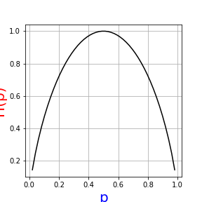

# 决策树 (decision tree)

* Quinlan
  * ID3算法,C4.5算法
* Breiman
  * CART算法
* Abstract
  * 定义在特征空间与类空间上的条件概率分布
  * 一种基本的分类与回归方法
* 模型
  * 分类决策树模型是一种描述对实例进行分类的树形结构
    * 结点(node)
      * 内部结点(internal node)
        * 表示一个特征或属性
      * 叶结点(leaf node)
        * 表示一个类
    * 有向边(directed edge)
* 策略
  * 决策树分类,从根结点开始,对实例的某一特征进行测试,根据测试结果,将实例分配到其子结点
  * 每一个子结点对应着该特征的一个取值,反复递归对实例进行测试分配,直到达到叶结点,将实例分配到叶结点的类中


* 熵 (entropy)

  * 表示随机变量不确定性的度量
    * 设$X$是一个取有限个值的离散随机变量,其概率分布为
      * $p_i=P(X=x_i)$, $i=1,2,\cdots,n$ 
    * 随机变量$X$的熵定义为
      * $H(X)=-\sum\limits_{i=1}^np_i\log p_i$ 
        * 比特 (bit)
          * 式中对数以2为底
        * 纳特 (nat)
          * 式中对数以$e$为底
    * 熵与$X$的取值无关,只与$X$的分布有关
      * $H(p)=-\sum\limits_{i=1}^np_i\log p_i$ 
    * 熵越大,随机变量的不确定性就越大
    * $0\leq H(p)\leq \log n$ 
  * 当随机变量取$\{1,0\}$时
    * $X$的分布为
      * $P(X=1)=p$, $P(X=0)=1-p$ ,$0\leq p \leq 1$ 
    * 熵为
      * $H(p)=-p\log_2p-(1-p)\log_2(1-p)$ 
  * 当$p=0$时或$p=1$时$H(p)=0$,随机变量完全没有不确定性,当$p=0.5$时,$H(p)=1$,熵取值最大,随机变量不确定性最大
    *   
  * 条件熵 (conditional entropy)
    * 设随机变量$(X,Y)$,其联合概率分布为
      * $P(X=x_i,Y=y_j)=p_{i,j}$, $i=1,2,\cdots,n$, $=1j,2,\cdots,m$ 
    * 随机变量$X$给定条件下$Y$的条件概率分布的熵对$X$的数学期望
      * $H(Y|X)=\sum\limits_{i=1}^np_iH(Y|X=x_i)$ 
        * $p_i=P(X=x_i)$, $i=1,2,\cdots,n$ 
      * 经验熵 (empirical entropy),经验条件熵 (empirical conditional entropy)
        * 熵和条件熵的概率由数据估计得到(特别是极大似然函数)

* 信息增益 (information gain)

  * 表示得知特征$X$的信息而使得类$Y$的信息的不确定性减少的程度

  * 定义

    * 特征$A$对训练数据集$D$的信息增益$g(D,A)$,定义为集合$D$的经验熵$H(D)$与特征$A$给定条件下$D$的经验条件熵$H(D|A)$之差
      * $g(D,A)=H(D)-H(D|A)$
      * 互信息 (mutual information)
        * 熵与条件熵之差
        * 决策树学习中的信息增益等价于训练数据集中类与特征的互信息

  * 信息增益的算法

    * 设训练数据集为$D$
      * $|D|$表示其样本容量,即样本个数
    * 设有$K$个类$C_k$
      * $|C_k|$为属于类$C_k$的样本个数, $\sum\limits_{k=1}^K|C_k|=|D|$, $k=1,2,\cdots,K$ 
    * 设特征$A$有$n$个不同的取值$\{a_1,a_2,\cdots,a_n\}$, 根据特征$A$的取值将$D$划分为$n$个子集$D_1,D_2,\cdots,D_n$ 
      * $|D_i|$为$D_i$的样本个数, $\sum\limits_{i=1}^n|D_i|=|D|$ 
    * 记子集$D_i$中属于类$C_k$的样本的集合为$D_{i,k}$ 
      * $D_{i,k}=D_i\cap C_k$ 
      * $|D_{i,k}|$为$D_{i,k}$的样本个数
    * (1) 计算数据集$D$的经验熵$H(D)$
      * $H(D)=-\sum\limits_{k=1}^K\frac{|C_k|}{|D|}\log_2\frac{|C_k|}{|D|}$ 
    * (2) 计算特征$A$对数据集$D$的经验条件熵$H(D|A)$ 
      * $H(D|A)=\sum\limits_{i=1}^n\frac{|D_i|}{|D|}H(D_i)=-\sum\limits_{i=1}^n\frac{|D_i|}{|D|}\sum\limits_{k=1}^K\frac{|D_{i,k}|}{|D_i|}\log_2\frac{D_{i,k}}{D_i}$ 
    * (3) 计算信息增益
      * $g(D,A)=H(D)-H(D|A)$ 

  * Examples

    * 训练数据集

      *  

      * ```python
        # import 
        import numpy as np
        from collections import Counter
        # datas
        age=np.array(['青年']*5+['中年']*5+['老年']*5)
        job=np.array(['否']*2+['是']*2+['否']*3+['是']+['否']*4+['是']*2+['否'])
        house=np.array(['否']*3+['是']+['否']*3+['是']*5+['否']*3)
        credit=np.array(['一般']+['好']*2+['一般']*3+['好']*2+['非常好']*3+['好']*2+['非常好']+['一般'])
        class_datas=np.array(['否']*2+['是']*2+['否']*3+['是']*7+['否'])
        datas=[]
        for i in range(len(class_datas)):
            datas.append({'age':age[i],
                          'job':job[i],
                          'house':house[i],
                          'credit':credit[i],
                          'class_datas':class_datas[i]})
        ```

    * 计算经验熵

      * $H(D)=0.971$ 

      * ```python
        def empirical_entropy(x):
            y_class=Counter(x)
            if len(y_class)<2:
                return 0
            y=list(y_class.keys())
            res_list=[]
            for i in range(len(y_class)):
                res_list.append(str(-y_class[y[i]]/len(x)*\
                                    np.log2(y_class[y[i]]/len(x))))
            res=eval("+".join(res_list))
            return res
        ```

        ```python
        H=empirical_entropy(class_datas)
        H
        ```

    * 计算个特征对数据集$D$的信息增益

      * ```python
        def conditional_entropy(x,name,class_key,class_value,datas):
            class_x=Counter(x)
            key_x=list(class_x.keys())
            key_v=list(class_x.values())
            temp=[]
            cond=[]
            for k in range(len(key_x)):
                for l in datas:
                    temp.append(l[name]==key_x[k])
                    if len(temp)==15:
                        cond.append(temp)
                        temp=[]
            datas_arr=np.array(datas).reshape(1,-1)
            datas_part=[]
            for j in range(len(cond)):
                cond_part=np.array(cond[j]).reshape(1,-1)
                datas_part.append([datas_arr[cond_part]])
            res_list=[]
            res=0
            for d in range(len(datas_part)):
                res=0
                for v in datas_part[d]:
                    for h in v:
                        if h[class_key]==class_value:
                            res+=1
                res_list.append({key_x[d]:key_v[d],class_value:res})
        #     print(res_list)
            res_all=[]
            for val in res_list:
                val_p=list(val.values())
                v_k=val_p[0]
                v_c=val_p[1]
                res_one=str((v_k/len(x))*\
                            (-(v_c/v_k)*np.log2(v_c/v_k)-\
                             (((v_k-v_c)/v_k)*np.log2((v_k-v_c)/v_k))))
                res_all.append(res_one)
        #     print(res_all)
            res_all_2=[]
            for n in res_all:
                if n == 'nan':
                    n='0'
                res_all_2.append(n)
            result=eval('+'.join(res_all_2))
            return result
        ```

      * 年龄
        * $g(D,A_{age})=0.083$ 

        * ```python
          A_age=conditional_entropy(age,'age','class_datas','是1',datas)
          H-A_age
          ```

      * 工作

        * $g(D,A_{job})=0.324$ 

        * ```python
          A_job=conditional_entropy(job,'job','class_datas','是1',datas)
          H-A_job
          ```

      * 房子

        * $g(D,A_{house})=0.420$ 

        * ```python
          A_house=conditional_entropy(house,'house','class_datas','是1',datas)
          H-A_house
          ```

      * 信贷

        * $g(D,A_{credit})=0.363$ 

        * ```python
          A_credit=conditional_entropy(credit,'credit','class_datas','是1',datas)
          H-A_credit
          ```

    * 最优特征

      * $A_{house}$ 

        * ```python
          max(H-A_age,H-A_credit,H-A_house,H-A_job)
          ```

  * 信息增益比 (information gain ratio)

    * 信息增益作为划分训练数据集的特征,存在偏向于选择取值较多的特征的问题
    * information gain ratio可以对这一问题进行矫正
    * 定义
      * 特征$A$对训练数据集$D$的信息增益比$g_R(D,A)$定义为其信息增益$g(D,A)$与训练数据集$D$关于特征$A$的值的熵$H_A(D)$之比
        * $g_R(D,A)=\frac{g(D,A)}{H_A(D)}$ 
          * $H_A(D)=-\sum\limits_{i=1}^n\frac{|D_i|}{|D|}\log_2\frac{|D_i|}{|D|}$, $n$是特征$A$取值的个数

* ID3算法

  * 训练数据集$D$,特征$A$,阈值$\varepsilon$ 
  * (1) 若$D$中所有实例属于同一类$C_k$,则$T$为结点树,并将类$C_k$作为该结点的类标记,返回$T$
  * (2) 若$A=\emptyset$, 则$T$为单节点树, 并将$D$中实例数最大的类$C_k$作为该结点的类标记,返回$T$
  * (3) 否则,按信息增益算法计算$A$中各特征对$D$的信息增益,选择信息增益最大的特征$A_g$ 
  * (4) 如果$A_g$的信息增益小于阈值$\varepsilon$,则置$T$为单结点树,并将$D$中实例数最大的类$C_k$作为该结点的类标记,返回$T$
  * (5) 否则,对$A_g$的每一可能值$a_i$, 依$A_g=a_i$将$D$分割为若干非空子集$D_i$, 将$D_i$中实例数最大的类作为标记,构建子结点,由结点及其子结点构成树$T$,返回$T$
  * (6) 对第$i$个子结点,以$D_i$为训练集,以$A-\{A_g\}$为特征集,递归地调用步(1)到步(5),得到子树$T_i$,返回$T_i$ 

* C4.5算法

  * 训练数据集$D$,特征$A$,阈值$\varepsilon$ 
  * (1) 若$D$中所有实例属于同一类$C_k$,则$T$为结点树,并将类$C_k$作为该结点的类标记,返回$T$
  * (2) 若$A=\emptyset$, 则$T$为单节点树, 并将$D$中实例数最大的类$C_k$作为该结点的类标记,返回$T$
  * (3) 否则,按信息增益比算法计算$A$中各特征对$D$的信息增益,选择信息增益最大的特征$A_g$ 
  * (4) 如果$A_g$的信息增益小于阈值$\varepsilon$,则置$T$为单结点树,并将$D$中实例数最大的类$C_k$作为该结点的类标记,返回$T$
  * (5) 否则,对$A_g$的每一可能值$a_i$, 依$A_g=a_i$将$D$分割为若干非空子集$D_i$, 将$D_i$中实例数最大的类作为标记,构建子结点,由结点及其子结点构成树$T$,返回$T$
  * (6) 对第$i$个子结点,以$D_i$为训练集,以$A-\{A_g\}$为特征集,递归地调用步(1)到步(5),得到子树$T_i$,返回$T_i$ 

* 决策树的剪枝 (pruning)

  * 在决策树学习中将已生成的树进行简化的过程
  * 策略
    * 通过极小化决策树整体的损失函数(loss function)或代价函数(cost function)来实现
  * 设树$T$的叶结点个数为$|T|$ 
    * $t$是树$T$的叶结点,该叶结点有$N_t$个样本点,其中$k$类的样本点有$N_{tk}$个,$k=1,2,\cdots,K$ 
    * $H_t(T)$为叶结点$t$上的经验熵,$\alpha\geq0$为参数
  * 决策树损失函数可以定义为
    * $C_\alpha(T)=\sum\limits_{t=1}^{|T|}N_tH_t(T)+\alpha|T|$ 
      * $H_t(T)=-\sum\limits_k\frac{N_{tk}}{N_t}\log \frac{N_{tk}}{N_t}$ 
    * 模型对训练数据的预测误差,即模型与训练数据的拟合程度
      * $C(T)=\sum\limits_{t=1}^{|T|}N_tH_t(T)=-\sum\limits_{t=1}^{|T|}\sum\limits_{k=1}^KN_{tk}\log \frac{N_{tk}}{N_t}$ 
    * $C_\alpha(T)=C(T)+\alpha|T|$ 
      * $|T|$表示模型复杂度
      * $\alpha\geq 0$控制两者之间的影响
        * 较大的$\alpha$促使选择较简单的模型(树)
        * 较小的$\alpha$促使选择较复杂的模型(树)
        * $\alpha=0$意味只考虑模型与训练数据的拟合程度,不考虑模型的复杂度
  * 剪枝 (pruning)
    * 当$\alpha$确定时,选择损失函数最小的模型,即损失函数最小的子树
      * 子树越大,往往与训练数据的拟合越好,模型的复杂度就越高
      * 子树越小,往往与训练数据的拟合不好,模型的复杂度就越低
      * 损失函数表示两者的平衡
    * 损失函数极小化等价于正则化的极大似然估计
    * 利用损失函数最小原则进行剪枝就是用正则化的极大似然估计进行模型选择
    * 剪枝算法 (pruning algorithm)
      * (1) 计算每个结点的经验熵
      * (2) 递归地从树的叶结点向上回缩
        * 如果$C_\alpha(剪枝后的树)\leq C_\alpha(剪枝前的树)$ 
        * 则,进行剪枝,即将父结点变为新的叶结点
      * (3) 重复(2)步,直到不能继续为止,得到损失函数最小的子树$T_\alpha$ 

* 分类与回归树 (classification and regression tree, CART)

  * CART是在给定输入随机变量$X$条件下输出随机变量$Y$的条件概率分布的学习方法
  * 策略
    * (1) 决策树生成
      * 基于训练数据集生成决策树,生成的决策树要尽量的大
    * (2) 决策树剪枝
      * 用于验证数据集对已生成的树进行剪枝并选择最优子树
      * 用损失函数最小作为剪枝的标准
  * 1 回归树的生成
    * 最小二乘回归树 (least squares regression tree)
      * 训练数据集$D$
      * 策略
        * 在训练数据集所在的输入空间中,递归地将每个区域划分为两个子区域
        * 并决定每个子区域上的输出值,构建二叉决策树
      * (1) 选择最优切分变量$j$与切分点$s$,求解
        * $\min\limits_{j,s}[\min\limits_{c_1}\sum\limits_{x_i\in R_1(j,s)}(y_i-c_1)^2+\min\limits_{c_2}\sum\limits_{x_i\in R_2(j,s)}(y_i-c_2)^2]$ 
        * 遍历变量$j$,对固定的切分变量$j$扫描切分点$s$,选择最小值的对$(j,s)$ 
      * (2) 用选定的对$(j,s)$划分区域并决定相应的输出值
        * $R_1(j,s)=\{x|x^{(j)}\leq s\}​$
        * $R_2(j,s)=\{x|x^{(j)}> s\}$ 
        * $\hat{c}_m=\frac{1}{N_m}\sum\limits_{x_i\in R_m(j,s)}y_i$ 
          * $x\in R_m$, $m=1,2$ 
          * 单元$R_m$上的$c_m$的最优值$\hat{c}_m$是$R_m$上的所有输入实例$x_i$对应的输出$y_i$的均值
          * $\hat{c}_m=ave(y_i|x_i\in R_m)$ 
      * (3) 继续对两个子区域调用步骤(1), (2),直至满足条件
      * (4) 将输入空间划分为$M$个区域$R_1,R_2,\cdots,R_M$,生成决策树
        * $f(x)=\sum\limits_{m=1}^M\hat{c}_mI(x\in R_m)$ 
  * 基尼指数 (Gini index)
    * 定义
      * 分类问题中,假设有$K$个类,样本点属于第$k$类的概率为$p_k$,则概率分布的基尼指数定义为
        * $Gini(p)=\sum\limits_{k=1}^Kp_k(1-p_k)=1-\sum\limits_{k=1}^Kp_k^2$ 
      * 二分类问题,样本点属于第一类的概率是$p$
        * $Gini(p)=2p(1-p)$ 
      * 对于给定样本集合$D$
        * $Gini(D)=1-\sum\limits_{k=1}^K(\frac{|C_k|}{|D|})^2$ 
        * $K$是类的个数,$C_k$是$D$中属于第$k$类的样本子集
  * 2 分类树的生成
    * 策略
      * 分类树用基尼指数选择最优特征,同时决定该特征的最优二值切分点
    * CART生成算法
      * (1) 设结点的训练数据集为$D$,计算现有特征对该数据集的基尼指数,此时,对每一个特征$A$,对其可能的取值$a$,根据样本点对$A=a$的测试为"是"或"否"将$D$分割为$D_1$,$D_2$两部分,计算$A=a$时的基尼指数
        * $D_1=\{(x,y)\in D|A(x)=a\}$, $D_2=D-D_1$
        * $Gini(D,A)=\frac{|D_1|}{|D|}Gini(D_1)+\frac{|D_2|}{|D|}Gini(D_2)$ 
      * (2) 在所有可能的特征$A$以及它们所有可能的切分点$a$中,选择基尼指数最小的特征及其对应的切分点作为最优切分点,依最优特征与最优切分点,从现在结点生成两个子结点,将训练数据集依特征分配到两个子结点中去
      * (3) 对两个子结点递归的调用(1), (2),直至满足停止条件
      * (4) 生成CART决策树
      * 算法停止的条件
        * 结点中的样本个数小于预定阈值,或样本集的基尼指数小于预定阈值(样本基本属于同一类),或者没有更多特征
  * CART剪枝
    * 策略
      * (1) 从生成算法产生的决策树$T_0$底端开始不断剪枝,直到$T_0$的根结点,形成一个子树序列$\{T_0,T_1,\cdots,T_n\}$ 
      * (2) 通过交叉验证法在独立的验证数据集上对子树序列进行测试,从中选择最优子树
    * (1) 设$k=0,T=T_0$ 
    * (2) 设$\alpha=+\infty$ 
    * (3) 自下而上地对各内部结点$t$计算
      * $C(T_t)$, 对训练数据的预测误差
      * $|T_t|$, 是$T_t$的叶结点个数, $T_t$表示以$t$为根结点的子树
      * $g(t)=\frac{C(t)-C(T_t)}{|T_t|-1}$ 
      * $\alpha=\min(\alpha,g(t))$ 
    * (4) 对$g(t)=\alpha$的内部结点$t$进行剪枝,并对叶结点$t$以多数表决法决定其类.得到树$T$
    * (5) 设$k=k+1,\alpha_k=\alpha,T_k=T$
    * (6) 如果$T_k$不是由根结点及两个叶结点构成的树,则回到第(2)步,否则令$T_k=T_n$
    * (7) 采用交叉验证法在子树序列$T_0,T_1,\cdots,T_n$中选取最优子树$T_\alpha$
      * 利用验证数据集,测试子树序列$T_0,T_1,\cdots,T_n$中各棵子树的平方误差或基尼指数.平方误差或基尼指数最小的决策树被认为是最优的决策树
      * 在子树序列中,每棵子树$T_0,T_1,\cdots,T_n$都对应于一个参数$\alpha_1,\alpha_2,\cdots,\alpha_n$,所以,当最优子树$T_k$确定时,对应的$\alpha_k$也确定了,即得到最优决策树$T_\alpha$ 
