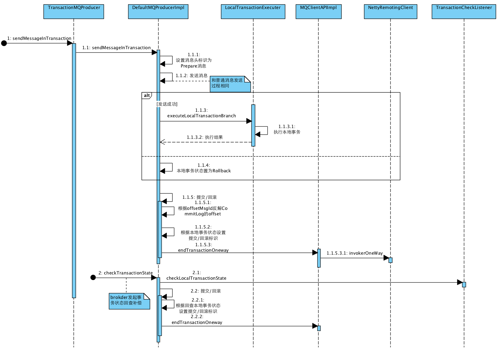

# RocketMQ

> 本文档主要是rocketmq实际代码使用,常见词语介绍等查看其他文档

## 一 下载

> http://rocketmq.apache.org/release_notes/release-notes-4.3.2/  二进制文件下载地址,下载后可以直接解压运行
>
> https://www.apache.org/dyn/closer.cgi?path=rocketmq/4.3.2/rocketmq-all-4.3.2-source-release.zip  源码方式下载地址, 下载后需要自己打包

## 二 启动

### 2.1 启动nameserver

> 进入rocketmq的bin目录
>
> ```shell
> nohup sh mqnamesrv &
> ```

### 2.2 启动broker server

> 进入bin目录
>
> ```shell
> nohup sh mqbroker -n localhost:9876  autoCreateTopicEnable=true &
> 集群方式参考集群配置文件RocketMQ集群
> ```

### 2.3 启动失败

> 默认情况下,我们的服务器都是单独的独立服务器,不会出现这种情况,但是我们在测试过程中使用的是虚拟机, 配置不够,会导致无法启动
>
> 修改runbroker.sh 和 runserver.sh
>
> 分别找到下图中的指示位置
>
> 修改内存大小即可,大小请自己按照自己虚拟机的配置适当调整,比如我修改为了以下值


## 三 图形化界面

> 此处非必须,实际开发中使用较少

```
下载rocketmq-console源码：https://github.com/apache/rocketmq-externals

进入子目录rocketmq-console下

执行mvn命令打包

mvn clean package -DskipTests

进入target目录

rocketmq-console-ng-1.0.0.jar即为springBoot项目

在该目录下CMD执行命令：

java -jar rocketmq-console-ng-1.0.0.jar --server.port=12581 --rocketmq.config.namesrvAddr=10.89.0.65:9876  
其中 
--server.port为运行的这个web应用的端口，如果不设置的话默认为8080；--rocketmq.config.namesrvAddr为RocketMQ命名服务地址，如果不设置的话默认为“”
OK了，访问下http://localhost:12581试试吧。

或者打包成 war 包扔到 tomcat 中运行
```

## 四 入门案例

> 此案例中使用的是一个消费者,所以消费者代码只有一个

### 4.1 pom.xml

```xml
    <dependencies>

        <!-- https://mvnrepository.com/artifact/org.apache.rocketmq/rocketmq-client -->
        <dependency>
            <groupId>org.apache.rocketmq</groupId>
            <artifactId>rocketmq-client</artifactId>
            <version>4.3.2</version>
        </dependency>

    </dependencies>
```

### 4.2 同步消息模式

原理：同步发送是指消息发送方发出数据后，会在收到接收方发回响应之后才发下一个数据包的通讯方式。

应用场景：此种方式应用场景非常广泛，例如重要通知邮件、报名短信通知、营销短信系统等。


#### 4.2.1 生产者

```java
/**
 * Created by jackiechan on 18-8-19/下午8:37.
 * 原理：同步发送是指消息发送方发出数据后，会在收到接收方发回响应之后才发下一个数据包的通讯方式。
 *
 * 应用场景：此种方式应用场景非常广泛，例如重要通知邮件、报名短信通知、营销短信系统等
 */
public class SyncProducer01 {
    public static void main(String[] args) throws Exception {
        //Instantiate with a producer group name.
        DefaultMQProducer producer = new
                DefaultMQProducer("group1");//groupname 同一个group代表是集群
        //Launch the instance.
        producer.setNamesrvAddr("192.168.3.8:9876");//设置nameserver地址
        //设置实例名字
        producer.setInstanceName("producer");//默认不需要设置,会以ip@pid作为名字, ip是机器ip,pid是jvmpid
        producer.start();
        for (int i = 0; i < 100; i++) {
            //Create a message instance, specifying topic, tag and message body.
            //topic和tags在消费者那边获取到消息后都可以获取, 可以通过tag区分消息
            Message msg = new Message("TopicTest" /* Topic 消息所属的topic */,
                    "TagA" /* Tag */,
                    ("Hello RocketMQ " +
                            i).getBytes(RemotingHelper.DEFAULT_CHARSET) /* Message body */
            );
            //Call send message to deliver message to one of brokers.
            SendResult sendResult = producer.send(msg);
            System.out.printf("%s%n", sendResult);
        }
        //Shut down once the producer instance is not longer in use.
        producer.shutdown();
    }
}
```

### 4.3 异步消息模式

原理：异步发送是指发送方发出数据后，不等接收方发回响应，接着发送下个数据包的通讯方式。MQ 的异步发送，需要用户实现异步发送回调接口（SendCallback），在执行消息的异步发送时，应用不需要等待服务器响应即可直接返回，通过回调接口接收务器响应，并对服务器的响应结果进行处理。

应用场景：异步发送一般用于链路耗时较长，对 RT 响应时间较为敏感的业务场景，例如用户视频上传后通知启动转码服务，转码完成后通知推送转码结果等。


#### 4.3.1 生产者

```java

/**
 * Created by jackiechan on 18-8-19/下午10:05
 *
 * @author jackiechan
 * 原理：异步发送是指发送方发出数据后，不等接收方发回响应，接着发送下个数据包的通讯方式。MQ 的异步发送，需要用户实现异步发送回调接口（SendCallback），在执行消息的异步发送时，应用不需要等待服务器响应即可直接返回，通过回调接口接收务器响应，并对服务器的响应结果进行处理。
 *
 * 应用场景：异步发送一般用于链路耗时较长，对 RT 响应时间较为敏感的业务场景，例如用户视频上传后通知启动转码服务，转码完成后通知推送转码结果等。
 */
public class AsyncProducer02 {
    public static void main(String[] args) throws Exception {
        //Instantiate with a producer group name.
        DefaultMQProducer producer = new DefaultMQProducer("ExampleProducerGroup");
        //Launch the instance.
        //Launch the instance.
        producer.setNamesrvAddr("192.168.3.8:9876");//设置nameserver地址
        producer.start();
        producer.setRetryTimesWhenSendAsyncFailed(0);
        for (int i = 0; i < 100; i++) {
            final int index = i;
            //Create a message instance, specifying topic, tag and message body.
            //消息的keys可以作为标记或者传递其他消息内容,可以在消费者获取到消息后获取keys进行区分
            Message msg = new Message("TopicTest",
                    "TagA",
                    "OrderID188",
                    "Hello world".getBytes(RemotingHelper.DEFAULT_CHARSET));
            //发送异步消息, 通过设置回调来接受服务器给我们返回的消息
            producer.send(msg, new SendCallback() {
                //当发送成功的时候执行的方法
                @Override
                public void onSuccess(SendResult sendResult) {
                    System.out.printf("%-10d OK %s %n", index,
                            sendResult.getMsgId());
                }
                //当发送失败的时候执行
                @Override
                public void onException(Throwable e) {
                    System.out.printf("%-10d Exception %s %n", index, e);
                    e.printStackTrace();
                }
            });
        }
        //Shut down once the producer instance is not longer in use.
        //当发送异步消息的时候,producer 不要shutdown,因为回调是异步的,可能在收到回调的时候producer关闭了会出错
      //  producer.shutdown();
    }
}

```

### 4.4 单向模式

原理：单向（Oneway）发送特点为只负责发送消息，不等待服务器回应且没有回调函数触发，即只发送请求不等待应答。此方式发送消息的过程耗时非常短，一般在微秒级别。

应用场景：适用于某些耗时非常短，但对可靠性要求并不高的场景，例如日志收集。


#### 4.4.1 生产者

```java

/**
 * Created by jackiechan on 18-8-19/下午10:25
 *
 * @author jackiechan
 * 原理：单向（Oneway）发送特点为只负责发送消息，不等待服务器回应且没有回调函数触发，即只发送请求不等待应答。此方式发送消息的过程耗时非常短，一般在微秒级别。
 *
 * 应用场景：适用于某些耗时非常短，但对可靠性要求并不高的场景，例如日志收集。
 */
public class OnewayProducer03 {
    public static void main(String[] args) throws Exception{
        //Instantiate with a producer group name.
        DefaultMQProducer producer = new DefaultMQProducer("ExampleProducerGroup");
        //Launch the instance.
        producer.setNamesrvAddr("192.168.3.8:9876");//设置nameserver地址
        producer.start();
        for (int i = 0; i < 100; i++) {
            //Create a message instance, specifying topic, tag and message body.
            Message msg = new Message("TopicTest" /* Topic */,
                    "TagA" /* Tag */,
                    ("Hello RocketMQ " +
                            i).getBytes(RemotingHelper.DEFAULT_CHARSET) /* Message body */
            );
            //Call send message to deliver message to one of brokers.
            producer.sendOneway(msg);

        }
        //Shut down once the producer instance is not longer in use.
        producer.shutdown();
    }
}
```

### 4.5消费者

> 此消费者可以接收上面三种不同的消息

```java

/**
 * Created by jackiechan on 18-8-19/下午9:50
 *
 * @authoe jackiechan
 */
public class MqConsumer {

    public static void main(String[] args) {
        //同一个group代表是集群
        DefaultMQPushConsumer consumer = new DefaultMQPushConsumer("PushConsumer_yll");
        consumer.setNamesrvAddr("192.168.3.8:9876");
        try {
            consumer.subscribe("TopicTest", "TagA||TagB");//可订阅多个tag，但是一个消息只能有一个tag
            consumer.setConsumeFromWhere(ConsumeFromWhere.CONSUME_FROM_FIRST_OFFSET);
            consumer.registerMessageListener(new MessageListenerConcurrently() {
                @Override
                public ConsumeConcurrentlyStatus consumeMessage(List<MessageExt> list, ConsumeConcurrentlyContext consumeConcurrentlyContext) {
                    Message msg = list.get(0);
                    //输出消息内容
                    System.out.println("收到消息了:"+new String(msg.getBody()));
                    //此处可以根据消息的tag或者keys来区分消息
                    if (msg.getTags() != null&&msg.getTags().equals("TagA")) {
                        //执行TagA的逻辑
                        System.out.println("收到的是taga的消息");
                    }
                    return ConsumeConcurrentlyStatus.CONSUME_SUCCESS;
                }
            });
            consumer.start();
        } catch (MQClientException e) {
            System.out.println("出错了");
        }
    }
}


```

## 五 顺序消费

**消息顺序**

消息顺序是只可以按照消息发送的顺序进行消费。一个订单产生3条消息，订单创建、付款、订单完成。消费时只有按照顺序消费才有意义，不可能先消费付款消息再消费订单创建消息，这样就乱了。另外，多笔订单又可以并行消费。如何保证呢？

一个订单产生的消息只能发送给同一个MQ服务器中的同一个分区，并且按顺序发送，这样才能在理论上保证消费者消费时是按照顺序消费的，因为一个分区就是一个逻辑队列。生产者虽然按顺序发送，但是第一条消息到达MQ的耗时比第二条多，那么第二条则会被先消费，这样就又导致消费时不是顺序的。那么如何解决呢？可以采取只有第一条被消费者消费成功后再发送第二条。看下图：


但是如果第一条被发送到消费者后，消费者没有响应（消费者发送响应但是因为网络问题丢失或者消费者就没有收到消息），那么在这种情况下你是继续发送第二条还是重发第一条呢？如果是严格消息顺序，那肯定是重发第一条，但是如果是消费者消费后的响应丢失了，那么重发第一条就会造成重复消费。

从另外一方面看，如果不考虑网络异常，那么要实现严格消息，就必须采取一种一对一关系，生产者A的消息对应到MQ服务器1的X队列，消费者A消费X队列。这样串行结构就会造成系统吞吐量太低；更多异常需要处理比如消费端出现问题，那么整个消息队列就会出现阻塞。RocketMQ通过轮询所有队列来确定消息发送到哪一个队列（负载均衡），比如相同订单号的消息会被先后发送到统一队列中。所以RocketMQ

**消息重复**

造成消费重复的根本原因是网络不可达，只要有网络，这种网络的不稳定因素就存在你无法规避。所以解决这个问题的最好办法就是绕过它。这就变成了，消费端收到两个一样的消息后如何处理，而不是从发送端解决不发送2个一样的消息。对于消费端的要求就是：

- 消费端处理业务消息要保持幂等性，也就是同一个东西执行多次会得到相同结果
- 保证每条消息都有唯一编号切保证消息处理成功与去重表的日志同时出现

第一条好理解，第二条就是利用一张日志表来记录已经处理成功的消息ID，如果新到的消息ID已经存在表中那么就不再处理这个消息。第一条是在消费端实现的，不属于消息系统的功能；第二条可以是消息系统实现也可以是业务端实现，处于对消息系统的吞吐量和高可用考虑最好还是由消费端去处理。**所以这也就是RocketMQ不解决消息重复的原因**。

### 5.1 生产者

```java

/**
 * Created by jackiechan on 18-8-20/上午12:08
 *
 * @author jackiechan
 */
public class OrderedProducer {
    public static void main(String[] args) throws Exception {
        //Instantiate with a producer group name.
        MQProducer producer = new DefaultMQProducer("example_group_name");
        ((DefaultMQProducer) producer).setNamesrvAddr(ServerUtil.SERVERADD);//设置服务器地址,请替换为自己的服务器地址
        //Launch the instance.
        producer.start();
        String[] tags = new String[] {"TagA", "TagB", "TagC", "TagD", "TagE"};
        for (int i = 0; i < 100; i++) {
            int orderId = i % 10;
            int a=i;
            //Create a message instance, specifying topic, tag and message body.
            Message msg = new Message("TopicTestjjj", tags[i % tags.length], "KEY" + i,
                    ("Hello RocketMQ==> " + i).getBytes(RemotingHelper.DEFAULT_CHARSET));
            SendResult sendResult = producer.send(msg, new MessageQueueSelector() {
                @Override
                public MessageQueue select(List<MessageQueue> mqs, Message msg, Object arg) {

                    // arg的值其实就是orderId
                    Integer id = (Integer) arg;

                    // mqs是队列集合，也就是topic所对应的所有队列
                    int index = id % mqs.size();

                    // 这里根据前面的id对队列集合大小求余来返回所对应的队列
                    System.out.println(index+"====>"+a);
                    return mqs.get(index);

                }
            }, orderId);

           // System.out.printf("%s%n", sendResult);
        }
        //server shutdown
        producer.shutdown();
    }
}

```

### 5.2 消费者

**消费者有多个,代码一致**

```java

/**
 * Created by jackiechan on 18-8-20/上午12:08
 *
 * @author jackiechan
 * 顺序消费的场景,一个业务需要从头到尾按照固定顺序执行, 比如订单的顺序是 创建订单-支付-发货,必须按照这个顺序执行, 就可以通过顺序消费来解决这个问题
 */
public class OrderedConsumer {
    public static void main(String[] args) throws Exception {
        DefaultMQPushConsumer consumer = new DefaultMQPushConsumer("example_group_name");
        consumer.setNamesrvAddr(ServerUtil.SERVERADD);//设置服务器地址,实际开发替换为自己的地址
        /**
         * 设置Consumer第一次启动是从队列头部开始消费还是队列尾部开始消费
         * 如果非第一次启动，那么按照上次消费的位置继续消费
         * 这里设置的是一个consumer的消费策略
         *  CONSUME_FROM_LAST_OFFSET 默认策略，从该队列最尾开始消费，即跳过历史消息
         *  CONSUME_FROM_FIRST_OFFSET 从队列最开始开始消费，即历史消息（还储存在broker的）全部消费一遍
         *  CONSUME_FROM_TIMESTAMP 从某个时间点开始消费，和setConsumeTimestamp()配合使用，默认是半个小时以前
         *
         */
        consumer.setConsumeFromWhere(ConsumeFromWhere.CONSUME_FROM_FIRST_OFFSET);

        consumer.subscribe("TopicTestjjj", "TagA || TagC || TagD");
        //设置一个Listener，主要进行消息的逻辑处理
        //注意这里使用的是MessageListenerOrderly这个接口
        consumer.registerMessageListener(new MessageListenerOrderly() {

            AtomicLong consumeTimes = new AtomicLong(0);
            @Override
            public ConsumeOrderlyStatus consumeMessage(List<MessageExt> msgs,
                                                       ConsumeOrderlyContext context) {
                //返回消费状态
                //SUCCESS 消费成功
                //SUSPEND_CURRENT_QUEUE_A_MOMENT 消费失败，暂停当前队列的消费

                context.setAutoCommit(false);//手动提交
                System.out.printf(Thread.currentThread().getName()+"消费者1===>" + msgs.get(0).getQueueId() +  "%n"+new String(msgs.get(0).getBody())+ "%n");
                this.consumeTimes.incrementAndGet();
                //以下内容模拟收消息失败,或者回滚等操作
//                if ((this.consumeTimes.get() % 2) == 0) {
//                    return ConsumeOrderlyStatus.SUCCESS;
//                } else if ((this.consumeTimes.get() % 3) == 0) {
//                    return ConsumeOrderlyStatus.ROLLBACK;
//                } else if ((this.consumeTimes.get() % 4) == 0) {
//                    return ConsumeOrderlyStatus.COMMIT;
//                } else if ((this.consumeTimes.get() % 5) == 0) {
//                    context.setSuspendCurrentQueueTimeMillis(3000);
//                    return ConsumeOrderlyStatus.SUSPEND_CURRENT_QUEUE_A_MOMENT;
//                }
                return ConsumeOrderlyStatus.SUCCESS;

            }
        });

        consumer.start();

        System.out.printf("Consumer Started.%n");
    }
}

```

**经过测试发现,不同队列的消息收取是无序的,但是同一队列中消息的收取顺序是按照发送顺序收取的**

## 六 广播模式

### 6.1 生产者

```java
/**
 * Created by jackiechan on 2018/8/20/上午10:22
 */
public class BroadcastProducer {
    public static void main(String[] args) throws Exception {
        DefaultMQProducer producer = new DefaultMQProducer("ProducerGroupName");
        producer.setNamesrvAddr(ServerUtil.SERVERADD);//设置服务器地址
        producer.start();
        for (int i = 0; i < 100; i++){
            //发送消息
            Message msg = new Message("TopicTest",
                    "TagA",
                    "OrderID188",
                    ("Hello world==>"+i).getBytes(RemotingHelper.DEFAULT_CHARSET));
            SendResult sendResult = producer.send(msg);
            System.out.printf("%s%n", sendResult);
        }
        producer.shutdown();
    }
}

```

### 6.2 消费者

**消费者有多个,代码一致**

```java

/**
 * Created by jackiechan on 2018/8/20/上午10:23
 * 广播模式的应用场景, 一个业务执行完成后需要多个不同的后续业务都执行,那么他们都需要知道前置业务完成,所以大家监听相同消息,同时获取消息
 * 比如 电商中商品更新完成后, 可能会需要同时更新 redis 缓存与 solr 搜索引擎
 */
public class BroadcastConsumer1 {
    public static void main(String[] args) throws Exception {
        DefaultMQPushConsumer consumer = new DefaultMQPushConsumer("example_group_name");
        consumer.setConsumeMessageBatchMaxSize(10);//每次拉取十条
        consumer.setConsumeFromWhere(ConsumeFromWhere.CONSUME_FROM_FIRST_OFFSET);
        consumer.setNamesrvAddr(ServerUtil.SERVERADD);
        //set to broadcast mode,设置消费模式为广播
        consumer.setMessageModel(MessageModel.BROADCASTING);

        consumer.subscribe("TopicTest", "TagA || TagC || TagD");

        consumer.registerMessageListener(new MessageListenerConcurrently() {

            @Override
            public ConsumeConcurrentlyStatus consumeMessage(List<MessageExt> msgs,
                                                            ConsumeConcurrentlyContext context) {
                System.out.printf(Thread.currentThread().getName() + " 消费者1收到消息 : " + new String(msgs.get(0).getBody()) + "%n");
                return ConsumeConcurrentlyStatus.CONSUME_SUCCESS;
            }
        });

        consumer.start();
        System.out.printf("Broadcast Consumer Started.%n");
    }
}

```

**经过测试,多个消费者可以同时收到消息**

## 七 延迟消费

> RocketMQ 支持定时消息，但是不支持任意时间精度，仅支持特定的 level，例如定时 5s， 10s， 1m 等。其中，level=0 级表示不延时，level=1 表示 1 级延时，level=2 表示 2 级延时，以此类推。

###7.1如何配置

在服务器端（rocketmq-broker端）的属性配置文件中加入以下行：

```
messageDelayLevel=1s 5s 10s 30s 1m 2m 3m 4m 5m 6m 7m 8m 9m 10m 20m 30m 1h 2h
```

描述了各级别与延时时间的对应映射关系。

> 1. 这个配置项配置了从1级开始，各级延时的时间，可以修改这个指定级别的延时时间；
> 2. 时间单位支持：s、m、h、d，分别表示秒、分、时、天；
> 3. 默认值就是上面声明的，可手工调整；
> 4. 默认值已够用，不建议修改这个值。

###7.2 如何发送延时消息

发送延时消息只需要在客户端（rocketmq-client端）待发送的消息（ com.alibaba.rocketmq.common.message.Message ）中设置延时级别即可。

###7.3延迟消息的整个流转过程 

    1、消息先写入commitlog文件
    
    2、消费线程将数据保存以SCHEDULE_TOPIC_XXX的topic下面并且以延迟粒度作为queueId区分
    
    3、定时任务扫描SCHEDULE_TOPIC_XXX下的每个Queue启一个线程进行消费，到时间后写到consumeQueue当中。
    
    4、参考下面目录，SCHEDULE_TOPIC_XXX目录下面以延迟粒度作为queue的区分
    
    5、每个粒度的都会启动一个定时任务，消费任务后隔0.1s继续扫描
    
    6、判断消息是否到期了通过当前时间点和延迟时间对比
    
    7、真正的消息保存在commitLog当中，SCHEDULE_TOPIC_XXX下面的消息相当于对commitLog立面的存的消息的偏移量等做了一层包装，consumeQueue里面的消息其实是从SCHEDULE目录下获取得。


延迟消息队列目录

###7.4SCHEDULE_TOPIC_XXX消息生成


commitLog消息同步到SCHEDULE_TOPIC_XXX当中

说明：参见DefaultMessageStore类

###7.5延迟消息消费


解析延迟粒度

说明：参见DefaultMessageStore类。

    1、根据不同的粒度启动扫描任务


启动延迟消息的定时任务


消费延迟队列到consumeQueue队列

说明：参见ScheduleMessageService类

    1、根据时间戳进行对比


定时启动下一次扫描粒度

 ### 7.6 代码

####7.6.1 生产者

```java

/**
 * Created by jackiechan on 2018/8/20/下午5:07
 */
public class ScheduledMessageProducer {
    public static void main(String[] args) throws Exception {
        // Instantiate a producer to send scheduled messages
        DefaultMQProducer producer = new DefaultMQProducer("ExampleProducerGroup");
        producer.setNamesrvAddr(ServerUtil.SERVERADD);//设置服务端地址
        // Launch producer
        producer.start();
        int totalMessagesToSend = 100;
        for (int i = 0; i < totalMessagesToSend; i++) {
            Message message = new Message("TestTopic", ("Hello scheduled message " + i).getBytes());
            // This message will be delivered to consumer 10 seconds later.
            //messageDelayLevel = "1s 5s 10s 30s 1m 2m 3m 4m 5m 6m 7m 8m 9m 10m 20m 30m 1h 2h";  不能指定具体的延迟时间,只能从这些里面选择,下标从1开始
            message.setDelayTimeLevel(3);//延迟10秒
            // Send the message
            producer.send(message);
        }

        // Shutdown producer after use.
        producer.shutdown();
    }
}
```

#### 7.6.2 消费者

```java

/**
 * Created by jackiechan on 2018/8/20/下午5:08
 */
public class ScheduledMessageConsumer {
    public static void main(String[] args) throws Exception {
        // Instantiate message consumer
        DefaultMQPushConsumer consumer = new DefaultMQPushConsumer("ExampleConsumer");
        consumer.setNamesrvAddr(ServerUtil.SERVERADD);//替换为自己的 nameserver 地址
        // Subscribe topics
        consumer.subscribe("TestTopic", "*");
        // Register message listener
        consumer.registerMessageListener(new MessageListenerConcurrently() {
            @Override
            public ConsumeConcurrentlyStatus consumeMessage(List<MessageExt> messages, ConsumeConcurrentlyContext context) {
                for (MessageExt message : messages) {
                    // Print approximate delay time period
                    System.out.println("Receive message[msgId=" + message.getMsgId() + "] "
                            + (System.currentTimeMillis() - message.getStoreTimestamp()) + "ms later");
                }
                return ConsumeConcurrentlyStatus.CONSUME_SUCCESS;
            }
        });
        // Launch consumer
        consumer.start();
    }
}

```


## 八 批量消费

 ```
RocketMQ 支持一次性拉取多条消息进行消费,相当于 rabbitmq 的 qos, 一次性获取消息的数量,比如有一百条消息,设置了一次性获取10条,那么每次都可以获取十条数据
 ```

### 8.1 生产者

```java
public class SyncProducer01 {
    public static void main(String[] args) throws Exception {
        //Instantiate with a producer group name.
        DefaultMQProducer producer = new
                DefaultMQProducer("group1");//groupname 同一个group代表是集群
        //Launch the instance.
        producer.setNamesrvAddr("192.168.3.8:9876");//设置nameserver地址
        //设置实例名字
        producer.setInstanceName("producer");//默认不需要设置,会以ip@pid作为名字, ip是机器ip,pid是jvmpid
        producer.start();
        for (int i = 0; i < 100; i++) {
            //Create a message instance, specifying topic, tag and message body.
            //topic和tags在消费者那边获取到消息后都可以获取, 可以通过tag区分消息
            Message msg = new Message("TopicTest" /* Topic 消息所属的topic */,
                    "TagA" /* Tag */,
                    ("Hello RocketMQ " +
                            i).getBytes(RemotingHelper.DEFAULT_CHARSET) /* Message body */
            );
            //Call send message to deliver message to one of brokers.
            SendResult sendResult = producer.send(msg);
            System.out.printf("%s%n", sendResult);
        }
        //Shut down once the producer instance is not longer in use.
        producer.shutdown();
    }
}
```

### 8.2 消费者

```java
public class Consumer {  
  
    public static void main(String[] args) throws InterruptedException, MQClientException {  
        DefaultMQPushConsumer consumer = new DefaultMQPushConsumer("group1");  
        consumer.setNamesrvAddr("192.168.3.8:9876");  
        consumer.setConsumeMessageBatchMaxSize(10);  
        /** 
         * 设置Consumer第一次启动是从队列头部开始消费还是队列尾部开始消费<br> 
         * 如果非第一次启动，那么按照上次消费的位置继续消费 
         */  
        consumer.setConsumeFromWhere(ConsumeFromWhere.CONSUME_FROM_FIRST_OFFSET);  
  
        consumer.subscribe("TopicTest", "*");  
  
        consumer.registerMessageListener(new MessageListenerConcurrently() {  
  
            public ConsumeConcurrentlyStatus consumeMessage(List<MessageExt> msgs, ConsumeConcurrentlyContext context) {  
                  
                try {  
                    System.out.println("msgs的长度" + msgs.size());  
                    System.out.println(Thread.currentThread().getName() + " Receive New Messages: " + msgs);  
                } catch (Exception e) {  
                    e.printStackTrace();  
                    return ConsumeConcurrentlyStatus.RECONSUME_LATER;  
                }  
                  
                  
                  
                return ConsumeConcurrentlyStatus.CONSUME_SUCCESS;  
            }  
        });  
  
        consumer.start();  
  
        System.out.println("Consumer Started.");  
    }  
}  
```


## 九 消息拉取机制

在RocketMQ中一般有两种获取消息的方式，一个是拉(pull，消费者主动去broker拉取)，一个是推(push，主动推送给消费者)，如下图

push-优点：及时性、服务端统一处理实现方便
push-缺点：容易造成堆积、负载性能不可控

pull-优点：获得消息状态方便、负载均衡性能可控


### 9.1 生产者


```java
package com.qianfeng.rocketmq.pull;
import org.apache.rocketmq.client.exception.MQClientException;
import org.apache.rocketmq.client.producer.DefaultMQProducer;
import org.apache.rocketmq.client.producer.SendResult;
import org.apache.rocketmq.common.message.Message;

import java.text.SimpleDateFormat;
import java.util.Date;

/**
 * Created by jackiechan on 2018/11/14/7:49 PM
 */
public class Producer {
    public static void main(String[] args) throws MQClientException, InterruptedException {
        //声明并初始化一个producer  
        //需要一个producer group名字作为构造方法的参数，这里为producer1  
        DefaultMQProducer producer = new DefaultMQProducer("producer1");

        //设置NameServer地址,此处应改为实际NameServer地址，多个地址之间用；分隔  
        //NameServer的地址必须有，但是也可以通过环境变量的方式设置，不一定非得写死在代码里  
        producer.setNamesrvAddr("192.168.159.128:9876;192.168.159.129:9876");
        //     producer.setVipChannelEnabled(false);//3.2.6的版本没有该设置，在更新或者最新的版本中务必将其设置为false，否则会有问题  
        producer.setRetryTimesWhenSendFailed(3);

        //调用start()方法启动一个producer实例  
        producer.start();

        //发送10条消息到Topic为TopicTest，tag为TagA，消息内容为“Hello RocketMQ”拼接上i的值  
        for (int i = 0; i < 10; i++) {
            try {
                Message msg = new Message("TopicTest",// topic  
                        "TagA",// tag  
                        "i"+i,("Hello RocketMQ " + i).getBytes("utf-8")// body  
                );

                //调用producer的send()方法发送消息  
                //这里调用的是同步的方式，所以会有返回结果  
                SendResult sendResult = producer.send(msg);
                System.out.println(new SimpleDateFormat("yyyy-MM-dd HH:mm:ss").format(
                        new Date())+","+i);
                //          System.out.println(sendResult.getSendStatus()); //发送结果状态  
                //打印返回结果，可以看到消息发送的状态以及一些相关信息  
                //           System.out.println(sendResult);  
            } catch (Exception e) {
                e.printStackTrace();
                Thread.sleep(1000);
            }
        }

        //发送完消息之后，调用shutdown()方法关闭producer  
        producer.shutdown();
    }  

}

```


### 9.2 消费者


```java
package com.qianfeng.rocketmq.pull;
import org.apache.rocketmq.client.consumer.DefaultMQPullConsumer;
import org.apache.rocketmq.client.exception.MQClientException;
import org.apache.rocketmq.client.impl.consumer.PullResultExt;
import org.apache.rocketmq.common.message.MessageExt;
import org.apache.rocketmq.common.message.MessageQueue;

import java.util.HashMap;
import java.util.List;
import java.util.Map;
import java.util.Set;

/**
 * Created by jackiechan on 2018/11/14/7:39 PM
 */
public class PullConsumer {
    private static final Map<MessageQueue, Long> offsetTable = new HashMap<MessageQueue, Long>();
    public static void main(String[] args) throws Exception {
        DefaultMQPullConsumer consumer = new DefaultMQPullConsumer("pullConsumer");
        consumer.setNamesrvAddr("192.168.159.128:9876;192.168.159.129:9876");
        consumer.start();
        try {
            Set<MessageQueue> mqs = consumer.fetchSubscribeMessageQueues("TopicTest");
            for(MessageQueue mq:mqs) {
                System.out.println("Consume from the queue: " + mq);
                //	long offset = consumer.fetchConsumeOffset(mq, true);
                //	PullResultExt pullResult =(PullResultExt)consumer.pull(mq, null, getMessageQueueOffset(mq), 32);
                //消息未到达默认是阻塞10秒，private long consumerPullTimeoutMillis = 1000 * 10;
                PullResultExt pullResult =(PullResultExt)consumer.pullBlockIfNotFound(mq, null, getMessageQueueOffset(mq), 32);
                putMessageQueueOffset(mq, pullResult.getNextBeginOffset());
                switch (pullResult.getPullStatus()) {
                    case FOUND:
                        List<MessageExt> messageExtList = pullResult.getMsgFoundList();
                        for (MessageExt m : messageExtList) {
                            System.out.println(new String(m.getBody()));
                        }
                        break;
                    case NO_MATCHED_MSG:
                        break;
                    case NO_NEW_MSG:
                        break ;
                    case OFFSET_ILLEGAL:
                        break;
                    default:
                        break;
                }
            }
        } catch (MQClientException e) {
            e.printStackTrace();
        }


    }

    private static void putMessageQueueOffset(MessageQueue mq, long offset) {
        offsetTable.put(mq, offset);
    }

    private static long getMessageQueueOffset(MessageQueue mq) {
        Long offset = offsetTable.get(mq);
        if (offset != null)
            return offset;
        return 0;
    }

}

```


### 9.3 PullScheduleService 模式


```java
package com.qianfeng.rocketmq.pull;

//
//                            _ooOoo_  
//                           o8888888o  
//                           88" . "88  
//                           (| -_- |)  
//                            O\ = /O  
//                        ____/`---'\____  
//                      .   ' \\| |// `.  
//                       / \\||| : |||// \  
//                     / _||||| -:- |||||- \  
//                       | | \\\ - /// | |  
//                     | \_| ''\---/'' | |  
//                      \ .-\__ `-` ___/-. /  
//                   ___`. .' /--.--\ `. . __  
//                ."" '< `.___\_<|>_/___.' >'"".  
//               | | : `- \`.;`\ _ /`;.`/ - ` : | |  
//                 \ \ `-. \_ __\ /__ _/ .-` / /  
//         ======`-.____`-.___\_____/___.-`____.-'======  
//                            `=---='  
//  
//         .............................................  
//                  佛祖镇楼                  BUG辟易  
//          佛曰:  
//                  写字楼里写字间，写字间里程序员；  
//                  程序人员写程序，又拿程序换酒钱。  
//                  酒醒只在网上坐，酒醉还来网下眠；  
//                  酒醉酒醒日复日，网上网下年复年。  
//                  但愿老死电脑间，不愿鞠躬老板前；  
//                  奔驰宝马贵者趣，公交自行程序员。  
//                  别人笑我忒疯癫，我笑自己命太贱；  
//  


import org.apache.rocketmq.client.consumer.*;
import org.apache.rocketmq.client.exception.MQClientException;
import org.apache.rocketmq.common.message.MessageQueue;
import org.apache.rocketmq.common.protocol.heartbeat.MessageModel;

/**
 * Created by jackiechan on 2018/11/14/7:52 PM
 */
public class PullScheduleService {
    public static void main(String[] args) throws MQClientException {
        final MQPullConsumerScheduleService scheduleService = new MQPullConsumerScheduleService("GroupName1");
        scheduleService.getDefaultMQPullConsumer().setNamesrvAddr("192.168.0.104:9876");
        scheduleService.setMessageModel(MessageModel.CLUSTERING);
        scheduleService.registerPullTaskCallback("TopicTest", new PullTaskCallback() {

            @Override
            public void doPullTask(MessageQueue mq, PullTaskContext context) {
                MQPullConsumer consumer = context.getPullConsumer();
                try {
                    // 获取从哪里拉取
                    long offset = consumer.fetchConsumeOffset(mq, false);
                    if (offset < 0)
                        offset = 0;

                    PullResult pullResult = consumer.pull(mq, "*", offset, 32);
                    System.out.println(offset + "\t" + mq + "\t" + pullResult);
                    switch (pullResult.getPullStatus()) {
                        case FOUND:
                            break;
                        case NO_MATCHED_MSG:
                            break;
                        case NO_NEW_MSG:
                        case OFFSET_ILLEGAL:
                            break;
                        default:
                            break;
                    }

                    // 存储Offset，客户端每隔5s会定时刷新到Broker
                    consumer.updateConsumeOffset(mq, pullResult.getNextBeginOffset());

                    // 设置再过100ms后重新拉取
                    context.setPullNextDelayTimeMillis(100);
                }
                catch (Exception e) {
                    e.printStackTrace();
                }
            }
        });

        scheduleService.start();
    }
}

```


## 十 Filter 高级过滤

> 新版已经剔除该功能,4.3.0中存在 bug, 内容没删除干净,4.3.2中已经删除完成

###10.1 过滤介绍

RocketMQ 的消息过滤方式有别于其他消息中间件，是在订阅时，再做过滤，先来看下Consume Queue的存储结构。


(1). 在Broker端进行Message Tag比对，先遍历 Consume Queue，如果存储的Message Tag 不订阅的 MessageTag不符合，则跳过，继续比对下一个，符合则传输给Consumer。
注意：Message Tag是字符串形式，Consume Queue中存储的是其对应的hashcode，比对时也是比对hashcode。

(2).Consumer收到过滤后的消息后，同样也要执行在Broker端的操作，但是比对的是真实的Message Tag字符串，而不是 Hashcode。

**为什么过滤要这样做？**
(1). Message Tag 存储 Hashcode，是为了在Consume Queue定长方式存储，节约空间。
(2). 过滤过程中不会访问 Commit Log 数据，可以保证堆积情况下也能高效过滤。

(3). 即使存在 Hash 冲突，也可以在 Consumer 端进行修正，保证万无一失。

**简单消息过滤**
通过订阅指定topic下tags来进行过滤

```java
/**
- 订阅指定topic下tags分别等于TagA戒TagC戒TagD
*/
consumer.subscribe("TopicTest", "TagA || TagC || TagD");

```

**高级过滤**


```
Rocket MQ 执行过滤是在 Broker 端，Broker 所在的机器会启动多个 FilterServer 过滤进程；Consumer 启动后，会向 FilterServer 上传一个过滤的Java类；Consumer 从 FilterServer拉消息，FilterServer将请求转发给Broker，FilterServer从Broker 收到消息后，按照 Consumer上传的Java过滤程序做过滤，过滤完成后返回给Consumer。这种过滤方法可以节省网络流量，但是增加了 Broker 的负担。
简单来说，是以下几点：
1.Broker 所在的机器会启动多个 FilterServer 过滤进程
2.Consumer 启动后，会向 FilterServer 上传一个过滤的 Java 类
3.Consumer 从 FilterServer拉消息，FilterServer将请求转収给Broker，FilterServer 从 Broker 收到消息后，按照Consumer上传的Java过滤程序做过滤，过滤完成后返回给 Consumer。
首先，我们需要启动我们的MQ服务，顺序为 namesrv、broker、filter。

```

**注意**

>我们需要在broker-*.properties文件里添加一句话，如下:
>filterServerNums=1 #指明过滤文件个数

### 10.2 生产者

> 注意：这边的msg.putUserProperty("SequenceId", String.valueOf(i))中的key和Filter文件中的要key要一致

```java
package com.qianfeng.rocketmq.filter;

//
//                            _ooOoo_  
//                           o8888888o  
//                           88" . "88  
//                           (| -_- |)  
//                            O\ = /O  
//                        ____/`---'\____  
//                      .   ' \\| |// `.  
//                       / \\||| : |||// \  
//                     / _||||| -:- |||||- \  
//                       | | \\\ - /// | |  
//                     | \_| ''\---/'' | |  
//                      \ .-\__ `-` ___/-. /  
//                   ___`. .' /--.--\ `. . __  
//                ."" '< `.___\_<|>_/___.' >'"".  
//               | | : `- \`.;`\ _ /`;.`/ - ` : | |  
//                 \ \ `-. \_ __\ /__ _/ .-` / /  
//         ======`-.____`-.___\_____/___.-`____.-'======  
//                            `=---='  
//  
//         .............................................  
//                  佛祖镇楼                  BUG辟易  
//          佛曰:  
//                  写字楼里写字间，写字间里程序员；  
//                  程序人员写程序，又拿程序换酒钱。  
//                  酒醒只在网上坐，酒醉还来网下眠；  
//                  酒醉酒醒日复日，网上网下年复年。  
//                  但愿老死电脑间，不愿鞠躬老板前；  
//                  奔驰宝马贵者趣，公交自行程序员。  
//                  别人笑我忒疯癫，我笑自己命太贱；  
//  


import org.apache.rocketmq.client.exception.MQBrokerException;
import org.apache.rocketmq.client.exception.MQClientException;
import org.apache.rocketmq.client.producer.DefaultMQProducer;
import org.apache.rocketmq.client.producer.SendResult;
import org.apache.rocketmq.common.message.Message;
import org.apache.rocketmq.remoting.exception.RemotingException;

import java.io.IOException;

/**
 * Created by jackiechan on 2018/11/14/3:55 PM
 */
public class Producer {
    public static void main(String[] args) throws IOException {
        try {
            DefaultMQProducer producer = new DefaultMQProducer("sequence_producer");

            producer.setNamesrvAddr("192.168.3.64:9876;192.168.3.71:9876;192.168.3.70:9876;192.168.3.67:9876");

            producer.start();
            // 订单列表
            for (int i = 0; i < 20; i++) {
                // 加个时间后缀

                Message msg = new Message("SequenceTopicTest",// topic  
                        "TagA",// tag  
                        ("Hello RocketMQ " + i).getBytes("utf-8")// body  
                );
                msg.putUserProperty("SequenceId", String.valueOf(i));//设置过了参数,SequenceId是 key, 要和 filter 中的保持一致
                //调用producer的send()方法发送消息  
                //这里调用的是同步的方式，所以会有返回结果  
                SendResult sendResult = producer.send(msg);
                System.out.println(i+""+sendResult.getSendStatus());
            }

            producer.shutdown();

        } catch (MQClientException e) {
            e.printStackTrace();
        } catch (RemotingException e) {
            e.printStackTrace();
        } catch (MQBrokerException e) {
            e.printStackTrace();
        } catch (InterruptedException e) {
            e.printStackTrace();
        }
    }

}

```

### 10.3 自定义Filter

> 务必注意：该java文件会上传到FilterSrv，所以内容上不得有任何中文，包括注释，否则MixAll.file2String方法返回null

```java
package com.qianfeng.rocketmq.filter;

//
//                            _ooOoo_  
//                           o8888888o  
//                           88" . "88  
//                           (| -_- |)  
//                            O\ = /O  
//                        ____/`---'\____  
//                      .   ' \\| |// `.  
//                       / \\||| : |||// \  
//                     / _||||| -:- |||||- \  
//                       | | \\\ - /// | |  
//                     | \_| ''\---/'' | |  
//                      \ .-\__ `-` ___/-. /  
//                   ___`. .' /--.--\ `. . __  
//                ."" '< `.___\_<|>_/___.' >'"".  
//               | | : `- \`.;`\ _ /`;.`/ - ` : | |  
//                 \ \ `-. \_ __\ /__ _/ .-` / /  
//         ======`-.____`-.___\_____/___.-`____.-'======  
//                            `=---='  
//  
//         .............................................  
//                  佛祖镇楼                  BUG辟易  
//          佛曰:  
//                  写字楼里写字间，写字间里程序员；  
//                  程序人员写程序，又拿程序换酒钱。  
//                  酒醒只在网上坐，酒醉还来网下眠；  
//                  酒醉酒醒日复日，网上网下年复年。  
//                  但愿老死电脑间，不愿鞠躬老板前；  
//                  奔驰宝马贵者趣，公交自行程序员。  
//                  别人笑我忒疯癫，我笑自己命太贱；  
//  


import org.apache.rocketmq.common.filter.FilterContext;
import org.apache.rocketmq.common.filter.MessageFilter;
import org.apache.rocketmq.common.message.MessageExt;

/**
 * Created by jackiechan on 2018/11/14/3:59 PM
 */
public class MyMessageFilter  implements MessageFilter {


    @Override
    public boolean match(MessageExt messageExt, FilterContext filterContext) {
        String property = messageExt.getUserProperty("SequenceId");//这里获取的就是生产者存放的属性
        if (property != null) {
            int id = Integer.parseInt(property);
            if((id % 2) == 0) {
                return true;
            }
        }
        return false;
    }
}

```

### 10.4 Consumer

>考虑到这边要读取Filter文件的绝对路径，而生产和开发环境的路径一般情况下是不一样的，所以可以将对应的Filter文件的路径配置到相应的配置文件中,实际开发中通过读取配置文件方式获取路径
```java
package com.qianfeng.rocketmq.filter;

//
//                            _ooOoo_  
//                           o8888888o  
//                           88" . "88  
//                           (| -_- |)  
//                            O\ = /O  
//                        ____/`---'\____  
//                      .   ' \\| |// `.  
//                       / \\||| : |||// \  
//                     / _||||| -:- |||||- \  
//                       | | \\\ - /// | |  
//                     | \_| ''\---/'' | |  
//                      \ .-\__ `-` ___/-. /  
//                   ___`. .' /--.--\ `. . __  
//                ."" '< `.___\_<|>_/___.' >'"".  
//               | | : `- \`.;`\ _ /`;.`/ - ` : | |  
//                 \ \ `-. \_ __\ /__ _/ .-` / /  
//         ======`-.____`-.___\_____/___.-`____.-'======  
//                            `=---='  
//  
//         .............................................  
//                  佛祖镇楼                  BUG辟易  
//          佛曰:  
//                  写字楼里写字间，写字间里程序员；  
//                  程序人员写程序，又拿程序换酒钱。  
//                  酒醒只在网上坐，酒醉还来网下眠；  
//                  酒醉酒醒日复日，网上网下年复年。  
//                  但愿老死电脑间，不愿鞠躬老板前；  
//                  奔驰宝马贵者趣，公交自行程序员。  
//                  别人笑我忒疯癫，我笑自己命太贱；  
//  


import org.apache.rocketmq.client.consumer.DefaultMQPushConsumer;
import org.apache.rocketmq.client.consumer.listener.ConsumeConcurrentlyContext;
import org.apache.rocketmq.client.consumer.listener.ConsumeConcurrentlyStatus;
import org.apache.rocketmq.client.consumer.listener.MessageListenerConcurrently;
import org.apache.rocketmq.client.exception.MQClientException;
import org.apache.rocketmq.common.MixAll;
import org.apache.rocketmq.common.consumer.ConsumeFromWhere;
import org.apache.rocketmq.common.message.MessageExt;

import java.io.IOException;
import java.util.List;

/**
 * Created by jackiechan on 2018/11/14/4:05 PM
 */
public class Consumer {
    public static void main(String[] args) throws MQClientException, IOException {
        DefaultMQPushConsumer consumer = new DefaultMQPushConsumer("please_rename_unique_group_name_3");
        consumer.setNamesrvAddr("192.168.140.128:9876;192.168.140.129:9876");
        /**
         * 设置Consumer第一次启动是从队列头部开始消费还是队列尾部开始消费<br>
         * 如果非第一次启动，那么按照上次消费的位置继续消费
         */
        consumer.setConsumeFromWhere(ConsumeFromWhere.CONSUME_FROM_FIRST_OFFSET);

        String filterCode = MixAll.file2String("/Users/jackiechan/Documents/Workspace/rocketmqonline/src/main/java/com/qianfeng/rocketmq/filter/MyMessageFilter.java");

        consumer.subscribe("SequenceTopicTest", "com.gwd.rocketmq.MyMessageFilter",filterCode);

        consumer.registerMessageListener(new MessageListenerConcurrently() {

            @Override
            public ConsumeConcurrentlyStatus consumeMessage(List<MessageExt> msgs, ConsumeConcurrentlyContext context) {
                System.out.print(Thread.currentThread().getName() + " Receive New Messages: " );
                for (MessageExt msg: msgs) {
                    System.out.println("content:" + new String(msg.getBody()));
                }

                return ConsumeConcurrentlyStatus.CONSUME_SUCCESS;
            }
        });
        consumer.start();
        System.out.println("Consumer Started.");
    }

}

```


##十一 分布式事务

> RocketMq 事物消息设计方案http://rocketmq.apache.org/rocketmq/the-design-of-transactional-message
>
> 注意,4.3.2以前版本的 rocketmq 存在 bug, 当发送的消息状态为 unknow 的时候,服务端在检查半消息状态的时候无法调用 producer 的 checkLocalTransaction的 bug, 导致检查失败,所以使用4.3.2版本

微服务倡导将复杂的系统拆分为若干个简单、职责单一、松耦合的服务，可以降低开发难度，便于敏捷开发。而对大多数中小型公司来说，实施微服务架构面临以下困难：

- 单体应用拆分为分布式系统后，应用间的通讯和故障处理机制变得复杂
- 微服务化后，一个简单的功能需要调用多个服务并操作多个数据库实现，数据一致性难以保障
- 大量的微服务，导致其测试、维护、部署变得困难

为了保障微服务架构下数据的一致性，通常需要引入分布式事务来解决，当前比较流行的分布式解决方案如下。

#### 11.1 基于二阶段提交的XA协议

- 第一阶段：协调者询问所有参与者是否可以执行提交操作，参与者执行准备工作，例如为资源上锁，预留资源，写undo/redo log。

- 第二阶段：若所有参与者回应“可提交”，则向所有参与者发送正式提交命令；若某个参与者回应“拒绝提交”，则向所有参与者发送回滚命令。


  

XA协议保障了事务的强一致性，然而由于其采用的阻塞协议带来的巨大性能开销，难以达到较高的系统吞吐量。

####11.2 TCC模式

TCC提供了一种全局事务解决方案，业务系统只需实现下面三个操作，即可完成分布式事务：

- TRY：完成参与者业务检查并预留业务资源

- CONFIRM：使用TRY阶段的预留业务资源，并执行业务

- CANCEL：释放TRY结算预留的业务资源


  

  TCC模式可以让业务更灵活地定义数据库操作的粒度，使得降低锁冲突、提高吞吐量成为可能，然而它对业务的侵入度较高，实现难度较大。

####12.3 事务消息

通过消息的异步事务，可以保证本地事务和消息发送同时执行成功或失败，从而保证了数据的最终一致性。

- 发送prepare消息，该消息对Consumer不可见

- 执行本地事务

- 若本地事务执行成功，则向MQ提交消息确认发送指令；若本地事务执行失败，则向MQ发送取消指令

- 若MQ长时间未收到确认发送或取消发送的指令，则向业务系统询问本地事务状态，并做补偿处理


  

####12.4 RocketMq事务消息


#####12.4.1 客户端事务消息发送




发送prepare消息复用了普通消息发送，只是给消息增加了TRAN_MSG=true的属性，该属性决定prepare消息对Consumer不可见

#####12.4.2 消息写入CommitLog


事务消息的CommitLog写入和普通消息一致，它利用文件的顺序写来提升吞吐量，并采用文件映射的方式降低系统开销。

#####12.4.3 消息写入ConsumeQueue


ConsumeQueue的写入是采用异步方式完成的，ReputMessageSerivce作为一个长驻线程负责查询索引的构造和ConsumeQueue的写入，对于Prepare/Rollback消息不会写ConsumeQueue，从而保证它们对Consumer不可见

#####12.4.4 Broker端事务提交/回滚


Broker收到提交/回滚指令后，首先从根据offset从CommitLog读出原有的prepare消息，构造新的消息（修改事务状态标识）并写入Broker。对于一条事务消息，RocketMq会存储两条消息，存在一定资源浪费。其实它是为了保证随后的消费者能尽可能从PageCache中读到该消息，而不是读取较早的prepare消息（可能导致缺页中断），以提升系统吞吐量。

此外，rocketmq 4.3.2 之前的版本尚未支持本地事务的状态回查，这样可能存在由于网络抖动，导致commit/rollback未提交到broker导致prepare消息长期悬挂的风险。

在RocketMq的设计文档中，为事务消息增加了一张事务状态表，它维护了消息的Offset、事务状态(P/C/R)信息。可以采用如下思路实现事务消息的回查机制：


- 在prepare消息写入commitLog后，可以通过CommitLogDispatcher写入一条事务状态记录(state=P)
- 在提交/回滚事务时，根据transactionId找到对应的事务状态记录，并修改对应的事务状态
- 通过长驻线程扫描事务状态表，对于超过一定时间的Prepare事务，发起对业务方的事务状态回查，根据回查结果修改事务状态，并向brokder发送相应的Commit/Rollback消息。


### 12.5 提供者

```java
package com.qianfeng.rocketmq.tran;

//
//                            _ooOoo_  
//                           o8888888o  
//                           88" . "88  
//                           (| -_- |)  
//                            O\ = /O  
//                        ____/`---'\____  
//                      .   ' \\| |// `.  
//                       / \\||| : |||// \  
//                     / _||||| -:- |||||- \  
//                       | | \\\ - /// | |  
//                     | \_| ''\---/'' | |  
//                      \ .-\__ `-` ___/-. /  
//                   ___`. .' /--.--\ `. . __  
//                ."" '< `.___\_<|>_/___.' >'"".  
//               | | : `- \`.;`\ _ /`;.`/ - ` : | |  
//                 \ \ `-. \_ __\ /__ _/ .-` / /  
//         ======`-.____`-.___\_____/___.-`____.-'======  
//                            `=---='  
//  
//         .............................................  
//                  佛祖镇楼                  BUG辟易  
//          佛曰:  
//                  写字楼里写字间，写字间里程序员；  
//                  程序人员写程序，又拿程序换酒钱。  
//                  酒醒只在网上坐，酒醉还来网下眠；  
//                  酒醉酒醒日复日，网上网下年复年。  
//                  但愿老死电脑间，不愿鞠躬老板前；  
//                  奔驰宝马贵者趣，公交自行程序员。  
//                  别人笑我忒疯癫，我笑自己命太贱；  
//  


import org.apache.rocketmq.client.exception.MQClientException;
import org.apache.rocketmq.client.producer.SendResult;
import org.apache.rocketmq.client.producer.TransactionListener;
import org.apache.rocketmq.client.producer.TransactionMQProducer;
import org.apache.rocketmq.common.message.Message;
import org.apache.rocketmq.remoting.common.RemotingHelper;

import java.io.UnsupportedEncodingException;
import java.util.concurrent.*;

/**
 * Created by jackiechan on 2018/11/15/11:16 PM
 */
public class TransactionProducer {
    public static void main(String[] args) throws MQClientException, InterruptedException {
        TransactionListener transactionListener = new TransactionListenerImpl();
        TransactionMQProducer producer = new TransactionMQProducer("please_rename_unique_group_name");
        producer.setNamesrvAddr("192.168.3.64:9876;192.168.3.71:9876;192.168.3.70:9876;192.168.3.67:9876");
        ExecutorService executorService = new ThreadPoolExecutor(2, 5, 100, TimeUnit.SECONDS, new ArrayBlockingQueue<Runnable>(2000), new ThreadFactory() {
            @Override
            public Thread newThread(Runnable r) {
                Thread thread = new Thread(r);
                thread.setName("client-transaction-msg-check-thread");
                return thread;
            }
        });

        producer.setExecutorService(executorService);
        producer.setTransactionListener(transactionListener);
        producer.start();

        String[] tags = new String[] {"TagA", "TagB", "TagC", "TagD", "TagE"};
        for (int i = 0; i < 10; i++) {
            try {
                Message msg =
                        new Message("TopicTest1234", tags[i % tags.length], "KEY" + i,
                                ("Hello RocketMQ " + i).getBytes(RemotingHelper.DEFAULT_CHARSET));
                SendResult sendResult = producer.sendMessageInTransaction(msg, null);
                System.out.printf("%s%n", sendResult);

                Thread.sleep(10);
            } catch (MQClientException | UnsupportedEncodingException e) {
                e.printStackTrace();
            }
        }

        for (int i = 0; i < 100000; i++) {
            Thread.sleep(1000);
        }
        producer.shutdown();
    }
}

```


### 12.6 确认监听器


```java
package com.qianfeng.rocketmq.tran;

//
//                            _ooOoo_  
//                           o8888888o  
//                           88" . "88  
//                           (| -_- |)  
//                            O\ = /O  
//                        ____/`---'\____  
//                      .   ' \\| |// `.  
//                       / \\||| : |||// \  
//                     / _||||| -:- |||||- \  
//                       | | \\\ - /// | |  
//                     | \_| ''\---/'' | |  
//                      \ .-\__ `-` ___/-. /  
//                   ___`. .' /--.--\ `. . __  
//                ."" '< `.___\_<|>_/___.' >'"".  
//               | | : `- \`.;`\ _ /`;.`/ - ` : | |  
//                 \ \ `-. \_ __\ /__ _/ .-` / /  
//         ======`-.____`-.___\_____/___.-`____.-'======  
//                            `=---='  
//  
//         .............................................  
//                  佛祖镇楼                  BUG辟易  
//          佛曰:  
//                  写字楼里写字间，写字间里程序员；  
//                  程序人员写程序，又拿程序换酒钱。  
//                  酒醒只在网上坐，酒醉还来网下眠；  
//                  酒醉酒醒日复日，网上网下年复年。  
//                  但愿老死电脑间，不愿鞠躬老板前；  
//                  奔驰宝马贵者趣，公交自行程序员。  
//                  别人笑我忒疯癫，我笑自己命太贱；  
//  


import org.apache.rocketmq.client.producer.LocalTransactionState;
import org.apache.rocketmq.client.producer.TransactionListener;
import org.apache.rocketmq.common.message.Message;
import org.apache.rocketmq.common.message.MessageExt;

import java.util.concurrent.ConcurrentHashMap;
import java.util.concurrent.atomic.AtomicInteger;

/**
 * Created by jackiechan on 2018/11/15/11:16 PM
 */
public class TransactionListenerImpl implements TransactionListener {
    private AtomicInteger transactionIndex = new AtomicInteger(0);

    private ConcurrentHashMap<String, Integer> localTrans = new ConcurrentHashMap<>();

    @Override
    public LocalTransactionState executeLocalTransaction(Message msg, Object arg) {
        int value = transactionIndex.getAndIncrement();
        int status = value % 3;
        localTrans.put(msg.getTransactionId(), status);
        return LocalTransactionState.UNKNOW;
    }

    @Override
    public LocalTransactionState checkLocalTransaction(MessageExt msg) {
        Integer status = localTrans.get(msg.getTransactionId());
        if (null != status) {
            switch (status) {
                case 0:
                    return LocalTransactionState.UNKNOW;
                case 1:
                    return LocalTransactionState.COMMIT_MESSAGE;
                case 2:
                    return LocalTransactionState.ROLLBACK_MESSAGE;
            }
        }
        return LocalTransactionState.COMMIT_MESSAGE;
    }
}

```


### 12.7 消费者

> 消费者和普通消费者无区别


## 十二 Spring 整合 RocketMQ

### 12.1 pom文件


```xml
 <!-- junit5 -->
    <dependency>
        <groupId>org.junit.jupiter</groupId>
        <artifactId>junit-jupiter-api</artifactId>
        <version>${junit5.version}</version>
        <scope>test</scope>
    </dependency>
    
    <dependency>
        <groupId>org.junit.platform</groupId>
        <artifactId>junit-platform-runner</artifactId>
        <version>${junit5-platform.version}</version>
        <scope>test</scope>
    </dependency>

    <dependency>
        <groupId>org.junit.platform</groupId>
        <artifactId>junit-platform-console-standalone</artifactId>
        <version>${junit5-platform.version}</version>
        <scope>test</scope>
    </dependency>
    
    <dependency>
        <groupId>org.springframework</groupId>
        <artifactId>spring-test</artifactId>
        <version>${spring.version}</version>
    </dependency>
    
    
    <dependency>
        <groupId>org.springframework</groupId>
        <artifactId>spring-context</artifactId>
        <version>${spring.version}</version>
    </dependency>
    
    <dependency>
        <groupId>org.springframework</groupId>
        <artifactId>spring-context-support</artifactId>
        <version>${spring.version}</version>
    </dependency>
    
    <dependency>
        <groupId>org.apache.rocketmq</groupId>
        <artifactId>rocketmq-client</artifactId>
        <version>${rocketmq-client.version}</version>
    </dependency>

<perproties>
<junit5.version>5.1.0</junit5.version>
<junit5-platform.version>1.1.0</junit5-platform.version>
<rocketmq-client.version>4.2.0</rocketmq-client.version>
<spring.version>5.0.4.RELEASE</spring.version>
    </perproties>
```


### 12.2生产者 xml 文件


```xml
<bean id="rocketmqProduct" class="org.apache.rocketmq.client.producer.DefaultMQProducer" init-method="start" destroy-method="shutdown">
    <property name="producerGroup" value="producer1"/>
    <property name="namesrvAddr" value="127.0.0.1:9876"/>
</bean>
```


###12.3 消费者配置文件


```xml
<bean id="consumerImplTest" class="com.qianfeng.rocketMqTest.spring.ConsumerTestImpl" />

<bean id="rocketmqConsumer" class="org.apache.rocketmq.client.consumer.DefaultMQPushConsumer" init-method="start" destroy-method="shutdown">
    <property name="consumerGroup" value="concurrent_consumer"/>
    <property name="namesrvAddr" value="127.0.0.1:9876"/>
    <property name="messageListener" ref="consumerImplTest"/>
    <property name="subscription">
        <map>
            <entry key="TopicTest">
                <value>*</value>
            </entry>
        </map>
    </property>
</bean>
```


### 12.4 消费者

```java
public class ConsumerImplTest implements MessageListenerConcurrently {
    public ConsumeConcurrentlyStatus consumeMessage(List<MessageExt> msgs, ConsumeConcurrentlyContext context) {
        System.out.println(Thread.currentThread().getName() + " Receive New Messages: " + msgs);
        //返回消费状态
        //CONSUME_SUCCESS 消费成功
        //RECONSUME_LATER 消费失败，需要稍后重新消费
        return ConsumeConcurrentlyStatus.CONSUME_SUCCESS;
    }
}
```


### 12.5 测试生产者


```java
@RunWith(JUnitPlatform.class)  // org.junit.platform.runner.JUnitPlatform
@ExtendWith(SpringExtension.class)  // org.springframework.test.context.junit.jupiter.SpringExtension
@ContextConfiguration({"classpath*:applicationContext-producer.xml"})//此处和生产者配置文件名字保持一致
public class JUnitProducer {

    @Autowired
    private DefaultMQProducer producer;
    
    @Test
    public void producerData() throws InterruptedException {
    for (int i = 0; i < 10; i++) {  // 发10条消息
        try {
        Message msg = new Message("TopicTest", // topic
            "TagA", // tag
            ("Hello RocketMQ " + i).getBytes(RemotingHelper.DEFAULT_CHARSET)// body
        );

        // 调用producer的send()方法发送消息
        // 这里调用的是同步的方式，所以会有返回结果
        SendResult sendResult = producer.send(msg);

        // 打印返回结果，可以看到消息发送的状态以及一些相关信息
        System.out.println(sendResult);
        } catch (Exception e) {
        e.printStackTrace();
        Thread.sleep(1000);
        }
    }
    }
    
}
```


### 12.6 测试消费者


```java
@RunWith(JUnitPlatform.class)
@ExtendWith(SpringExtension.class)
@ContextConfiguration({"classpath*:applicationContext-consumer.xml"})//和消费者文件保持一致
public class JUnitConsumer {

    @Test
    public void runConsumer() {
    System.out.println("Consumer Started.");
        
        // 下面的代码把线程阻塞住,这样就可以先运行消费者再运行生产者.当然不要也可以,不要的化就得先运行生产者,
      //再运行消费者,生产者先把消息发送到MQ上,消费者启动后从MQ上拿消息
    synchronized (JUnitConsumer.class) {
        while (true) {
        try {
            JUnitConsumer.class.wait();
        } catch (Throwable e) {
            e.printStackTrace();
        }
        }
    }
    }
    
}
```


##十三 SpringBoot 整合

> 官方说明:https://github.com/apache/rocketmq-externals/blob/master/rocketmq-spring-boot-starter/README_zh_CN.md
>
> 官方案例代码:https://github.com/apache/rocketmq-externals/tree/master/samples/rocketmq-spring-boot-starter-sample


###13.1 Apache埋的坑
####13.1.1、关于pom.xml文件的引用


```xml
<!--在pom.xml中添加依赖-->
<dependency>
    <groupId>org.apache.rocketmq</groupId>
    <artifactId>spring-boot-starter-rocketmq</artifactId>
    <version>1.0.0-SNAPSHOT</version>
</dependency>
```

>pom无法引用 
>因为这个Apache并没有把这份代码传到中央仓库。 
>也就是说这个地方是没有的。 这个时候，你如想要引这个包怎么办呢？需要自己打包，传到私服或者本地仓库上去。 

注意：坑 
报错了：

```
[ERROR] Failed to execute goal org.apache.maven.plugins:maven-compiler-plugin:3.1:compile (default-compile) on project spring-boot-starter-rocketmq: Fatal error compiling: java.lang.ExceptionInInitializerError: com.sun.tools.javac.code.TypeTags -> [Help 1]
```

>回去把Pom改一下，把springboot框架升到2.0+重新打包，jdk建议暂时先不改。最小的改动，能够成功就好了，免得出现其他的问题。
>
>打包成功，发到私服或者本地仓库。然后再在项目中引用你自己私服或者本地仓库的项目。

```xml
 <!-- RocketMQ止-->
        <!--在pom.xml中添加依赖-->
        <dependency>
            <groupId>org.apache.rocketmq</groupId>
            <artifactId>spring-boot-starter-rocketmq</artifactId>
            <version>1.0.0</version>
        </dependency>
   <!--下面建议也引用，不然会出现各种问题-->
    <!-- https://mvnrepository.com/artifact/org.springframework/spring-messaging -->
    <dependency>
        <groupId>org.springframework</groupId>
        <artifactId>spring-messaging</artifactId>
        <version>5.0.8.RELEASE</version>
    </dependency>

    <!-- https://mvnrepository.com/artifact/org.apache.rocketmq/rocketmq-client -->
    <dependency>
        <groupId>org.apache.rocketmq</groupId>
        <artifactId>rocketmq-client</artifactId>
        <version>4.2.0</version>
        <exclusions>
            <exclusion>
                <groupId>org.slf4j</groupId>
                <artifactId>slf4j-api</artifactId>
            </exclusion>
        </exclusions>
    </dependency>

    <!-- https://mvnrepository.com/artifact/com.fasterxml.jackson.core/jackson-databind -->
    <dependency>
        <groupId>com.fasterxml.jackson.core</groupId>
        <artifactId>jackson-databind</artifactId>
        <version>2.9.6</version>
    </dependency>

    <!-- https://mvnrepository.com/artifact/org.springframework.boot/spring-boot-configuration-processor -->
    <dependency>
        <groupId>org.springframework.boot</groupId>
        <artifactId>spring-boot-configuration-processor</artifactId>
        <version>2.0.4.RELEASE</version>
    </dependency>
    <!-- RocketMQ止-->
```


#### 13.1.2 nameserver 问题

>注意： 
>如果你是SpringBoot2.0+的框架，或者是JDK10。 
>你需要将你自己的项目配置文件中的，spring.rocketmq.name-server改成 
>spring.rocketmq.nameServer。注意是nameServer。 
>不然就会报各种稀奇古怪的bug。