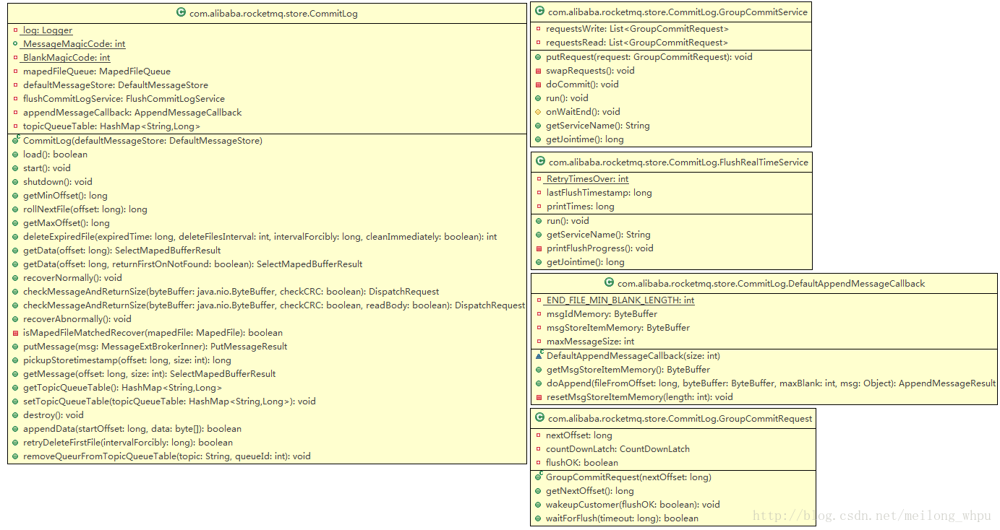

# RocketMQ存储篇——CommitLog

# CommitLog

commitlog文件的存储地址：$HOME\store\commitlog\${fileName}，每个文件的大小默认1G =1024*1024*1024，commitlog的文件名fileName，名字长度为20位，左边补零，剩余为起始偏移量；比如00000000000000000000代表了第一个文件，起始偏移量为0，文件大小为1G=1073741824；当这个文件满了，第二个文件名字为00000000001073741824，起始偏移量为1073741824，以此类推，第三个文件名字为00000000002147483648，起始偏移量为2147483648 
消息存储的时候会顺序写入文件，当文件满了，写入下一个文件。

## 文件的消息单元存储结构

| 顺序编号 | 字段简称                   | 字段大小（字节） | 字段含义                                                     |
| -------- | -------------------------- | ---------------- | ------------------------------------------------------------ |
| 1        | msgSize                    | 4                | 代表这个消息的大小                                           |
| 2        | MAGICCODE                  | 4                | MAGICCODE = daa320a7                                         |
| 3        | BODY CRC                   | 4                | 消息体BODY CRC 当broker重启recover时会校验                   |
| 4        | queueId                    | 4                |                                                              |
| 5        | flag                       | 4                |                                                              |
| 6        | QUEUEOFFSET                | 8                | 这个值是个自增值不是真正的consume queue的偏移量，可以代表这个consumeQueue队列或者tranStateTable队列中消息的个数，若是非事务消息或者commit事务消息，可以通过这个值查找到consumeQueue中数据，QUEUEOFFSET * 20才是偏移地址；若是PREPARED或者Rollback事务，则可以通过该值从tranStateTable中查找数据 |
| 7        | PHYSICALOFFSET             | 8                | 代表消息在commitLog中的物理起始地址偏移量                    |
| 8        | SYSFLAG                    | 4                | 指明消息是事物事物状态等消息特征，二进制为四个字节从右往左数：当4个字节均为0（值为0）时表示非事务消息；当第1个字节为1（值为1）时表示表示消息是压缩的（Compressed）；当第2个字节为1（值为2）表示多消息（MultiTags）；当第3个字节为1（值为4）时表示prepared消息；当第4个字节为1（值为8）时表示commit消息；当第3/4个字节均为1时（值为12）时表示rollback消息；当第3/4个字节均为0时表示非事务消息； |
| 9        | BORNTIMESTAMP              | 8                | 消息产生端(producer)的时间戳                                 |
| 10       | BORNHOST                   | 8                | 消息产生端(producer)地址(address:port)                       |
| 11       | STORETIMESTAMP             | 8                | 消息在broker存储时间                                         |
| 12       | STOREHOSTADDRESS           | 8                | 消息存储到broker的地址(address:port)                         |
| 13       | RECONSUMETIMES             | 8                | 消息被某个订阅组重新消费了几次（订阅组之间独立计数）,因为重试消息发送到了topic名字为%retry%groupName的队列queueId=0的队列中去了，成功消费一次记录为0； |
| 14       | PreparedTransaction Offset | 8                | 表示是prepared状态的事物消息                                 |
| 15       | messagebodyLength          | 4                | 消息体大小值                                                 |
| 16       | messagebody                | bodyLength       | 消息体内容                                                   |
| 17       | topicLength                | 1                | topic名称内容大小                                            |
| 18       | topic                      | topicLength      | topic的内容值                                                |
| 19       | propertiesLength           | 2                | 属性值大小                                                   |
| 20       | properties                 | propertiesLength | propertiesLength大小的属性数据                               |

## CommitLog类结构

功能清单如下：

## 获取最小Offset（getMinOffset）

从MapedFileQueue中获取第一个MapedFile对象（即第一个文件），若该文件可用（MapedFile对象的availabe变量值）则返回该对象的fileFromOffset值，若不可用，则取下一个文件的起始偏移量，计算方式为：fileFromOffset值+文件的固定大小1G-fileFromOffset%1G。fileFromOffset%1G一般情况下为0。

## 获取最大物理偏移量（getMaxOffset）

调用MapedFileQueue类的方法获取在MapedFile队列中的最大Offset值，即为当前写入消息的最大位置。

## 读取指定起始位置offset所在文件的全部剩余消息（getData）

调用MapedFileQueue的findMapedFileByOffset方法取指定起始位置offset所在的文件对应的MapedFile对象。然后计算在该文件内部的起始位置，由于参数中的指定起始位置是从第一个文件开始位置算起的，针对文件内部的起始位置应该是offset%fileSize。最后调用MapedFile对象的selectMapedBuffer方法获取该文件中从起始位置开始的所有剩余信息。

## 正常恢复CommitLog内存数据（recoverNormally）

主要是恢复MapedFileQueue对象的commitedWhere变量值（即刷盘的位置），删除该commitedWhere值所在文件之后的commitlog文件以及对应的MapedFile对象。

在Broker启动过程中会调用该方法。从MapedFileQueue的MapedFile列表的倒数第三个对象（即倒数第三个文件）开始遍历每块消息单元，若总共没有三个文件，则从第一个文件开始遍历每块消息单元。

首先，每次读取到消息单元块之后，进行CRC的校验，在校验过程中，若检查到第5至8字节MAGICCODE字段等于BlankMagicCode（cbd43194）则返回msgSize=0的DispatchRequest对象；若校验未通过或者读取到的信息为空则返回msgSize=-1的DispatchRequest对象；否则返回msgSize等于第1个4字节的msgSize字段值的DispatchRequest对象。

对于msgSize大于零，则读取的偏移量mapedFileOffset累加msgSize；若等于零，则表示读取到了文件的最后一块信息，则继续读取下一个MapedFile对象的文件；直到消息的CRC校验未通过或者读取完所有信息为止。

计算有效信息的最后位置processOffset，计算方式为：取最后读取的MapedFile对象的fileFromOffset加上最后读取的位置mapedFileOffset值。

最后更新内存中的对象数据信息：设置MapedFileQueue对象的commitedWhere等于processOffset；调用truncateDirtyFiles方法将processOffset所在文件之后的文件全部清理掉，并且将所在文件对应的MapedFile对象的wrotepostion和commitPosition设置为processOffset%fileSize，即等于mapedFileOffset值。

## 异常恢复CommitLog内存数据（recoverAbnormally）

在Broker启动过程中会调用该方法。与正常恢复的区别在于：正常恢复是从倒数第3个文件开始恢复；而异常恢复是从最后的文件开始往前寻找与checkpoint文件的记录相匹配的一个文件。

首先，若该MapedFile队列为空，则MapedFileQueue对象的commitedWhere等于零，并且调用DefaultMessageStore.destroyLogics() 方法删除掉逻辑队列consumequeue中的物理文件以及清理内存数据。否则从MapedFileQueue的MapedFile列表找到从哪个文件（对应的MapedFile对象）开始恢复数据，查找逻辑如下：

1、从MapedFile列表中的最后一个对象开始往前遍历每个MapedFile对象，检查该MapedFile对象对应的文件是否满足恢复条件，查找逻辑如下，若查找完整个队列未找到符合条件的MapedFile对象，则从第一个文件开始恢复。

A）从该文件中获取第一个消息单元的第5至8字节的MAGICCODE字段，若该字段等于MessageMagicCode（即不是正常的消息内容），则直接返回后继续检查前一个文件；

B）获取第一个消息单元的第56位开始的8个字节的storeTimeStamp字段，若等于零，也直接返回后继续检查前一个文件；

C）检查是否开启消息索引功能（MessageStoreConfig .messageIndexEnable，默认为true）并且是否使用安全的消息索引功能（MessageStoreConfig. MessageIndexSafe，默认为false，在可靠模式下，异常宕机恢复慢；非可靠模式下，异常宕机恢复快），若开启可靠模式下面的消息索引，则消息的storeTimeStamp字段表示的时间戳必须小于checkpoint文件中物理队列消息时间戳、逻辑队列消息时间戳、索引队列消息时间戳这三个时间戳中最小值，才满足恢复数据的条件；否则消息的storeTimeStamp字段表示的时间戳必须小于checkpoint文件中物理队列消息时间戳、逻辑队列消息时间戳这两个时间戳中最小值才满足恢复数据的条件；

2、从找到的MapedFile对象开始往后开始遍历每个文件的消息单元，首先，每次读取到消息单元块之后，进行CRC的校验，在校验过程中，若检查到第5至8字节MAGICCODE字段等于BlankMagicCode（cbd43194）则返回msgSize=0的DispatchRequest对象；若校验未通过或者读取到的信息为空则返回msgSize=-1的DispatchRequest对象；否则返回msgSize等于第1个4字节的msgSize字段值的DispatchRequest对象。

对于msgSize大于零，则读取的偏移量mapedFileOffset累加msgSize，并将DispatchRequest对象放入DefaultMessageStore.DispatchMessageService服务线程中，由该线程在后台进行ConsumeQueue队列和Index服务的数据加载；若等于零，则表示读取到了文件的最后一块信息，则继续读取下一个MapedFile对象的文件；直到消息的CRC校验未通过或者读取完所有信息为止。

计算有效信息的最后位置processOffset，计算方式为：取最后读取的MapedFile对象的fileFromOffset加上最后读取的位置mapedFileOffset值。

3、更新内存中的对象数据信息：设置MapedFileQueue对象的commitedWhere等于processOffset；调用MapedFileQueue.truncateDirtyFiles方法将processOffset所在文件之后的文件全部清理掉，并且将所在文件对应的MapedFile对象的wrotepostion和commitPosition设置为processOffset%fileSize，即等于mapedFileOffset值。

4、调用DefaultMessageStore.truncateDirtyLogicFiles(long processOffset) 方法，在该方法中遍历DefaultMessageStore.consumeQueueTable的values值（即ConcurrentHashMap<Integer/* queueId */,ConsumeQueue>），对于调用每个ConsumeQueue对象的truncateDirtyLogicFiles(long processOffset)方法，该方法根据物理偏移值processOffset删除无效的逻辑文件。

## 写入消息（putMessage）

在Broker接受到生产者的消息之后，会间接的调用CommitLog.putMessage(MessageExtBrokerInner msg)方法完成消息的写入操作。具体逻辑如下：

1、获取消息的sysflag字段，检查消息是否是非事务性（第3/4字节为0）或者提交事务（commit，第4字节为1，第3字节为0）消息，若是，再从消息properties属性中获取"DELAY"参数（该参数在应用层通过Message.setDelayTimeLevel(int level)方法设置，消息延时投递时间级别，0表示不延时，大于0表示特定延时级别）属性的值（即延迟级别），若该值大于0，则将此消息设置为定时消息；即更改该消息为定时消息，更改如下信息：第一，将MessageExtBrokerInner对象的topic值更改为"SCHEDULE_TOPIC_XXXX"，第二，根据延迟级别获取延时消息的队列ID（queueId等于延迟级别减去1）并更改queueId值；第三，将消息中原真实的topic和queueId存入消息属性中；第四，该延迟消息的consumequeue队列中的tagscode等于存储时间加上延迟级别对应的时长，若没有该延迟级别则将存储时间加上1000；

2、调用MapedFileQueue.getLastMapedFile方法获取或者创建最后一个文件（即MapedFile列表中的最后一个MapedFile对象），若还没有文件或者已有的最后一个文件已经写满则创建一个新的文件，即创建一个新的MapedFile对象并返回；

3、调用MapedFile.appendMessage(Object msg, AppendMessageCallback cb)方法将消息内容写入MapedFile.mappedByteBuffer：MappedByteBuffer对象，即写入消息缓存中；由后台服务线程定时的将缓存中的消息刷盘到物理文件中；

4、若最后一个MapedFile剩余空间不足够写入此次的消息内容，即返回状态为END_OF_FILE标记，则再次调用MapedFileQueue.getLastMapedFile方法获取新的MapedFile对象然后调用MapedFile.appendMessage方法重写写入，最后继续执行后续处理操作；若为PUT_OK标记则继续后续处理；若为其他标记则返回错误信息给上层；

5、初始化DispatchRequest对象，其中包括topic、queueID、wroteOffset（写入的开始物理位置）、wroteBytes（写入的大小）、logicsOffset（已经写入的消息块个数）、消息key值等；调用DefaultMessageStore.DispatchMessageService.putRequest(DispatchRequest dispatchRequest)将请求消息放入DispatchMessageService.requestsWrite队列中；由DispatchMessageService服务处理该请求；为请求中的信息创建consumequeue数据和index索引。

6、若该Broker是同步刷盘，并且消息的property属性中"WAIT"参数(该参数在应用层可以通过Message.setWaitStoreMsgOK(boolean waitStoreMsgOK)方法设置，表示是否等待服务器将消息存储完毕再返回（可能是等待刷盘完成或者等待同步复制到其他服务器）)为空或者为TRUE，则利用GroupCommitService后台线程服务进行刷盘操作，具体步骤如下：

1）构建GroupCommitRequest对象，其中nextOffset变量的值等于wroteOffset（写入的开始物理位置）加上wroteBytes（写入的大小）,表示下一次写入消息的开始位置；

2）将该对象存入GroupCommitService.requestsWrite写请求队列中，并唤醒GroupCommitService线程将写队列的数据与读队列的数据交互（读队列的数据肯定是空）；

3）该线程的doCommit方法中遍历读队列的数据，检查MapedFileQueue.committedWhere（刷盘刷到哪里的记录）是否大于等于GroupCommitRequest.nextOffset，若是表示该请求消息表示nextOffset之前的消息已经被刷盘，否则调用CommitLog.MapedFileQueue.commit(int flushLeastPages) 进行刷盘操作；

4）用MapedFileQueue的存储时间戳storeTimestamp变量值（在MapedFileQueue.commit方法成功执行后更新）更新StoreCheckpoint.physicMsgTimestamp变量值（checkpoint文件内容中其中一个值）；

5）清空读请求队列requestRead；

7、若该Broker为异步刷盘（ASYNC_FLUSH），唤醒FlushRealTimeService线程服务。在该线程的run方法处理逻辑如下：

1）若根据CommitLog刷盘间隔时间（默认是1秒）来间断性的调用CommitLog.MapedFileQueue.commit(int flushLeastPages)方法进行刷盘操作；

2）用MapedFileQueue的存储时间戳storeTimestamp变量值（在MapedFileQueue.commit方法成功执行后更新）更新StoreCheckpoint.physicMsgTimestamp变量值（checkpoint文件内容中其中一个值）；

8、若该Broker为同步双写主用（SYNC_MASTER），并且消息的property属性中"WAIT"参数为空或者为TRUE，则等待监听主Broker将数据同步到从Broker的结果，若同步失败，则置PutMessageResult对象的putMessageStatus变量为FLUSH_SLAVE_TIMEOUT，监测方法如下：

1）检查主从数据传输是否正常。备用连接是否大于0，主用put的位置masterPutwhere等于wroteOffset（写入的开始物理位置）加上wroteBytes（写入的大小），masterPutwhere减去HAService.push2SlaveMaxOffset（写入到Slave的最大Offset）的差值不能大于256M，否则视为主备同步异常，置PutMessageResult对象的putMessageStatus变量为SLAVE_NOT_AVAILABLE；

2)若主备同步正常，则利用wroteOffset（写入的开始物理位置）加上wroteBytes（写入的大小）的值为参数构建GroupCommitRequest对象，即该对象的nextOffset值等于wroteOffset+wroteBytes；然后调用HAService.GroupTransferService.putRequest(GroupCommitRequest request)方法将请求对象放入 GroupTransferService服务的队列中，用于监听是否同步完成；再调用GroupCommitRequest.waitForFlush(long timeout)方法，该方法一直处于阻塞状态，直到HAService线程服务完成同步工作或者超时才返回结果；若GroupCommitRequest对象的flushOK变量为true则表示同步成功了，在GroupTransferService服务线程中判断是否同步完成的方法是用该对象中的nextOffset值与HAService.push2SlaveMaxOffset比较。

9、返回PutMessageResult对象；若上诉都成功则该对象的putMessageStatus变量为PUT_OK；

## 读取消息（getMessage）

该方法的入参有两个：读取的起始偏移量offset和读取的大小size。首先调用findMapedFileByOffset方法根据起始偏移量offset所在的MapedFile对象；然后调用MapedFile对象的selectMapedBuffer方法获取从offset开始的size大小的消息内容；由于offset是commitlog文件的全局偏移量，要以offset%mapedFileSize的余数作为单个文件的起始读取位置传入selectMapedBuffer方法中。

## 指定位置开始写入二进制消息（appendData）

根据入参中的指定位置startOffset值调用getLastMapedFile方法获取最后一个MapedFile对象，若MapedFile队列为空则以startOffset为起始偏移量创建新的文件（即新的MapedFile对象）。然后调用MapedFile对象的appendMessage(final byte[] data)方法将二进制消息写入缓存中。

## 获取指定位置所在文件的下一个文件的起始偏移量（rollNextFile）

调用rollNextFile(long offset)方法，获取该入参的偏移量所在文件的下一个文件的起始偏移量，算法如下：offset+mapedFileSzie-offset% mapedFileSzie

## DefaultAppendMessageCallback类的实现

该类实现了AppendMessageCallback回调类的doAppend(final long fileFromOffset, final ByteBuffer byteBuffer,final int maxBlank, final Object msg)方法，该顺序写方法的具体逻辑如下：

1）获取当前内存对象的写入位置（wrotePostion变量值）；若写入位置没有超过文件大小则继续顺序写入；

2）由内存对象mappedByteBuffer创建一个指向同一块内存的ByteBuffer对象，并将内存对象的写入指针指向写入位置；

3）以文件的起始偏移量（fileFromOffset）、ByteBuffer对象、该内存对象剩余的空间（fileSize-wrotePostion）、消息对象msg为参数调用AppendMessageCallback回调类的doAppend方法；

3.1）根据broker的ip+port和在整个commitlog上开始位置（fileFromOffset+wrotepostion）生成16个字节的消息ID（messageId）；

3.2）根据消息的"topic-queueid"作为key值在CommitLog. topicQueueTable中获取values值（即为queueoffset值），若没有则置为0并以此"topic-queueid"作为key值存入topicQueueTable中；

3.3）通过参数sysflag的标志位判断消息类型，若是PREPARED事务，则取TransactionStateService.tranStateTableOffset变量值（DefaultMessageStore中初始化的TransactionStateService对象）赋值给queueoffset临时变量；若是ROLLBACK事务，则取消息中的queueoffset值赋值给临时变量queueoffset；

3.4)根据消息对象msg计算消息的总长度，若总长度大于消息长度的最大值（MessageStoreConfig.maxMessageSize指定，默认为512K）则返回由status= MESSAGE_SIZE_EXCEEDED 初始化的AppendMessageResult对象；若总长度加上文件末尾剩余的空格8字节的值大于该内存对象剩余的空间，则将剩余的空间用空格填满，即向内存对象中写入剩余空间大小、结尾文件MAGICCODE（cbd43194），内存对象剩余的部分填充空格，并返回由status=END_OF_FILE、写入的字节数（等于剩余空间大小）、消息ID、queueoffset初始化的AppendMessageResult对象；

3.5）将消息内容按照commitlog规定的格式先写入DefaultAppendMessageCallback对象创建的内存对象msgIdMemory中，然后在整体复制到MapedFile的内存对象mappedByteBuffer中，返回由status=PUT_OK、写入的字节数（等于剩余空间大小）、消息ID、queueoffset初始化的AppendMessageResult对象；

3.6）若非事务性或者提交事务消息，在写入完成之后将对应的values值加1；若是PREPARED事务，则将TransactionStateService.tranStateTableOffset变量值加1，该变量值表示在statetable文件中的消息个数；

4）将MapedFile.wrotePostion的值加上写入的字节数（AppendMessageResult对象返回的值）；

5）更新存储时间戳MapedFile.storeTimestamp ；