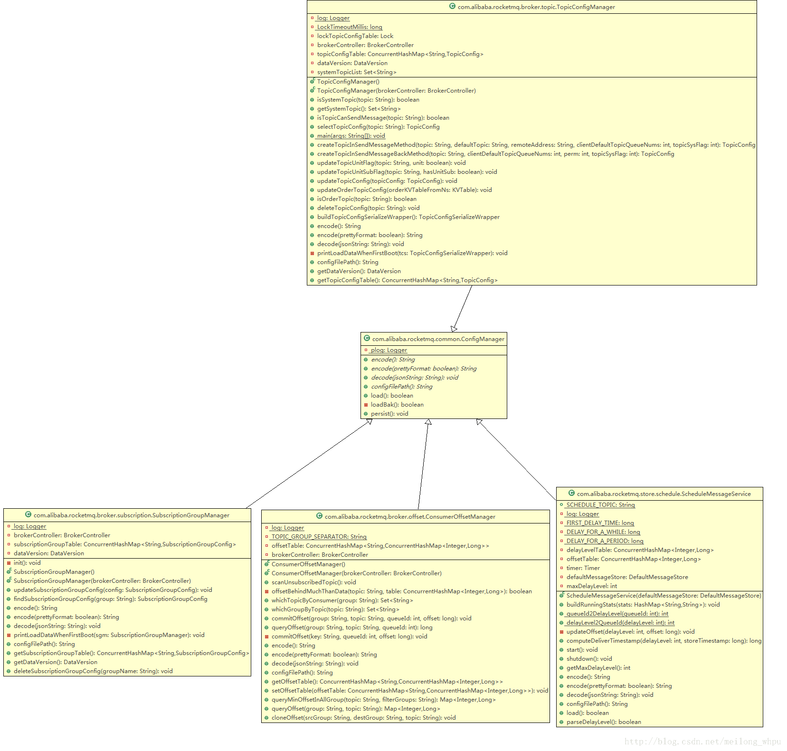

# RocketMQ存储篇——Config文件以及执行延迟消息的线程服务

在$HOME\store\config目录下面存储各类config文件，包括：consumerOffset.json、delayOffset.json、subscriptionGroup.json、topics.json四类config文件。 
topics.json文件由TopicConfigManager类解析并存储；存储每个topic的读写队列数、权限、是否顺序等信息。 
consumerOffset.json文件由ConsumerOffsetManager类解析并存储；存储每个消费者Consumer在每个topic上对于该topic的consumequeue队列的消费进度； 
delayOffset.json文件由ScheduleMessageService类解析并存储；存储对于延迟主题SCHEDULE_TOPIC_XXXX的每个consumequeue队列的消费进度； 
subscriptionGroup.json文件由SubscriptionGroupManager类解析并存储；存储每个消费者Consumer的订阅信息。 
各类图机构如下： 

## 1 ScheduleMessageService执行延迟消息

该类除了解析并存储delayOffset.json文件之外，还有一个重要的任务，就是定时执行延迟消息的任务。

在load方法中，将这些级别（"1s 5s 10s 30s 1m 2m 3m 4m 5m 6m 7m 8m 9m 10m 20m 30m 1h 2h"）的延时存入延迟级别delayLevelTable：ConcurrentHashMap<Integer /* level */, Long/* delay timeMillis */>变量中，例如1s的kv值为1:1000,5s的kv值为2:5000，key值依次类推；每个延迟级别即为一个队列。

在Broker启动时调用ScheduleMessageService.start方法，在该方法处理两件事：一、每个延迟队列增加定时器；二、设置定时任务将延迟进度刷盘。 
为每个延迟级别设置一个定时器。遍历delayLevelTable列表，key值为level，并以level从offsetTable中获取该级别的队列消费进度offset。以level、offset为参数初始化DeliverDelayedMessageTimerTask对象，并存入定时器中，在1秒之后在调用该对象的run方法。 
延迟消费逻辑就在DeliverDelayedMessageTimerTask对象的run方法中。在该方法中调用executeOnTimeup方法，若该方法抛出异常，则重新初始化DeliverDelayedMessageTimerTask对象并放入定时器中，在10秒之后重新执行该对象。其中executeOnTimeup方法的业务逻辑如下：

1）调用DefaultMessageStore对象的findConsumeQueue(String topic, int queueId)方法获取对应的ConsumeQueue对象；其中topic等于"SCHEDULE_TOPIC_XXXX"；queueId等于延迟级别level减1； 
2）以offset偏移量为参数调用ConsumeQueue对象的getIndexBuffer方法获取consumequeue的数据；若未获取到ConsumeQueue对象则以offset、level为参数初始化DeliverDelayedMessageTimerTask对象并放入定时器中，100毫秒之后再重新执行； 
3）从consumequeue的数据中逐个继续每个消息单元，根据每个消息单元的tagsCode检查延迟时间是否已经到了，以tagsCode存储的时间戳减去当前时间戳； 
3.1）若大于零则表示延迟时间未到，则以该数据开始偏移量为offset，对应的level为参数初始化DeliverDelayedMessageTimerTask对象，并且在该时间差额之后再次调用该对象的run方法；然后更新ScheduleMessageService.offsetTable变量中相应延迟级别的offset值； 
3.2）若小于等于零则表示延迟时间已经到了。首先以解析出来的物理偏移量commitLogOffset和消息大小size为参数调用DefaultMessageStore对象的lookMessageByOffset(long commitLogOffset, int size)方法；然后将该方法返回的MessageExt对象转换成MessageExtBrokerInner对象，其中，主要是将真实的topic和queueId从消息的properties中取出并设置到给MessageExtBrokerInner对象中；再调用DefaultMessageStore对象的putMessage(MessageExtBrokerInner msg)方法进行消息写入。若写入消息成功，则继续解析后面的消息单元，然后重复执行第3步；否则以该数据开始偏移量为offset、对应的level为参数初始化DeliverDelayedMessageTimerTask对象并放入定时器中，在10秒之后重新执行；并且更新ScheduleMessageService.offsetTable变量中相应延迟级别的offset值； 
4）在第3步中对获取到的consumequeue数据逐个解析完成之后，将上述consumequeue数据的最后一个消息读取偏移量之后的一个消息读取偏移量（offset+consumequeue消息中的消息单元个数）作为nextoffset、对应的level为参数初始化DeliverDelayedMessageTimerTask对象并放入定时器中，100毫秒之后再重新执行；

## 2 收到发送消息时创建topic的配置信息（createTopicInSendMessageMethod）

调用TopicConfigManager.createTopicInSendMessageMethod(final String topic, final String defaultTopic,final String remoteAddress, final int clientDefaultTopicQueueNums, final int topicSysFlag)方法进行Topic配置的创建。大致逻辑如下： 
1、以参数topic从TopicConfigManager.topicConfigTable中获取该topic的配置信息对象TopicConfig；若获取到了则直接返回该对象；否则创建一个新的配置对象并存入topicConfigTable变量中； 
2、该topic不存在，则以参数defaultTopic从TopicConfigManager.topicConfigTable中获取该topic的配置信息对象TopicConfig，该参数在Producer发送信息时默认为"TBW102"，而该topic在Broker启动时会自动创建； 
3、用topic来初始化新的TopicConfig对象，并用以defaultTopic获取到的TopicConfig对象的其他参数来初始化新创建的TopicConfig对象； 
4、将新创建的TopicConfig对象以topic为key值存入TopicConfigManager.topicConfigTable变量中，并且更新dataVersion值； 
5、然后将topicConfigTable变量值持久化到topics.json物理文件中。

## 3 根据GroupName查找订阅组信息（findSubscriptionGroupConfig）

调用SubscriptionGroupManager.findSubscriptionGroupConfig(String GroupNmae)方法获取订阅信息。大致步骤如下： 
1、以GroupNmae从SubscriptionGroupManager.SubscriptionGroupTable变量中获取订阅信息SubscriptionGroupConfig对象；若不为空则直接返回该对象； 
2、若为空，表示还没有该订阅信息，再检查Broker是否运行自动创建订阅组（由配置参数autoCreateSubscriptionGroup设置，默认为true）。若不允许则直接返回null；若允许则首先以GroupName为参数创建SubscriptionGroupConfig对象，并存入SubscriptionGroupTable变量中；然后更新SubscriptionGroupManager的dataversion值；再将SubscriptionGroupManager的内容持久化到subscriptionGroup.json文件中；最后返回该新创建的SubscriptionGroupConfig对象；

## 4收到消费失败时的回传消息时创建topic的配置信息（createTopicInSendMessageBackMethod）

调用TopicConfigManager.createTopicInSendMessageBackMethod(String topic, int clientDefaultTopicQueueNums, int perm, int topicSysFlag)方法进行Topic配置的创建。大致逻辑如下：

1、以参数topic从TopicConfigManager.topicConfigTable中获取该topic的配置信息对象TopicConfig；若获取到了则直接返回该对象；否则创建一个新的配置对象并存入topicConfigTable变量中； 
2、以该方法的入参初始化TopicConfig对象，并以topic为key值存入TopicConfigManager.topicConfigTable变量中，并且更新dataVersion值； 
3、然后将topicConfigTable变量值持久化到topics.json物理文件中。