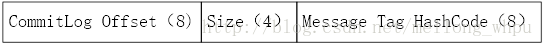
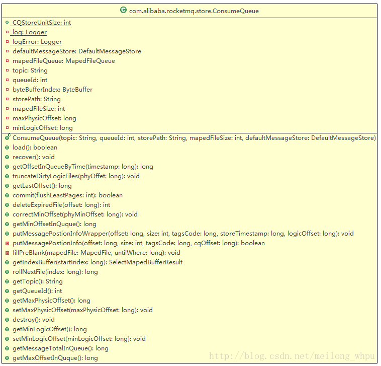

# RocketMQ存储篇——Consumequeue

Consumequeue类对应的是每个topic和queuId下面的所有文件。Consumequeue类文件的存储路径默认为$HOME/store/consumequeue/{topic}/{queueId}/{fileName}，每个文件由30W条数据组成，每条数据的结构如下图所示： 
消息的起始物理偏移量physical offset(long 8字节)+消息大小size(int 4字节)+tagsCode(long 8字节)，每条数据的大小为20个字节，从而每个文件的默认大小为600万个字节。

每个cosumequeue文件的名称fileName，名字长度为20位，左边补零，剩余为起始偏移量；比如00000000000000000000代表了第一个文件，起始偏移量为0，文件大小为600W，当第一个文件满之后创建的第二个文件的名字为00000000000006000000，起始偏移量为6000000，以此类推，第三个文件名字为00000000000012000000，起始偏移量为12000000，消息存储的时候会顺序写入文件，当文件满了，写入下一个文件。

## ConsumeQueue类结构

## 1 删除指定偏移量之后的逻辑文件（truncateDirtyLogicFiles）

此步的目的是首先删除指定偏移量processOffset所在文件之后的逻辑文件，其次是修正所在文件对应的MappedFile对象的写入位置和提交位置两个变量。

从ConsumeQueue.MapedFileQueue的MapedFile队列中获取最后一个MappedFile文件（调用），然后从第一个数据块开始解析：

若第一块消息单元中的物理偏移值（第1至8个字节）大于了processOffset，则从MapedFile列表中删除该记录并从磁盘中删除物理文件，然后继续获取列表的最后一个文件（即为当初的倒数第二个文件了）并从第一个数据块开始解析。否则不断地更新MappedFile文件wrotePostion和CommittedPosition两个变量为解析到的数据块位置；直到解析到数据块的大小为空或者物理偏移值大于了processOffset为止。

## 2 恢复ConsumeQueue内存数据（recover）

主要是更新ConsumeQueue.maxPhysicOffset变量（最后一个消息对应的物理offset）和删除最后一个消息所在文件之后的文件以及对应的MapedFile对象。

在Broker启动过程中会调用该方法。首先获取ConsumeQueue对象中的List<MappedFile>列表变量，从倒数第三个文件开始恢复，即列表中的倒数第三个MappedFile对象；若文件总数没有达到3个，则从第一个文件开始恢复。从选择的开始恢复的文件（倒数第三个或者第一个文件）中顺序解析consumequeue的每个数据单元（即20个字节）。

正常情况下ConsumeQueue文件中二进制信息的内容是连续的20个字节的信息单元组成，并且每个信息单元中的offset和size都是大于零的。从倒数第三个文件中开始解析，若整个文件的所有数据单元均有效（即offset和size均大于零）则继续获取下一个文件的MapedFile对象然后从文件头开始解析数据单元，直到遇到文件的一个数据单元的offset和size不大于零为止。以最后一个有效的消息单元的前8个字节（即为物理位移offset）来初始化ConsumeQueue.maxPhysicOffset变量；

计算出processOffset,等于最后一个MappedFile文件的fileFromOffset（即文件名的数字值）+最后一个有效的消息单元在该MappedFile对象中的位置偏移量mappedFileOffest；

调用MapedFileQueue.truncateDirtyFiles(long processOffset)方法，利用该方法首先更新processOffset所在文件对象（MapedFile对象）的wrotepostion和committedpostion值，然后清理指定偏移量processOffset所在文件之后的所有文件，不仅删除物理文件而且删除MappedFile列表中对应的MapedFile对象。

## 3 查找消息发送时间最接近timestamp逻辑队列的offset（getOffsetInQueueByTime）

首先利用请求时间戳timestamp调用MapedFileQueue对象的getMapedFileByTime方法获取文件的更新时间在该时间戳之后的文件对应的MapedFile对象。

然后用二分查找法查找最接近timestamp的消息的逻辑队列。大致逻辑如下：

置low=0、high=该文件已经写入的最后消息位置；然后(low+high)/2计算逻辑队列的中间消息单元的偏移量，然后读取以该偏移量开始一个消息单元，并从该消息单元中解析物理偏移量；

以该物理偏移量调用从commitlog中获取消息内容并取该消息的发送时间字段值；

若该发送时间值小于请求时间戳timestamp，则low标记为该中间位置；

若该发送时间大于请求时间戳timestamp，则high标记为该中间位置；

然后重复第一步的操作，直到找到消息发送时间等于请求时间戳timestamp或者high<low为止。

若上述二分法一直在往左边寻找且未找到或者一直在往右边寻找且未找到，则将最后一个中间位置的offset作为最接近的值；

若上述二分法左右均选择过且未找到发送时间等于请求时间戳timestamp的消息，则取距请求时间戳timestamp最近的消息在逻辑队列中的offset值；

## 4 获取最后一条消息对应物理队列的下一个偏移量（getLastOffset）

首先调用MapedFileQueue对象的getLastMapedFile2方法获取列表中的最后一个MapedFile对象（即对应的是最后一个物理文件）；

然后读取最后一个文件的最有一个有效的消息单元，取该消息单元的commitlogoffset（第1至8个字节）和消息大小size（第9至12个字节）；

最后将commitlogOffset+size即为物理队列中的下一个消息的偏移量。

## 5 消息刷盘（commit）

调用MapedFileQueue对象的commit方法进行消息的刷盘操作。

## 6 将commitlog物理偏移量/消息大小等信息直接写入consumequeue中（putMessagePostionInfoWrapper）

调用ConsumeQueue.putMessagePostionInfoWrapper(long offset, int size, long tagsCode, long storeTimestamp, long logicOffset)方法，将相关参数写入Consumequeue文件中。具体步骤如下：

1）根据入参信息构建consumequeue中的数据格式buffer块；

2）找到最后一个MappedFile文件，调用appendMessage(final byte[] data)方法将consumequeue的格式数据追加到MappedFile文件的后面；更新StoreCheckpoint.logicsMsgTimestamp变量值为请求对象中的storeTimestamp值；

## 7 根据消息序号索引获取consumequeue数据（getIndexBuffer）

调用getIndexBuffer(final long startIndex)方法，在方法中，由于startIndex只是消息单元的序号，故需将startIndex乘以20方可得到起始偏移量offset，然后调用MapedFileQueue对象的findMapedFileByteOffset方法根据该起始偏移量找到所在的文件，即对应的MapedFile对象，然后调用MapedFile对象selectMapedBuffer(int pos)，其中pos等于起始偏移量offset除以文件大小（fileSize）的余数。

## 8 根据物理队列最小offset计算修正逻辑队列最小offset（correctMinOffset）

调用correctMinOffset(long phyMinOffset)方法，根据物理队列的最小offset来修正逻辑队列的最小offset值。大致逻辑如下：

1）获取MapedFileQueue队列中第一个MapedFile对象，然后调用selectMapedBuffer(0)方法从第0位开始读取所有数据；

2）逐个解析获取到的数据的数据单元，检查每个消息单元中保存的物理偏移量（前8字节）是否大于等于最小物理偏移量，若是则将此消息单元的位置加上该文件的起始偏移量作为ConsumeQueue数据的最小逻辑偏移量存于变量minLogicOffset中。

## 9 获取指定位置所在文件的下一个文件的起始偏移量（rollNextFile）

调用rollNextFile(long offset)方法，获取该入参的偏移量所在文件的下一个文件的起始偏移量，算法如下：offset+mapedFileSzie/20-offset% mapedFileSzie,即得到下个偏移量的值，该值要乘以消息单元大小（20）才是真正的文件读取偏移量位置。