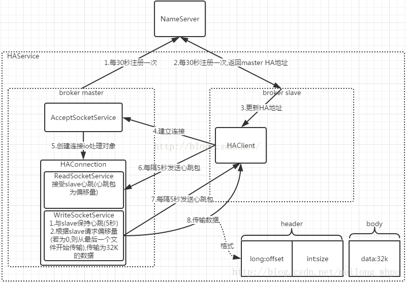
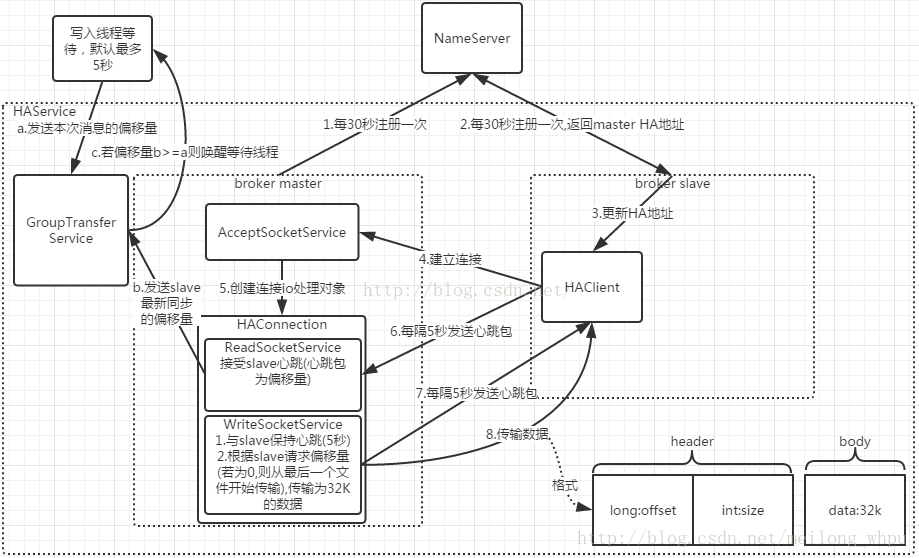

# RocketMQ存储篇——HA高可用

在集群模式的部署方式中，Master与Slave配对是通过指定相同的brokerName参数来配对，Master的BrokerId必须是0，Slave的BrokerId必须是大于0的数。一个Master下面可以挂载多个Slave，同一个Master下的多个Slave通过指定不同的BrokerId来区分。有4种部署方式：

| 部署方式                      | 优点                                                         | 缺点                                                         | 备注                                                         |
| ----------------------------- | ------------------------------------------------------------ | ------------------------------------------------------------ | ------------------------------------------------------------ |
| 单个Master模式                | 一旦Broker重启或者宕机时，会导致整个服务不可用，不建议线上环境使用； |                                                              |                                                              |
| 多个Master模式                | 配置简单，单个Master宕机或重启维护对应用无影响，在磁盘配置为RAID10时，即使机器宕机不可恢复情况下，由于RAID10磁盘非常可靠，消息也不会丢（异步刷盘丢失少量消息，同步刷盘一条不丢），性能最高。 | 单台机器宕机期间，这台机器上未被消费的消息在机器恢复之前不可订阅，消息实时性会收到影响。 | 当使用多master无slave的集群搭建方式时，master的brokerRole配置必须为ASYNC_MASTER。如果配置为SYNC_MASTER，则producer发送消息时，返回值的SendStatus会一直是SLAVE_NOT_AVAILABLE。 |
| 多Master多Slave模式——异步复制 | 即使磁盘损坏，消息丢失的非常少，但消息实时性不会受影响，因为Master宕机后，消费者仍然可以从Slave消费，此过程对应用透明，不需要人工干预，性能同多Master模式几乎一样。 | Master宕机，磁盘损坏情况，会丢失少量信息。                   |                                                              |
| 多Master多Slave模式——同步双写 | 数据与服务都无单点，Master宕机情况下，消息无延迟，服务可用性与数据可用性都非常高； | 性能比异步复制模式稍低，大约低10%左右，发送单个消息的RT会稍高，目前主宕机后，备机不能自动切换为主机，后续会支持自动切换功能。 |                                                              |

在集群模式下，为了保证高可用，必须要保证备用Broker与主用Broker信息是一致的，在备用Broker初始化时设置的了定时任务，每个60秒调用SlaveSynchronize.syncAll()方法发起向主用Broker进行一次config类文件的同步，而消息数据的同步由主备Broker通过心跳检测的方式完成，每隔5秒进行一次心跳。 **主用Broker提供读写服务，而备用Broker只提供读服务。**

## 1 Topic配置同步

在syncAll方法中调用SlaveSynchronize.syncTopicConfig()方法向主用Broker发起topics.json文件的同步。大致步骤如下：

1）向主用Broker发起GET_ALL_TOPIC_CONFIG请求码，主用Broker将所有topic配置信息返回给备用Broker；

2）比较主备topic信息的DataVersion；若不同则用主用Broker返回的topic配置信息更新备用Broker的topic，并进行持久化，同时更新备用Broker中topic信息的DataVersion。

## 2 消费进度信息同步

在syncAll方法中调用SlaveSynchronize. syncConsumerOffset ()方法向主用Broker发起consumerOffset.json文件的同步。大致步骤如下：

1）向主用Broker发起GET_ALL_CONSUMER_OFFSET请求码，主用Broker将所有ConsumerOffset配置信息返回给备用Broker；

2）更新备用Broker的ConsumerOffsetManager.offsetTable变量，同时进行持久化；

## 3 延迟消费进度信息同步

在syncAll方法中调用SlaveSynchronize.syncDelayOffset()方法向主用Broker发起delayOffset.json文件的同步。大致步骤如下：

向主用Broker发起GET_ALL_DELAY_OFFSET请求码，主用Broker将所有delayOffset信息返回给备用Broker；备用Broker直接将收到的delayOffset信息持久化到物理文件delayOffset.json中；

## 4 订阅关系同步

在syncAll方法中调用SlaveSynchronize. syncSubscriptionGroupConfig ()方法向主用Broker发起delayOffset.json文件的同步。大致步骤如下：

1）向主用Broker发起GET_ALL_SUBSCRIPTIONGROUP_CONFIG请求码，主用Broker将所有SubscriptionGroup配置信息返回给备用Broker；

2）更新备用Broker的ConsumerOffsetManager. subscriptionGroupTable变量，同时进行持久化；

## 5 消息数据同步

在主备Broker启动的时候，启动HAService服务，启动了如下服务：

1）HAService.AcceptSocketService：该服务是主用Broker使用，该服务主要监听新的Socket连接，若有新的连接到来，则创建HAConnection对象，在该对象中创建了HAConnection.WriteSocketService和HAConnection.ReadSocketService线程服务，对新来的socket连接分别进行读和写的监听。

2）HAService.GroupTransferService：该服务是对同步进度进行监听，若达到应用层的写入偏移量，则通知应用层该同步已经完成。在调用CommitLog.putMessage方法写入消息内容时，根据主用broker的配置来决定是否利用该服务进行同步等待数据同步的结果。

3）HAService.HAClient：该服务是备用Broker使用，在备用Broker启动之后与主用Broker建立socket连接，然后将备用Broker的commitlog文件的最大数据位置每隔5秒给主用Broker发送一次；并监听主用Broker的返回消息。

## 5.1 主用Broker的业务逻辑

一、AcceptSocketService服务线程

在启动该模块时，注册监听Socket的OP_READ操作，若有该操作达到，即有备用Broker请求连接到该主用Broker上时，利用该ScoketChannel初始化HAConnection对象，并调用该对象的start方法，在该方法中启动该对象的ReadSocketService和WriteSocketService服务线程，然后将该HAConnection对象存入HAService.connectionList:List<HAConnection>变量中，该变量是存储客户端连接，用于管理连接的删除和销毁。

ReadSocketService服务线程用于读取备用Broker的请求，WriteSocketService服务线程用于向备用Broker写入数据。

二、HAConnection.ReadSocketService服务线程

该模块主要是读取备用Broker的心跳信息，该信息就是8个字节，值为备用Broker的最大物理偏移量，在解析到该值之后，首先，将该值赋值给HAConnection.slaveAckOffset变量；然后若HAConnection.slaveRequestOffset小于零(在第一次启动时赋值为-1)则赋值给该变量；最后调用HAService.notifyTransferSome(long slaveAckOffset)方法，在该方法中，若slaveAckOffset大于HAService.push2SlaveMaxOffset的值则更新push2SlaveMaxOffset的值，并通知调用GroupTransferService.notifyTransferSome方法唤醒GroupTransferService服务线程。在同步双写模式下面，前端调用者会通过此线程服务来监听同步进度情况。

三、HAConnection.WriteSocketService服务线程

该服务线程启动之后，就每隔5秒向备用Broker发送心跳信息，具体步骤如下：

1）检查HAConnection.slaveRequestOffset是否等于-1，即刚启动的状态，还没有收到备用Broker端的最大偏移量值；则等待1秒钟之后再次监听slaveRequestOffset变量；若收到了备用Broker的最大偏移量，即不等于-1了。则执行如下步骤；

2）检查WriteSocketService.nextTransferFromWhere是否等于-1，即刚启动的状态，若是则要计算从哪里开始读取数据进行同步，大致逻辑如下：

2.1）若HAConnection.slaveRequestOffset不等于零，则将slaveRequestOffset赋值给nextTransferFromWhere变量，表示就以备用Broker传来的最大偏离量开始读取数据进行同步；

2.2）若HAConnection.slaveRequestOffset等于零，表示备用Broker端还没有commitlog数据，则将最后一个文件同步到备用Broker，即nextTransferFromWhere=最大偏移量maxOffset-maxOffset%1G，得到的值为最后一个文件的开始偏移量；

3）向备用Broker发送心跳消息，消息为12个字节，前8个字节为开始同步的偏移量offset，后4个字节填0；若发送成功则继续下面的逻辑，否则从第1步开始重新执行；

4）以nextTransferFromWhere为开始读取偏移量从commitlog中读取数据，调用DefaultMessageStore对象的getCommitLogData方法；若没有获取到数据则该服务线程等待100毫秒之后重新从第1步开始执行；

5）若获取到commitlog数据，再检查该数据的大小是否大于了32K，每次数据同步最多只能同步32K，若大于了32K，则只发送前32K数据；消息机构为：

12个字节的消息头，其中，前8个字节为开始同步的偏移量offset，后4个字节为同步数据的大小；先发送消息头，发送完成之后再发送同步数据；

6）一直重复执行1-5步，若出现异常跳出来循环后，则停止该服务，并且从HAService.connectionList变量中删除该客户端连接；然后关掉Socket链接，释放资源。

四、GroupTransferService服务线程

在该模块中有两个请求队列分别是GroupTransferService.requestsRead：List<GroupCommitRequest>和requestsWrite:List<GroupCommitRequest>,应用层将请求放入requestsWrite队列中，当该服务线程被唤醒时，首先将requestsWrite队列的请求与requestsRead队列的请求交换，而requestsRead队列一般都是空的，也就是将requestsWrite队列的内容赋值到requestsRead队列之后再清空；然后遍历requestsRead队列的每个GroupCommitRequest对象，用该对象的NextOffset值与push2SlaveMaxOffset比较，若push2SlaveMaxOffset大于了该对象的NextOffset值则置GroupCommitRequest请求对象的flushOK变量为true，在调用处对该变量有监听。

## 5.2 备用Broker的业务逻辑

在备用Broker启动的时候，启动了HAService.HAClient线程服务，该线程有两个作用，第一，每隔5秒发送一次心跳消息；第二，接受主用Broker的返回数据，然后进行后续处理。在该服务未停止的情况下，循环的执行下列步骤。

1、从HAService.HAClient.masterAddress变量中获取主用Broker的地址，在备用Broker向Name Server注册时会返回主用Broker的地址；若有主用Broker地址则与主用Broker建立Socket链接，并在该链接上注册OP_READ操作，即监听主用Broker返回的消息；调用DefaultMessageStore.getMaxPhyOffset()方法获取备用Broker本地的最大写入位置即最大物理偏移量，然后赋值给HAClient.currentReportedOffset变量；更新最后写入时间戳lastWriteTimestamp；

2、检查上次写入时间戳lastWriteTimestamp距离现在是否已经过了5秒，即每隔5秒向主用Broker进行一次物理偏移量报告（HAClient.currentReportedOffset）；若超过了5秒，则备用Broker向主用Broker报告备用Broker的当前最大物理偏移量的值，该消息只有8个字节，即为物理偏移量的值；

3、该服务线程等待1秒钟，然后从SocketChannel读取主用Broker返回的数据，一直循环的读取并解析数据，直到HAClient.byteBufferRead:ByteBuffer中无可写的空间为止，当ByteBuffer中的this.position<this.limit时表示有可写空间,该byteBufferRead变量是在初始化时HAClient是创建的，初始化空间为ReadMaxBufferSize=4G，若为空将重复读取3次后仍然没有数据则跳出该循环。若读取到数据，则首先更新HAClient.lastWriteTimestamp变量；然后调用HAClient.dispatchReadRequest()方法对数据解析和处理，在dispatchReadRequest方法中循环的读取byteBufferRead变量中的数据，具体处理步骤如下：

3.1）用HAClient.dispatchPostion变量来标记从byteBufferRead变量读取数据的位置；初始化值为0；

3.2）byteBufferRead变量的position值表示从SocketChannel中收到的数据的最后位置；首先将此position值赋值给临时变量readSocketPos，比较position减dispatchPostion的值大于12（消息头部长度为12个字节）：

1）若小于12个字节，并且byteBufferRead变量中没有可写空间（this.position>=this.limit）,则调用HAClient.reallocateByteBuffer()方法进行ByteBuffer的整理，然后返回继续执行第4步；整理过程如下：

1.A）检查byteBufferRead变量中的二进制数据是否解析完了（reamin=ReadMaxBufferSize-dispatchPostion），若reamin>0表示没有解析完，则将剩下的数据复制到HAClient.byteBufferBackup变量中；

1.B）将byteBufferRead和byteBufferBackup的数据进行交换；

1.C）重新初始化byteBufferRead变量的position等于reamin，即表示byteBufferRead中写入到了位置position；

2）若大于12个字节表示有心跳消息从主用Broker发送过来，进行如下处理：

2.A）在byteBufferRead中从dispatchPostion位置开始读取数据，初始化状态下dispatchPostion等于0；读取8个字节的数据即为主用Broker的同步的起始物理偏移量masterPhyOffset，再后4字节为数据的大小bodySize；

2.B）从备用Broker中获取最大的物理偏移量，若与主用Broker传来的起始物理偏移量masterPhyOffset不相等，则直接返回继续执行第4步；

2.C）若position-dispatchPostion的值大于消息头部长度12字节加上bodySize之和；则说明有数据同步，则继续在byteBufferRead中以position+dispatchPostion开始位置读取bodySize大小的数据；

2.D）调用DefaultMessageStore.appendToCommitLog(long startOffset, byte[] data)方法进行数据的写入；

2.E）将byteBufferRead变量的position值重置为readSocketPos；dispatchPostion值累计12+bodySize；

2.F）检查当前备用Broker的最大物理偏移量是否大于了上次向主用Broker报告时的最大物理偏移量（HAClient.currentReportedOffset），若大于则更新HAClient.currentReportedOffset的值，并将最新的物理偏移量向主用Broker报告。

2.G）继续读取byteBufferRead变量中的数据并执行第3.1和3.2步；

4、在第3步返回之后，检查当前备用Broker的最大物理偏移量是否大于了上次向主用Broker报告时的最大物理偏移量（HAClient.currentReportedOffset），若大于则更新HAClient.currentReportedOffset的值，并将最新的物理偏移量向主用Broker报告。

5、检查最后写入时间戳lastWriteTimestamp距离当前的时间，若大于了5秒，表示这期间未收到过主用Broker的消息，则关闭与主用Broker的连接；

Master-Slave方式就遇到了主从复制延迟的问题（异步复制永远是延迟的），那么在Master不可用后可能会导致部分数据丢失。针对这种场景，提供了同步双写的模式。

主备Broker的异步同步和同步双写在同步流程上面没有区别，只是在写入消息时，同步双写会创建一个GroupCommitRequest请求，由GroupTransferService服务线程来监听同步的进度是否达到了该请求的要求，若达到了则返回通知调用者；而异步同步时调用者不关心同步的进度，同步完成之后也不需通知任何调用者。两种同步方式的流程图如下：

1、主备Broker异步同步流程图： 
 
2、主备Broker同步双写流程图： 
