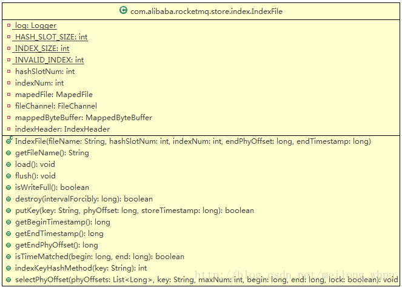
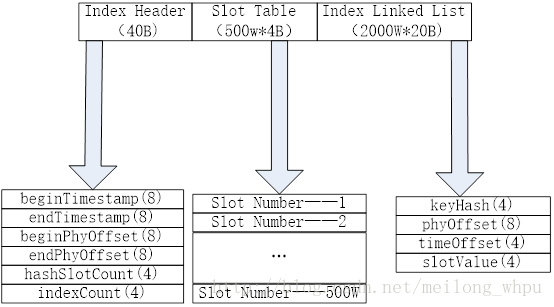

# RocketMQ存储篇——IndexFile和IndexService

# 1 IndexFile

为操作Index文件提供访问服务,Index文件的存储位置是：$HOME \store\index\${fileName}，文件名fileName是以创建时的时间戳命名的，文件大小是固定的，等于40+500W*4+2000W*20= 420000040个字节大小。 

## 1.1 Index文件的数据结构

Index Header结构各字段的含义：

beginTimestamp：第一个索引消息落在Broker的时间戳；

endTimestamp：最后一个索引消息落在Broker的时间戳；

beginPhyOffset：第一个索引消息在commitlog的偏移量；

endPhyOffset：最后一个索引消息在commitlog的偏移量；

hashSlotCount：构建索引占用的槽位数；

indexCount：构建的索引个数；

Slot Table里面的每一项保存的是这个topic-key是第几个索引；根据topic-key的Hash值除以500W取余得到这个Slot Table的序列号，然后将此索引的顺序个数存入此Table中。

Slottable的位置（absSlotPos）的计算公式：40+keyHash%（500W）*4；

Index Linked List的字段含义：

keyHash:topic-key(key是消息的key)的Hash值；

phyOffset:commitLog真实的物理位移；

timeOffset：时间位移，消息的存储时间与Index Header中beginTimestamp的时间差；

slotValue：当topic-key(key是消息的key)的Hash值取500W的余之后得到的Slot Table的slot位置中已经有值了（即Hash值取余后在Slot Table中有冲突时），则会用最新的Index值覆盖，并且将上一个值写入最新Index的slotValue中，从而形成了一个链表的结构。

Index Linked List的位置（absIndexPos）的计算公式： 40+ 500W*4+index的顺序数*40；

当对请求消息生成索引时，就是先计算出absSlotPos和absIndexPos值；然后在按照上面的数据结构将值写入对于的位置即可。

## 1.2 向index文件中写入索引消息（putKey）

调用putKey(final String key, final long phyOffset, final long storeTimestamp)方法，该方法中的入参key为topic-key值；phyOffset为物理偏移量。

1）首先根据key的Hash值计算出absSlotPos值；

2）根据absSlotPos值作为index文件的读取开始偏移量读取4个字节的值，即为了避免KEY值的hash冲突，将之前的key值的索引顺序数给冲突了，故先从slot Table中的取当前存储的索引顺序数，若该值小于零或者大于当前的索引总数（IndexHeader的indexCount值）则视为无效，即置为0；否则取出该位置的值，放入当前写入索引消息的Index Linked的slotValue字段中；

3）计算当前存时间距离第一个索引消息落在Broker的时间戳beginTimestamp的差值，放入当前写入索引消息的Index Linked的timeOffset字段中；

4）计算absIndexPos值，然后根据数据结构上值写入Index Linked中；

5）将索引总数写入slot Table的absSlotPos位置；

6）若为第一个索引，则更新IndexHeader的beginTimestamp和beginPhyOffset字段；

7）更新IndexHeader的endTimestamp和endPhyOffset字段；

8）将IndexHeader的hashSlotCount和indexCount字段值加1；

## 1.3以topic-key值从Index中获取在一个时间区间内的物理偏移量列表（selectPhyOffset）

调用方法是selectPhyOffset(final List<Long> phyOffsets, final String key, final int maxNum,final long begin, final long end, boolean lock)。

在调用该方法之前，先要检查开始时间、结束时间是否落在该Index文件中，调用isTimeMatched(long begin,long end)方法。在该方法中，用IndexHeader的beginTimestamp和EndTimestamp进行比较，若开始时间begin和结束时间end有一部分落在了Index内，则返回true。

在selectPhyOffset方法中。参数key值是topic-key（消息的key）的值。按如下步骤查找物理偏离量列表： 
1）计算key值的hash值；然后除以500W取余，得slotPos值； 
2）计算absSlotPos=40+slotPos*4；然后从index中以absSlotPos偏移量读取4个字节的整数值，即为该索引的顺序数index； 
3）计算absIndexPos=40+ 500W*4+index的顺序数*20； 
4）以absIndexPos为开始偏移量从index中读取后面20个字节的消息单元数据。 
5）检查读取到的数据中keyHash值是否等于请求参数key值的hash值，存储时间是否在请求时间范围内，若是在存入物理偏移量列表中； 
6）然后用读取数据中的slotValue值重新计算absIndexPos；并重新第4/5/6步的操作。这就是说在此次该key值时，Hash值有冲突，在Index Linked List中形成了链表，该链表是由slotValue值连接各个消息单元的。

# 2 IndexService

IndexService是线程类服务，在启动Broker时启动该线程服务。该类主要有两个功能，第一，是定时的创建消息的索引；第二是为应用层提供访问index索引文件的接口。

## 2.1 创建消息的索引（buildIndex）

在将消息写入commitlog中之后，在调用DefaultMessageStore.DispatchMessageService.putRequest(DispatchRequest dispatchRequest)方法，在该方法中将请求放入IndexService.requestQueue队列中，由IndexService线程每隔3秒检测该队列中的请求信息。若存在请求信息，则调用IndexService.buildIndex(Object[] req)方法。具体逻辑如下：

1）调用retryGetAndCreateIndexFile方法获取Index文件的对象IndexFile。 
A）从IndexFile列表中获取最后一个IndexFile对象；若该对象对应的Index文件没有写满，即IndexHeader的indexCount不大于2000W；则直接返回该对象； 
B）若获得的该对象为空或者已经写满，则创建新的IndexFile对象，即新的Index文件，若是因为写满了而创建，则在创建新Index文件时将该写满的Index文件的endPhyOffset和endTimestamp值初始化给新Index文件中IndexHeader的beginPhyOffset和beginTimestamp。 
C）启一个线程，调用IndexFile对象的fush将上一个写满的Index文件持久化到磁盘物理文件中；然后更新StoreCheckpoint.IndexMsgTimestamp为该写满的Index文件中IndexHeader的endTimestamp；

2）遍历requestQueue队列中的请求消息。将每个请求消息的commitlogOffset值与获取的IndexFile文件的endPhyOffset进行比较，若小于endPhyOffset值，则直接忽略该条请求信息；对于消息类型为Prepared和RollBack的也直接忽略掉。

3）对于一个topic可以有多个key值，每个key值以空格分隔，遍历每个key值，将topic-key值作为putKey方法的入参key值，将该topic的物理偏移量存入Index文件中，若存入失败则再次获取IndexFile对象重复调用putKey方法。

## 2.2 查找topic和key的物理偏移量offset（queryOffest）

调用queryOffset(String topic,String key,int maxNum,long begin,long end) 方法。每个topic和key值最多获取的物理偏移量不得超过64个。该方法查找的物理偏移量列表被封装在QueryOffsetResult对象中。在该方法中，从IndexFile列表的最后一个对象开始往前遍历每个IndexFile对象。主要逻辑如下：

1）调用InfexFile对象的isTimeMacted检查开始时间、结束时间是否有一部分落在该Index文件中IndexHeader的beginTimestamp和EndTimestamp之间，若是则调用IndexFile的selectPhyOffset方法获取物理偏移量列表；

2）检查IndexFile的beginTimestamp是否小于入参begin，若是则不用在往前寻找了，直接返回；

3）若已经找到的物理偏移量个数已经大于了64，则直接返回；