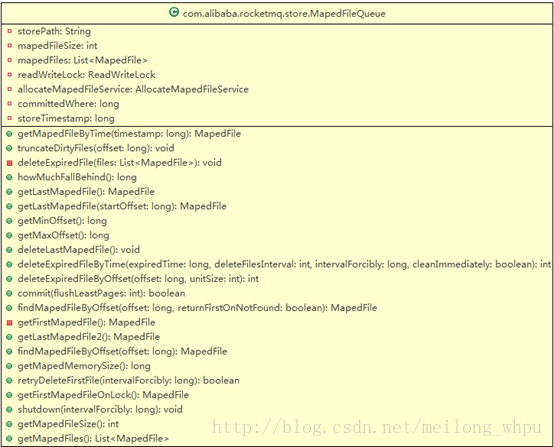

# RocketMQ存储篇——MapedFileQueue

# MapedFileQueue

应用层访问commitlog和consumequeue文件是通过MappFileQueue来操作MapedFile类，从而间接操作磁盘上面的文件；MappFileQueue是由多个MapedFile队列组成的，该类的结果如下图所示。 
 
功能清单如下：

## 1. 获取在某时间点之后更新的文件（getMapedFileByTime）

方法getMapedFileByTime(final long timestamp)，遍历MapedFile列表，若遇到文件的更新时间戳大于某时间点timestamp则返回该MapedFile对象，遍历完之后仍然没有找到则返回列表的最后一个MapedFile对象。

## 清理指定偏移量所在文件之后的文件（truncateDirtyFiles）

方法truncateDirtyFiles(long offset)：遍历MapedFile列表，每个MapedFile对象对应着一个固定大小的文件，若当文件的起始偏移量fileFromOffset<=offset<=fileFromOffset+fileSize，则表示指定的位置偏移量offset落在的该文件上，则将对应的MapedFile对象的wrotepostion和commitPosition设置为offset%fileSize，若文件的起始偏移量fileFromOffset>offset，即是命中的文件之后的文件，则将这些文件删除并且从MappFileQueue的MapedFile列表中清除掉。

## 获取或创建最后一个文件（getLastMapedFile）

从MapedFile列表中获取最后一个MapedFile对象，若列表为空或者最后一个对象对应的文件已经写满，则创建一个新的文件（即新的MapedFile对象）；若存在最后一个文件（对应最后一个MapedFile对象）并且未写满，则直接返回最后一个MapedFile对象。 
若列表为空，则创建的新文件的文件名（即fileFromOffset值）为0；若最后一个文件写满，则新文件的文件名等于最后一个文件的fileFromOffset+fileSize； 
若在Broker启动初始化的时候会创建了后台服务线程（AllocateMapedFileService服务），则调用AllocateMapedFileService.putRequestAndReturnMapedFile方法，在该方法中用下一个文件的文件路径、下下一个文件的路径、文件大小为参数初始化AllocateRequest对象，并放入该服务线程的requestQueue:PriorityBlockingQueue<AllocateRequest>变量中，由该线程在后台监听requestQueue队列，若该队列中存在AllocateRequest对象，则利用该对象的变量值创建MapedFile对象（即在磁盘中生成了对应的物理文件），并存入AllocateRequest对象的MapedFile变量中，并且在下一个新文件之后继续将下下一个新文件也创建了。若是在当前线程中直接创建MappeFile对象，则只创建一个新的文件。 
最后将创建或返回的MapedFile对象存入MapedFileQueue的MapedFile列表中，并返回该MapedFile对象给调用者。

## 获取列表中的最后一个文件（getLastMapedFile2）

```
从MapedFile列表中获取最后一个MapFile对象；若列表为空则返回null。
12
```

## 统计内存的数据还有多少未持久化（howMuchFallBehind）

调用getLastMapedFile方法获取Mapped队列中最后一个MapedFile对象，计算得出未刷盘的消息大小，计算公式为：最后一个MapedFile对象fileFromOffset+写入位置wrotepostion-commitedWhere（上次刷盘的位置）。

## 获取MapedFile队列中最小Offset值（getMinOffset）

先获取MapedFile队列中第一个MapedFile对象，再取该对象的fileFromOffset值（即文件的名字值），该值即为最小offset值；若MapedFile列表为空，则直接返回-1；

## 获取MapedFile队列中最大Offset值（getMaxOffset）

获取Mapped队列中最后一个MapedFile对象，将最后一个MapedFile对象fileFromOffset加上写入位置wrotepostion值即为最大offset值。

## 删除某类文件中的最后一个文件（deleteLastMaped）

例如commit类型的文件下面有多个固定大小（1G）的文件，即对应在MapedFile列表中有多个MapedFile对象，若要删除最后一个文件，首先从磁盘中删除物理文件，然后从列表中删除最后一个MapedFile对象。

## 根据指定的offset找到所在文件（findMapedFileByOffset）

方法findMapedFileByOffset(final long offset, final boolean returnFirstOnNotFound)：首先找到MapedFile队列中的第一个MapedFile对象，取该对象的fileFromOffset值；然后指定的offset减去fileFromOffset值再除以fileSize得到文件在MapedFile队列中的序列号index，最后根据index值从列表中获取MapedFile对象。若index值获取对象时出错误（index<0或者大于列表的总数），则根据returnFirstOnNotFound参数决定是返回null或者第一个MapedFile对象。

## MapedFile队列中的消息刷盘（commit）

首先根据commitWhere值（上次刷盘的位置）在队列中找到所处的文件对象MapedFile，即调用findMapedFileByOffset方法；然后调用MapedFile对象的commit方法完成消息刷盘操作；最后利用MapedFile对象的fileFromOffset值加上这次刷盘的消息大小得到的总和更新commitWhere值，作为下次刷盘的开始位置，同时更新MapedFileQueue对象的存储时间戳（storeTimestamp）。