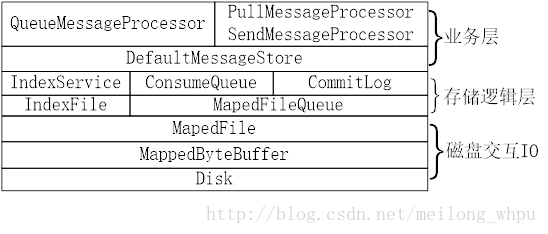
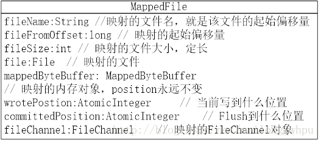

# RocketMQ存储篇——整体结构以及MappedFile讲解

1. 存储篇
2. 大文件的磁盘操作——MapedFile

**1** 存储篇 
**1.1** 整体结构 
存储层的结构如下图所示，业务层均通过DefaultMessageStore类提供的方法作为统一入口访问底层文件。RocketMQ底层有6类文件，对于不同类型的文件在存储逻辑层采用不同的类提供服务，其中三类大文件：Index文件由IndexService类提供服务，consumequeue文件由Consumequeue类提供服务，commitlog文件由CommitLog类提供服务，还有两类小文件：checkpoint文件由StoreCheckPoint类提供访问服务、config目录下面的配置文件（以json格式存储）由ConfigMananger类提供访问服务； 
对于index/consumequeue/commitlog这三类大文件，为了提供读写性能，底层采用java.nio.MappedByteBuffer类，该类是文件内存映射方案，支持随机读/顺序写操作，为了便于存储逻辑层操作大文件，将该类封装成MapedFile类；对于每类大文件，在存储时分隔成多个固定大小的文件，其中每分隔的文件的文件名为前面所有文件的大小+1，即为文件的起始偏移量，从而实现了整个大文件的串联，每个固定大小的文件均由MapedFile类提供操作服务；MapedFile类提供了顺序写、随机读、内存数据刷盘、内存清理等与文件相关的服务。 
 
**1.2** 大文件的磁盘操作——MapedFile 
对于commitlog、consumequeue、index三类大文件进行磁盘读写操作，均是通过MapedFile类来完成。该类的成员变量如下图所示，就是映射文件的属性信息； 
 
该类有如下主要的功能： 
**1.2.1** 向文件顺序写操作（appendMessage） 
有两种顺序写的方法，第一种是供commitlog使用，传入消息内容，由CommitLog按照规定的格式构造二进制信息并顺序写，方法：appendMessage(final Object msg, final AppendMessageCallback cb)；第二种是由调用者将消息按照规定的格式组装成二进制信息之后再传入，方法：appendMessage(final byte[] data)； 
一、appendMessage(final Object msg, final AppendMessageCallback cb)方法 
该方法中msg是MessageExtBrokerInner对象。具体的顺序写操作在AppendMessageCallback回调类的doAppend(final long fileFromOffset, final ByteBuffer byteBuffer,final int maxBlank, final Object msg)方法中实现。目前只有CommitLog的内部类DefaultAppendMessageCallback实现了该回调类的方法，故该顺序写方法只有在写入commitlog文件是才调用。 
二、appendMessage(final byte[] data)方法 
1）获取当前内存对象的写入位置（wrotePostion变量值）； 
2）若当前写入位置加上二进制消息的长度小于文件大小，即剩余的空间够写入该消息，则由内存对象mappedByteBuffer创建一个指向同一块内存的ByteBuffer对象，并将内存对象的写入指针指向写入位置；然后将该二进制信息写入该内存对象，同时将wrotePostion值增加消息的大小；

**1.2.2** 消息刷盘操作（commit） 
主要功能是将内存中的消息写入磁盘文件中。方法是commit(final int flushLeastPages)。主要逻辑： 
1）检查文件是否写满了，即写入位置（wrotePostion）是否等于文件大小（fileSize），若已经写满则进行刷盘操作； 
2）检查内存中未刷的消息页数是否大于最小刷盘页数，即要刷盘的消息页数flushLeastPages（每页默认大小为4K）是否大于【committedPosition（上次刷盘的位置）减去wrotePostion】/4K；若不够页数也暂不刷盘； 
3）MapedFile的父类是ReferenceResource，该父类的作用是记录该MapedFile中的内存对象被引用的次数；该引用次数为正数表示资源可用即未被shutdown，当在刷盘之前将引用次数加1后为正数，则调用BtyeBuffer的force方法进行刷盘，再将committedPosition置为wrotePostion值；最后将引用次数减1；若引起次数为不为正数则将直接committedPosition置为wrotePostion值；

**1.2.3** 随机读操作（selectMapedBuffer） 
随机读操作分为两个方法，第一个是读取指定位置开始的所有消息内容，方法为：selectMapedBuffer(int pos) ，第二个是读取指定位置开始的指定消息大小的消息内容，方法为：selectMapedBuffer(int pos, int size)。 
这两个方法均是调用ByteBuffer的slice和limit方法获取消息内容，然后初始化SelectMapedBufferResult对象并返回；该对象的startOffset变量是读取消息的开始位置加上该文件的起始偏移量；

**1.2.4** 清理内存操作

Cleanup方法主要功能是在调用shutdown时清理掉内存中的二进制信息；

**1.2.5** 判断文件是否写满

检查wrotepostion是否等于fileSize，若相等则表示文件已经写满；