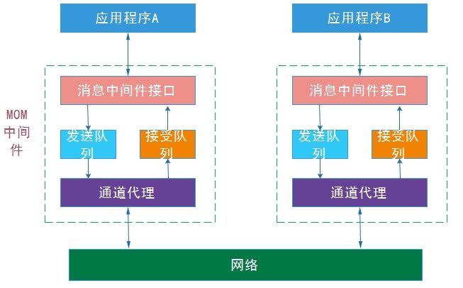
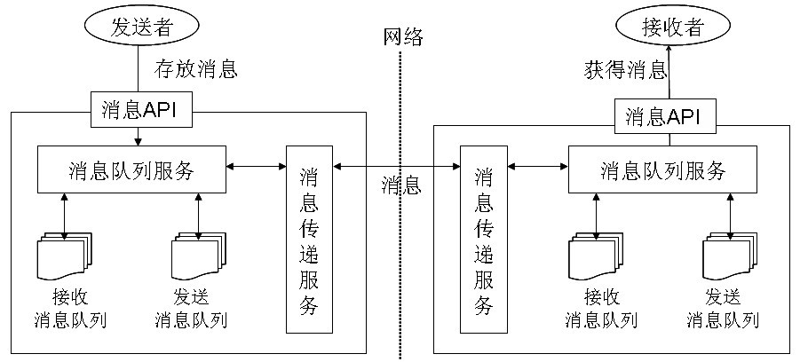
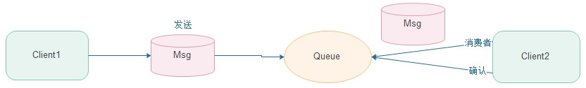
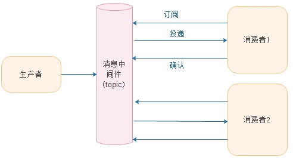
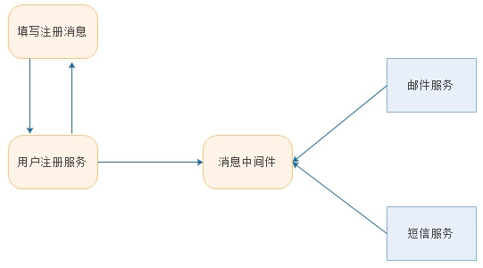
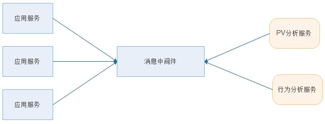
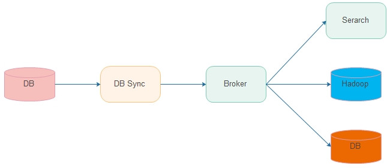
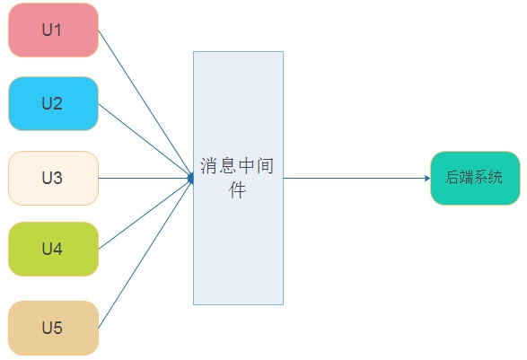
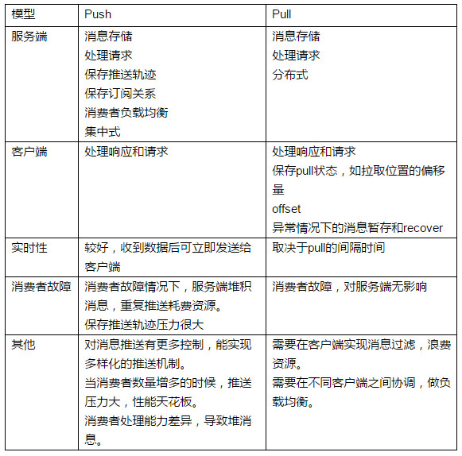

# 消息中间件MQ

###  1 消息中间件介绍

一般，我们认为消息中间件是指支持与保障分布式应用程序之间同步/异步收发消息的中间件。消息是分布式应用之间进行数据交换的基本信息单位，分布式应用程序之间的通信接口由消息中间件提供。其中，异步方式指消息发送方在发送消息时不必知道接收方的状态，更无需等待接收方的回复，而接收方在收到消息时也不必知道发送方的目前状态，更无需进行同步的消息处理，它们之间的连接完全是松耦合的，通信是非阻塞的，这种异步通信方式是由消息中间件中的消息队列及其服务机制保障的。一般地，实时性要求较高的业务采用同步方式处理，实时性要求不高的业务采用异步方式进行处理。

消息中间件已广泛应用于各类分布式应用系统，消息中间件开始向发布/订阅架构转变，并成为企业应用集成中间件的一种核心机制，而基于发布/订阅架构的消息中间件通常称为发布/订阅消息中间件或消息代理。目前比较典型的消息中间件包括IBM WebSphere MQSeries、阿里的RocketMQ和Kafka等。

消息中间件是在消息的传输过程中保存信息的容器。消息中间件再将消息从它的源中继到它的目标时充当中间人的作用。队列的主要目的是提供路由并保证消息的传递；如果发送消息时接收者不可用，消息队列会保留消息，直到可以成功地传递它为止，当然，消息队列保存消息也是有期限的。

### 2 消息中间件的特点

#### 2.1 采用异步处理模式

消息发送者可以发送一个消息而无须等待响应。消息发送者将消息发送到一条虚拟的通道（主题或队列）上，消息接收者则订阅或是监听该通道。一条信息可能最终转发给一个或多个消息接收者，这些接收者都无需对消息发送者做出同步回应。整个过程都是异步的。

#### 2.2 应用程序和应用程序调用关系为松耦合关系

主要体现在如下两点：
（1）发送者和接受者不必了解对方、只需要确认消息
（2）发送者和接受者不必同时在线
比如在线交易系统为了保证数据的最终一致，在支付系统处理完成后会把支付结果放到消息中间件里通知订单系统修改订单支付状态。两个系统通过消息中间件解耦。

### 3 消息传递服务模型

消息传递服务模型如下图所示

### 4 消息中间件的传输模式

#### 4.1 点对点模型

点对点模型用于消息生产者和消息消费者之间点到点的通信。消息生产者将消息发送到由某个名字标识的特定消费者。这个名字实际上对于消费服务中的一个队列（Queue），在消息传递给消费者之前它被存储在这个队列中。队列消息可以放在内存中也可以是持久的，以保证在消息服务出现故障时仍然能够传递消息。

传统的点对点消息中间件通常由消息队列服务、消息传递服务、消息队列和消息应用程序接口API组成，其典型的结构如下图所示。

特点：
（1）每个消息只用一个消费者
（2）发送者和接受者没有时间依赖
（3）接受者确认消息接受和处理成功
示意图如下所示：

#### 4.2 发布-订阅模型（Pub/Sub）

发布者/订阅者模型支持向一个特定的消息主题生产消息。0或多个订阅者可能对接收来自特定消息主题的消息感兴趣。在这种模型下，发布者和订阅者彼此不知道对方。这种模式就好比是匿名公告板。这种模式被概况为：多个消费者可以获得消息，在发布者和订阅者之间存在时间依赖性。发布者需要建立一个订阅（subscription），以便能够消费者订阅。订阅者必须保持持续的活动状态及接收消息，除非订阅者建立了持久的订阅。在这种情况下，在订阅者未连接时发布的消息将在订阅者重新连接时重新发布。如下图所示：

发布/订阅模型特性
（1）每个消息可以有多个订阅者
（2）客户端只有订阅后才能接收到消息
（3）持久订阅和非持久订阅

注意：
（1）发布者和订阅者有时间依赖
接受者和发布者只有建立订阅关系才能收到消息
（2）持久订阅
订阅关系建立后，消息就不会消失，不管订阅者是否都在线
（3）非持久订阅
订阅者为了接受消息，必须一直在线。
当只有一个订阅者时约等于点对点模式

### 5 消息中间件应用场景

#### 5.1 用户注册异步处理

网站用户注册，注册成功后会过一会发送邮件确认或者短息

#### 5.2 日志分析使用

把日志进行集中收集，用于计算PV、用户行为分析

#### 5.3 数据复制

（1）将数据从源头复制到多个目的地，一般是要求顺序或者保证因果序列
（2）用于跨机房数据传输、搜索、离线数据计算等。

#### 5.4 延迟消息发送和暂存

（1）把消息中间件当成可靠的消息暂存地
（2）定时进行消息投递，比如模拟用户秒杀访问，进行系统性能压测

#### 5.5 消息广播

（1）缓存数据同步更新
（2）往应用推送数据
比如更新本地缓存：

### 6 消息中间件消息模型分类

#### 6.1 push推消息模型

消息生产者将消息发送给消息传递服务，消息传递服务又将消息推给消息消费者。

#### 6.2 pull拉消息模型

消费者请求消息服务接受消息，消息生产者从消息中间件拉该消息。

#### 6.3 两种类型的区别

push推消息和pull拉消息的区别
